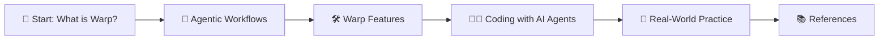

Generate the additional content for Today date Post file specified in #folder:_posts and base its content on the .webloc and  other references in #folder:src according to the title specified previously and follow the blueprint below to give your readers that engaging, brain-friendly “Head First” learning experience:
Hook with a Story
• Lead with a brief, concrete scenario that illustrates the problem or context.

Lay Out the Roadmap
• Show a simple diagram or bulleted flowchart of the steps you’ll cover.
• For the Mermaid diagrams, use pastel colors and emoticons to make them visually appealing. Make use of subgraphs when necessary. Remind to add '!" after the first line of the Mermaid code block to enable rendering. See example below.

Dive into Bite-Sized Chunks
• Present each concept in its own 1–2 paragraph section, with a descriptive subheading.
• Immediately follow each chunk with a quick “Your Turn” mini-exercise.

Mix Media Liberally
• Embed diagrams and code samples, right alongside the text.
• Wherever possible, give an alternate representation (e.g. mermaid chart + narrative).

Keep It Conversational
• Use “you” and “we,” ask rhetorical questions, and sprinkle in light humor.
• Call out caveats or “pro tips” in sidebars or blockquotes.

Scaffold Reader Practice
• Offer a scaffolded code snippet or config, then invite the reader to tweak it.
• Provide clear, numbered steps under a “Do this!” heading.

Highlight Key Features, Concepts, Patterns, Workflows and Reminders
• Highlight the relevant features, concepts, patterns, or workflows in the text.
• For each make a diagram that illustrates the key steps inside a folding section. If there is md code or text inside the folding this shall inserted as html.
• After each major section, insert a “Quick Recap” that restates the highlighted or mental model.

Conclude with Real-World Next Steps
• Close by circling back to your story: how can readers apply what they’ve learned?
• Offer links to further reading or exercises to deepen understanding.

include  at the end a chapter listing the References used in the post.