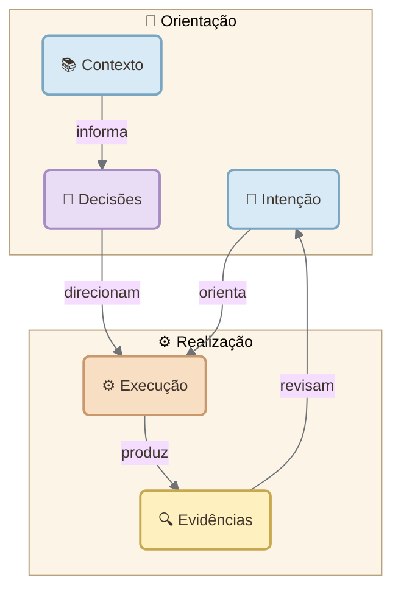
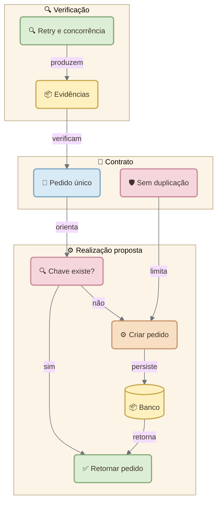
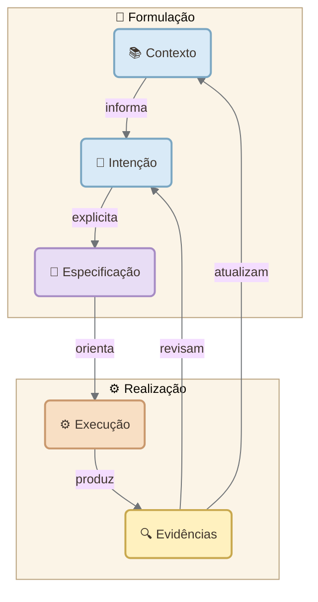

# Diagramas semânticos para o FACTORY-BLOG

Guia de uso da skill **blog-mermaid-diagrams** — edição de 4 de outubro de 2026.

## Conteúdo

- [1. O que a skill produz](#1-o-que-a-skill-produz)
- [2. Instalação e uso](#2-instalação-e-uso)
- [3. Do texto ao diagrama](#3-do-texto-ao-diagrama)
- [4. Identidade visual e layout](#4-identidade-visual-e-layout)
- [5. Exemplo: mapa conceitual](#5-exemplo-mapa-conceitual)
- [6. Exemplo: contrato de intenção em Rails](#6-exemplo-contrato-de-intenção-em-rails)
- [7. Exemplo: fluxo semântico de HOLOFLUX](#7-exemplo-fluxo-semântico-de-holoflux)
- [8. Incorporação em um post Jekyll](#8-incorporação-em-um-post-jekyll)
- [9. Prompts para uso cotidiano](#9-prompts-para-uso-cotidiano)
- [10. Revisão e limitações](#10-revisão-e-limitações)
- [Referências](#referências)

## 1. O que a skill produz

**Diagramas semânticos** é o nome editorial abrangente usado neste guia. Mermaid é a linguagem de representação. A semântica vem dos conceitos, dos papéis e das relações escolhidas.

| Visão | Pergunta respondida | Representação |
|---|---|---|
| Mapa conceitual | Como as ideias se relacionam? | Flowchart com relações rotuladas |
| Mapa de intenções | Quais objetivos dependem de outros? | Flowchart de objetivos |
| Contrato de intenção | Sob quais condições o resultado será aceito? | Contexto, restrições, realização e evidências |
| Fluxo semântico | Como o significado se transforma? | Flowchart com transformações e retorno |
| Interação temporal | Quem interage e em que ordem? | sequenceDiagram |
| Hierarquia de conceitos | Como um tema se subdivide? | mindmap |

Mapas conceituais podem ter múltiplas conexões; uma árvore de tópicos representa principalmente hierarquia. Não transformar associação em causalidade.

As visões de IOP e HOLOFLUX abaixo são **propostas conceituais**, não uma notação padronizada nem evidência de implementação existente.

## 2. Instalação e uso

Extraia a pasta `blog-mermaid-diagrams` do pacote em `.agents/skills/` na raiz do projeto. O arquivo principal deverá ficar em:

```text
.agents/skills/blog-mermaid-diagrams/SKILL.md
```

A descoberta automática depende da ferramenta utilizada. Quando ela não reconhecer essa pasta, indique explicitamente o caminho do `SKILL.md` ou use o diretório de skills documentado pela ferramenta.

No ChatGPT, use a skill pessoal instalada:

> Use a skill blog-mermaid-diagrams para criar um mapa conceitual deste texto e incorporá-lo junto à explicação correspondente.

No projeto local:

> Leia .agents/skills/blog-mermaid-diagrams/SKILL.md e os contratos atuais da fábrica. Aplique suas instruções a este post.

A skill contém referências sobre visões semânticas, temas e uma baseline dos padrões da fábrica. Os contratos atuais da raiz do FACTORY-BLOG têm prioridade sobre essa baseline.

## 3. Do texto ao diagrama

1. Defina a pergunta do leitor.
2. Extraia de cinco a nove conceitos relevantes, quando o assunto justificar.
3. Registre as relações sustentadas pelo texto como frases: “contexto informa decisões”.
4. Separe afirmações da fonte, interpretações e hipóteses.
5. Escolha a visão e os grupos naturais.
6. Gere o código, confira a fidelidade ao texto e inspecione o desenho renderizado.

Não tente representar o post inteiro em um único gráfico. Um diagrama deve esclarecer uma relação central; outro pode explicar a implementação.

## 4. Identidade visual e layout

No FACTORY-BLOG, mantenha a paleta canônica:

| Papel | Classe | Cor de preenchimento |
|---|---|---|
| Entrada e objetivo | pastelBlue | #D9EAF7 |
| Planejamento e orquestração | pastelPurple | #E8DDF5 |
| Ação e execução | pastelOrange | #F8DFC4 |
| Artefato e evidência | pastelYellow | #FFF1BF |
| Política, risco e bloqueio | pastelRose | #F6D6DD |
| Resultado e validação | pastelGreen | #DCEFD6 |

Use um emoticon funcional em cada nó, nomes curtos e relações de uma a três palavras. A cor reforça o papel; o texto deve continuar compreensível sem ela.

Use subgraphs para fases, contextos ou responsabilidades reais. Evite caixas artificiais e aninhamento excessivo. Conexões externas podem interferir na direção interna de um grupo.

| Escolha | Aplicação |
|---|---|
| TD | Ramificações, feedback e colunas estreitas |
| LR | Fluxos curtos que caibam na largura disponível |
| Nó arredondado `A("Nome")` | Conceito ou ação; padrão visual |
| Nó arredondado | Entrada ou resultado |
| Nó arredondado com saídas rotuladas | Decisão real; losango é opcional |
| Cilindro | Armazenamento real |

Não variar formas por decoração. Usar no máximo cinco nós horizontalmente. Reorientar, simplificar ou dividir antes de reduzir a fonte.

Os padrões consultados usam perfis de 480px, 520px e 640px; há exemplos de validação com 600px. Confirme a largura aceita pelo contrato e pelo renderer atuais. Os exemplos deste guia usam o perfil médio de 520px e fonte 13px.

Para light e dark, o FACTORY-BLOG usa um painel interno de fundo explícito #FFF8EF, texto #3E342C e conectores #6F7377. O diagrama permanece claro dentro de páginas claras ou escuras; isso não significa que ele muda automaticamente para um tema escuro.

## 5. Exemplo: mapa conceitual

Texto de origem criado para este exemplo:

> A intenção orienta a execução. O contexto informa decisões. As decisões direcionam a execução. Evidências produzidas pela execução permitem revisar a intenção.

Prompt:

> Extraia os conceitos e relações deste parágrafo. Crie um mapa conceitual com dois subgraphs, relações curtas e cores semânticas. Preserve somente o que está afirmado no texto.



**Legenda:** mapa das relações afirmadas no parágrafo; não descreve uma arquitetura implementada.

## 6. Exemplo: contrato de intenção em Rails

Cenário hipotético: uma API de pedidos recebe retries. Queremos evitar duplicação por operação, inclusive sob concorrência. O desenho organiza intenção, implementação proposta e critérios de verificação.

Prompt:

> Represente a intenção de evitar pedidos duplicados. Separe contrato e realização, use nó arredondado para a decisão sobre a chave e cilindro para o banco. Trate os testes como critérios esperados, sem afirmar que foram executados.



**Legenda:** contrato conceitual e realização proposta. O fluxo resume o caso; a solução real deve especificar unicidade no banco, concorrência, escopo da chave e comportamento quando o payload muda. A seta de evidência representa a verificação pretendida, não testes já aprovados.

## 7. Exemplo: fluxo semântico de HOLOFLUX

O exemplo mostra a passagem de intenção para uma forma explícita, sua realização e o retorno das observações. Os nomes das transformações são uma proposta editorial para este guia.

Prompt:

> Crie uma visão conceitual de HOLOFLUX que conecte intenção, especificação, execução e evidências, com contexto informando a formulação. Mostre o retorno das evidências à intenção e declare que a visão é proposta.



**Legenda:** visão conceitual proposta para HOLOFLUX. As evidências podem exigir revisão da compreensão do problema. A inspiração filosófica não estabelece, por si, um mecanismo computacional.

## 8. Incorporação em um post Jekyll

Neste documento, os exemplos usam blocos `mermaid`, próprios de Markdown comum. No FACTORY-BLOG, o contrato atual exige `mermaid!` e `mermaid: true` no front matter. A exclamação é uma convenção da fábrica, não uma exigência universal de Mermaid ou Jekyll.

Preserve o front matter existente e acrescente a chave necessária:

```yaml
mermaid: true
```

Envolva o diagrama com a classe do perfil:

````markdown
<div class="mermaid-diagram mermaid-diagram--medium" markdown="1">

```mermaid!
%% Copiar aqui a inicialização canônica do exemplo ou do contrato atual.
%% Copiar aqui o flowchart, as relações e as classes do exemplo.
```

</div>
````

Esse trecho é um molde; substitua os comentários pelo código completo. Reutilize o CSS existente. Quando ele ainda não estiver presente e a inclusão fizer parte do escopo autorizado, o perfil médio usa:

```css
.mermaid-diagram--medium img,
.mermaid-diagram--medium svg {
  display: block;
  width: 100%;
  max-width: 520px;
  height: auto;
  margin: 1.1rem auto;
}
```

Posicione o desenho após a pergunta ou o parágrafo que ele esclarece. Acrescente uma legenda e uma explicação textual equivalente. Para detalhes extensos, apresente primeiro um resumo e coloque a visão completa em `<details>`.

## 9. Prompts para uso cotidiano

**Texto para mapa:**

> Use blog-mermaid-diagrams para extrair um mapa conceitual desta seção. Identifique conceitos e relações antes de gerar Mermaid. Não acrescente causalidade ausente no texto.

**Revisão de layout:**

> Revise este diagrama na largura média do FACTORY-BLOG. Avalie TD e LR, rótulos, cruzamentos e subgraphs. Preserve 13px e divida o desenho se necessário. Registre quais verificações foram realmente feitas.

**Integração no post:**

> Incorpore um diagrama semântico no ponto em que ele melhor responde à pergunta do leitor. Preserve front matter, fontes e conteúdo. Use os contratos atuais da fábrica e forneça uma legenda.

**IOP em Rails:**

> Mapeie intenção, contexto, restrições, realização proposta e critérios de aceitação desta funcionalidade Rails. Separe comportamento esperado de evidências observadas.

## 10. Revisão e limitações

- Cada relação tem apoio no texto ou está identificada como interpretação?
- Cada forma, cor e ícone corresponde a um papel real?
- Os subgraphs ajudam a compreender a estrutura?
- Os nomes e relações são curtos sem perder significado?
- O desenho cabe na largura escolhida sem texto minúsculo?
- Há recortes, altura excessiva ou cruzamentos desnecessários?
- O painel, os grupos e as setas ficam legíveis nos dois temas da página?
- O renderer do blog reconhece o bloco e a configuração?

**Estado de verificação deste documento:** conteúdo, links internos e delimitação dos blocos conferidos. Exemplos preparados conforme a skill e a baseline consultada; não foram renderizados nem executados no blog. Mermaid calcula o posicionamento automaticamente: a fonte editável não garante um layout final adequado.

## Referências

1. [Blog Mermaid Diagrams — skill pessoal](https://chatgpt.com/skills?skill_id=6ac2a42ad0bc81918baf5984b3cc0fa0). Workflow, regras e referências usadas neste guia.
2. [FACTORY-BLOG — proposta de incorporação, PR #4](https://github.com/ezoatworks/factory-blog/pull/4). Repositório privado; acesso depende de permissão. Este link identifica a proposta, sem presumir seu estado atual de merge.
3. [FACTORY-BLOG — MERMAID-STANDARDS.md](https://github.com/ezoatworks/factory-blog/blob/main/MERMAID-STANDARDS.md). Contrato canônico da fábrica; consultar a versão atual.
4. [FACTORY-BLOG — VISUAL-REPRESENTATION-STANDARDS.md](https://github.com/ezoatworks/factory-blog/blob/main/VISUAL-REPRESENTATION-STANDARDS.md). Seleção de representações e limites de exatidão.
5. [Mermaid — Flowcharts: Basic Syntax](https://mermaid.js.org/syntax/flowchart.html). Referência oficial para direção, formas, relações e subgraphs; consultada em 4 de outubro de 2026.
6. [Mermaid — Theme Configuration](https://mermaid.js.org/config/theming.html). Referência oficial para configuração de temas; consultada em 4 de outubro de 2026.
