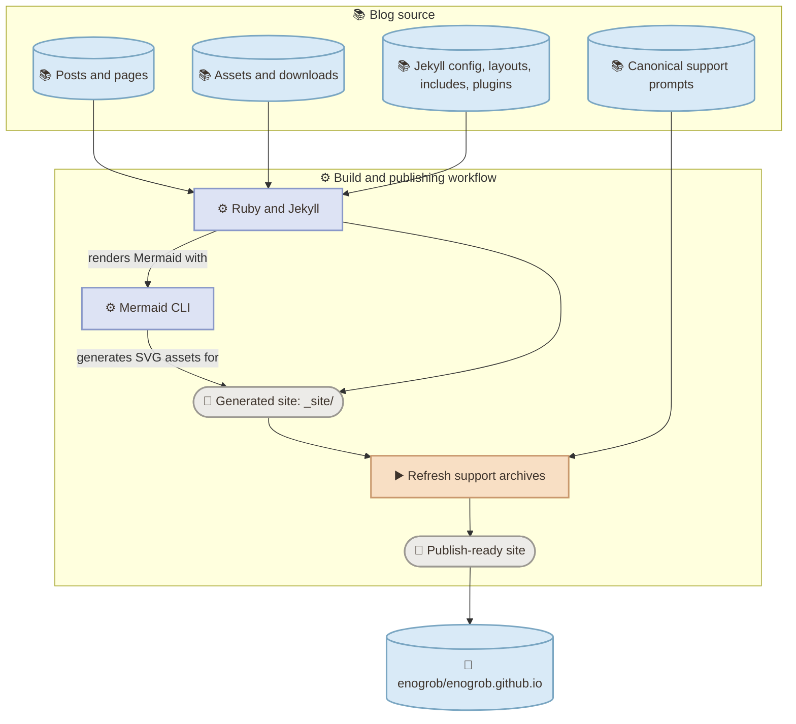

# Blog Source

Source repository for [enogrob.github.io](https://enogrob.github.io), Roberto Nogueira's personal blog. The site is built with Jekyll and published to a separate GitHub Pages repository.

## Contents

- [Project at a glance](#project-at-a-glance)
- [Architecture](#architecture)
- [Repository layout](#repository-layout)
- [Local development](#local-development)
- [Writing content](#writing-content)
- [Mermaid diagrams](#mermaid-diagrams)
- [Build and deployment](#build-and-deployment)
- [Scripts](#scripts)
- [Skills and visual standards](#skills-and-visual-standards)
- [References](#references)

## Project at a glance

| Area | Technology or location |
| --- | --- |
| Site generator | Jekyll 4.3 |
| Theme | Minima |
| Content | Markdown, Liquid, and YAML front matter |
| Mermaid rendering | Mermaid CLI through a custom Jekyll plugin |
| Automation | GitHub Actions |
| Published site | [enogrob.github.io](https://enogrob.github.io) |

> **📚 CONTEXT**
>
> This repository is the source for the blog, not the published site. The `src/` directory contains companion learning materials and is excluded from the Jekyll build.

## Architecture



The workflow is defined in [`.github/workflows/jekyll.yml`](.github/workflows/jekyll.yml). Static Mermaid rendering is implemented in [`_plugins/static_mermaid.rb`](_plugins/static_mermaid.rb). The `src/` companion materials are not inputs to the Jekyll build.

## Repository layout

| Path | Purpose |
| --- | --- |
| `_posts/` | Date-prefixed blog posts |
| `_includes/` | Reusable Liquid and HTML fragments |
| `_layouts/` | Page and post layouts |
| `_plugins/` | Custom Jekyll behavior, including static Mermaid rendering |
| `assets/` | Stylesheets, images, and downloadable resources |
| `docs/` | Supporting documentation and visual standards |
| `scripts/` | Build and publishing helpers |
| `.github/workflows/` | Continuous integration and publishing workflow |
| `.github/skills/` | Repository-specific authoring and publishing skills |
| `src/` | Companion learning materials, excluded from the published site |
| `_site/` | Generated Jekyll output; do not edit by hand |

## Local development

### Requirements

- Ruby and Bundler; CI uses Ruby 3.3.3.
- Node.js; CI uses Node.js 22.
- Mermaid CLI 12.0.0 (`mmdc`) on `PATH` to render Mermaid diagrams.
- `libvips` is installed by CI for image processing.

### Install and build

```sh
bundle install
npm install --global @mermaid-js/mermaid-cli@12.0.0
bundle exec jekyll build
```

The generated site is written to `_site/`. To serve it locally:

```sh
bundle exec jekyll serve
```

When the site contains Mermaid diagrams, `mmdc` must be available for the custom plugin to render them during the build.

## Writing content

Create posts in `_posts/` using the repository's date-prefixed filename convention, for example `YYYY-MM-DD-post-title.md`. Posts use YAML front matter; see nearby posts for fields such as `title`, `date`, `categories`, `tags`, `image`, and `mermaid`.

Keep source links, claims, images, and technical details grounded in the referenced materials. Preserve existing asset paths and published URLs when editing existing posts.

## Mermaid diagrams

For local authoring and VS Code preview, use standard `mermaid` fences. The Jekyll publishing skill's publication contract changes only the opening fence to `mermaid!`; preserve the diagram body and closing fence. Posts containing diagrams should declare `mermaid: true` in front matter.

The custom static renderer recognizes both `mermaid` and `mermaid!` fences and creates SVG assets under `_site/assets/generated/mermaid/`. The current CI workflow verifies generated output when Mermaid fences are present, but does not invoke the standalone Mermaid converter or validator scripts.

Follow the [Mermaid visual standard](docs/mermaid-visual-standard/README.md): use diagram structure and styling to communicate meaning, not as decoration. The diagram should remain understandable without color or emoji.

## Build and deployment

The GitHub Actions workflow runs for pushes and pull requests targeting `main`, and supports manual runs. It installs the build tools, builds the site, checks Mermaid output when diagrams are present, refreshes the Copilot support archives, and checks key generated files.

On a push to `main`, or a manual run with deployment enabled, the workflow publishes `_site/` to `enogrob/enogrob.github.io`. Publishing requires the `BLOG_PUBLISH_TOKEN` repository secret. The generated `_site/` directory is a build artifact; make source changes elsewhere.

> **🧪 VALIDATION**
>
> Run `bundle exec jekyll build` after changes that affect posts, layouts, includes, or site configuration. For Mermaid changes, inspect the generated page and SVG output as well as the source diagram.

## Scripts

| Script | Purpose |
| --- | --- |
| [`scripts/refresh_copilot_support_archives.sh`](scripts/refresh_copilot_support_archives.sh) | Refreshes and verifies downloadable Copilot support ZIP archives during CI |
| [`scripts/sync_copilot_init_companion.py`](scripts/sync_copilot_init_companion.py) | Synchronizes the Copilot CLI initialization lab into the unpacked companion archive; called by the archive refresh script |
| [`scripts/convert_mermaid_fences.rb`](scripts/convert_mermaid_fences.rb) | Prints a copy of a Markdown file with plain Mermaid opening fences changed to `mermaid!` |
| [`scripts/validate_jekyll_mermaid.rb`](scripts/validate_jekyll_mermaid.rb) | Checks a post for plain Mermaid fences and missing `mermaid: true` front matter |

The archive refresh script and its Python helper are used by CI. The Mermaid converter and validator are optional manual helpers. The separate `src/github-copilot-rails-labs/scripts/` directory belongs to the companion learning project.

## Skills and visual standards

- [Jekyll Mermaid publishing skill](.github/skills/jekyll-mermaid-publishing/SKILL.md) describes the local-authoring and Jekyll-publication fence contract.
- [Mermaid visual standard](docs/mermaid-visual-standard/README.md) covers semantic diagrams and architecture.
- [Text visual standard](docs/text-visual-standard/README.md) covers semantic callouts and other explanatory text components.

Use the least forceful visual treatment that communicates the meaning. Keep callouts readable without styling, distinguish claims from evidence, and avoid turning ordinary paragraphs into decorative boxes.

## References

- [Jekyll documentation](https://jekyllrb.com/docs/)
- [Minima theme](https://github.com/jekyll/minima)
- [Mermaid documentation](https://mermaid.js.org/intro/)
- [Mermaid CLI](https://github.com/mermaid-js/mermaid-cli)
- [GitHub Pages: custom GitHub Actions workflows](https://docs.github.com/en/pages/getting-started-with-github-pages/using-custom-workflows-with-github-pages)
