# **Generative AI in a Nutshell**

Just finished reading **Generative AI in a Nutshell** by *Henrik Kniberg* — and wow, what a ride!

This isn’t your typical dry AI manual. It’s short, funny, full of quirky hand-drawn illustrations, and packed with *actually useful* insights. If you’ve seen Kniberg’s viral [18-minute video](https://www.youtube.com/watch?v=2IK3DFHRFfw) on the same topic, this book is the deeper, sketchier, and even more practical version.

Here are a few highlights from the book:

**1. AI isn’t magic — but it *feels* like it.**

Kniberg describes generative AI as a turbo-charged autocomplete that can code, write, design, and brainstorm like a super intern who occasionally lies with great confidence.

**2. Mindset matters more than job titles.**

According to the book, most people react to AI in one of three ways:

| Reaction     | Outcome       |
|--------------|---------------|
| 😱 Panic     | Fear/freeze   |
| 🙈 Denial   | Miss the wave |
| 🤔 Curiosity | Learn & grow ✅ |

Kniberg’s advice? Stay curious. Test things. Learn by doing.

**3. AI won’t take your job… but people using AI might.**

This one hits home. The book emphasizes that AI isn’t about replacement — it’s about amplification. Those who learn to wield it will be the ones who stay ahead.

**4. You don’t need to be an AI expert — just a good experimenter.**

Kniberg encourages readers to *start small and play*. Whether it’s summarizing text, writing emails, prototyping designs, or debugging code, every bit of hands-on experience builds confidence and skill.

**5. Prompting is a new superpower.**

One of the most useful takeaways: how you *talk* to AI matters. A vague prompt leads to vague results. A specific, well-contextualized prompt gets you gold. (The book includes great before-and-after examples.)

```mermaid!
%%{init: {"theme": "default", "look": "handDrawn", "flowchart": {"nodeSpacing": 60, "rankSpacing": 120}}}%%
flowchart LR
  subgraph Core_Magic["Core Magic"]
    A[Autocomplete Turbocharge]
  end

  subgraph Mindset["Mindset Matters"]
    A -->|inspires| B{Mindset Choice}
    B -->|🤔 Curiosity| C[Learn & Grow]
    B -->|😱 Panic| D[Freeze Up]
    B -->|🙈 Denial| E[Miss the Wave]
  end

  subgraph Experiment["Experimentation Loop"]
    C --> F[Start Small & Play]
    F --> G[Prototype & Iterate]
    G --> H[Confidence Boost]
    H --> I{Continue?}
    I -->|Yes| F
    I -->|No| J[Reflect & Pivot]
  end

  subgraph Prompting["Prompt Superpowers"]
    G --> K{Prompt Quality}
    K -->|Vague| L[Lame Output]
    K -->|Specific| M[Golden Response]
    M --> N[Real-World Wins]
  end

  C -.-> N
  D -. block .-> L
  E -. blocked .-> L
```

Whether you’re a leader trying to future-proof your team, or a developer wondering what’s next — this book is a quick, insightful read that leaves you more inspired than overwhelmed.

If you want to have a **Einstein in your basement?** Or maybe a super intern? This book is for you.:

> **Quick Heads-Up:** *[Generative AI in a Nutshell](https://leanpub.com/ainutshell)* by Henrik Kniberg is sketch-packed and puzzle-driven—grab the [book](https://leanpub.com/ainutshell) and dive into the [course](https://leanpub.com/c/ainutshell)!

### References

- [Read the Ebook on Leanpub](https://leanpub.com/ainutshell)
- [Explore the Course on Leanpub](https://leanpub.com/c/ainutshell)
- [Buy on Amazon](https://www.amazon.com.br/Generative-AI-Nutshell-Survive-English-ebook/dp/B0DSBFN12W/ref=sr_1_1?crid=29C6A83UW97O3&dib=eyJ2IjoiMSJ9.FGBX_12aZdDMT5erK9Bqzl8d92es7eoLS3Xdm-zaLCtanf-fxUSHLTH4iX97Y0terNlU_LaqKlcjKh_ejlV_9HfklHJlEQImpjh_9Nn_Kc4.94AMC1rJmiDRquHpJVYWy_iFY2O78YJyGYhAwtVmLMA&dib_tag=se&keywords=generative+ai+in+a+nutshell&qid=1743464777&sprefix=Generative+AI+in+a+%2Caps%2C481&sr=8-1)
- [Watch the YouTube Video](https://www.youtube.com/watch?v=2IK3DFHRFfw)
- [View the Illustration](https://blog.crisp.se/wp-content/uploads/2024/01/generative-AI-in-a-nutshell.png)

Curious to hear how others are using (or avoiding) generative AI at work. Wins? Struggles? Big questions? Drop them below Let’s learn from each other.
