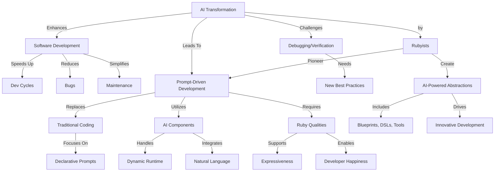

# **Rubyists Leading the Way in the AI Revolution**


Artificial Intelligence (AI) isn’t just knocking on the door of software development—it’s tearing the whole thing down to reimagine how we build, debug, and optimize applications. If you’re like me, you’ve probably wondered: “How will languages like Ruby and frameworks like Rails survive this massive shift?”  

Well, **good news**: they’re not just surviving—they’re leading the way. Intrigued? Let’s break it down.

## Why Ruby and Rails Are Perfect for the AI Era

**Ruby’s Superpowers (Hint: It’s About YOU)**  
Ruby isn’t just another programming language; it’s the ultimate productivity booster:
- **Expressiveness**: Code flows like water, leaving you to focus on solving problems, not wrestling syntax.  
- **Rails' Conventions**: Convention-over-configuration lets us deliver faster iterations while maintaining sanity.  

### So, Why Does This Matter for AI?  
When you pair Ruby’s dynamism with AI’s advances, you unlock a potential new development paradigm where we move beyond code-as-text to something revolutionary: **Prompt-Driven Development (PDD).**

## What Is Prompt-Driven Development?  
Let’s start with this **simple idea**:  
> **Instead of writing thousands of lines of static code, we write high-level prompts.**

### Example Workflow:
- You describe functionality in **plain language**:  
  > “Users enter a name and password. On submit, validate their data and display a dashboard.”  
- AI translates it into functionality.  
- No boilerplate. No endless debugging.

**Key Characteristics of PDD:**  
- Prompts are dynamic and **runtime-driven**.  
- "Codebases" become living systems that adapt via high-level instructions.  
- **Say goodbye to static code scaffolding.**  

Sound wild? It’s actually happening. Here's a real-world **example prompt**:

```
You are an account manager AI. Users request changes.  
Ensure actions are valid based on their subscription status.  
Notify the account owner of success or failure, then confirm completion by logging the request.  
```

The result? A dynamic Rails application where AI takes care of actual implementation. You define **what** happens—the AI figures out **how**.

## A Quick Concept Map

Let’s connect some dots. Here’s how AI, prompts, and Ruby fit into this transformative shift:



## How Did We Get Here?  

### Historical Context: Declarative Development & BDD  
Prompt-driven development builds on past innovations like:  
- **HyperTalk (1980s)**: A pseudo-English language for Apple’s HyperCard.  
- **BDD (2000s)**: Bringing non-technical stakeholders into feature discussions via tools like `RSpec` and `Cucumber`.

But older technologies imposed strict syntax rules—**AI eliminates that limitation**, enabling truly **freeform, conversational programming.**

#### Key Difference:
- Then: Structured *natural language-like* scripts required developer maintenance.
- Now: AI understands context and creates solutions dynamically.

## Challenges & Opportunities  

Adopting AI-first approaches isn't without hurdles:  

### **Challenges**  
- Ensuring deterministic, secure AI behavior.  
- Debugging abstracted systems.  
- Shifting developers into design-focused roles.

### **Opportunities**  
- **Efficiency Gains**: Shorter cycles; fewer bugs.  
- **Dynamic UX**: Self-adjusting and self-documenting systems.
- **Developer Evolution**: From writing low-level code to crafting high-level prompts and workflows.

**Why Ruby?**  
Ruby’s flexibility and beauty put it front and center. Imagine writing prompt-driven **DSLs in Ruby** that feel like…magic.

## AI + Ruby and Rails: A Perfect Match  

Here’s a bold idea Obie proposes:  
> What if future Rails apps dynamically translated high-level functionality at runtime?

Imagine **AI deeply embedded into Rails**, creating “smart” components:  
- Auto-inferred method names.  
- API auto-connectivity.  
- Real-time optimizations.  

**Future prediction**: People will criticize this as “too magical”—just like they dismissed Rails in its early days. And just like before, they’ll be proven wrong.

## What Can We Do Today?

Here’s where things get practical:  

1. **Start with prototypes like `Blueprints`.**  
   Tools to help **compose prompts** and manage AI-driven workflows.  
2. **Use AI inside your Ruby workflows.**  
   Experiment with new abstractions that add AI into Rails apps (see Obie’s `Raix Rails` framework).  
3. **Join Ruby AI communities.**  
   You don’t have to walk this journey alone! Join forces to influence the ecosystem.  

### Closing Thoughts

The pace of AI innovation is dizzying, but Rubyists, as always, are perfectly positioned to embrace it. By focusing on **expressiveness**, **developer happiness**, and **outcomes**, Ruby has everything it needs to lead the way in the AI-first development future.

**Ready to build this future together?**  
Join the [Ruby AI Builders](https://discord.gg/kkrpc5vDH8) and start pioneering today.

**Let’s do what Rubyists do best: Rewrite what’s possible.**  

*Post Inspired by Obie Fernandez’s article on the [AI-powered future of Ruby and Rails](https://medium.com/codex/the-future-of-ruby-and-rails-in-the-age-of-ai-8f1acea31bc2).*
