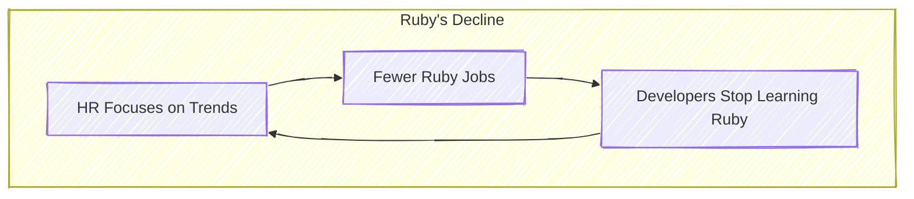
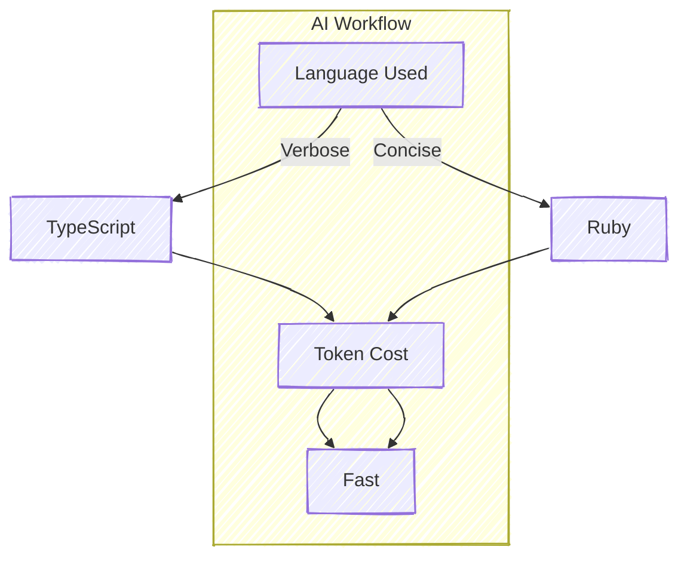

# **Ruby’s AI Awakening: The Unexpected Edge in Token Efficiency**

Once hailed as the darling of developers and startups, Ruby and its popular framework Ruby on Rails faced a steady decline over the last decade. But just when Ruby seemed relegated to nostalgia for developers of the mid-2000s, a new player entered the scene that might launch Ruby back into relevance: Artificial Intelligence (AI).

## The Fall: The Perceived Decline of Ruby

- **What happened?**
  Despite its elegance, developer friendliness, and flexible syntax, Ruby has fallen out of favor over the years.
  
  - Newer frameworks like **Next.js**, **Django**, and **Node.js** gained ground.
  - **HR and hiring trends** shifted focus to trendier and more popular languages, feeding a vicious cycle where Ruby became less visible in job postings.

- **Major pain point:**
  Technical recruitment often emphasizes specific language fluency (e.g., Python or JavaScript) over transferable skills like system design or domain expertise. This hurts versatile languages like Ruby.

### Diagram: Why Ruby Fell Behind

<div style="max-width: 50%; margin: auto;">

</div>

## Enter the Revolution: AI-Assisted Coding

In a coding landscape shaped by AI tools, a “vibe coding” revolution is underway. Tools like **Cursor IDE**, the **Cline extension for VS Code**, and **GitHub Copilot** allow developers to:

- Describe functionality in natural language (e.g., “I need a user service for managing users”).
- Generate complete implementations, refactor code, or troubleshoot in plain English.

### Benefits:
- **Faster coding:** Developers can focus on architecture while AI engineers the mechanics.
- **Token-based costs:** AI pricing models are tied to the number of tokens (text chunks) processed.
- **Seamless Integration:** GitHub Copilot offers in-line code completions and context-aware suggestions directly in VS Code, reducing context switching and accelerating development.

## The Comeback: Ruby’s Hidden Advantage

Ruby’s elegant design, focused on developer happiness and readability, turns into a **cost-saving juggernaut** in this AI era.

1. **Readability = Efficiency:** 
    Ruby’s concise syntax means AI can capture complex ideas with fewer tokens compared to verbose languages like TypeScript or Java.

    **Example**:
<div style="max-width: 50%; margin: auto;">
    ```mermaid!
%%{init: {"theme": "default", "look": "handDrawn"}}%%
    graph TD
        subgraph Example Code Comparisons
            TScript[TypeScript Code: 50 tokens] --> Ruby[Ruby Code: 17 tokens]
        end
    ```
</div>
2. **Cost Efficiency:**
   - Generating complex code costs approximately **1/3rd the tokens** in Ruby compared to TypeScript.
   - For businesses utilizing AI tools heavily, this translates to massive savings.

### Showcasing Ruby's Token Advantage

Here’s an actual comparison when writing a user service in TypeScript vs. Ruby:

**TypeScript: (verbosely verbose)**

```typescript
interface User {
  id: number;
  firstName: string;
  lastName: string;
  email: string;
  isActive: boolean;
}

class UserService {
  private users: User[] = [];
  public addUser(user: User): void {
    this.users.push(user);
  }
  public getUserById(id: number): User | undefined {
    return this.users.find((user) => user.id === id);
  }
  public getAllActiveUsers(): User[] {
    return this.users.filter((user) => user.isActive);
  }
}
```

**Ruby: (clean and concise)**

```ruby
class User
  attr_accessor :id, :first_name, :last_name, :email, :active

  def initialize(id, first_name, last_name, email, active = true)
    @id = id
    @first_name = first_name
    @last_name = last_name
    @email = email
    @active = active
  end
end

class UserService
  def initialize
    @users = []
  end

  def add_user(user)
    @users << user
  end

  def get_user_by_id(id)
    @users.find { |user| user.id == id }
  end

  def get_all_active_users
    @users.select(&:active)
  end
end
```

## The Economic Implications: Why Ruby Could Shine 🌟

As AI-assisted workflows spread, **token efficiency** becomes a critical factor. Here’s why Ruby stands to gain:

1. **Lower Costs:** Teams using AI tools can save up to **3x on token processing costs** by adopting Ruby over verbose languages like Java or TypeScript.
2. **Faster Turnaround:** Ruby’s simplicity allows for quicker code generation, lower latency, and faster debugging workflows.
3. **Scalable AI Integration:** Businesses can integrate AI coding tools effectively without breaking their budgets.

### Diagram: AI Advantage with Ruby

<div style="max-width: 60%; margin: auto;">

</div>

## Reflecting Forward: Will AI Resurrect Ruby?

Ruby won’t magically overthrow Python or JavaScript as the most in-demand languages tomorrow, but it might claim a unique niche in AI-assisted development. In a future where AI tools automate much of coding, programming languages will be evaluated based on cost-efficiency, readability, and their ability to adapt to AI workflows.

### Story Takeaways:
- Focus less on trends and keywords; **domain knowledge** and transferable skills should be recruitment priorities.
- Ruby’s token efficiency makes it a perfect fit for AI-based coding workflows.
- Businesses relying on AI tools could see **huge savings** leveraging Ruby’s simplicity and expressiveness.

**What do you think? Is this a second wind for Ruby? Could token efficiency become a major selection factor in tech stacks as AI tools dominate development?**

Let’s keep reflecting, iterating, and coding… elegantly, the Ruby way!

*Post Inspired by Yacine Petitprez’s article on the [Ruby's Renaissance in the AI Era](https://anykeyh.hashnode.dev/rubys-renaissance-in-the-ai-era).*