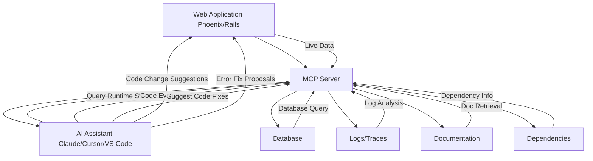

Imagine coding with an AI that doesn't just read your code but understands your entire application as it runs. That's the promise of Tidewave, the latest innovation from José Valim and the team at Dashbit.

# **Ride the Tide with Tidewave: Runtime Intelligence for Rails and Phoenix**

Tidewave introduces "Runtime Intelligence," bridging the gap between static code analysis and dynamic application behavior. By embedding a Model Context Protocol (MCP) server into your web application, Tidewave enables AI assistants to interact with your app's live state. This means AI tools can now:

* Inspect and query your database directly.
* Access and analyze real-time logs and traces.
* Evaluate code within the actual running context of your app.
* Retrieve and utilize your application's documentation and dependencies.

Currently supporting Phoenix and Ruby on Rails, Tidewave is open source and integrates seamlessly with AI tools like Claude, Cursor, VS Code (Copilot), Windsurf, and Zed.

### A Glimpse into the Future: AI-Powered Development

In a recent demonstration, José Valim showcased Tidewave's capabilities by guiding Claude Desktop to implement a pricing plan component in a Phoenix application. The AI assistant was able to:

* Identify the relevant live view page.
* Modify the appropriate files with contextual awareness.
* Compile the project, detect errors, and apply fixes autonomously.

This level of integration signifies a shift towards more intelligent and context-aware development tools.

### Join the Tidewave Movement

Tidewave is more than just a tool; it's a step towards a future where AI and developers collaborate more closely. By providing AI assistants with a deeper understanding of your application's runtime, Tidewave enhances productivity and opens new possibilities in software development.

To learn more or get involved, visit [tidewave.ai](https://tidewave.ai) and explore the repositories for Phoenix and Rails on GitHub:
- [Tidewave Phoenix](https://github.com/tidewave-ai/tidewave_phoenix)
- [Tidewave Rails](https://github.com/tidewave-ai/tidewave_rails)

### References

* [Tidewave Official Website](https://tidewave.ai)
* [José Valim's Announcement on X](https://x.com/josevalim/status/1917296901268910405)
* [Elixir Forum Discussion on Tidewave](https://elixirforum.com/t/tidewave-has-just-been-announced-by-jose-valim/70674)
* [DEV Community Article on Tidewave](https://dev.to/adolfont/tidewave-connecting-web-apps-to-ai-powered-development-248h)
