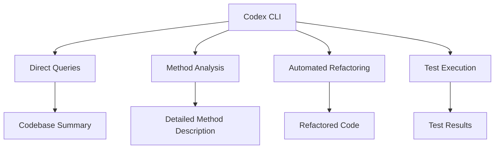

# **Codex CLI + Ruby: Automating Codebase Navigation via Command Line**

Picture this: you’ve inherited a sprawling Ruby codebase with no documentation. It feels like wandering through a dense forest without a compass. Enter **OpenAI's Codex CLI**, your AI companion that turns code spelunking into a guided tour.

But here’s the twist: instead of using the interactive UI, we’ll streamline our workflow using **CLI parameters**. Think of it as skipping the tour guide and going straight for the map.

## Setting Up Codex CLI

First, install Codex CLI and set your API key:

```bash
npm install -g @openai/codex
export OPENAI_API_KEY="your-api-key-here"
```

Navigate to your Ruby project:

```bash
cd path/to/your/ruby_project
```

Initialize Git if needed:

```bash
git init
```

## Exploring the Codebase from the Command Line

Instead of launching Codex in interactive mode, we’ll use the `--query` parameter for direct questions:

```bash
codex --query "Explain the purpose of this codebase."
```

Codex will respond with a high-level summary, giving you an overview without needing to navigate the UI.

## Analyzing Specific Methods or Classes

If you want to dive into a particular method, pass your question as a parameter:

```bash
codex --query "What does the 'process_order' method in 'order.rb' do?"
```

Codex will parse the file and provide a clear, concise explanation.

## Automating Refactoring

Need to improve code without manual editing? Use the `--query` parameter with a specific command:

```bash
codex --query "Refactor 'calculate_total' method in 'cart.rb' to use 'inject' instead of a loop."
```

Codex will suggest improvements and display the modified code directly in your terminal.

## Running Tests

To validate changes, use the CLI to execute tests:

```bash
codex --query "Run the test suite to verify all tests pass."
```

Codex will run the tests and report the outcome, ensuring your changes didn’t break the code.

## Visual Summary

Here’s a conceptual map of Codex CLI operations when using parameters instead of the UI:



## References

* OpenAI Codex CLI – Getting Started: ([help.openai.com](https://help.openai.com/en/articles/11096431-openai-codex-cli-getting-started?utm_source=chatgpt.com))
* OpenAI Codex CLI: Build Faster Code Right From Your Terminal: ([blott.studio](https://www.blott.studio/blog/post/openai-codex-cli-build-faster-code-right-from-your-terminal?utm_source=chatgpt.com))
* OpenAI Codex CLI Tutorial - DataCamp: ([datacamp.com](https://www.datacamp.com/tutorial/open-ai-codex-cli-tutorial?utm_source=chatgpt.com))

By using command-line parameters, you unlock a faster, more automated way to explore, refactor, and test your Ruby codebase with Codex CLI.
