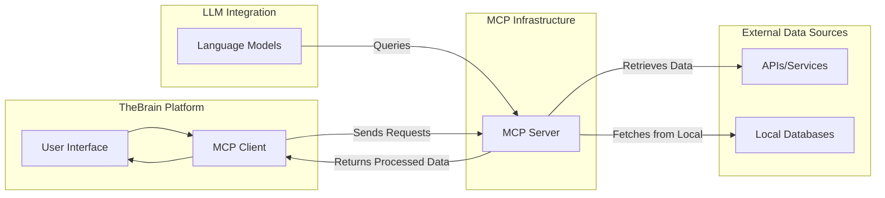

# **The Vision: Making TheBrain Smarter**

Imagine walking through your Brain—the digital map of your thoughts and ideas. You have pathways, connections, and concepts intertwined, but something’s missing. What if your Brain could actually think for itself? What if it could actively talk to AI, generating insights and managing knowledge for you?

That’s where the **MCP Server** comes in. By integrating a **Model Context Protocol (MCP) Server** within **TheBrain**, your digital mind map transforms from a static knowledge repository to an **AI-powered assistant**. TheBrain wouldn’t just store data—it would think with you.

### The Core Idea: Bridging Brains and AI

Right now, TheBrain is like a brilliant library: well-organized, interconnected, but quiet. You have to manually pull knowledge from it. An MCP Server, on the other hand, turns it into an **interactive genius**. It could:

* **Access Knowledge Dynamically**: LLMs could query your Brain and fetch data effortlessly.
* **Generate Insights**: Imagine asking your Brain how concepts are related, and it just tells you.
* **Automate Knowledge Updates**: Pull in new information from APIs and data sources automatically.
* **Answer Your Questions**: Instead of searching for an answer, your Brain finds it for you.

### Let’s Make It Real: How Would This Work?

Picture this: You’re brainstorming on how to automate your project pipeline. Instead of looking through every node, you simply ask, “What are the most efficient automation tools?” TheBrain, powered by MCP, gathers insights from your existing notes, integrates data from external APIs, and gives you a curated answer.

#### Visualizing the Integration

To make sense of how MCP fits into TheBrain, imagine it as a central **hub** that takes in your questions, finds the answers from your Brain, and, if needed, pulls additional data from the outside world. Check out this concept map:

### Why This Matters: Real-World Benefits

* **Boost Your Thinking**: Let your Brain think with you, instead of just being a map.
* **Dynamic Knowledge Updates**: Your Brain never goes out of date, constantly pulling in fresh information.
* **More Efficient Brainstorming**: Don’t dig through notes—ask and get direct insights.

### Call to Action: The Next Step for TheBrain

It’s time to take TheBrain from a passive companion to an active thinker. Integrating an MCP Server isn’t just a technical upgrade—it’s giving your Brain a voice. Let’s push for this innovation and make our digital minds more alive.

### References

* [Introducing the Model Context Protocol](https://www.thebrain.com/blog/introducing-thebrain-api)
* [Model Context Protocol Overview](https://modelcontextprotocol.io/)
* [Introducing TheBrain API](https://www.thebrain.com/blog/introducing-thebrain-api)
* [TheBrain Product Page](https://www.thebrain.com/products/thebrain)
