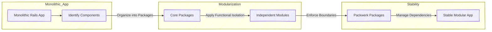

# **Building a Modular Ruby on Rails Application: One Brick at a Time**

Imagine you're building a massive Lego castle. At first, it's just a few basic walls—easy to manage, right? But as you add towers, drawbridges, and intricate little windows, things start to get a bit... chaotic. You realize that if you don't plan and structure it carefully, your castle could collapse or take ages to fix if one piece breaks. Welcome to the world of modularizing Ruby on Rails applications!

#### The Problem: One Big Unstable Block

Rails apps can quickly turn into sprawling monoliths—one big structure that’s hard to maintain and prone to collapse if a single component fails. Just like a Lego structure without proper support, your app might work today but fall apart tomorrow.

#### The Solution: Building with Lego Bricks

Modularization is like swapping your monolithic castle for a modular Lego set. Each part—towers, gates, walls—is its own module, designed independently but fitting neatly into the larger whole. This way, if your drawbridge breaks, you can replace just that section without touching the entire castle.

#### Packwerk: The Lego Brick Separator

Just as a Lego brick separator helps you split pieces without breaking the whole build, Packwerk helps divide your Rails app into manageable packages. It enforces boundaries, ensuring your bricks (modules) don't get stuck together in unmanageable ways.

#### Strategies for Modularization

1. **Start Small:** Don’t demolish the whole castle! Begin by identifying the most unstable parts and isolating them first. In Rails, that means creating packages for your core components.
2. **Functional Isolation over Domain Isolation:** Instead of making every tower its own piece, group related functionalities together—like all the windows in a single package.
3. **Gradual Build:** Gradual modularization means adding one module at a time, ensuring each integrates well before moving on.
4. **Avoid Premature Optimization:** Don’t start modularizing before your castle even has a base—it’s about improving stability, not adding unnecessary complexity.

#### Troubleshooting: When Your Bricks Don’t Fit

Sometimes packages conflict—like trying to connect a round tower to a square base. The book covers this with strategies like:

* Merging packages when dependencies overlap.
* Splitting problematic packages into smaller, more manageable ones.
* Injecting dependencies instead of hardwiring them.

#### The Result: A Stable, Flexible Structure

When done right, modularization in Rails creates a resilient system where parts can be swapped or updated independently. Like a well-built Lego castle, it’s durable, flexible, and—best of all—manageable!

#### Visualization: Modularization Process

#### Final Thoughts

Just as building a giant Lego castle requires careful planning and structure, modularizing a Rails app means thinking about stability, flexibility, and future-proofing. Use tools like Packwerk to ensure your bricks stay in place—and enjoy your well-organized, robust castle!

#### References

* Hagemann, S. (2025). [Gradual Modularization for Ruby and Rails. Leanpub.](https://leanpub.com/package-based-rails-applications)
* Packwerk. (2020). Retrieved from [https://github.com/Shopify/packwerk](https://github.com/Shopify/packwerk)

