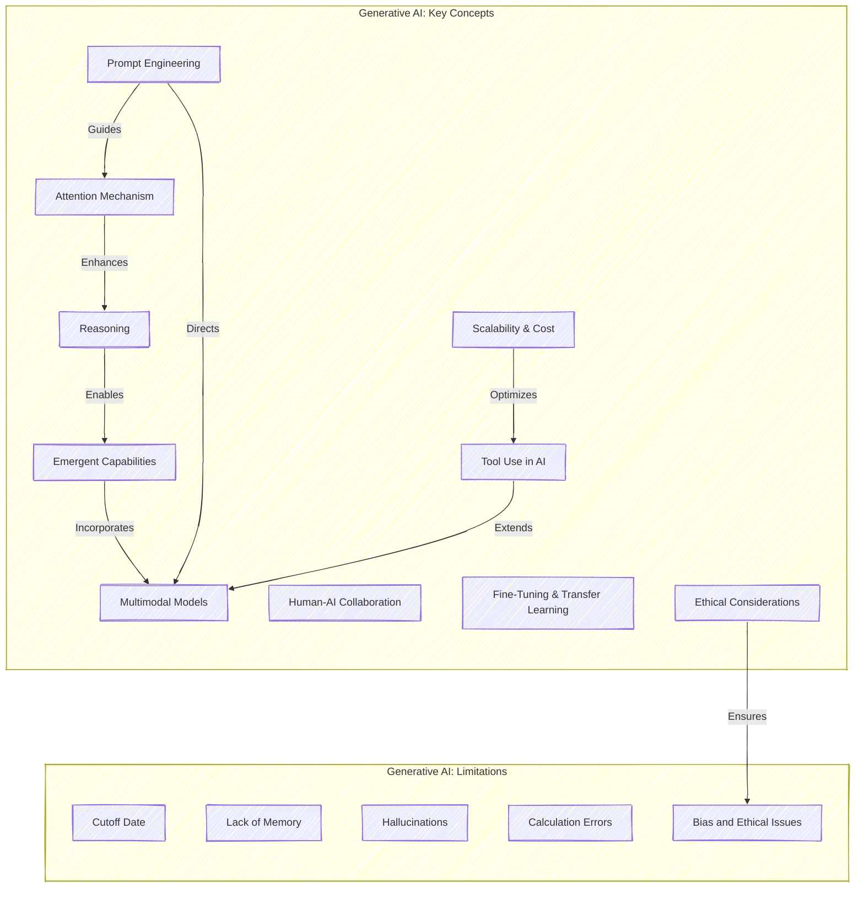

# **Generative AI Key Concepts, Limitations, and More!**
#### **Why Should You Care About Generative AI?**

Imagine this: You’ve got Einstein, a master chef, a data scientist, and a stand-up comedian all hanging out in your basement, ready to help you with whatever you need. That’s Generative AI in a nutshell!

But wait—don’t start celebrating just yet. While Generative AI can be insanely powerful, it also comes with its quirks and flaws. Think of it as your new super-smart buddy who sometimes gets a little too confident—or just flat-out weird.

Ready to dive in? Let’s go head first into the concepts that make Generative AI tick and the limitations that keep it from being perfect.

### **Attention Mechanisms - AI’s Focus Superpower**
#### **What’s the Big Deal?**

Imagine you’re at a concert, and everyone’s screaming. Yet, somehow, you zero in on the voice of your friend shouting, “They’re playing your song!” That’s **attention**—picking out the important bits and ignoring the noise.

#### **Why Should You Care?**

* Helps AI process long and complex text without getting lost.
* Makes the AI capable of distinguishing between subtle differences, like whether “bat” means the flying mammal or the baseball tool.
* Basically, attention is why modern AI doesn’t just spit out word soup.

#### **Attention in Action:**

Think about how ChatGPT generates long responses without losing coherence. That’s attention doing its magic—focusing on what matters and keeping the output on track.

> **Hot Take:** Check out [`Attention Is All You Need`](https://en.wikipedia.org/wiki/Attention_Is_All_You_Need) by Vaswani et al.—the brainy blueprint that sparked the Transformer revolution and made attention the AI superstar!

### **Reasoning - Coherent Thinking Before Blabbering**
**What’s the Deal?**

Old models? They were like that friend who blurts out the first thing that comes to mind. Modern AI, though, takes a second to think it through. It’s like pausing before answering a tricky question. This coherence-oriented thinking makes AI responses more structured and logical.

**Why Should You Care?**
*   Produces more coherent and logical responses, especially for complex problems.
*   Less likely to give you a knee-jerk answer that makes no sense.
*   Moves from being a “text generator” to a thoughtful problem solver.
    
**Real-Life Scenario:**

Imagine asking, “How do I file taxes as a freelancer?” Instead of just giving vague advice, reasoning models break down the steps logically and might even consider your location and income type.

### **Emergent Capabilities - Creative Surprises from AI**
**Wait, What Just Happened?**

Imagine teaching your pet dog to fetch, but one day it walks into the kitchen and makes you a sandwich. That’s **emergent capability**—when AI suddenly shows creative skills that no one expected. These are unexpected abilities that go beyond just processing or predicting text.

**Why Should You Care?**

*   Models trained for text start generating creative content like poetry or even coding.
*   AI learns new skills on its own just by processing vast amounts of data.
*   Your AI chatbot can suddenly become a storyteller or a creative assistant.
    

#### **Mind-Blowing Example:**

A language model trained to chat suddenly becomes amazing at composing music. It wasn’t designed for that—it just picked it up along the way from training data.

### **Prompt Engineering - Taming the Beast**
#### **Here’s the Trick:**

Generative AI is like a genie—it’ll grant your wish, but you’d better be specific! Vague requests? You might just get nonsense. Crafting the right prompt is the difference between “Help me with my resume” and “Write a professional resume for a software developer with 5 years of experience.”

#### **Prompt Engineering vs. Prompt Imagination**

*   **Prompt Imagination:** The creative process of coming up with ways to use Generative AI. It’s about **what you can do** with the model. Example: Realizing you can use an AI model as a brainstorming partner.
*   **Prompt Engineering:** The technical craft of writing effective prompts to get the desired output. It’s about **how you do it**. Example: Asking an AI to act as a brainstorming coach and generate a list of innovative ideas.
    

#### **Why Should You Care?**

*   Combining imagination with engineering gives you the best results.
*   You’ll discover new applications for AI while also learning how to get the most accurate or creative responses.
*   It’s not just about knowing the tool—it’s about being creative with it.
    
#### **Pro Tips:**

*   Set the context: “Pretend you’re a marketing expert...”
*   Be clear: “Summarize in three bullet points.”
*   Use role-play: “You are an AI lawyer; draft a contract.”
*   Imagine possibilities: “How could AI help me automate my weekly reports?”

### **Multimodal Models - More Than Just Words**
#### **What’s So Cool About It?**

Think of AI that doesn’t just talk but can see, hear, and even generate videos. Yep, that’s **multimodal AI**—kind of like your digital Swiss Army knife.

#### **Why Should You Care?**

* You can show it a picture and ask questions about it.
* Convert voice notes to text without lifting a finger.
* Create videos from written scripts.

### **Human-AI Collaboration - Teamwork Makes the Dream Work**
#### **Why Team Up with AI?**

Generative AI isn’t here to replace you—it’s here to **help you be awesome**. It’s like a co-pilot for creativity and productivity.

### **The Dark Side: Key Limitations and How to Mitigate Them**

#### **Cutoff Date: Living in the Past**
*   **Problem:** Generative AI models are trained on data up to a certain date, which means they lack knowledge of recent events.
*   **Mitigation:** Use **tools for real-time data retrieval**, like integrating the model with search engines or knowledge bases. Clearly indicate the cutoff date when querying.
    
#### **Lack of Memory: Goldfish Brain Syndrome**
*   **Problem:** Models can’t remember previous interactions, leading to inconsistent responses in long conversations.
*   **Mitigation:** Use **memory frameworks** or conversational history management to maintain context. Break complex tasks into smaller sessions to minimize memory issues.

#### **Hallucinations: Confidently Wrong**
*   **Problem:** Sometimes the model generates content that sounds plausible but is factually incorrect.
*   **Mitigation:** Cross-check AI-generated information with reliable sources. Use AI models that include **fact-checking modules** or integrate real-time data verification tools.

#### **Calculation Issues: Not a Math Genius**
*   **Problem:** Generative AI often struggles with accurate arithmetic and numerical reasoning.
*   **Mitigation:** Combine AI with **calculation tools or scripting environments** to ensure numeric accuracy. Use models specifically trained for mathematical tasks.
    
#### **Bias and Ethical Challenges: AI Can Be a Jerk**
*   **Problem:** Models can inadvertently reflect biases present in the training data.
*   **Mitigation:** Regularly **audit model outputs** for bias. Implement **bias mitigation techniques** during training, like fine-tuning with diverse and balanced datasets.

### **Visualizing Generative AI Concepts and Limitations**

### **Final Takeaway**

Generative AI is a super-tool—but like any tool, you’ve got to know how to use it. Understand its strengths, acknowledge its limitations, and always keep your human brain in the loop.

Got a story of your AI being a genius—or a total goofball? Share it in the comments!

> **Quick Heads-Up:** *[Generative AI in a Nutshell](https://leanpub.com/ainutshell)* by Henrik Kniberg is sketch-packed and puzzle-driven—grab the [book](https://leanpub.com/ainutshell) and dive into the [course](https://leanpub.com/c/ainutshell)!

### References

* [Kniberg, Henrik. *Generative AI in a Nutshell*. 2025.](https://leanpub.com/ainutshell)
* [Vaswani, A., et al. *Attention Is All You Need*. 2017.](https://papers.neurips.cc/paper/7181-attention-is-all-you-need.pdf)
* [OpenAI. *Transformer Models and Their Applications*.](https://scholar.google.com.br/scholar_url?url=https://arxiv.org/pdf/2302.07730&hl=en&sa=X&ei=hPMpaNPAFPKmieoPt6mz8AY&scisig=AAZF9b_A0xr9qjvLMDrySzeBG2GQ&oi=scholarr)

