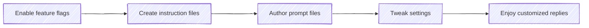

# **Customize chat responses in VS Code**
Copilot can tailor its responses to your coding style and project needs using the right context. By setting up custom instructions, you define rules for tasks like code generation or reviews. Prompt files let you create reusable chat prompts in Markdown format. This article explains how to use both features in Visual Studio Code to customize Copilot's behavior.

## Hook with a Story
Imagine you’re deep into a coding session in VS Code: you ask Copilot for a snippet, and it answers—but it never quite matches your style. Wouldn’t it be great if you could teach Copilot your team’s conventions once and have it remember? Let’s make Copilot your personalized pair-programmer.

## Lay Out the Roadmap
Here’s what we’ll cover:



## Enable Instructions & Prompt Files
VS Code’s experimental `chat.promptFiles` switch lets you turn on custom instruction and prompt files. When enabled:

  1. Open Settings (⇧⌘P → “Preferences: Open Settings (UI)”).
  2. Search for **chat.promptFiles**, toggle it on.

Your Turn:
Do this! Flip the switch and restart VS Code; notice the new “Instructions” and “Prompt Files” options in the Chat view.

> Quick Recap: One setting unlocks workspace‐wide instructions and prompts.

## Instruction Files
Instruction files let you define coding guidelines in Markdown:

• **`.github/copilot-instructions.md`** applies to all chats.
• **`.instructions.md`** files in `.github/instructions/` target specific folders using an `applyTo:` front‐matter.

Example front matter:
```yaml
---
applyTo: "**/*.ts"
---
# TypeScript Guidelines
- Use PascalCase for types
- Prefix private fields with _
```

Your Turn:
Do this! Create `.github/copilot-instructions.md` at your repo root with two simple rules: indent size and semicolon usage.

> Quick Recap: Instructions = global or scoped coding rules in Markdown.

## Prompt Files (Experimental)
Prompt files are full chat prompts saved as `.prompt.md` in `.github/prompts/`. They can include:

• **Front-Matter**: `mode`, `tools`, `description`.
• **Body**: your natural-language prompt, code templates, examples.

Sample header:
```yaml
---
mode: 'agent'
tools: ['terminalLastCommand']
description: 'Generate test stubs'
---
``` 

Your Turn:
Do this! Run the “Chat: New Prompt File” command (⇧⌘P) and scaffold a prompt that asks for a REST endpoint review.

> Quick Recap: Prompt files = reusable, sharable chat templates.

## Settings for Custom Instructions
You can also embed instructions directly in `settings.json`:

```json
"github.copilot.chat.codeGeneration.instructions": [
  { "text": "Always include a brief comment header." },
  { "file": "general-coding.instructions.md" }
]
```

Your Turn:
Do this! Add a rule in your workspace settings: “Prefix private fields with `_`.”

> Quick Recap: Settings = inline or file-referenced instructions per task.

## Conclude with Real-World Next Steps
You’ve now unlocked a practical way to align Copilot with your team’s coding DNA. Go ahead and:

- Commit your instruction & prompt files to version control.
- Share them in your team’s repo for consistent, on-brand AI replies.
- Explore further: build prompts for testing, reviews, and commit messages.

Keep iterating—your custom chat setup will evolve as your codebase grows!

## References

* [Customize chat responses in VS Code](https://code.visualstudio.com/docs/copilot/copilot-customization#_reusable-prompt-files-experimental)
