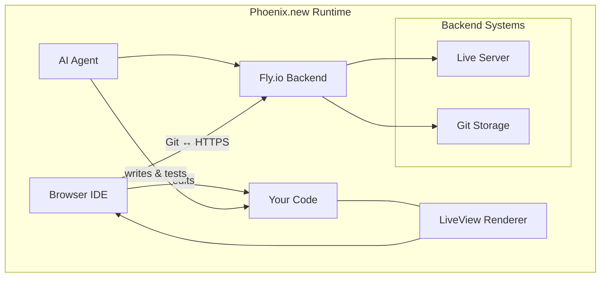

# **The Remote AI Runtime for Phoenix**

## Hook with a Story
Imagine you’re racing against the clock: juggling local servers, tangled configs, and endless `mix phx.server` restarts—only to spot a typo after hours of debugging. What if your IDE, your terminal, and your CI pipeline could all live in one browser tab, effortlessly orchestrated by an AI sidekick? Enter **Phoenix.new**, your new best friend for building Phoenix apps without installation headaches or context switching.

## Lay Out the Roadmap
Here’s what we’ll cover:

- **1. Quickstart with phoenix.new**: Sign in and spin up your first workspace
- **2. A Full IDE in Your Browser**: Explore VS Code, terminals, and extensions, all live
- **3. AI Agents That Code**: Watch the agent scaffold, test, and deploy your app
- **4. Real-Time Previews & LiveView**: See changes instantly with pub/sub magic
- **5. Practice: Your First Remote Phoenix App**: Scaffold, clone, and run locally

## 1. Quickstart with phoenix.new
Spin up a Phoenix workspace without installing Elixir or Node. Simply:

1. Head to [https://phoenix.new](https://phoenix.new) and sign in with your Fly.io account.
2. Authorize your workspace and let the remote runtime spin up (takes ~10 s).
3. Click **New Phoenix App**, give it a name (e.g. `todo-app`).

> **Pro Tip**: Keep your Fly token handy to unlock private workspaces.

**Your Turn**
- Go to phoenix.new and create a sandbox “hello-world” Phoenix project.

> **Quick Recap**: phoenix.new removes local install friction: one login → one click → remote IDE.

## 2. A Full IDE in Your Browser
You get VS Code in-browser, complete with extensions, theming, and an *Exterm* terminal. Everything you love about your local setup—linting, formatting, Git, debugging—runs remotely.



**Your Turn**
- Open the Extensions panel, install ESLint or any plugin, and watch agent logs update with your changes.

> **Quick Recap**: The remote IDE feels local—full VS Code features + remote compute.

## 3. AI Agents That Code
Ask the agent to scaffold your Phoenix app—migrations, contexts, tests, LiveViews—all written for you. It even catches syntax errors on the fly and commits each step.

> **Sidebar**: The AI agent uses headless Chrome to verify pages and tests them like a human would.

**Your Turn**
- Prompt the agent: **“Generate a blog engine with posts table and LiveView editor.”** Observe the plan it writes.

> **Quick Recap**: Agents auto-plan, code, test, and commit. You’re the captain, it’s the crew.

## 4. Real-Time Previews & LiveView
Thanks to Phoenix LiveView and PubSub, any change—template tweak or CSS update—renders instantly in your preview pane. Shareable URLs let teammates preview private builds on mobile or desktop.

**Your Turn**
- Change the CSS class in `lib/your_app_web/live/page_live.html.heex`, and see it update without a full reload.

> **Quick Recap**: LiveView + remote runtime = instant feedback loop.

## 5. Practice: Your First Remote Phoenix App
### Do this!
1. Visit: https://phoenix.new
2. Sign in & authorize Fly.io
3. Create **todo-app** with LiveView
4. Click **Clone to Local** and run:

```bash
mix deps.get && mix phx.server
```

5. Tweak `config/dev.exs` for your database adapter.

> **Pro Tip**: Use `mix phx.gen.schema` inside the remote shell to add new entities.

> **Quick Recap**: One remote click, one local clone—zero install drama.

## Conclusion & Next Steps
Remember Dave, our harried developer from the beginning? He now spins up Phoenix apps in seconds, iterates without rebuilds, and collaborates with AI agents that catch errors before they hit production. Ready to supercharge your Phoenix workflow?

- Dive deeper: [Phoenix.new docs](https://phoenix.new)
- Check out the Fly Blog deep-dive: [Remote AI Runtime for Phoenix](https://fly.io/blog/phoenix-new-the-remote-ai-runtime/)
- Tinker: build a real-time chat, e-commerce site, or dashboard with LiveView.

Happy coding!

## References
- [Phoenix.new website](https://phoenix.new)
- [Fly.io Blog: Remote AI Runtime for Phoenix](https://fly.io/blog/phoenix-new-the-remote-ai-runtime/)