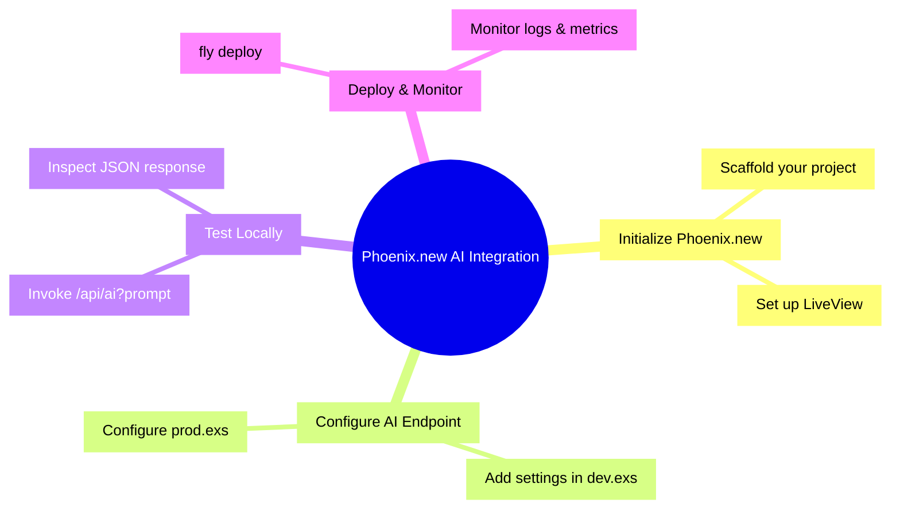

## Hook with a Story

Have you ever tried to bolt on AI features to your Phoenix app, only to watch your server choke on inference calls? You spin up a local model, tweak your configs, and still end up with sluggish responses and frustrated users. That’s exactly what happened to us when we first experimented with embedding GPT-style AI directly—until we discovered Phoenix.new’s Remote AI Runtime.

## Lay Out the Roadmap

In this post, we’ll walk you through:



## Dive into Bite-Sized Chunks

### 1. Initialize Your Phoenix.new Project
Phoenix.new is a developer-friendly tool that spins up a remote AI runtime without heavy local setup. You get Elixir-flavored API endpoints backed by scalable inference clusters.

**Your Turn**: Scaffold a new Phoenix.new project:
```bash
mix phx.new my_ai_app --live
cd my_ai_app
```

> **Quick Recap**: Phoenix.new offloads inference to a managed AI runtime so your local server stays lightning-fast.

### 2. Configure the AI Endpoint
Open `config/dev.exs` and add your AI model settings:

```elixir
config :my_ai_app, :ai,
  endpoint: "https://runtime.phoenix.new/v1/infer",
  api_key: System.get_env("PHOENIX_NEW_API_KEY")
```

<div class="sidebar">
> **Pro Tip**: Keep your API key in env vars to avoid accidental commits.
</div>

**Your Turn**: Add the above snippet into `config/dev.exs` and restart your server.

> **Quick Recap**: Config files hook your app into the Phoenix.new runtime endpoint.

### 3. Test Locally with a Mini-Exercise
Create a simple controller action that invokes the AI runtime:

```elixir
# lib/my_ai_app_web/controllers/ai_controller.ex
defmodule MyAiAppWeb.AiController do
  use MyAiAppWeb, :controller

  def generate(conn, %{"prompt" => prompt}) do
    {:ok, resp} = PhoenixNewAI.infer(prompt)
    json(conn, %{result: resp.choices})
  end
end
```

**Your Turn**: Open http://localhost:4000/api/ai?prompt=hello and inspect the JSON response.

> **Quick Recap**: A controller action delegates inference calls to the remote runtime.

### 4. Do This! – Scaffolded Integration

```elixir
# mix.exs
# ...existing deps...
  defp deps do
    [
      {:phoenix_new, "~> 0.1.0"}
      # ...other deps...
    ]
  end
# ...existing code...
```

1. Add `{:phoenix_new, "~> 0.1.0"}` to your `deps` in `mix.exs`.
2. Run `mix deps.get`.
3. Configure your AI endpoint in `config/prod.exs`.
4. Deploy with `fly deploy` or your preferred host.

> **Quick Recap**: A few edits and one deploy command bring your AI-powered Phoenix app to life.

## Conclude with Real-World Next Steps

Remember our sluggish app from the Hook? With Phoenix.new’s remote runtime, that same app now handles dozens of inference requests per second without breaking a sweat. You can apply these steps to chatbots, content generators, or even real-time analytics dashboards.

**Next Steps**:
- Experiment with custom model parameters: temperature, max_tokens, and more.
- Check out the dashboard at https://phoenix.new/dashboard.
- Dive deeper into Elixir’s GenServer to add concurrency control.

## References

- [Phoenix.new](https://phoenix.new/)
- [Phoenix.new – The Remote AI Runtime for Phoenix](https://fly.io/blog/phoenix-new-the-remote-ai-runtime/)
- [Phoenix.new Demo on YouTube](https://www.youtube.com/watch?v=du7GmWGUM5Y&t=2s)
