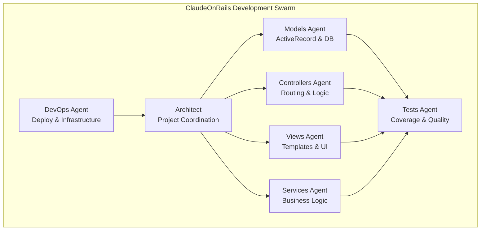

# **ClaudeOnRails: AI-Powered Rails Development Swarm**

## Hook with a Story
Picture this: You're building a Rails app at 2 AM, coffee-fueled and context-switching between models, controllers, views, and tests. You ask Claude for help with authentication, but now you're manually coordinating database migrations, controller logic, view templates, and test coverage across seven different chat sessions. What if instead of playing conductor to a one-person AI orchestra, you had an entire **specialized development team** that automatically knew who should handle what? Meet ClaudeOnRails—where AI agents work like your dream development team.

## Lay Out the Roadmap
Here's what we'll explore:

- **1. Understanding AI Agent Swarms**: Why specialized agents beat single-prompt development
- **2. Meet the ClaudeOnRails Team**: Architect, Models, Controllers, Views, Services, Tests, and DevOps agents
- **3. Installation & Setup**: Get your AI development team running in minutes
- **4. Natural Language Development**: From "build a shopping cart" to full implementation
- **5. Practice: Your First Swarm Project**: Build a real feature with coordinated agents


## 1. Understanding AI Agent Swarms
Instead of one AI trying to juggle everything, ClaudeOnRails deploys **specialist agents** that collaborate like a real development team. Each agent masters their domain and coordinates with others automatically.



**Your Turn**
- Think about your last Rails feature: How many different files did you touch? Models, controllers, views, routes, tests, maybe migrations?

> **Quick Recap**: Specialized agents = focused expertise + automatic coordination.


## 2. Meet the ClaudeOnRails Team
Each agent has a specific role and deep Rails knowledge:

* **Architect Agent:** Coordinates the entire development process, makes high-level architectural decisions, and delegates tasks to appropriate specialists.

* **Models Agent:** Handles ActiveRecord models and associations, creates and manages database migrations, and ensures proper validations and scopes.

* **Controllers Agent:** Manages routing and request handling, implements authentication and authorization, and handles API endpoints and error responses.

* **Views Agent:** Creates ERB templates and partials, manages CSS/SCSS and JavaScript assets, and builds responsive, accessible UI components.

* **Services Agent:** Implements business logic and service objects, handles background jobs and external integrations, and manages complex workflows and data processing.

* **Tests Agent:** Ensures comprehensive test coverage, writes unit, integration, and system tests, and maintains test quality and performance.

* **DevOps Agent:** Handles deployment configurations, manages infrastructure and environment setup, and optimizes performance and monitoring.

**Your Turn**
- Which agent would handle adding Stripe payments? (Hint: Services + Controllers + Tests)

> **Quick Recap**: Seven specialists working in harmony beats one generalist working alone.


## 3. Installation & Setup
Getting your AI development team up and running is surprisingly simple:

### Do this!
1. **Add to your Gemfile:**
```ruby
group :development do
  gem 'claude-on-rails'
end
```

2. **Install and generate:**
```bash
bundle install
rails generate claude_on_rails:swarm
```

3. **Start your development swarm:**
```bash
claude-swarm
```

That's it! The generator automatically:
- Analyzes your Rails project structure
- Creates customized swarm configuration
- Sets up agent-specific prompts
- Configures your development environment

**Your Turn**
- Run the generator in a test Rails app and explore the `.claude-on-rails/` directory structure.

> **Pro Tip**: The swarm adapts to your existing Rails conventions and project structure.

> **Quick Recap**: Three commands get you a full AI development team.


## 4. Natural Language Development
Here's where the magic happens. Instead of writing code, you describe what you want:

### **Traditional Approach:**
```
You: "Help me add user authentication"
Claude: "Here's a User model... now you need to create the migration... 
         don't forget the controller... and the views... and tests..."
You: *frantically copy-pasting across multiple files*
```

### **ClaudeOnRails Approach:**
```
You: "Add user authentication with email confirmation"
Architect: "Breaking this down across the team..."
Models: "Creating User model with devise..."
Controllers: "Setting up authentication routes..."
Views: "Building login/signup forms..."
Tests: "Adding comprehensive auth tests..."
DevOps: "Configuring email settings..."
```

### **Real Examples:**
```bash
> Create a shopping cart with Stripe payment integration
# Full e-commerce implementation across all layers

> Build a RESTful API for our mobile app with JWT auth  
# Complete API with authentication, serializers, and docs

> Optimize the dashboard - it's loading too slowly
# Performance improvements across models, views, and database
```

**Your Turn**
- Try: "Add a blog system with comments and tags" and watch the coordination happen.

> **Quick Recap**: Describe the outcome, not the implementation steps.


## 5. Practice: Your First Swarm Project
Let's build a real feature with coordinated agents:

### **Project: Task Management System**

#### Do this!
1. **Start your swarm:**
```bash
claude-swarm
```

2. **Make your request:**
```
> Create a task management system where users can create projects, 
  add tasks with due dates, assign them to team members, and track progress
```

3. **Watch the coordination:**
- Architect plans the feature breakdown
- Models creates Project, Task, User associations  
- Controllers handles CRUD operations and assignments
- Views builds the dashboard and task interfaces
- Services implements notification logic
- Tests ensures everything works correctly
- DevOps optimizes database queries

4. **Iterate naturally:**
```
> Add email notifications when tasks are overdue
> Create a calendar view for task due dates  
> Add time tracking to tasks
```

Each request gets automatically routed to the right specialists!

**Your Turn**
- Add one more feature: "Create a reporting dashboard showing project completion rates"

> **Pro Tip**: Start with high-level features, then drill down into specifics.

> **Quick Recap**: Complex features become simple conversations with specialized teams.


## How It's Different
### **Before ClaudeOnRails:**
- Manual context switching between different aspects
- Remembering to implement tests, security, performance
- Ensuring consistency across the entire application
- Coordinating complex features across multiple files

### **With ClaudeOnRails:**
- Natural language feature descriptions
- Automatic coordination across all Rails layers
- Built-in best practices and conventions
- Comprehensive test coverage by default


## Customization & Project Structure
After setup, you'll have:

```
your-rails-app/
├── claude-swarm.yml              # Swarm configuration
├── CLAUDE.md                     # Project context for Claude
└── .claude-on-rails/
    ├── context.md                # Rails project context
    └── prompts/                  # Agent-specific prompts
        ├── architect.md
        ├── models.md
        ├── controllers.md
        ├── views.md
        ├── services.md
        ├── tests.md
        └── devops.md
```

**Your Turn**
- Customize `prompts/models.md` to include your team's specific validation patterns.


## Conclusion & Next Steps
Remember our 2 AM developer from the beginning? They now describe features in plain English and watch specialized AI agents implement them with Rails best practices, comprehensive tests, and proper architecture. No more context switching, no more forgotten edge cases.

Ready to transform your Rails development workflow?

### **Next Actions:**
- Install ClaudeOnRails in your current project
- Try building a feature with natural language descriptions  
- Explore the [examples directory](https://github.com/obie/claude-on-rails/tree/main/examples) for inspiration
- Join the conversation: How are you using AI swarms in development?

**Advanced Exploration:**
- Customize agent prompts for your team's conventions
- Integrate with Rails MCP Server for enhanced documentation
- Build domain-specific agents for your business logic

Happy swarming!

## References
- [ClaudeOnRails GitHub Repository](https://github.com/obie/claude-on-rails)
- [Introducing ClaudeOnRails - Medium Article by Obie Fernandez](https://obie.medium.com/introducing-claudeonrails-a25fb82ae37b)
- [ClaudeOnRails Gem on RubyGems.org](https://rubygems.org/gems/claude-on-rails)
- [claude-swarm dependency](https://github.com/parruda/claude-swarm)
- [Rails MCP Server Integration](https://github.com/mariochavez/rails-mcp-server)
