# **ClaudeOnRails: AI-Powered Rails Development Swarm**

## Hook with a Story
Picture this: You're building a Rails app at 2 AM, coffee-fueled and context-switching between models, controllers, views, and tests. You ask Claude for help with authentication, but now you're manually coordinating database migrations, controller logic, view templates, and test coverage across seven different chat sessions. What if instead of playing conductor to a one-person AI orchestra, you had an entire **specialized development team** that automatically knew who should handle what? Meet ClaudeOnRails—where AI agents work like your dream development team.

## Lay Out the Roadmap
Here's what we'll explore:

- **1. Understanding AI Agent Swarms**: Why specialized agents beat single-prompt development
- **2. Meet the ClaudeOnRails Team**: Architect, Models, Controllers, Views, Services, Tests, and DevOps agents
- **3. Installation & Setup**: Get your AI development team running in minutes
- **4. Natural Language Development**: From "build a shopping cart" to full implementation
- **5. Practice: Your First Swarm Project**: Build a real feature with coordinated agents


## 1. Understanding AI Agent Swarms
Instead of one AI trying to juggle everything, ClaudeOnRails deploys **specialist agents** that collaborate like a real development team. Each agent masters their domain and coordinates with others automatically.

```mermaid!
graph TB
    subgraph "ClaudeOnRails Development Swarm"
        A["🎭 Architect Agent<br/>Project Coordination"] --> B["📊 Models Agent<br/>ActiveRecord & DB"]
        A --> C["🎮 Controllers Agent<br/>Routing & Logic"]
        A --> D["🎨 Views Agent<br/>Templates & UI"]
        A --> E["⚙️ Services Agent<br/>Business Logic"]
        B --> F["🧪 Tests Agent<br/>Coverage & Quality"]
        C --> F
        D --> F
        E --> F
        G["🚀 DevOps Agent<br/>Deploy & Infrastructure"] --> A
    end
    
    style A fill:#e1f5fe
    style B fill:#f3e5f5
    style C fill:#e8f5e8
    style D fill:#fff3e0
    style E fill:#ffebee
    style F fill:#f0f8e8
    style G fill:#fff8e1
```

**Your Turn**
- Think about your last Rails feature: How many different files did you touch? Models, controllers, views, routes, tests, maybe migrations?

> **Quick Recap**: Specialized agents = focused expertise + automatic coordination.


## 2. Meet the ClaudeOnRails Team
Each agent has a specific role and deep Rails knowledge:

* **Architect Agent:** Coordinates the entire development process, makes high-level architectural decisions, and delegates tasks to appropriate specialists.

* **Models Agent:** Handles ActiveRecord models and associations, creates and manages database migrations, and ensures proper validations and scopes.

* **Controllers Agent:** Manages routing and request handling, implements authentication and authorization, and handles API endpoints and error responses.

* **Views Agent:** Creates ERB templates and partials, manages CSS/SCSS and JavaScript assets, and builds responsive, accessible UI components.

* **Services Agent:** Implements business logic and service objects, handles background jobs and external integrations, and manages complex workflows and data processing.

* **Tests Agent:** Ensures comprehensive test coverage, writes unit, integration, and system tests, and maintains test quality and performance.

* **DevOps Agent:** Handles deployment configurations, manages infrastructure and environment setup, and optimizes performance and monitoring.

**Your Turn**
- Which agent would handle adding Stripe payments? (Hint: Services + Controllers + Tests)

### **💡 Pattern Spotlight: Hub & Spoke in Action**

Notice something familiar about the ClaudeOnRails team structure? **It's the Hub & Spoke pattern in perfect action!**

```mermaid!
graph TD
    subgraph "ClaudeOnRails Hub & Spoke"
        A["🎭 Architect Agent<br/>(HUB)"] --> B["📊 Models Agent"]
        A --> C["🎮 Controllers Agent"]
        A --> D["🎨 Views Agent"]
        A --> E["⚙️ Services Agent"]
        A --> F["🧪 Tests Agent"]
        A --> G["🚀 DevOps Agent"]
    end
    
    style A fill:#e1f5fe
    style B fill:#f3e5f5
    style C fill:#e8f5e8
    style D fill:#fff3e0
    style E fill:#ffebee
    style F fill:#f0f8e8
    style G fill:#fff8e1
```

**Why Hub & Spoke works perfectly here:**
- **Central Coordination**: Architect Agent orchestrates the entire development process
- **Specialized Delegation**: Each specialist agent handles their specific domain
- **Clear Communication**: Single point of coordination prevents chaos
- **Scalable**: Easy to add new specialist agents without changing the coordination structure

The genius? ClaudeOnRails can **dynamically switch patterns** based on the task - starting with Hub & Spoke for coordination, then moving to Parallel Swarm for execution, or Pipeline Chain for sequential workflows!

> **Quick Recap**: Seven specialists working in harmony beats one generalist working alone.


## Agent Swarm Patterns: The Architecture Behind Smart Coordination

### Wait, There Are Coordination Patterns?

Absolutely! Just like Rails follows MVC patterns, AI agent swarms follow predictable coordination patterns. Once you know these patterns, you can architect **any** development workflow by combining specialized agents.

**Think of it like musical ensembles:** Each pattern orchestrates agents differently - sometimes you need a jazz quartet, sometimes a full symphony orchestra!

<details>
<summary><strong>🎯 Pattern #1: The Hub & Spoke (Central Coordinator)</strong></summary>

<p><strong>When to use:</strong> When you need one agent to coordinate and delegate to specialists.</p>

<p><strong>Perfect for:</strong> Feature development, project planning, complex integrations</p>

```mermaid!
graph TD
    subgraph "Hub & Spoke Pattern"
        A["🎭 Architect Agent"] --> B["📊 Models Agent"]
        A --> C["🎮 Controllers Agent"]
        A --> D["🎨 Views Agent"]
        A --> E["⚙️ Services Agent"]
        A --> F["🧪 Tests Agent"]
        A --> G["🚀 DevOps Agent"]
    end
    
    style A fill:#e1f5fe
    style B fill:#f3e5f5
    style C fill:#e8f5e8
    style D fill:#fff3e0
    style E fill:#ffebee
    style F fill:#f0f8e8
    style G fill:#fff8e1
```

<p><strong>Real example:</strong> "Build user authentication" → Architect breaks it down and assigns: Models (User model), Controllers (auth routes), Views (login forms), Tests (auth specs).</p>

<p><strong>Your Turn:</strong> What complex feature would benefit from central coordination? <em>E-commerce checkout? Multi-tenant architecture?</em></p>

</details>

<details>
<summary><strong>🔄 Pattern #2: The Pipeline Chain (Sequential Handoffs)</strong></summary>

<p><strong>When to use:</strong> When development must follow a specific sequence with handoffs.</p>

<p><strong>Perfect for:</strong> CI/CD workflows, code review processes, staged deployments</p>

```mermaid!
graph 
    subgraph "Pipeline Chain Pattern"
        A["📝 Requirements"] --> B["🏗️ Models Agent"]
        B --> C["🎮 Controllers Agent"]
        C --> D["🎨 Views Agent"]
        D --> E["🧪 Tests Agent"]
        E --> F["🚀 DevOps Agent"]
    end
    
    style A fill:#e3f2fd
    style B fill:#f3e5f5
    style C fill:#e8f5e8
    style D fill:#fff3e0
    style E fill:#ffebee
    style F fill:#fff8e1
```

<p><strong>Real example:</strong> "API development pipeline" → Models create schema → Controllers implement endpoints → Tests verify behavior → DevOps deploys and monitors.</p>

<p><strong>Your Turn:</strong> What development workflows in your team follow strict sequences? <em>Feature branches? Release processes?</em></p>

</details>

<details>
<summary><strong>🌊 Pattern #3: The Parallel Swarm (Concurrent Specialists)</strong></summary>

<p><strong>When to use:</strong> When multiple agents can work simultaneously on different aspects.</p>

<p><strong>Perfect for:</strong> Large feature development, performance optimization, technical debt cleanup</p>

```mermaid!
graph 
    subgraph "Parallel Swarm Pattern"
        A["🚀 Feature Request"] --> B["🎭 Coordinator"]
        B --> C["📊 Models Team"]
        B --> D["🎮 Controllers Team"]
        B --> E["🎨 Frontend Team"]
        C --> F["🔄 Integration"]
        D --> F
        E --> F
        F --> G["✅ Complete Feature"]
    end
    
    style A fill:#e3f2fd
    style B fill:#e1f5fe
    style C fill:#f3e5f5
    style D fill:#e8f5e8
    style E fill:#fff3e0
    style F fill:#ffebee
    style G fill:#fff8e1
```

<p><strong>Real example:</strong> "Rebuild dashboard for performance" → Models optimize queries, Controllers cache responses, Views implement lazy loading - all simultaneously.</p>

<p><strong>Your Turn:</strong> What big projects could benefit from parallel development? <em>Mobile app + web app? Multi-language support?</em></p>

</details>

<details>
<summary><strong>🔄 Pattern #4: The Feedback Loop (Iterative Improvement)</strong></summary>

<p><strong>When to use:</strong> When agents should learn from each other and continuously improve code quality.</p>

<p><strong>Perfect for:</strong> Code refactoring, performance tuning, security hardening</p>

```mermaid!
graph 
    subgraph "Feedback Loop Pattern"
        A["🔧 Implement"] --> B["🧪 Test Results"]
        B --> C{"📊 Quality Check"}
        C -->|Pass| D["✅ Deploy"]
        C -->|Fail| E["🔄 Refactor"]
        E --> A
        D --> F["📈 Monitor"]
        F --> E
    end
    
    style A fill:#e1f5fe
    style B fill:#f3e5f5
    style C fill:#fff3e0
    style D fill:#e8f5e8
    style E fill:#ffebee
    style F fill:#fff8e1
```

<p><strong>Real example:</strong> "Optimize slow endpoints" → Implement changes → Run performance tests → Check metrics → Refine approach → Repeat until targets are met.</p>

<p><strong>Your Turn:</strong> What aspects of your codebase could benefit from continuous improvement cycles? <em>Test coverage? Load times? Security?</em></p>

</details>

<details>
<summary><strong>🌲 Pattern #5: The Decision Tree (Smart Routing)</strong></summary>

<p><strong>When to use:</strong> When different types of requests need different agent combinations.</p>

<p><strong>Perfect for:</strong> Multi-project environments, different application types, varying complexity levels</p>

```mermaid!
graph 
    subgraph "Decision Tree Pattern"
        A["📥 Request"] --> B{"🤔 Request Type?"}
        B -->|API Only| C["🔧 Backend Swarm"]
        B -->|Full Stack| D["🌐 Full Team"]
        B -->|Bug Fix| E["🐛 Debug Squad"]
        C --> F["✅ API Response"]
        D --> G["✅ Complete App"]
        E --> H["✅ Bug Fixed"]
    end
    
    style A fill:#e3f2fd
    style B fill:#f3e5f5
    style C fill:#e1f5fe
    style D fill:#e8f5e8
    style E fill:#ffebee
    style F fill:#fff3e0
    style G fill:#fff8e1
    style H fill:#f0f8e8
```

<p><strong>Real example:</strong> "Smart routing" → API requests go to Models+Controllers+Tests, UI requests add Views+Frontend, bugs go to specialized debugging agents.</p>

<p><strong>Your Turn:</strong> How could smart routing help your development workflow? <em>Different clients? Various project types?</em></p>

</details>

<details>
<summary><strong>⚡ Pattern #6: The Emergency Response (Crisis Management)</strong></summary>

<p><strong>When to use:</strong> When production issues require immediate, coordinated response.</p>

<p><strong>Perfect for:</strong> Hotfixes, security patches, performance emergencies, data recovery</p>

```mermaid!
graph 
    subgraph "Emergency Response Pattern"
        A["🚨 Alert"] --> B["🎯 Triage Agent"]
        B --> C["🔍 Diagnostic Team"]
        C --> D["🛠️ Fix Team"]
        D --> E["🧪 Rapid Testing"]
        E --> F["🚀 Hot Deploy"]
        F --> G["📊 Monitor"]
    end
    
    style A fill:#ffcdd2
    style B fill:#ffebee
    style C fill:#e1f5fe
    style D fill:#f3e5f5
    style E fill:#e8f5e8
    style F fill:#fff3e0
    style G fill:#fff8e1
```

<p><strong>Real example:</strong> "Production down!" → Triage identifies database issue → Diagnostics find slow query → Fix team optimizes → Tests verify → Deploy immediately → Monitor recovery.</p>

<p><strong>Your Turn:</strong> What production emergencies has your team faced? How could coordinated agents help? <em>Database locks? Memory leaks? Security breaches?</em></p>

</details>

<details>
<summary><strong>🔄 Pattern #7: The Circuit Breaker (Fault Tolerance)</strong></summary>

<p><strong>When to use:</strong> When you need to handle agent failures gracefully and maintain system stability.</p>

<p><strong>Perfect for:</strong> Production systems, external API dependencies, error-prone operations</p>

```mermaid!
graph 
    subgraph "Circuit Breaker Pattern"
        A["📥 Request"] --> B{"🔍 Health Check"}
        B -->|Healthy| C["🎯 Primary Agent"]
        B -->|Degraded| D["🛡️ Fallback Agent"]
        B -->|Failed| E["⚠️ Circuit Open"]
        C --> F["✅ Success"]
        D --> G["⚡ Limited Response"]
        E --> H["❌ Fail Fast"]
    end
    
    style A fill:#e3f2fd
    style B fill:#fff3e0
    style C fill:#e8f5e8
    style D fill:#fff8e1
    style E fill:#ffcdd2
    style F fill:#e8f5e8
    style G fill:#fff8e1
    style H fill:#ffebee
```

<p><strong>Real example:</strong> "Deploy feature → Primary agent fails → Fallback agent provides basic functionality → Circuit opens to prevent cascade failures."</p>

<p><strong>Your Turn:</strong> What parts of your system need graceful degradation? <em>Payment processing? Email delivery? External APIs?</em></p>

</details>

<details>
<summary><strong>🎭 Pattern #8: The Actor Model (Message-Driven Coordination)</strong></summary>

<p><strong>When to use:</strong> When agents need to communicate asynchronously through message passing.</p>

<p><strong>Perfect for:</strong> Complex workflows, event-driven architectures, distributed processing</p>

```mermaid!
graph 
    subgraph "Actor Model Pattern"
        A["📬 Message Queue"] --> B["🎭 Controller Actor"]
        B --> C["📨 Send Message"]
        C --> D["📊 Models Actor"]
        C --> E["🎨 Views Actor"]
        C --> F["🧪 Tests Actor"]
        D --> G["📬 Response Queue"]
        E --> G
        F --> G
        G --> H["🔄 Orchestrator"]
    end
    
    style A fill:#e3f2fd
    style B fill:#e1f5fe
    style C fill:#f3e5f5
    style D fill:#e8f5e8
    style E fill:#fff3e0
    style F fill:#fff8e1
    style G fill:#ffebee
    style H fill:#f0f8e8
```

<p><strong>Real example:</strong> "User registration → Controller sends messages → Models creates user, Views renders welcome, Tests verifies flow → All respond asynchronously."</p>

<p><strong>Your Turn:</strong> What workflows could benefit from loose coupling? <em>Order processing? Content publishing? User onboarding?</em></p>

</details>

<details>
<summary><strong>⚖️ Pattern #9: The Load Balancer (Dynamic Agent Scaling)</strong></summary>

<p><strong>When to use:</strong> When you need to distribute work across multiple instances of the same agent type.</p>

<p><strong>Perfect for:</strong> High-traffic applications, resource-intensive tasks, peak load handling</p>

```mermaid!
graph 
    subgraph "Load Balancer Pattern"
        A["🌊 High Load"] --> B["⚖️ Load Balancer"]
        B --> C["🔧 Models Agent 1"]
        B --> D["🔧 Models Agent 2"]
        B --> E["🔧 Models Agent 3"]
        C --> F["📊 Results Aggregator"]
        D --> F
        E --> F
        F --> G["✅ Combined Output"]
    end
    
    style A fill:#ffcdd2
    style B fill:#e1f5fe
    style C fill:#f3e5f5
    style D fill:#f3e5f5
    style E fill:#f3e5f5
    style F fill:#e8f5e8
    style G fill:#fff3e0
```

<p><strong>Real example:</strong> "Black Friday traffic surge → Load balancer spins up 5 Models agents → Distribute database operations → Aggregate results → Handle peak load smoothly."</p>

<p><strong>Your Turn:</strong> When does your system experience load spikes? <em>Marketing campaigns? End-of-month reporting? Holiday traffic?</em></p>

</details>

<details>
<summary><strong>🕰️ Pattern #10: The Temporal Workflow (Time-Based Coordination)</strong></summary>

<p><strong>When to use:</strong> When agents need to coordinate across time with delays, scheduling, and timeouts.</p>

<p><strong>Perfect for:</strong> Background jobs, scheduled tasks, long-running processes</p>

```mermaid!
graph 
    subgraph "Temporal Workflow Pattern"
        A["⏰ Schedule Task"] --> B["📅 Timer Agent"]
        B --> C["🔔 Trigger Event"]
        C --> D["🎯 Execute Agent"]
        D --> E{"✅ Success?"}
        E -->|Yes| F["📝 Log Success"]
        E -->|No| G["⏳ Retry Timer"]
        G --> H["🔄 Retry Agent"]
        H --> E
    end
    
    style A fill:#e3f2fd
    style B fill:#fff8e1
    style C fill:#e1f5fe
    style D fill:#f3e5f5
    style E fill:#fff3e0
    style F fill:#e8f5e8
    style G fill:#ffebee
    style H fill:#f3e5f5
```

<p><strong>Real example:</strong> "Weekly reports → Schedule every Monday → Timer triggers → Models agent generates → Email agent sends → Retry if failure → Log completion."</p>

<p><strong>Your Turn:</strong> What time-based processes need automation? <em>Backups? Reports? Maintenance tasks? Notifications?</em></p>

</details>

<details>
<summary><strong>🎯 Pattern #11: The Saga Pattern (Distributed Transactions)</strong></summary>

<p><strong>When to use:</strong> When you need to coordinate complex transactions across multiple agents with rollback capability.</p>

<p><strong>Perfect for:</strong> E-commerce workflows, financial operations, multi-step business processes</p>

```mermaid!
graph 
    subgraph "Saga Pattern"
        A["🛒 Order Request"] --> B["🎭 Saga Coordinator"]
        B --> C["💳 Payment Agent"]
        C --> D["📦 Inventory Agent"]
        D --> E["📧 Email Agent"]
        E --> F["✅ Complete"]
        F --> G["🎉 Success"]
        C -->|Fail| H["❌ Compensate"]
        D -->|Fail| H
        E -->|Fail| H
        H --> I["🔄 Rollback"]
    end
    
    style A fill:#e3f2fd
    style B fill:#e1f5fe
    style C fill:#f3e5f5
    style D fill:#e8f5e8
    style E fill:#fff3e0
    style F fill:#e8f5e8
    style G fill:#e8f5e8
    style H fill:#ffcdd2
    style I fill:#ffebee
```

<p><strong>Real example:</strong> "Purchase workflow → Charge payment → Reserve inventory → Send confirmation → If any step fails → Rollback previous steps → Maintain data consistency."</p>

<p><strong>Your Turn:</strong> What business processes need all-or-nothing execution? <em>User registration? Subscription changes? Data migrations?</em></p>

</details>

<details>
<summary><strong>🔍 Pattern #12: The Observer Swarm (Event-Driven Reactions)</strong></summary>

<p><strong>When to use:</strong> When multiple agents need to react to the same events independently.</p>

<p><strong>Perfect for:</strong> Monitoring, analytics, notifications, audit trails</p>

```mermaid!
graph 
    subgraph "Observer Swarm Pattern"
        A["📊 Event Source"] --> B["📡 Event Bus"]
        B --> C["📈 Analytics Agent"]
        B --> D["📧 Notification Agent"]
        B --> E["🔍 Audit Agent"]
        B --> F["⚠️ Alert Agent"]
        C --> G["📊 Dashboard Update"]
        D --> H["📧 User Notification"]
        E --> I["📝 Audit Log"]
        F --> J["🚨 Slack Alert"]
    end
    
    style A fill:#e3f2fd
    style B fill:#e1f5fe
    style C fill:#f3e5f5
    style D fill:#e8f5e8
    style E fill:#fff3e0
    style F fill:#ffcdd2
    style G fill:#f3e5f5
    style H fill:#e8f5e8
    style I fill:#fff3e0
    style J fill:#ffcdd2
```

<p><strong>Real example:</strong> "User signup event → Analytics tracks conversion → Notification sends welcome email → Audit logs activity → Alert notifies team → All happen independently."</p>

<p><strong>Your Turn:</strong> What events in your system need multiple reactions? <em>Deployments? Errors? User actions? Performance issues?</em></p>

</details>

### Advanced Pattern Recognition Quiz

**Do this!** Match these complex Rails scenarios with the advanced patterns:

1. **Payment processing that must handle credit card failures gracefully**
   - *Pattern:* `__________`

2. **Background job system for processing uploaded CSV files**
   - *Pattern:* `__________`

3. **User registration that must create account, send email, setup billing, and rollback if any step fails**
   - *Pattern:* `__________`

4. **System monitoring where errors trigger multiple independent responses (logging, alerting, metrics)**
   - *Pattern:* `__________`

5. **API that scales Models agents based on traffic load**
   - *Pattern:* `__________`

### Your Turn: Pattern Recognition

**Do this!** Match these real development scenarios with the right swarm pattern:

1. **Building a new microservice from scratch**
   - *Pattern:* `__________`

2. **Monthly security audit and updates across all apps**  
   - *Pattern:* `__________`

3. **Different teams requesting APIs vs full-stack features**
   - *Pattern:* `__________`

4. **Site performance is degrading, need continuous optimization**
   - *Pattern:* `__________`

**Pro Tip:** Most complex projects combine multiple patterns! For example: Decision Tree for routing → Hub & Spoke for coordination → Parallel Swarm for execution.

<details>
<summary><strong>🎯 Quiz Answers: Pattern Recognition Mastery</strong></summary>

<p><strong>Advanced Pattern Recognition Quiz Answers:</strong></p>

<p><strong>1. Payment processing that must handle credit card failures gracefully</strong><br>
&nbsp;&nbsp;&nbsp;- <em>Pattern:</em> <strong>Circuit Breaker</strong> - Handles failures gracefully with fallback mechanisms</p>

<p><strong>2. Background job system for processing uploaded CSV files</strong><br>
&nbsp;&nbsp;&nbsp;- <em>Pattern:</em> <strong>Temporal Workflow</strong> - Time-based coordination with scheduling and retries</p>

<p><strong>3. User registration that must create account, send email, setup billing, and rollback if any step fails</strong><br>
&nbsp;&nbsp;&nbsp;- <em>Pattern:</em> <strong>Saga Pattern</strong> - Distributed transactions with rollback capability</p>

<p><strong>4. System monitoring where errors trigger multiple independent responses (logging, alerting, metrics)</strong><br>
&nbsp;&nbsp;&nbsp;- <em>Pattern:</em> <strong>Observer Swarm</strong> - Multiple agents react to the same events independently</p>

<p><strong>5. API that scales Models agents based on traffic load</strong><br>
&nbsp;&nbsp;&nbsp;- <em>Pattern:</em> <strong>Load Balancer</strong> - Dynamic agent scaling for high-traffic scenarios</p>

<hr>

<p><strong>Your Turn Pattern Recognition Answers:</strong></p>

<p><strong>1. Building a new microservice from scratch</strong><br>
&nbsp;&nbsp;&nbsp;- <em>Pattern:</em> <strong>Hub & Spoke</strong> - Central coordination with specialist delegation</p>

<p><strong>2. Monthly security audit and updates across all apps</strong><br>
&nbsp;&nbsp;&nbsp;- <em>Pattern:</em> <strong>Temporal Workflow</strong> - Scheduled, time-based coordination</p>

<p><strong>3. Different teams requesting APIs vs full-stack features</strong><br>
&nbsp;&nbsp;&nbsp;- <em>Pattern:</em> <strong>Decision Tree</strong> - Smart routing based on request type</p>

<p><strong>4. Site performance is degrading, need continuous optimization</strong><br>
&nbsp;&nbsp;&nbsp;- <em>Pattern:</em> <strong>Feedback Loop</strong> - Iterative improvement with continuous monitoring</p>

<hr>

<p><strong>How did you score?</strong> 🎯</p>
<ul>
<li><strong>8/8 correct</strong>: Pattern Master! You're ready to architect complex agent swarms</li>
<li><strong>6-7 correct</strong>: Pattern Pro! You understand the core concepts</li>
<li><strong>4-5 correct</strong>: Pattern Apprentice! Review the examples and try again</li>
<li><strong>0-3 correct</strong>: Pattern Beginner! Focus on understanding when to use each pattern</li>
</ul>

</details>

**Quick Recap:** Master these 12 coordination patterns, and you can architect any development workflow with specialized agent teams!

## 3. Installation & Setup
Getting your AI development team up and running is surprisingly simple:

### Do this!
1. **Add to your Gemfile:**
```ruby
group :development do
  gem 'claude-on-rails'
end
```

2. **Install and generate:**
```bash
bundle install
rails generate claude_on_rails:swarm
```

3. **Start your development swarm:**
```bash
claude-swarm
```

That's it! The generator automatically:
- Analyzes your Rails project structure
- Creates customized swarm configuration
- Sets up agent-specific prompts
- Configures your development environment

**Your Turn**
- Run the generator in a test Rails app and explore the `.claude-on-rails/` directory structure.

> **Pro Tip**: The swarm adapts to your existing Rails conventions and project structure.

> **Quick Recap**: Three commands get you a full AI development team.


## 4. Natural Language Development
Here's where the magic happens. Instead of writing code, you describe what you want:

### **Traditional Approach:**
```
You: "Help me add user authentication"
Claude: "Here's a User model... now you need to create the migration... 
         don't forget the controller... and the views... and tests..."
You: *frantically copy-pasting across multiple files*
```

### **ClaudeOnRails Approach:**
```
You: "Add user authentication with email confirmation"
Architect: "Breaking this down across the team..."
Models: "Creating User model with devise..."
Controllers: "Setting up authentication routes..."
Views: "Building login/signup forms..."
Tests: "Adding comprehensive auth tests..."
DevOps: "Configuring email settings..."
```

### **Real Examples:**
```bash
> Create a shopping cart with Stripe payment integration
# Full e-commerce implementation across all layers

> Build a RESTful API for our mobile app with JWT auth  
# Complete API with authentication, serializers, and docs

> Optimize the dashboard - it's loading too slowly
# Performance improvements across models, views, and database
```

**Your Turn**
- Try: "Add a blog system with comments and tags" and watch the coordination happen.

> **Quick Recap**: Describe the outcome, not the implementation steps.


## 5. Practice: Your First Swarm Project
Let's build a real feature with coordinated agents:

### **Project: Task Management System**

#### Do this!
1. **Start your swarm:**
```bash
claude-swarm
```

2. **Make your request:**
```
> Create a task management system where users can create projects, 
  add tasks with due dates, assign them to team members, and track progress
```

3. **Watch the coordination:**
- Architect plans the feature breakdown
- Models creates Project, Task, User associations  
- Controllers handles CRUD operations and assignments
- Views builds the dashboard and task interfaces
- Services implements notification logic
- Tests ensures everything works correctly
- DevOps optimizes database queries

4. **Iterate naturally:**
```
> Add email notifications when tasks are overdue
> Create a calendar view for task due dates  
> Add time tracking to tasks
```

Each request gets automatically routed to the right specialists!

**Your Turn**
- Add one more feature: "Create a reporting dashboard showing project completion rates"

> **Pro Tip**: Start with high-level features, then drill down into specifics.

> **Quick Recap**: Complex features become simple conversations with specialized teams.


## How It's Different
### **Before ClaudeOnRails:**
- Manual context switching between different aspects
- Remembering to implement tests, security, performance
- Ensuring consistency across the entire application
- Coordinating complex features across multiple files

### **With ClaudeOnRails:**
- Natural language feature descriptions
- Automatic coordination across all Rails layers
- Built-in best practices and conventions
- Comprehensive test coverage by default

### Visual Comparison: Traditional vs ClaudeOnRails
```mermaid!
graph 
    subgraph "Traditional Development"
        A1["💭 Think Feature"] --> B1["📝 Write Model"]
        B1 --> C1["🎮 Write Controller"] 
        C1 --> D1["🎨 Create Views"]
        D1 --> E1["🧪 Write Tests"]
        E1 --> F1["🚀 Deploy"]
        F1 --> G1["🐛 Debug Issues"]
        G1 --> B1
    end
    
    style A1 fill:#ffcdd2
    style B1 fill:#ffcdd2
    style C1 fill:#ffcdd2
    style D1 fill:#ffcdd2
    style E1 fill:#ffcdd2
    style F1 fill:#ffcdd2
    style G1 fill:#ffcdd2
```


**The difference is clear: sequential struggle vs. coordinated efficiency!** 🚀

## Customization & Project Structure
After setup, you'll have:

```
your-rails-app/
├── claude-swarm.yml              # Swarm configuration
├── CLAUDE.md                     # Project context for Claude
└── .claude-on-rails/
    ├── context.md                # Rails project context
    └── prompts/                  # Agent-specific prompts
        ├── architect.md
        ├── models.md
        ├── controllers.md
        ├── views.md
        ├── services.md
        ├── tests.md
        └── devops.md
```

**Your Turn**
- Customize `prompts/models.md` to include your team's specific validation patterns.


## Conclusion & Next Steps
Remember our 2 AM developer from the beginning? They now describe features in plain English and watch specialized AI agents implement them with Rails best practices, comprehensive tests, and proper architecture. No more context switching, no more forgotten edge cases.

Ready to transform your Rails development workflow?

### **Next Actions:**
- Install ClaudeOnRails in your current project
- Try building a feature with natural language descriptions  
- Explore the [examples directory](https://github.com/obie/claude-on-rails/tree/main/examples) for inspiration
- Join the conversation: How are you using AI swarms in development?

**Advanced Exploration:**
- Customize agent prompts for your team's conventions
- Integrate with Rails MCP Server for enhanced documentation
- Build domain-specific agents for your business logic

Happy swarming!

## References
- [ClaudeOnRails GitHub Repository](https://github.com/obie/claude-on-rails)
- [Introducing ClaudeOnRails - Medium Article by Obie Fernandez](https://obie.medium.com/introducing-claudeonrails-a25fb82ae37b)
- [ClaudeOnRails Gem on RubyGems.org](https://rubygems.org/gems/claude-on-rails)
- [Claude-swarm dependency](https://github.com/parruda/claude-swarm)
