# **PocketFlow: The 100-Line LLM Framework That Makes Agents Actually Understandable**

## Hook with a Story

Picture this: You're at a tech meetup, and someone starts explaining their AI agent architecture. They mention LangChain's 405K lines of code, CrewAI's complex abstractions, and AutoGen's mysterious black boxes. Your eyes glaze over as they dive into the technical jargon.

Then someone else steps up and says: "What if I told you that **every AI agent is just a simple graph with 100 lines of code?**" 

That person would be talking about **PocketFlow** - the minimalist LLM framework that strips away all the complexity to reveal the beautiful simplicity underneath. No more wondering what's happening behind the scenes. No more vendor lock-in. Just pure, transparent agent logic you can actually understand.


## Lay Out the Roadmap

Here's our journey to mastering PocketFlow and understanding how LLM agents really work:

```mermaid!
graph 
    subgraph "Learning Journey"
        A[🎯 The Big Secret] --> B[🧩 Core Building Blocks]
        B --> C[🔍 Simple Research Agent]
        C --> D[⚡ Your First Implementation]
        D --> E[🚀 Real-World Applications]
        E --> F[🌟 Next Steps]
    end
    
    style A fill:#ffd1dc
    style B fill:#e0f4f3
    style C fill:#e1f5fe
    style D fill:#f0f8e8
    style E fill:#fff8e1
    style F fill:#f3e5f5
```



**What you'll learn:**
1. Why agents are just simple graphs (not rocket science!)
2. The three building blocks that power everything
3. How to build a research agent in minutes
4. Why PocketFlow beats massive frameworks
5. How to apply this to real projects


## The Big Secret: Agents Are Just Simple Graphs!

### Wait, That's It? Really?

Yes! Here's the mind-blowing truth that complex frameworks try to hide:

```mermaid!
graph LR
    subgraph "Agent Decision Loop"
        A[🤔 Think] --> B{🔀 Decide}
        B -->|Search| C[🔍 Search Web]
        B -->|Answer| D[💬 Give Answer]
        C --> A
    end
    
    subgraph "Completion"
        D --> E[✅ Done]
    end
    
    style A fill:#e1f5fe
    style B fill:#f3e5f5
    style C fill:#e8f5e8
    style D fill:#fff3e0
    style E fill:#ffebee
```



Every AI agent, no matter how complex it seems, follows this pattern:
1. **Think** about the current situation
2. **Decide** what action to take next
3. **Do** the chosen action
4. **Loop** back to thinking with new information

> **💡 Pro Tip:** Even the most sophisticated frameworks like OpenAI Agents, LangChain, and LangGraph follow this exact pattern under the hood. PocketFlow just makes it visible!

### Your Turn: Spot the Pattern

Think about how **you** solve problems. Let's say someone asks: "What's the weather like in Tokyo?"

**Your mental process:**
1. 🤔 "I need current weather info"
2. 🔀 "Should I check my phone or ask someone?"
3. 📱 "I'll check a weather app"
4. 🤔 "Got the info, now I can answer"
5. 💬 "It's 22°C and sunny in Tokyo"

See? You're already thinking like an agent!


## Dive into Bite-Sized Chunks

### Building Block #1: Nodes (The Workers)

Think of **Nodes** as specialized workers in a kitchen:

```python
class SearchWebNode(Node):
    def prep(self, shared):
        # 🥄 Grab ingredients (get search query)
        return shared["search_query"]
    
    def exec(self, search_query):
        # 👨‍🍳 Do the actual work (search the web)
        results = google_search(search_query)
        return results
    
    def post(self, shared, prep_res, exec_res):
        # 🍽️ Serve the dish (save results, decide what's next)
        shared["search_results"] = exec_res
        return "analyze_results"
```

**Every node has three simple jobs:**
- **Prep:** Gather what you need from the shared workspace
- **Exec:** Do your specialized task
- **Post:** Save your results and decide where to go next

### Your Turn: Design a Node

**Do this!** Imagine you're building a "TranslateText" node. What would each method do?
1. **Prep:** What information would you need?
2. **Exec:** What's the main task?
3. **Post:** Where should the flow go next?

*Think about it before reading on...*

**Quick Recap:** Nodes are like specialized workers that prep, execute, and hand off to the next worker.


### Building Block #2: Flow (The Recipe)

The **Flow** is like a recipe that tells workers where to go next:

```python
# Connect the nodes like a flowchart
search_node - "analyze" >> analyze_node
search_node - "answer" >> answer_node
analyze_node - "search_more" >> search_node
analyze_node - "answer" >> answer_node

# Create the flow starting with search
flow = Flow(start=search_node)
```

**Flow connections are simple:**
- `node1 - "action" >> node2` means "if node1 returns 'action', go to node2"
- It's just like following arrows in a flowchart!

### Your Turn: Connect the Dots

**Do this!** Draw arrows connecting these nodes:
1. **StartNode** → (if "needs_info") → **SearchNode**
2. **StartNode** → (if "can_answer") → **AnswerNode** 
3. **SearchNode** → (always) → **StartNode**

```mermaid!
graph LR
    subgraph "Flow Control"
        A[🚀 StartNode] --> B{🤔 Decision}
    end
    
    subgraph "Actions"
        B -->|needs_info| C[🔍 SearchNode]
        B -->|can_answer| D[💬 AnswerNode]
        C --> A
    end
    
    style A fill:#e1f5fe
    style B fill:#f3e5f5
    style C fill:#e8f5e8
    style D fill:#fff3e0
```



**Quick Recap:** Flow is just a simple recipe that says "if this, then go there."


### Building Block #3: Shared Store (The Kitchen Counter)

The **Shared Store** is like a big kitchen counter where everyone can leave notes and ingredients:

```python
# Everyone can read and write to this shared space
shared = {
    "question": "What's the capital of France?",
    "search_results": "Paris is the capital...",
    "answer": "The capital of France is Paris."
}
```

**It's that simple:**
- All nodes can read from and write to this shared dictionary
- It's how information flows between different workers
- Think of it as everyone's shared notebook

### Your Turn: Design Your Shared Store

**Do this!** If you were building a "Recipe Generator" agent, what would you put in the shared store?

*Hint: Think about what information different nodes would need to share...*

**Quick Recap:** Shared store is just a dictionary where all nodes can read and write information.


## Let's Build a Super Simple Research Agent

### Before We Code: The Mental Model

Our research agent will be like having a super-smart assistant who can:
1. **Read** your question
2. **Decide** if they need to look something up
3. **Search** the web if needed  
4. **Answer** once they have enough info

```mermaid!
graph LR
    subgraph "Input"
        A[📝 Question: Who won 2023 Super Bowl?]
    end
    
    subgraph "Processing"
        A --> B[🤔 DecideAction]
        B -->|need info| C[🔍 SearchWeb]
        B -->|can answer| D[💬 AnswerQuestion]
        C --> B
    end
    
    subgraph "Output"
        D --> E[✅ Done: Kansas City Chiefs!]
    end
    
    style A fill:#e3f2fd
    style B fill:#f3e5f5
    style C fill:#e8f5e8
    style D fill:#fff3e0
    style E fill:#ffebee
```



### Step 1: The Decision Maker

```python
class DecideAction(Node):
    def prep(self, shared):
        # Gather what we know so far
        question = shared["question"]
        context = shared.get("search_results", "No previous research")
        return question, context
    
    def exec(self, inputs):
        question, context = inputs
        
        # Ask the LLM to decide what to do
        prompt = f"""
        Question: {question}
        What we know: {context}
        
        Should I search for more info or answer now?
        Respond with either "search" or "answer"
        """
        
        decision = call_llm(prompt)
        return decision.strip().lower()
    
    def post(self, shared, prep_res, exec_res):
        # Return the decision (this tells Flow where to go next)
        return exec_res  # "search" or "answer"
```

### Your Turn: Test Your Understanding

**Do this!** Walk through what happens when someone asks "What's 2+2?":
1. What would `prep` gather?
2. What would the LLM likely decide?
3. Where would the flow go next?


### Step 2: The Web Searcher

```python
class SearchWeb(Node):
    def prep(self, shared):
        # Get the search query (we'll keep it simple)
        question = shared["question"]
        return question
    
    def exec(self, question):
        # In real life, you'd use Google API
        # For now, let's simulate it
        if "super bowl 2023" in question.lower():
            return "The Kansas City Chiefs won Super Bowl LVII in 2023"
        else:
            return f"Search results for: {question}"
    
    def post(self, shared, prep_res, exec_res):
        # Save results and go back to decision maker
        shared["search_results"] = exec_res
        return "decide"  # Go back to DecideAction
```

### Your Turn: Enhance the Searcher

**Do this!** What would you change to make this more realistic?
1. How would you connect to a real search API?
2. What information would you extract from search results?
3. How would you handle search errors?


### Step 3: The Answer Generator

```python
class AnswerQuestion(Node):
    def prep(self, shared):
        # Gather everything we know
        question = shared["question"]
        research = shared.get("search_results", "")
        return question, research
    
    def exec(self, inputs):
        question, research = inputs
        
        prompt = f"""
        Answer this question: {question}
        Based on this research: {research}
        
        Give a helpful, friendly answer:
        """
        
        answer = call_llm(prompt)
        return answer
    
    def post(self, shared, prep_res, exec_res):
        # Save the final answer
        shared["final_answer"] = exec_res
        return "done"  # We're finished!
```

### Your Turn: Improve the Answer

**Do this!** How would you make the answer better?
1. What if there's no research data?
2. How would you cite sources?
3. What tone should the answer have?


## Scaffold Reader Practice

### Let's Connect Everything Together!

**Do this!** Follow these numbered steps to build your complete agent:

```python
# Step 1: Create your nodes
decide = DecideAction()
search = SearchWeb()
answer = AnswerQuestion()

# Step 2: Connect them with arrows
decide - "search" >> search      # If decide returns "search", go to search
decide - "answer" >> answer      # If decide returns "answer", go to answer  
search - "decide" >> decide      # After searching, go back to decide

# Step 3: Create the flow
flow = Flow(start=decide)

# Step 4: Set up your question
shared = {"question": "Who won the 2023 Super Bowl?"}

# Step 5: Run it!
flow.run(shared)

# Step 6: See the result
print(shared["final_answer"])
```

### Your Turn: Customize It

**Do this!** Try changing these parts:
1. **Question:** Ask about something else
2. **Search logic:** Add more realistic search results
3. **Connections:** What if search could go directly to answer?

**Pro tip:** Start small, test each part, then add complexity!


## Why PocketFlow Beats the Giants

### The Shocking Size Comparison

| Framework | Lines of Code | Dependencies | Download Size |
|-----------|---------------|--------------|---------------|
| **LangChain** | 405,000+ | Many | +166MB |
| **CrewAI** | 18,000+ | Many | +173MB |
| **AutoGen** | 7,000+ | Many | +26MB |
| **PocketFlow** | **100** | **Zero** | **56KB** |

### Mix Media Liberally: The Complexity Iceberg

```mermaid!
graph TD
    subgraph "Surface Level - What You See"
        A[🏔️ What You See] --> B[✨ Complex Framework UI]
        A --> C[🎭 Impressive Demos]
        A --> D[📢 Marketing Promises]
    end
    
    style A fill:#e1f5fe
    style B fill:#f0f8e8
    style C fill:#fff8e1
    style D fill:#f3e5f5
```

```mermaid!
graph TD
    subgraph "Hidden Depths - Reality"
        E[🌊 What's Hidden Below] --> F[📚 405K Lines of Code]
        E --> G[🔒 Vendor Lock-in]
        E --> H[⚫ Black Box Logic]
        E --> I[🐛 Debugging Nightmares]
    end
    
    style E fill:#e8eaf6
    style F fill:#ffcdd2
    style G fill:#ffcdd2
    style H fill:#ffcdd2
    style I fill:#ffcdd2
```




**The truth:** Most frameworks hide the simple graph pattern under layers of complexity!

### Your Turn: Calculate the Difference

**Do this!** 
- PocketFlow: 100 lines
- LangChain: 405,000 lines
- **Ratio:** LangChain is 4,050x larger!

Would you rather debug 100 lines or 405,000 lines? 🤔


## Keep It Conversational

### But Wait, Is This Really Enough?

You might be thinking: "This seems too simple! What about all the advanced features?"

Here's the secret: **You don't need them!** 

> **🎯 Real Talk:** 90% of AI applications can be built with just these simple patterns. The other 10% usually involves domain-specific logic that big frameworks can't help with anyway.

### The "Enterprise Features" Reality Check

**Complex frameworks promise:**
- ❌ Built-in tool integration (but APIs change constantly)
- ❌ Advanced memory systems (but your use case is unique)  
- ❌ Multi-agent orchestration (but adds debugging complexity)

**PocketFlow delivers:**
- ✅ **Crystal clear logic** you can understand and modify
- ✅ **Zero vendor lock-in** - use any LLM, any API
- ✅ **Debugging simplicity** - 100 lines vs 405,000 lines
- ✅ **Production ready** - no mysterious failures

### Your Turn: Challenge the Status Quo

**Do this!** Next time someone shows you a complex AI framework, ask:
1. "Can you show me the core logic in under 200 lines?"
2. "What happens if this vendor changes their API?"
3. "How do I debug this when something goes wrong?"


## Highlight Patterns and Reminders

### Quick Recap: The Universal Agent Pattern

Every successful AI agent follows this pattern:

```mermaid!
graph 
    subgraph "Universal Agent Pattern"
        A[📊 Observe] --> B[🤔 Think]
        B --> C[🎯 Act]
        C --> D[📈 Learn]
        D --> A
    end
    
    style A fill:#e1f5fe
    style B fill:#f3e5f5
    style C fill:#e8f5e8
    style D fill:#fff3e0
```



**Mental Model:** 
- **Observe:** What's the current situation?
- **Think:** What should I do next?
- **Act:** Take one specific action
- **Learn:** Update what I know and repeat

**Remember:** If you understand this loop, you understand every AI agent ever built!


## Conclude with Real-World Next Steps

### Coming Full Circle: From Meetup to Mastery

Remember our meetup story from the beginning? Now **you're** the person who can step up and say: "Actually, every AI agent is just a simple graph!"

You've learned:
- ✅ The secret pattern behind all AI agents
- ✅ How to build agents in 100 lines instead of 405,000
- ✅ Why simple beats complex in production
- ✅ The three building blocks that power everything

### Your Next Steps in the Real World

**Immediate (This Week):**
1. **Download PocketFlow:** `pip install pocketflow`
2. **Build the research agent:** Follow our tutorial
3. **Modify it:** Add your own search logic or questions

**Short-term (This Month):**
1. **Pick a real problem:** Customer support? Content generation? Data analysis?
2. **Design the graph:** What nodes do you need? How do they connect?
3. **Start simple:** Build one node at a time, test everything

**Long-term (This Quarter):**
1. **Go production:** Deploy your agent for real users
2. **Scale gradually:** Add complexity only when needed
3. **Share your story:** Help others discover the simple truth about agents

### Ready to Dive Deeper?

**Essential Resources:**
- 📚 [PocketFlow Documentation](https://the-pocket.github.io/PocketFlow/) - Complete guides and examples
- 💻 [GitHub Repository](https://github.com/the-pocket/PocketFlow) - All 100 lines of source code
- 🎥 [Agentic Coding Tutorial](https://zacharyhuang.substack.com/p/agentic-coding-the-most-fun-way-to) - Let AI help you build AI
- 🔍 [Research Agent Tutorial](https://pocketflow.substack.com/p/llm-agent-internal-as-a-graph-tutorial) - Deep dive into the example we built

**Community:**
- 💬 [Discord Community](https://discord.gg/hUHHE9Sa6T) - Connect with other PocketFlow builders
- 📝 [Create an Issue](https://github.com/The-Pocket/PocketFlow/issues/new) - Get help or suggest improvements


## References

1. **PocketFlow Framework**
   - GitHub Repository: [https://github.com/the-pocket/PocketFlow](https://github.com/the-pocket/PocketFlow)
   - Official Documentation: [https://the-pocket.github.io/PocketFlow/](https://the-pocket.github.io/PocketFlow/)

2. **LLM Agents Tutorial**
   - "LLM Agents are simply Graph — Tutorial For Dummies": [https://pocketflow.substack.com/p/llm-agent-internal-as-a-graph-tutorial](https://pocketflow.substack.com/p/llm-agent-internal-as-a-graph-tutorial)

3. **Framework Comparisons**
   - LangChain: [https://github.com/langchain-ai/langchain](https://github.com/langchain-ai/langchain)
   - CrewAI: [https://github.com/joaomdmoura/crewAI](https://github.com/joaomdmoura/crewAI)
   - AutoGen: [https://github.com/microsoft/autogen](https://github.com/microsoft/autogen)

4. **Additional Learning**
   - Agentic Coding Guide: [https://zacharyhuang.substack.com/p/agentic-coding-the-most-fun-way-to](https://zacharyhuang.substack.com/p/agentic-coding-the-most-fun-way-to)
   - PocketFlow Discord Community: [https://discord.gg/hUHHE9Sa6T](https://discord.gg/hUHHE9Sa6T)
