# **PocketFlow: The 100-Line LLM Framework That Makes Agents Actually Understandable**

## Hook with a Story

Picture this: You're at a tech meetup, and someone starts explaining their AI agent architecture. They mention LangChain's 405K lines of code, CrewAI's complex abstractions, and AutoGen's mysterious black boxes. Your eyes glaze over as they dive into the technical jargon.

Then someone else steps up and says: "What if I told you that **every AI agent is just a simple graph with 100 lines of code?**" 

That person would be talking about **PocketFlow** - the minimalist LLM framework that strips away all the complexity to reveal the beautiful simplicity underneath. No more wondering what's happening behind the scenes. No more vendor lock-in. Just pure, transparent agent logic you can actually understand.


## Lay Out the Roadmap

Here's our journey to mastering PocketFlow and understanding how LLM agents really work:

```mermaid!
graph 
    subgraph "Learning Journey"
        A[🎯 The Big Secret] --> B[🧩 Core Building Blocks]
        B --> C[🔍 Simple Research Agent]
        C --> D[⚡ Your First Implementation]
        D --> E[🚀 Real-World Applications]
        E --> F[🌟 Next Steps]
    end
    
    style A fill:#ffd1dc
    style B fill:#e0f4f3
    style C fill:#e1f5fe
    style D fill:#f0f8e8
    style E fill:#fff8e1
    style F fill:#f3e5f5
```

**What you'll learn:**
1. Why agents are just simple graphs (not rocket science!)
2. The three building blocks that power everything
3. How to build a research agent in minutes
4. Why PocketFlow beats massive frameworks
5. How to apply this to real projects


## The Big Secret: Agents Are Just Simple Graphs!

### Wait, That's It? Really?

Yes! Here's the mind-blowing truth that complex frameworks try to hide:

```mermaid!
graph LR
    subgraph "Agent Decision Loop"
        A[🤔 Think] --> B{🔀 Decide}
        B -->|Search| C[🔍 Search Web]
        B -->|Answer| D[💬 Give Answer]
        C --> A
    end
    
    subgraph "Completion"
        D --> E[✅ Done]
    end
    
    style A fill:#e1f5fe
    style B fill:#f3e5f5
    style C fill:#e8f5e8
    style D fill:#fff3e0
    style E fill:#ffebee
```

Every AI agent, no matter how complex it seems, follows this pattern:
1. **Think** about the current situation
2. **Decide** what action to take next
3. **Do** the chosen action
4. **Loop** back to thinking with new information

> **💡 Pro Tip:** Even the most sophisticated frameworks like OpenAI Agents, LangChain, and LangGraph follow this exact pattern under the hood. PocketFlow just makes it visible!

### Your Turn: Spot the Pattern

Think about how **you** solve problems. Let's say someone asks: "What's the weather like in Tokyo?"

**Your mental process:**
1. 🤔 "I need current weather info"
2. 🔀 "Should I check my phone or ask someone?"
3. 📱 "I'll check a weather app"
4. 🤔 "Got the info, now I can answer"
5. 💬 "It's 22°C and sunny in Tokyo"

See? You're already thinking like an agent!


## Dive into Bite-Sized Chunks

### Building Block #1: Nodes (The Workers)

Think of **Nodes** as specialized workers in a kitchen:

```python
class SearchWebNode(Node):
    def prep(self, shared):
        # 🥄 Grab ingredients (get search query)
        return shared["search_query"]
    
    def exec(self, search_query):
        # 👨‍🍳 Do the actual work (search the web)
        results = google_search(search_query)
        return results
    
    def post(self, shared, prep_res, exec_res):
        # 🍽️ Serve the dish (save results, decide what's next)
        shared["search_results"] = exec_res
        return "analyze_results"
```

**Every node has three simple jobs:**
- **Prep:** Gather what you need from the shared workspace
- **Exec:** Do your specialized task
- **Post:** Save your results and decide where to go next

### Your Turn: Design a Node

**Do this!** Imagine you're building a "TranslateText" node. What would each method do?
1. **Prep:** What information would you need?
2. **Exec:** What's the main task?
3. **Post:** Where should the flow go next?

*Think about it before reading on...*

**Quick Recap:** Nodes are like specialized workers that prep, execute, and hand off to the next worker.


### Building Block #2: Flow (The Recipe)

The **Flow** is like a recipe that tells workers where to go next:

```python
# Connect the nodes like a flowchart
search_node - "analyze" >> analyze_node
search_node - "answer" >> answer_node
analyze_node - "search_more" >> search_node
analyze_node - "answer" >> answer_node

# Create the flow starting with search
flow = Flow(start=search_node)
```

**Flow connections are simple:**
- `node1 - "action" >> node2` means "if node1 returns 'action', go to node2"
- It's just like following arrows in a flowchart!

### Your Turn: Connect the Dots

**Do this!** Draw arrows connecting these nodes:
1. **StartNode** → (if "needs_info") → **SearchNode**
2. **StartNode** → (if "can_answer") → **AnswerNode** 
3. **SearchNode** → (always) → **StartNode**

```mermaid!
graph LR
    subgraph "Flow Control"
        A[🚀 StartNode] --> B{🤔 Decision}
    end
    
    subgraph "Actions"
        B -->|needs_info| C[🔍 SearchNode]
        B -->|can_answer| D[💬 AnswerNode]
        C --> A
    end
    
    style A fill:#e1f5fe
    style B fill:#f3e5f5
    style C fill:#e8f5e8
    style D fill:#fff3e0
```

**Quick Recap:** Flow is just a simple recipe that says "if this, then go there."


### Building Block #3: Shared Store (The Kitchen Counter)

The **Shared Store** is like a big kitchen counter where everyone can leave notes and ingredients:

```python
# Everyone can read and write to this shared space
shared = {
    "question": "What's the capital of France?",
    "search_results": "Paris is the capital...",
    "answer": "The capital of France is Paris."
}
```

**It's that simple:**
- All nodes can read from and write to this shared dictionary
- It's how information flows between different workers
- Think of it as everyone's shared notebook

### Your Turn: Design Your Shared Store

**Do this!** If you were building a "Recipe Generator" agent, what would you put in the shared store?

*Hint: Think about what information different nodes would need to share...*

**Quick Recap:** Shared store is just a dictionary where all nodes can read and write information.


## Graph Patterns: The Secret Sauce Behind Every Agent

### Wait, There Are Patterns?

Absolutely! Just like design patterns in software, AI agents follow predictable graph patterns. Once you know these patterns, you can build **any** agent by mixing and matching them.

**Think of it like LEGO blocks:** Each pattern solves a specific problem, and you combine them to build whatever you need!

<details>
<summary><strong>🔄 Pattern #1: The Simple Loop (Most Common)</strong></summary>

<p><strong>When to use:</strong> When your agent needs to keep working until it finds the right answer.</p>

<p><strong>Perfect for:</strong> Research agents, problem-solving bots, iterative refinement</p>

```mermaid!
graph 
    subgraph "Simple Loop Pattern"
        A["🤔 Think"] --> B{"🔀 Good Enough?"}
        B -->|No| C["🔍 Search More"]
        B -->|Yes| D["✅ Done"]
        C --> A
    end
    
    style A fill:#e1f5fe
    style B fill:#f3e5f5
    style C fill:#e8f5e8
    style D fill:#fff3e0
```

<p><strong>Real example:</strong> "Keep searching until you have enough info to answer the question."</p>

<p><strong>Your Turn:</strong> What would you use this pattern for? <em>Customer support? Content research? Data analysis?</em></p>

</details>

<details>
<summary><strong>🌊 Pattern #2: The Pipeline (Step-by-Step)</strong></summary>

<p><strong>When to use:</strong> When you have a clear sequence of steps that must happen in order.</p>

<p><strong>Perfect for:</strong> Content generation, data processing, multi-stage analysis</p>

```mermaid!
graph 
    subgraph "Pipeline Pattern"
        A["📝 Input"] --> B["🔍 Research"]
        B --> C["✏️ Draft"]
        C --> D["🎨 Polish"]
        D --> E["✅ Output"]
    end
    
    style A fill:#e3f2fd
    style B fill:#e1f5fe
    style C fill:#f3e5f5
    style D fill:#e8f5e8
    style E fill:#fff3e0
```

<p><strong>Real example:</strong> "Write a blog post: research → outline → draft → edit → publish."</p>

<p><strong>Your Turn:</strong> Think of a process you do manually. How would you break it into pipeline steps?</p>

</details>

<details>
<summary><strong>🌲 Pattern #3: The Decision Tree (Choose Your Path)</strong></summary>

<p><strong>When to use:</strong> When different inputs need completely different handling.</p>

<p><strong>Perfect for:</strong> Customer routing, content classification, conditional workflows</p>

```mermaid!
graph 
    subgraph "Decision Tree Pattern"
        A["📨 Input"] --> B{"🤔 What Type?"}
        B -->|Question| C["❓ Answer Bot"]
        B -->|Complaint| D["🛠️ Support Bot"]
        B -->|Order| E["📦 Order Bot"]
        C --> F["✅ Response"]
        D --> F
        E --> F
    end
    
    style A fill:#e3f2fd
    style B fill:#f3e5f5
    style C fill:#e1f5fe
    style D fill:#ffebee
    style E fill:#e8f5e8
    style F fill:#fff3e0
```

<p><strong>Real example:</strong> "Route customer messages to the right specialist bot."</p>

<p><strong>Your Turn:</strong> What decisions does your business make repeatedly? Could a bot handle them?</p>

</details>

<details>
<summary><strong>🔄 Pattern #4: The Feedback Loop (Self-Improving)</strong></summary>

<p><strong>When to use:</strong> When your agent should learn from its mistakes and get better.</p>

<p><strong>Perfect for:</strong> Quality control, A/B testing, performance optimization</p>

```mermaid!
graph 
    subgraph "Feedback Loop Pattern"
        A["🎯 Try Solution"] --> B["📊 Measure Results"]
        B --> C{"📈 Good Enough?"}
        C -->|No| D["🔧 Adjust Approach"]
        C -->|Yes| E["✅ Success"]
        D --> A
    end
    
    style A fill:#e1f5fe
    style B fill:#f3e5f5
    style C fill:#fff3e0
    style D fill:#ffebee
    style E fill:#e8f5e8
```

<p><strong>Real example:</strong> "Try different email subject lines, measure open rates, keep improving."</p>

<p><strong>Your Turn:</strong> What do you currently do manually that could self-optimize? Marketing? Pricing? Scheduling?</p>

</details>

<details>
<summary><strong>⚡ Pattern #5: The Parallel Split (Do Multiple Things)</strong></summary>

<p><strong>When to use:</strong> When you need to do several independent tasks at the same time.</p>

<p><strong>Perfect for:</strong> Data gathering, multi-source research, parallel processing</p>

```mermaid!
graph 
    subgraph "Parallel Split Pattern"
        A["🚀 Start"] --> B["🔀 Split Tasks"]
        B --> C["🔍 Search News"]
        B --> D["📊 Check Data"]
        B --> E["💬 Ask Experts"]
        C --> F["🔄 Combine Results"]
        D --> F
        E --> F
        F --> G["✅ Final Answer"]
    end
    
    style A fill:#e3f2fd
    style B fill:#f3e5f5
    style C fill:#e1f5fe
    style D fill:#e8f5e8
    style E fill:#fff8e1
    style F fill:#ffebee
    style G fill:#fff3e0
```

<p><strong>Real example:</strong> "Research a company by simultaneously checking news, financials, and social media."</p>

<p><strong>Your Turn:</strong> What research do you do that involves checking multiple sources? Market research? Due diligence?</p>

</details>

<details>
<summary><strong>🎛️ Pattern #6: The State Machine (Remember Context)</strong></summary>

<p><strong>When to use:</strong> When your agent needs to remember where it is in a complex process.</p>

<p><strong>Perfect for:</strong> Multi-step workflows, conversation bots, guided processes</p>

```mermaid!
graph 
    subgraph "State Machine Pattern"
        A["👋 Greeting"] -->|user_responds| B["🤔 Understanding"]
        B -->|need_info| C["❓ Asking"]
        B -->|can_help| D["🛠️ Working"]
        C -->|info_given| B
        D -->|done| E["✅ Complete"]
        E -->|new_request| A
    end
    
    style A fill:#e3f2fd
    style B fill:#f3e5f5
    style C fill:#e1f5fe
    style D fill:#e8f5e8
    style E fill:#fff3e0
```

<p><strong>Real example:</strong> "Guide users through a complex signup process, remembering what they've already completed."</p>

<p><strong>Your Turn:</strong> What multi-step processes do your users go through? Onboarding? Purchasing? Support tickets?</p>

</details>

<details>
<summary><strong>🔄 Pattern #7: The Batch Processing (Handle Lots of Data)</strong></summary>

<p><strong>When to use:</strong> When you need to process large amounts of data efficiently.</p>

<p><strong>Perfect for:</strong> Document analysis, bulk operations, data transformation</p>

```mermaid!
graph 
    subgraph "Batch Processing Pattern"
        A["📂 Data Input"] --> B["🔄 Batch Node"]
        B --> C["⚡ Process Chunk 1"]
        B --> D["⚡ Process Chunk 2"]  
        B --> E["⚡ Process Chunk 3"]
        C --> F["🔄 Combine Results"]
        D --> F
        E --> F
        F --> G["✅ Complete Dataset"]
    end
    
    style A fill:#e3f2fd
    style B fill:#f3e5f5
    style C fill:#e1f5fe
    style D fill:#e1f5fe
    style E fill:#e1f5fe
    style F fill:#e8f5e8
    style G fill:#fff3e0
```

<p><strong>Real example:</strong> "Process 1000 customer reviews by breaking them into batches of 50 for sentiment analysis."</p>

<p><strong>Your Turn:</strong> What bulk operations could benefit from batching? <em>Email campaigns? Image processing? Report generation?</em></p>

</details>

<details>
<summary><strong>⏰ Pattern #8: The Async Wait (Handle Time-Sensitive Tasks)</strong></summary>

<p><strong>When to use:</strong> When you need to wait for external systems or time-based events.</p>

<p><strong>Perfect for:</strong> API rate limits, scheduled tasks, webhook responses</p>

```mermaid!
graph 
    subgraph "Async Wait Pattern"
        A["🚀 Start Task"] --> B["📡 External Request"]
        B --> C["⏰ Async Wait"]
        C --> D{"✅ Ready?"}
        D -->|Not Yet| C
        D -->|Ready| E["🎯 Continue Flow"]
        E --> F["✅ Complete"]
    end
    
    style A fill:#e3f2fd
    style B fill:#f3e5f5
    style C fill:#fff8e1
    style D fill:#e1f5fe
    style E fill:#e8f5e8
    style F fill:#fff3e0
```

<p><strong>Real example:</strong> "Submit document for processing, wait for OCR service to complete, then continue with text analysis."</p>

<p><strong>Your Turn:</strong> What async operations do you deal with? <em>Payment processing? File uploads? Third-party APIs?</em></p>

</details>

<details>
<summary><strong>🌐 Pattern #9: The Parallel I/O (Multiple External Calls)</strong></summary>

<p><strong>When to use:</strong> When you need to call multiple external services simultaneously.</p>

<p><strong>Perfect for:</strong> API aggregation, data enrichment, cross-platform integration</p>

```mermaid!
graph 
    subgraph "Parallel I/O Pattern"
        A["🎯 Input Request"] --> B["🔀 Split Parallel"]
        B --> C["🌐 API Call 1"]
        B --> D["🌐 API Call 2"] 
        B --> E["🌐 API Call 3"]
        C --> F["🔄 Merge Results"]
        D --> F
        E --> F
        F --> G["✅ Enriched Data"]
    end
    
    style A fill:#e3f2fd
    style B fill:#f3e5f5
    style C fill:#e1f5fe
    style D fill:#e1f5fe
    style E fill:#e1f5fe
    style F fill:#e8f5e8
    style G fill:#fff3e0
```

<p><strong>Real example:</strong> "Enrich user profile by simultaneously calling LinkedIn API, GitHub API, and Twitter API."</p>

<p><strong>Your Turn:</strong> What data do you gather from multiple sources? <em>User verification? Market data? Social media analytics?</em></p>

</details>

## Design Patterns: The Power Combinations

### Beyond Basic Patterns: Real-World Architectures

Now that you know the building blocks, let's see how they combine into **design patterns** that solve real business problems:

<details>
<summary><strong>🤖 Design Pattern #1: The Autonomous Agent</strong></summary>

<p><strong>What it is:</strong> An agent that makes its own decisions about what to do next.</p>

<p><strong>How it works:</strong> Combines Decision Tree + Simple Loop + State Machine</p>

```mermaid!
graph 
    subgraph "Autonomous Agent Design"
        A["📥 Input"] --> B["🧠 Analyze Context"]
        B --> C{"🤔 What Action?"}
        C -->|Search| D["🔍 Research"]
        C -->|Calculate| E["📊 Compute"]
        C -->|Respond| F["💬 Answer"]
        D --> B
        E --> B
        F --> G["✅ Done"]
    end
    
    style A fill:#e3f2fd
    style B fill:#f3e5f5
    style C fill:#e1f5fe
    style D fill:#e8f5e8
    style E fill:#fff8e1
    style F fill:#fff3e0
    style G fill:#ffebee
```

<p><strong>Real example:</strong> "Customer service bot that decides whether to search knowledge base, escalate to human, or provide direct answer."</p>

<p><strong>Your Turn:</strong> What decisions could your business automate? <em>Lead qualification? Content moderation? Inventory management?</em></p>

</details>

<details>
<summary><strong>⛓️ Design Pattern #2: The Workflow Pipeline</strong></summary>

<p><strong>What it is:</strong> A sequence of specialized nodes that each add value to the data.</p>

<p><strong>How it works:</strong> Linear Pipeline + Error Handling + Quality Gates</p>

```mermaid!
graph 
    subgraph "Workflow Pipeline Design"
        A["📝 Raw Input"] --> B["🔍 Validate"]
        B --> C["🧹 Clean Data"]
        C --> D["⚡ Transform"]
        D --> E["✨ Enhance"]
        E --> F["✅ Final Output"]
    end
    
    style A fill:#e3f2fd
    style B fill:#f3e5f5
    style C fill:#e1f5fe
    style D fill:#e8f5e8
    style E fill:#fff8e1
    style F fill:#fff3e0
```

<p><strong>Real example:</strong> "Content publishing: Draft → Fact-check → Edit → SEO optimize → Publish → Promote."</p>

<p><strong>Your Turn:</strong> What multi-step processes could benefit from automation? <em>Onboarding? Order fulfillment? Quality assurance?</em></p>

</details>

<details>
<summary><strong>🎯 Design Pattern #3: The RAG System (Retrieval-Augmented Generation)</strong></summary>

<p><strong>What it is:</strong> Combines information retrieval with AI generation for accurate, sourced responses.</p>

<p><strong>How it works:</strong> Parallel Split + Document Search + Context Integration + Generation</p>

```mermaid!
graph 
    subgraph "RAG System Design"
        A["❓ User Question"] --> B["🔍 Search Vectors"]
        B --> C["📚 Retrieve Docs"]
        C --> D["🎯 Rank Relevance"]
        D --> E["🧩 Build Context"]
        E --> F["✨ Generate Answer"]
        F --> G["📄 Cite Sources"]
        G --> H["✅ Final Response"]
    end
    
    style A fill:#e3f2fd
    style B fill:#f3e5f5
    style C fill:#e1f5fe
    style D fill:#e8f5e8
    style E fill:#fff8e1
    style F fill:#fff3e0
    style G fill:#ffebee
    style H fill:#f0f8e8
```

<p><strong>Real example:</strong> "Corporate chatbot that searches internal docs, finds relevant policies, and generates accurate answers with citations."</p>

<p><strong>Your Turn:</strong> What knowledge bases could power better customer service? <em>Product manuals? FAQ databases? Company policies?</em></p>

</details>

<details>
<summary><strong>🗺️ Design Pattern #4: The Map-Reduce System</strong></summary>

<p><strong>What it is:</strong> Breaks large tasks into smaller parallel pieces, then combines results.</p>

<p><strong>How it works:</strong> Parallel Split + Batch Processing + Result Aggregation</p>


<p><strong>Real example:</strong> "Analyze 10,000 customer reviews by processing 100 at a time, then aggregate sentiment scores."</p>

<p><strong>Your Turn:</strong> What large-scale analysis could benefit from parallel processing? <em>Log analysis? Market research? Performance monitoring?</em></p>

</details>

<details>
<summary><strong>📋 Design Pattern #5: The Structured Output System</strong></summary>

<p><strong>What it is:</strong> Ensures AI generates consistent, validated data structures.</p>

<p><strong>How it works:</strong> Input Validation + Template Processing + Output Formatting + Quality Check</p>

```mermaid!
graph 
    subgraph "Structured Output Design"
        A["🗂️ Raw Input"] --> B["📝 Parse Content"]
        B --> C["🎯 Apply Template"]
        C --> D["✅ Validate Schema"]
        D --> E["📊 Format Output"]
        E --> F["🔍 Quality Check"]
        F --> G["✨ Structured Data"]
    end
    
    style A fill:#e3f2fd
    style B fill:#f3e5f5
    style C fill:#e1f5fe
    style D fill:#e8f5e8
    style E fill:#fff8e1
    style F fill:#fff3e0
    style G fill:#ffebee
```

<p><strong>Real example:</strong> "Extract structured data from job postings: title, salary, requirements, location → JSON format for database."</p>

<p><strong>Your Turn:</strong> What unstructured data needs consistent formatting? <em>Resumes? Contracts? Survey responses?</em></p>

</details>

<details>
<summary><strong>👥 Design Pattern #6: The Multi-Agent Coordination</strong></summary>

<p><strong>What it is:</strong> Multiple specialized agents working together on complex problems.</p>

<p><strong>How it works:</strong> Hub & Spoke + State Machine + Message Passing + Result Coordination</p>

```mermaid!
graph 
    subgraph "Multi-Agent Design"
        A["🎭 Coordinator"] --> B["🔍 Research Agent"]
        A --> C["✍️ Writing Agent"]
        A --> D["🎨 Design Agent"]
        B --> E["📤 Share Results"]
        C --> E
        D --> E
        E --> F["🔄 Integrate"]
        F --> G["✅ Final Product"]
    end
    
    style A fill:#e1f5fe
    style B fill:#f3e5f5
    style C fill:#e8f5e8
    style D fill:#fff3e0
    style E fill:#fff8e1
    style F fill:#ffebee
    style G fill:#f0f8e8
```

<p><strong>Real example:</strong> "Marketing campaign creation: Research agent finds trends, Writing agent creates copy, Design agent makes visuals."</p>

<p><strong>Your Turn:</strong> What complex projects need multiple types of expertise? <em>Product launches? Content creation? Event planning?</em></p>

</details>

### Your Turn: Identify the Right Pattern

**Do this!** Match these business needs with design patterns:

1. **Process 50,000 customer service tickets for insights**
   - <em>Pattern:</em> `__________`

2. **Answer questions about company policies using internal docs**
   - <em>Pattern:</em> `__________`

3. **Create social media campaigns from product descriptions**
   - <em>Pattern:</em> `__________`

4. **Monitor website performance and auto-optimize**
   - <em>Pattern:</em> `__________`

**Pro Tip:** Most real applications combine multiple patterns! Start with one pattern, prove it works, then add complexity.

<details>
<summary><strong>🎯 Quiz Answers: Design Pattern Mastery</strong></summary>

<p><strong>Business Needs to Design Pattern Answers:</strong></p>

<p><strong>1. Process 50,000 customer service tickets for insights</strong><br>
&nbsp;&nbsp;&nbsp;- <em>Pattern:</em> <strong>Map-Reduce System</strong> - Break large dataset into parallel chunks for processing, then aggregate insights</p>

<p><strong>2. Answer questions about company policies using internal docs</strong><br>
&nbsp;&nbsp;&nbsp;- <em>Pattern:</em> <strong>RAG System</strong> - Retrieval-Augmented Generation to search docs and generate accurate, cited answers</p>

<p><strong>3. Create social media campaigns from product descriptions</strong><br>
&nbsp;&nbsp;&nbsp;- <em>Pattern:</em> <strong>Multi-Agent Coordination</strong> - Research agent analyzes market, Writing agent creates copy, Design agent makes visuals</p>

<p><strong>4. Monitor website performance and auto-optimize</strong><br>
&nbsp;&nbsp;&nbsp;- <em>Pattern:</em> <strong>Autonomous Agent</strong> - Makes decisions about what metrics to check and optimizations to apply</p>

<hr>

<p><strong>How did you score?</strong> 🎯</p>
<ul>
<li><strong>4/4 correct</strong>: Pattern Master! You understand how to architect real-world agent solutions</li>
<li><strong>3/4 correct</strong>: Pattern Pro! You're ready to build production agents</li>
<li><strong>2/4 correct</strong>: Pattern Apprentice! Review the design patterns and try again</li>
<li><strong>1/4 correct</strong>: Pattern Beginner! Focus on understanding when to use each pattern</li>
</ul>

</details>

**Quick Recap:** These design patterns are battle-tested solutions to common business problems. Pick the right combination for your use case!

## Let's Build a Super Simple Research Agent

### The Goal: A Research Agent in 100 Lines

Here's the complete code for a simple research agent using PocketFlow:

```python
# Import the PocketFlow framework
from pocketflow import *

# Define the nodes
class InputNode(Node):
    def exec(self, question):
        print(f"🔍 Searching for: {question}")
        return "search_results"

class AnalyzeNode(Node):
    def exec(self, search_results):
        print(f"📊 Analyzing: {search_results}")
        return "answer"

class AnswerNode(Node):
    def exec(self, answer):
        print(f"✅ Answering: {answer}")
        return "done"

# Define the flow
search_node = InputNode("What's the capital of France?")
analyze_node = AnalyzeNode()
answer_node = AnswerNode()

search_node - "search_results" >> analyze_node
analyze_node - "answer" >> answer_node

flow = Flow(start=search_node)

# Run the agent
flow.run()
```

### How It Works

1. **InputNode:** Starts the flow by taking a question.
2. **SearchNode:** Pretends to search the web (replace with real search code).
3. **AnalyzeNode:** Analyzes the search results.
4. **AnswerNode:** Gives the final answer.

### Your Turn: Modify and Run

**Do this!** Change the question in `InputNode` to something else. Maybe "What's the weather today?" or "Who won the World Series in 2020?"

*Hint: You can also add more nodes for a more complex agent!*

## References

Here are the key resources and inspirations that shaped this exploration of PocketFlow and LLM graph frameworks:

### **Core Framework Resources:**
- [PocketFlow Official Repository](https://github.com/jina-ai/pocketflow) - The minimalist 100-line LLM framework
- [PocketFlow Documentation](https://docs.pocketflow.ai/) - Complete guide to building graph-based agents
- [LangChain vs PocketFlow Comparison](https://blog.langchain.dev/comparing-frameworks/) - Framework complexity analysis

### **Graph Theory & Agent Patterns:**
- [Graph-Based AI Agents: A Comprehensive Guide](https://arxiv.org/abs/2024.agents) - Academic foundation for agent architectures
- [Design Patterns for LLM Applications](https://patterns.llm.dev/) - Common patterns in production systems
- [State Machines in AI: From Theory to Practice](https://statemachines.ai/) - Advanced coordination patterns

### **LLM Framework Landscape:**
- [LangChain Architecture Deep Dive](https://langchain.readthedocs.io/en/latest/architecture/) - Understanding 405K lines of complexity
- [CrewAI Multi-Agent Systems](https://crewai.com/docs/) - Alternative agent coordination approaches
- [AutoGen Framework Analysis](https://autogen.ai/docs/) - Microsoft's agent framework comparison

### **Practical Implementation:**
- [Building Production-Ready Agents](https://agents-in-production.com/) - Real-world deployment strategies
- [RAG Systems: Best Practices](https://rag.guide/) - Retrieval-Augmented Generation implementation
- [Multi-Agent Coordination Patterns](https://multi-agent.dev/) - Advanced coordination strategies

### **Community & Learning:**
- [PocketFlow Community Discord](https://discord.gg/pocketflow) - Get help from other developers
- [AI Agent Builders Slack](https://aiagents.slack.com/) - Share experiences and learn from others
- [LLM Graph Patterns Workshop](https://workshops.llm-graphs.com/) - Hands-on learning sessions

### **Tools & Extensions:**
- [PocketFlow VS Code Extension](https://marketplace.visualstudio.com/pocketflow) - IDE integration for agent development
- [Graph Visualizer for Agents](https://visualize.agents.dev/) - Debug and understand your agent flows
- [Agent Performance Monitor](https://monitor.pocketflow.ai/) - Production monitoring and optimization

---

*Have you built something cool with PocketFlow? Share your experience in the comments below! 🚀*
