# Layered Design for Ruby on Rails Applications: Master the Extended Rails Way

*Based on Vladimir Dementyev's comprehensive guide to building maintainable Rails applications*

---

## 🚀 The Journey from Simple to Sophisticated

Picture this: You've just launched your Rails MVP. The code is clean, the features work, and your users are happy. Fast forward six months—your codebase has grown, your team has expanded, and suddenly that elegant Rails app feels more like a house of cards. Sound familiar?

Welcome to the world of **Rails at Scale**, where the conventions that once made you productive now threaten to overwhelm your application's maintainability. But here's the good news: there's a path forward that doesn't require abandoning The Rails Way.

## 🗺️ Your Roadmap to Layered Excellence

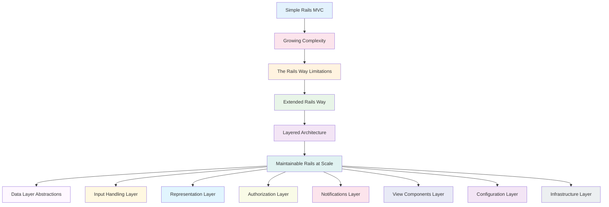

## 📚 What You'll Master

In this comprehensive guide, we'll explore Vladimir Dementyev's **Extended Rails Way**—a philosophy that embraces Rails conventions while introducing strategic abstraction layers that grow with your application.

## 🧱 The Complete Rails Layer Architecture

Let's start with the big picture. Here's how a well-layered Rails application looks when all pieces come together:

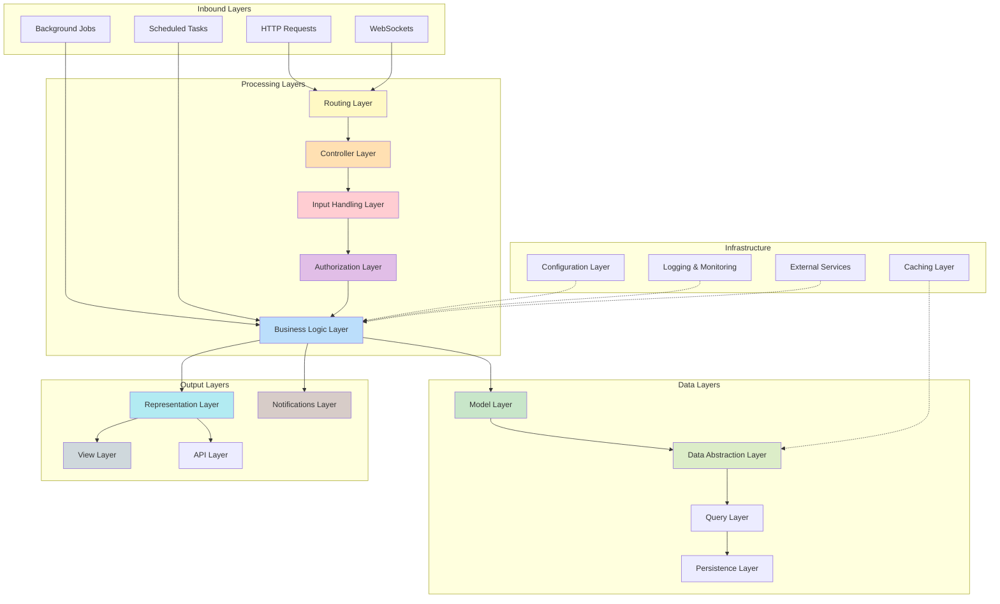

---

## 🎯 Layer 1: The Foundation - Understanding Rails Web Architecture

<strong>🔍 Click to explore the Web Request Journey</strong>

The journey of a simple click through a Rails application is more complex than you might think. Let's trace this path:

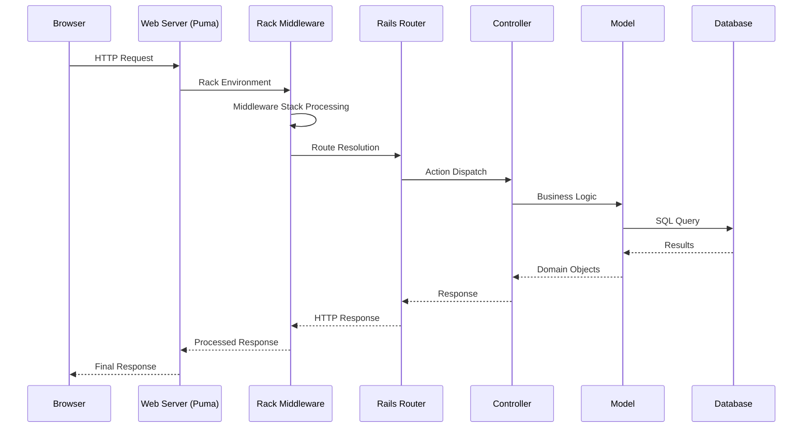

<h3>Key Insights:</h3>
<ul>
<li><strong>Thousands of method calls</strong> happen in a single request</li>
<li><strong>3,000+ object allocations</strong> for even simple actions</li>
<li><strong>Middleware stack</strong> provides cross-cutting concerns</li>
<li><strong>Controller</strong> translates web requests to business actions</li>
</ul>

---

## 🎯 Layer 2: Data Layer Abstractions

<strong>🔍 Click to explore Data Layer Patterns</strong>

Active Record is powerful, but it can become a God object. Here's how to tame it:

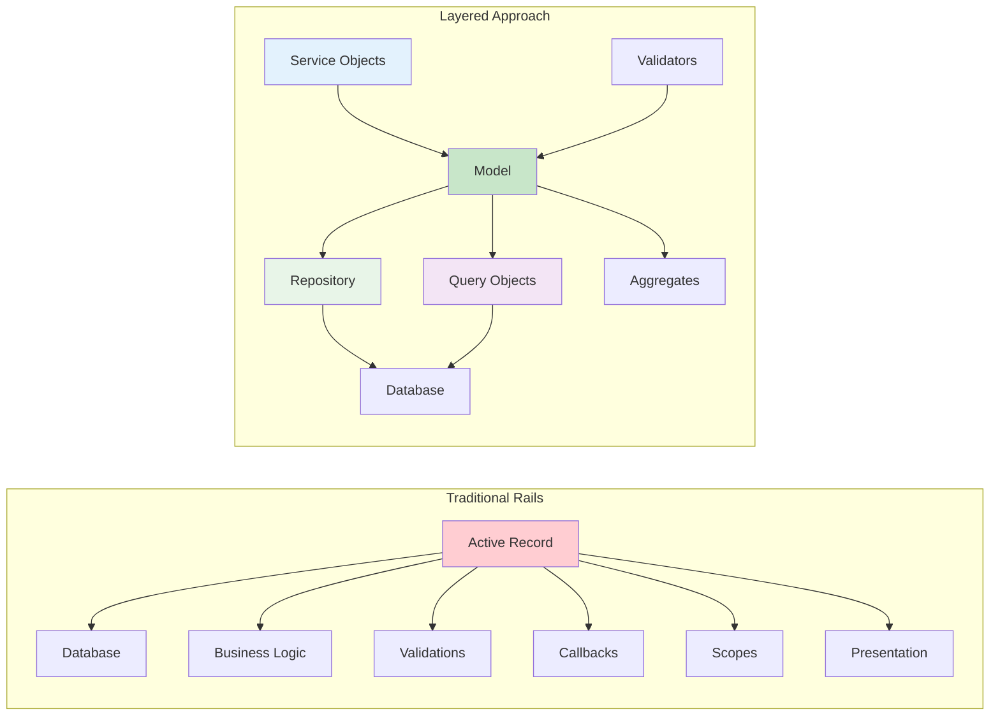

### Data Layer Components:

**Repository Pattern:**

<pre><code class="language-ruby">class PostRepository
  def initialize(relation = Post.all)
    @relation = relation
  end

  def published
    @relation.where(status: 'published')
  end

  def by_author(author)
    @relation.where(author: author)
  end

  def recent(limit = 10)
    @relation.order(created_at: :desc).limit(limit)
  end
end</code></pre>

**Query Objects:**

<pre><code class="language-ruby">class PopularPostsQuery
  def initialize(relation = Post.all)
    @relation = relation
  end

  def call(timeframe: 1.week.ago)
    @relation
      .joins(:comments, :likes)
      .where(created_at: timeframe..)
      .group('posts.id')
      .having('COUNT(comments.id) > ? AND COUNT(likes.id) > ?', 10, 50)
      .order('COUNT(likes.id) DESC')
  end
end</code></pre>

---

## 🎯 Layer 3: Input Handling Layer

<strong>🔍 Click to explore Form Objects and Input Processing</strong>

Move user input handling out of your models and controllers:

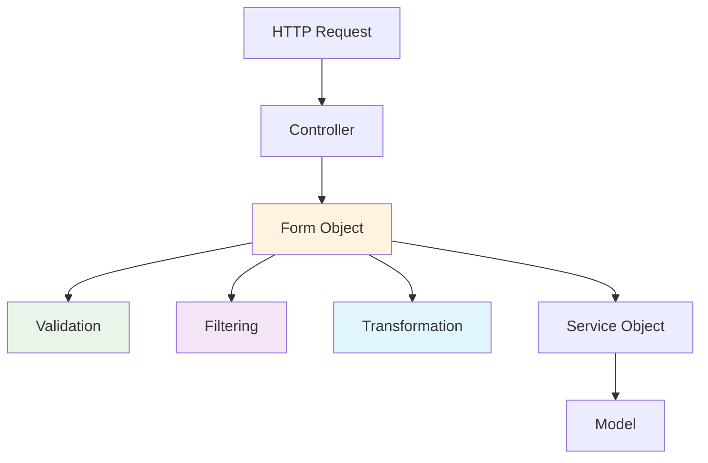

### Form Objects in Action:

<pre><code class="language-ruby">class PostForm
  include ActiveModel::Model
  include ActiveModel::Attributes

  attribute :title, :string
  attribute :content, :string
  attribute :category_id, :integer
  attribute :tags, :string
  attribute :publish_immediately, :boolean

  validates :title, presence: true, length: { minimum: 10 }
  validates :content, presence: true
  validates :category_id, presence: true

  def save
    return false unless valid?
    
    Post.transaction do
      post = create_post
      assign_tags(post)
      publish_if_requested(post)
      post
    end
  end

  private

  def create_post
    Post.create!(
      title: title,
      content: content,
      category_id: category_id
    )
  end

  def assign_tags(post)
    return unless tags.present?
    
    tag_names = tags.split(',').map(&:strip)
    post.tag_list.add(tag_names)
    post.save!
  end

  def publish_if_requested(post)
    return unless publish_immediately
    
    PublishingService.new(post).call
  end
end</code></pre>

### Filter Objects:

<pre><code class="language-ruby">class PostFilters
  include ActiveModel::Model
  include ActiveModel::Attributes

  attribute :category, :string
  attribute :status, :string
  attribute :author_id, :integer
  attribute :date_from, :date
  attribute :date_to, :date
  attribute :search, :string

  def apply(relation = Post.all)
    relation = relation.where(category: category) if category.present?
    relation = relation.where(status: status) if status.present?
    relation = relation.where(author_id: author_id) if author_id.present?
    relation = relation.where(created_at: date_from..) if date_from.present?
    relation = relation.where(created_at: ..date_to) if date_to.present?
    relation = relation.where("title ILIKE ?", "%#{search}%") if search.present?
    relation
  end
end</code></pre>

---

## 🎯 Layer 4: Representation Layer

<strong>🔍 Click to explore Presenters and Serializers</strong>

Keep your models focused on business logic by extracting presentation concerns:

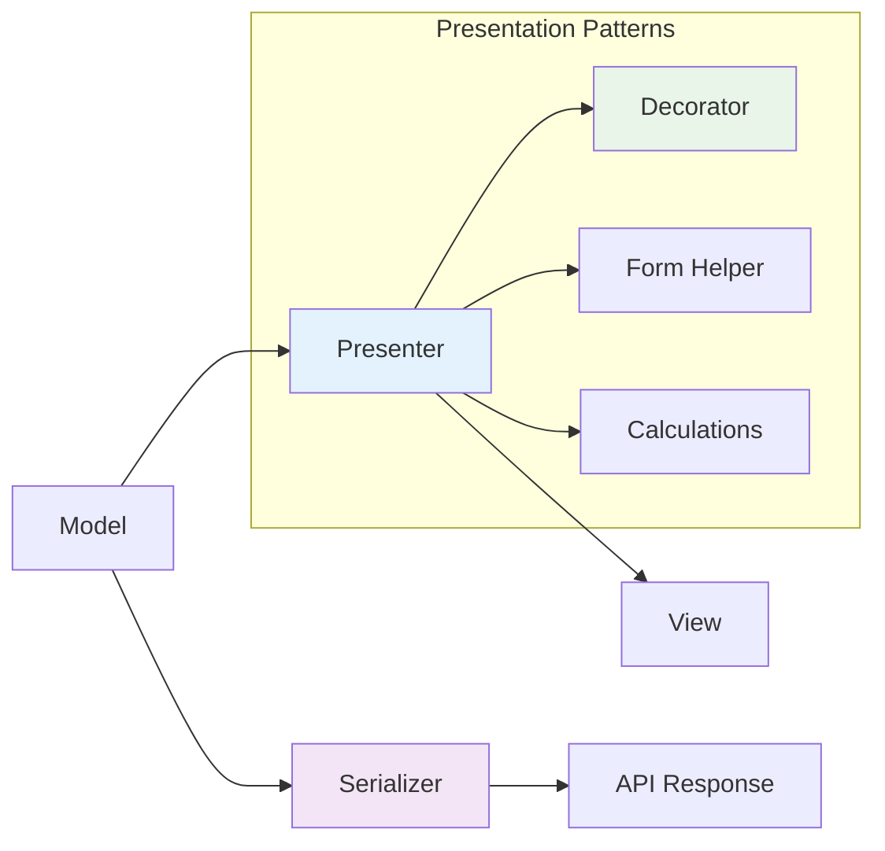

### Presenter Pattern:

<pre><code class="language-ruby">class PostPresenter < SimpleDelegator
  def initialize(post, view_context = nil)
    super(post)
    @view_context = view_context
  end

  def formatted_published_date
    return "Draft" unless published?
    
    published_at.strftime("%B %d, %Y")
  end

  def reading_time
    words = content.split.size
    minutes = (words / 200.0).ceil
    "#{minutes} min read"
  end

  def author_avatar_url
    author.avatar.present? ? author.avatar.url : default_avatar_url
  end

  def share_url
    return unless @view_context
    
    @view_context.post_url(self)
  end

  def seo_description
    content.truncate(160, separator: ' ')
  end

  def social_share_title
    "#{title} - #{author.name}"
  end

  private

  def default_avatar_url
    "https://ui-avatars.com/api/?name=#{CGI.escape(author.name)}"
  end
end</code></pre>

### Serializer Pattern:

<pre><code class="language-ruby">class PostSerializer
  def initialize(post, options = {})
    @post = post
    @options = options
  end

  def as_json
    {
      id: @post.id,
      title: @post.title,
      content: formatted_content,
      author: author_data,
      published_at: @post.published_at&.iso8601,
      tags: @post.tags.pluck(:name),
      comments_count: @post.comments.count,
      likes_count: @post.likes.count,
      reading_time: calculate_reading_time,
      url: @options[:url_helpers]&.post_url(@post)
    }
  end

  private

  def formatted_content
    return @post.content unless @options[:truncate]
    
    @post.content.truncate(@options[:truncate])
  end

  def author_data
    {
      id: @post.author.id,
      name: @post.author.name,
      avatar_url: @post.author.avatar&.url
    }
  end

  def calculate_reading_time
    (@post.content.split.size / 200.0).ceil
  end
end</code></pre>

---

## 🎯 Layer 5: Authorization Layer

<strong> Click to explore Authorization Patterns</strong>

Implement authorization as a first-class concern with dedicated abstractions:

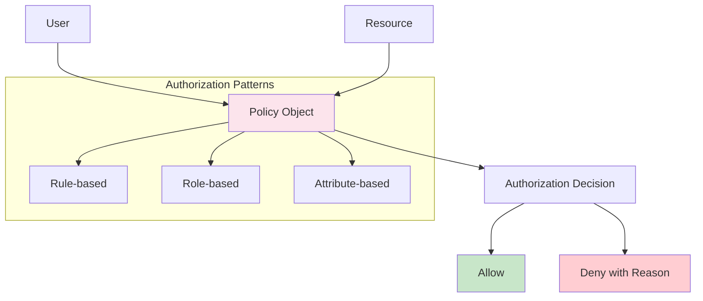

### Policy Objects:

<pre><code class="language-ruby">class PostPolicy
  def initialize(user, post)
    @user = user
    @post = post
  end

  def show?
    @post.published? || owner? || admin?
  end

  def create?
    @user.present?
  end

  def update?
    owner? || admin?
  end

  def destroy?
    owner? || admin?
  end

  def publish?
    (owner? && @user.can_publish?) || admin?
  end

  class Scope
    def initialize(user, scope)
      @user = user
      @scope = scope
    end

    def resolve
      if @user&.admin?
        @scope.all
      elsif @user.present?
        @scope.where(
          "status = 'published' OR author_id = ?", 
          @user.id
        )
      else
        @scope.published
      end
    end
  end

  private

  def owner?
    @user.present? && @post.author_id == @user.id
  end

  def admin?
    @user&.admin?
  end
end</code></pre>

### Authorization Service:

<pre><code class="language-ruby">class AuthorizationService
  def initialize(user)
    @user = user
  end

  def authorize!(action, resource)
    policy = policy_for(resource)
    
    unless policy.public_send("#{action}?")
      raise UnauthorizedError, 
        "#{@user&.id || 'Anonymous'} cannot #{action} #{resource.class}##{resource.id}"
    end
    
    true
  end

  def authorized?(action, resource)
    policy_for(resource).public_send("#{action}?")
  rescue NoMethodError
    false
  end

  def scope(relation)
    policy_class = policy_class_for(relation.model)
    policy_class::Scope.new(@user, relation).resolve
  end

  private

  def policy_for(resource)
    policy_class = policy_class_for(resource.class)
    policy_class.new(@user, resource)
  end

  def policy_class_for(resource_class)
    "#{resource_class}Policy".constantize
  end
end</code></pre>

---

## 🎯 Layer 6: Notifications Layer

<strong>🔍 Click to explore Multi-channel Notification Systems</strong>

Build a flexible notification system that supports multiple channels:

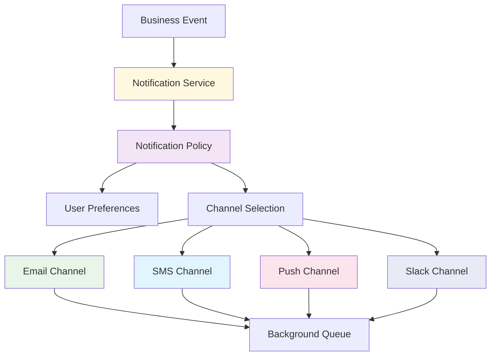

### Notification Service:

<pre><code class="language-ruby">class NotificationService
  def initialize(user, event_type, payload = {})
    @user = user
    @event_type = event_type
    @payload = payload
  end

  def deliver
    return unless should_notify?

    enabled_channels.each do |channel|
      deliver_via_channel(channel)
    end
  end

  private

  def should_notify?
    notification_policy.allowed?(@event_type, @user)
  end

  def enabled_channels
    @user.notification_preferences
         .where(event_type: @event_type, enabled: true)
         .pluck(:channel)
  end

  def deliver_via_channel(channel)
    case channel.to_sym
    when :email
      EmailNotificationJob.perform_later(@user.id, @event_type, @payload)
    when :sms
      SmsNotificationJob.perform_later(@user.id, @event_type, @payload)
    when :push
      PushNotificationJob.perform_later(@user.id, @event_type, @payload)
    when :slack
      SlackNotificationJob.perform_later(@user.id, @event_type, @payload)
    end
  end

  def notification_policy
    @notification_policy ||= NotificationPolicy.new
  end
end</code></pre>

### Notification Preferences:

<pre><code class="language-ruby">class NotificationPreferences
  def initialize(user)
    @user = user
    @preferences = load_preferences
  end

  def enabled_for?(event_type, channel)
    preference = find_preference(event_type, channel)
    preference&.enabled? || default_enabled?(event_type, channel)
  end

  def update_preference(event_type, channel, enabled)
    preference = find_or_create_preference(event_type, channel)
    preference.update!(enabled: enabled)
  end

  def bulk_update(preferences_hash)
    preferences_hash.each do |key, enabled|
      event_type, channel = key.split('.')
      update_preference(event_type, channel, enabled)
    end
  end

  private

  def load_preferences
    @user.notification_preferences.index_by do |pref|
      "#{pref.event_type}.#{pref.channel}"
    end
  end

  def find_preference(event_type, channel)
    @preferences["#{event_type}.#{channel}"]
  end

  def find_or_create_preference(event_type, channel)
    find_preference(event_type, channel) ||
      @user.notification_preferences.create!(
        event_type: event_type,
        channel: channel,
        enabled: default_enabled?(event_type, channel)
      )
  end

  def default_enabled?(event_type, channel)
    NOTIFICATION_DEFAULTS.dig(event_type.to_s, channel.to_s) || false
  end
end</code></pre>

---

## 🎯 Layer 7: View Components Layer

<strong>🔍 Click to explore Component-based UI Architecture</strong>

Build maintainable UIs with reusable components:

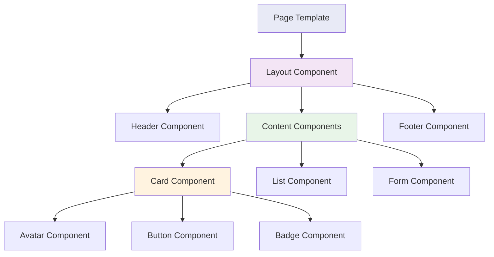

### View Component Example:

<pre><code class="language-ruby">class PostCardComponent < ViewComponent::Base
  def initialize(post, current_user: nil, variant: :default)
    @post = PostPresenter.new(post)
    @current_user = current_user
    @variant = variant
  end

  private

  attr_reader :post, :current_user, :variant

  def show_actions?
    current_user.present?
  end

  def can_edit?
    return false unless current_user
    
    PostPolicy.new(current_user, post).update?
  end

  def card_classes
    base_classes = "post-card"
    base_classes += " post-card--featured" if post.featured?
    base_classes += " post-card--compact" if variant == :compact
    base_classes
  end

  def reading_time_text
    "#{post.reading_time} • #{post.formatted_published_date}"
  end
end</code></pre>

### Component Template:

<pre><code class="language-erb">&lt;!-- app/components/post_card_component.html.erb --&gt;
&lt;article class="&lt;%= card_classes %&gt;"&gt;
  &lt;% if post.featured_image.present? %&gt;
    &lt;div class="post-card__image"&gt;
      &lt;%= image_tag post.featured_image, alt: post.title %&gt;
    &lt;/div&gt;
  &lt;% end %&gt;

  &lt;div class="post-card__content"&gt;
    &lt;header class="post-card__header"&gt;
      &lt;h3 class="post-card__title"&gt;
        &lt;%= link_to post.title, post_path(post) %&gt;
      &lt;/h3&gt;
      
      &lt;div class="post-card__meta"&gt;
        &lt;%= render AuthorAvatarComponent.new(post.author, size: :small) %&gt;
        &lt;span class="post-card__reading-time"&gt;
          &lt;%= reading_time_text %&gt;
        &lt;/span&gt;
      &lt;/div&gt;
    &lt;/header&gt;

    &lt;div class="post-card__excerpt"&gt;
      &lt;%= post.seo_description %&gt;
    &lt;/div&gt;

    &lt;footer class="post-card__footer"&gt;
      &lt;div class="post-card__tags"&gt;
        &lt;% post.tags.each do |tag| %&gt;
          &lt;%= render TagComponent.new(tag, variant: :small) %&gt;
        &lt;% end %&gt;
      &lt;/div&gt;

      &lt;% if show_actions? %&gt;
        &lt;div class="post-card__actions"&gt;
          &lt;%= render LikeButtonComponent.new(post, current_user) %&gt;
          &lt;%= render BookmarkButtonComponent.new(post, current_user) %&gt;
          
          &lt;% if can_edit? %&gt;
            &lt;%= link_to "Edit", edit_post_path(post), 
                        class: "btn btn--small btn--outline" %&gt;
          &lt;% end %&gt;
        &lt;/div&gt;
      &lt;% end %&gt;
    &lt;/footer&gt;
  &lt;/div&gt;
&lt;/article&gt;</code></pre>

---

## 🎯 Layer 8: Configuration Layer

<strong>🔍 Click to explore Application Configuration Management</strong>

Treat configuration as a first-class citizen in your application:

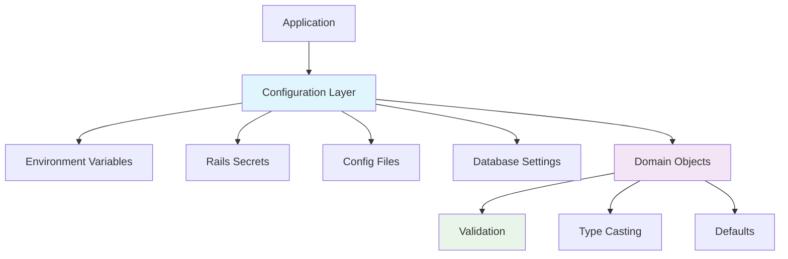

### Configuration Objects:

<pre><code class="language-ruby">class ApplicationConfig
  include ActiveModel::Model
  include ActiveModel::Attributes

  # Email Configuration
  attribute :smtp_host, :string, default: 'localhost'
  attribute :smtp_port, :integer, default: 587
  attribute :smtp_username, :string
  attribute :smtp_password, :string
  attribute :smtp_authentication, :string, default: 'plain'
  attribute :smtp_enable_starttls_auto, :boolean, default: true

  # File Storage Configuration
  attribute :storage_service, :string, default: 'local'
  attribute :aws_access_key_id, :string
  attribute :aws_secret_access_key, :string
  attribute :aws_region, :string, default: 'us-east-1'
  attribute :aws_bucket, :string

  # Cache Configuration
  attribute :cache_store, :string, default: 'memory_store'
  attribute :redis_url, :string
  attribute :redis_namespace, :string

  # Feature Flags
  attribute :enable_social_login, :boolean, default: false
  attribute :enable_notifications, :boolean, default: true
  attribute :enable_analytics, :boolean, default: false

  validates :smtp_host, presence: true
  validates :smtp_port, inclusion: { in: 1..65535 }
  validates :storage_service, inclusion: { 
    in: %w[local aws gcs azure], 
    message: "%{value} is not a valid storage service" 
  }

  validate :aws_credentials_present_when_aws_storage
  validate :redis_url_present_when_redis_cache

  def self.load
    new(
      smtp_host: ENV['SMTP_HOST'],
      smtp_port: ENV['SMTP_PORT'],
      smtp_username: ENV['SMTP_USERNAME'],
      smtp_password: ENV['SMTP_PASSWORD'],
      smtp_authentication: ENV['SMTP_AUTHENTICATION'],
      smtp_enable_starttls_auto: ENV['SMTP_ENABLE_STARTTLS_AUTO'],
      
      storage_service: ENV['STORAGE_SERVICE'],
      aws_access_key_id: ENV['AWS_ACCESS_KEY_ID'],
      aws_secret_access_key: ENV['AWS_SECRET_ACCESS_KEY'],
      aws_region: ENV['AWS_REGION'],
      aws_bucket: ENV['AWS_BUCKET'],
      
      cache_store: ENV['CACHE_STORE'],
      redis_url: ENV['REDIS_URL'],
      redis_namespace: ENV['REDIS_NAMESPACE'],
      
      enable_social_login: ENV['ENABLE_SOCIAL_LOGIN'] == 'true',
      enable_notifications: ENV['ENABLE_NOTIFICATIONS'] != 'false',
      enable_analytics: ENV['ENABLE_ANALYTICS'] == 'true'
    )
  end

  def smtp_settings
    {
      address: smtp_host,
      port: smtp_port,
      user_name: smtp_username,
      password: smtp_password,
      authentication: smtp_authentication.to_sym,
      enable_starttls_auto: smtp_enable_starttls_auto
    }
  end

  def aws_credentials
    {
      access_key_id: aws_access_key_id,
      secret_access_key: aws_secret_access_key,
      region: aws_region
    }
  end

  private

  def aws_credentials_present_when_aws_storage
    return unless storage_service == 'aws'
    
    if aws_access_key_id.blank? || aws_secret_access_key.blank?
      errors.add(:base, 'AWS credentials required when using AWS storage')
    end
  end

  def redis_url_present_when_redis_cache
    return unless cache_store == 'redis_cache_store'
    
    if redis_url.blank?
      errors.add(:redis_url, 'is required when using Redis cache store')
    end
  end
end</code></pre>

---

## 🎯 Layer 9: Infrastructure Layer

<strong>🔍 Click to explore Cross-cutting Concerns</strong>

Handle logging, monitoring, and external services with dedicated abstractions:

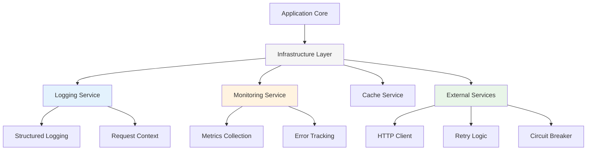

### Logging Service:

<pre><code class="language-ruby">class ApplicationLogger
  def self.for(context)
    new(context)
  end

  def initialize(context)
    @context = context
    @logger = Rails.logger
  end

  def info(message, **metadata)
    log(:info, message, metadata)
  end

  def warn(message, **metadata)
    log(:warn, message, metadata)
  end

  def error(message, **metadata)
    log(:error, message, metadata)
  end

  def with_context(**additional_context)
    self.class.new(@context.merge(additional_context))
  end

  private

  def log(level, message, metadata)
    log_entry = {
      level: level,
      message: message,
      timestamp: Time.current.iso8601,
      **@context,
      **metadata
    }

    @logger.public_send(level, log_entry.to_json)
  end
end

# Usage:
# ApplicationLogger.for(user_id: current_user.id, request_id: request.uuid)
#                  .info("User created post", post_id: post.id)</code></pre>

### External Service Abstraction:

<pre><code class="language-ruby">class ExternalServiceClient
  include Retryable

  def initialize(base_url:, timeout: 30, retries: 3)
    @base_url = base_url
    @timeout = timeout
    @retries = retries
    @circuit_breaker = CircuitBreaker.new(
      failure_threshold: 5,
      recovery_timeout: 60
    )
  end

  def get(path, **options)
    perform_request(:get, path, options)
  end

  def post(path, data, **options)
    perform_request(:post, path, options.merge(json: data))
  end

  private

  def perform_request(method, path, options)
    @circuit_breaker.call do
      retryable(tries: @retries, on: [Net::TimeoutError, Net::HTTPServerError]) do
        response = HTTP.timeout(@timeout)
                      .public_send(method, "#{@base_url}#{path}", options)
        
        handle_response(response)
      end
    end
  rescue CircuitBreaker::OpenCircuitError
    raise ServiceUnavailableError, "Service circuit breaker is open"
  end

  def handle_response(response)
    case response.status
    when 200..299
      response.parse
    when 400..499
      raise ClientError, "Client error: #{response.status}"
    when 500..599
      raise ServerError, "Server error: #{response.status}"
    else
      raise UnknownError, "Unknown response: #{response.status}"
    end
  end
end</code></pre>

---

## 🏆 The Ebook That Started It All

This comprehensive guide is inspired by **Vladimir Dementyev's** groundbreaking book:

### 📖 "Layered Design for Ruby on Rails Applications"

  

Vladimir Dementyev, a core contributor to Ruby on Rails and the creator of AnyCable, brings years of experience building and maintaining large-scale Rails applications. This book is the definitive guide to evolving beyond the basic MVC structure while staying true to Rails principles.

**What makes this book special:**
- ✅ **Real-world patterns** tested in production applications
- ✅ **Gradual approach** - no big rewrites required
- ✅ **Performance considerations** for each abstraction layer
- ✅ **Practical examples** with complete code samples
- ✅ **Testing strategies** for layered architectures

## 🎯 Master These Pattern Recognition Skills

<strong>🧠 Test Your Understanding: Layered Architecture Quiz</strong>

**Question 1:** You have a Rails model with 500+ lines containing validations, callbacks, scopes, business logic, and presentation methods. What's the first refactoring you should consider?

<strong>💡 Click for Answer</strong>

**Answer:** Start by extracting presentation logic into **Presenter objects** and validation logic into **Form objects**. These are the safest first steps that provide immediate benefits without changing core business logic.

**Why this approach:**
- Presentation logic is usually the easiest to extract
- Form objects can handle context-specific validations
- Both patterns have minimal impact on existing code
- You'll see immediate improvements in model readability

**Question 2:** Your application needs to send notifications via email, SMS, and Slack. Currently, this logic is scattered across different controllers and background jobs. Which pattern should you implement?

<strong>💡 Click for Answer</strong>

**Answer:** Implement a **Notifications Layer** with:
- A central NotificationService to coordinate delivery
- Channel-specific adapters (EmailChannel, SmsChannel, SlackChannel)
- User preference management for channel selection
- Background job integration for async delivery

**Benefits:**
- Single point of control for all notifications
- Easy to add new channels
- User preferences handled centrally
- Consistent delivery tracking and error handling

**Question 3:** You're building an API that needs different data representations for different client types (mobile app, web app, external partners). What abstraction should you use?

<strong>💡 Click for Answer</strong>

**Answer:** Implement **Serializer objects** with variant support:

<pre><code class="language-ruby">class PostSerializer
  def initialize(post, variant: :default)
    @post = post
    @variant = variant
  end

  def as_json
    case @variant
    when :mobile
      mobile_representation
    when :external_api
      external_api_representation
    else
      default_representation
    end
  end
end</code></pre>

**Why Serializers:**
- Keep presentation logic out of models
- Support multiple output formats
- Easy to test and maintain
- Version control for API changes

## 🚀 Your Next Steps

Ready to transform your Rails application? Here's your action plan:

### Phase 1: Foundation (Weeks 1-2)
1. **Audit your models** - Identify God objects and responsibility overlaps
2. **Extract presenters** - Move display logic out of models
3. **Implement basic authorization** - Add policy objects for your core entities

### Phase 2: Input & Data (Weeks 3-4)
4. **Create form objects** - Handle complex user input scenarios
5. **Add query objects** - Extract complex Active Record queries
6. **Implement repository pattern** - For your most complex data access

### Phase 3: Architecture (Weeks 5-6)
7. **Build notification layer** - Centralize all user communications
8. **Add view components** - Create reusable UI components
9. **Extract service objects** - Encapsulate complex business operations

### Phase 4: Infrastructure (Weeks 7-8)
10. **Implement configuration layer** - Manage app settings properly
11. **Add monitoring abstractions** - Structured logging and metrics
12. **Extract external service clients** - Handle third-party integrations

## 📚 Essential Resources

### Books & Guides
- [Layered Design for Ruby on Rails Applications](https://www.packtpub.com/product/layered-design-for-ruby-on-rails-applications/9781801813785) - The definitive guide
- [Clean Architecture](https://www.amazon.com/Clean-Architecture-Craftsmans-Software-Structure/dp/0134494164) - Uncle Bob's architectural principles
- [Patterns of Enterprise Application Architecture](https://martinfowler.com/books/eaa.html) - Martin Fowler's classic

### Gems & Tools
- [ViewComponent](https://viewcomponent.org/) - Component-based UI architecture
- [Pundit](https://github.com/varvet/pundit) - Authorization via policy objects
- [Dry-rb](https://dry-rb.org/) - Toolkit for building better Ruby applications
- [ROM-rb](https://rom-rb.org/) - Data mapper implementation for Ruby

### Community & Learning
- [Evil Martians Blog](https://evilmartians.com/blog) - Advanced Rails architecture patterns
- [Ruby on Rails Guides](https://guides.rubyonrails.org/) - Official Rails documentation
- [GoRails](https://gorails.com/) - Advanced Rails screencasts

---

## 🎯 The Extended Rails Way: Your Path to Mastery

The beauty of the Extended Rails Way lies in its pragmatic approach. You don't need to rebuild your entire application overnight. Instead, you can gradually introduce these patterns as your application grows and evolves.

Remember: **The goal isn't to add complexity—it's to manage complexity through strategic abstraction.**

Start small, measure the impact, and build confidence in these patterns. Your future self (and your team) will thank you for creating a maintainable, scalable Rails application that grows gracefully with your business needs.

Happy coding! 🚀

---

*Want to dive deeper into advanced Rails architecture patterns? Check out our other posts on [Ruby and AI](/ruby/ai/), [Rails Development](/ruby/rails/), and [Modern Web Development](/projects/).*
