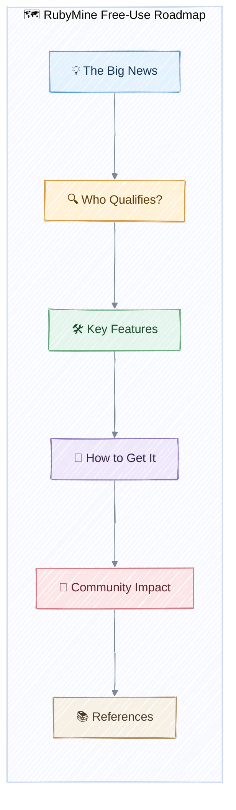
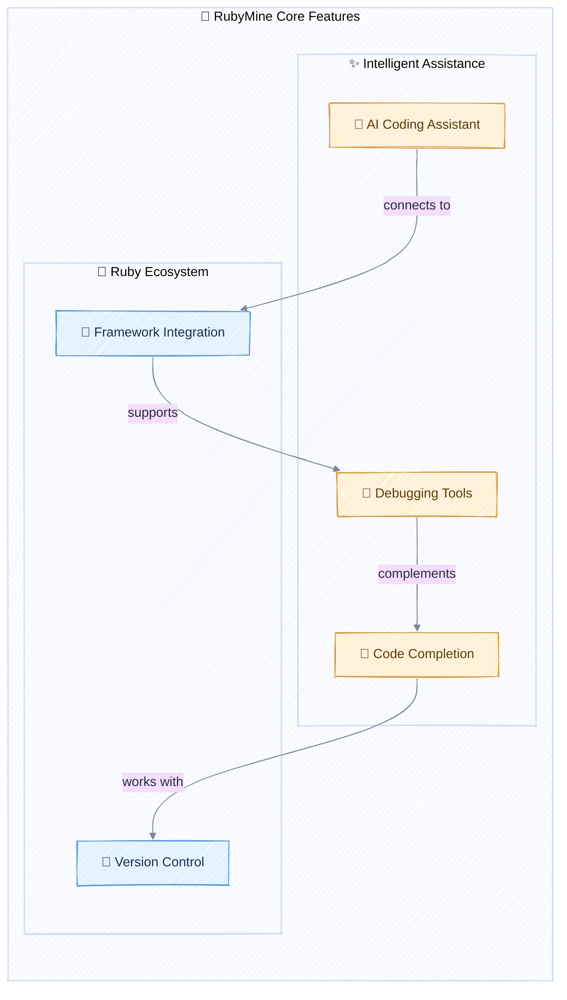

## Hook with a Story

Imagine you’re a student, hobbyist, or open-source contributor, staring at the $89 RubyMine price tag. You want to build the next big Rails app, but your budget says “nope.” Suddenly, JetBrains drops a bombshell: RubyMine is now free for non-commercial use! 🎉

## Lay Out the Roadmap

Let’s break down what this means and how you can take advantage:

## 💡 The Big News

JetBrains, the company behind RubyMine, has made its powerful Ruby and Rails IDE free for non-commercial use. This move aims to lower barriers for hobbyists, students, and open-source contributors.

> **Quick Recap:** RubyMine is now free for anyone not using it for paid work or business.

**Your Turn:**  
Think of a project you’ve put off because of tool costs. Would free RubyMine change your plans?

## 🔍 Who Qualifies?

Non-commercial use means you’re not getting paid or running a business with RubyMine. Students, hobbyists, and open-source contributors are in. If your side project turns into a startup, you’ll need a commercial license.

> **Pro Tip:** If you’re unsure, check JetBrains’ [pricing page](https://www.jetbrains.com/ruby/buy/) for details.

**Your Turn:**  
List your current Ruby projects. Which ones fit the “non-commercial” definition?

## 🛠️ Key Features

RubyMine offers intelligent code completion, debugging, version control, and deep Rails support. The free tier includes all core features—even AI-assisted coding and integration with frameworks like Sinatra and Hanami.

> **Quick Recap:** You get the full RubyMine experience—just not enterprise support.

**Your Turn:**  
Try out RubyMine’s AI coding assistant. What’s the first feature you’d test?

## 🚦 How to Get It

Ready to download? Head to [JetBrains’ RubyMine download page](https://www.jetbrains.com/ruby/download/). Choose your OS, install, and start coding. If you ever need to upgrade for commercial use, JetBrains makes it easy.

**Do this!**
1. Visit the [download page](https://www.jetbrains.com/ruby/download/).
2. Select your platform (Windows, macOS, Linux).
3. Install and activate with a JetBrains account.

> **Quick Recap:** Download, install, and start building—no payment required for non-commercial use.

**Your Turn:**  
Download RubyMine and open your favorite Ruby project. What’s the first thing you notice?

## 🌱 Community Impact

This move is expected to boost open-source contributions and make RubyMine a staple in classrooms. Community leaders predict more innovation and easier onboarding for new Rubyists.

> **Caveat:** If your side project becomes a business, remember to upgrade your license!

**Your Turn:**  
How could free access to RubyMine help you contribute to open-source or learn Ruby faster?

## 📚 References

- [JetBrains Makes RubyMine Free for Non-Commercial Use – WebProNews](https://www.webpronews.com/jetbrains-makes-rubymine-free-for-non-commercial-use/)
- [Official RubyMine Blog Announcement](https://blog.jetbrains.com/ruby/2025/09/rubymine-is-now-free-for-non-commercial-use/)
- [RubyMine Download Page](https://www.jetbrains.com/ruby/download/)
- [JetBrains Pricing](https://www.jetbrains.com/ruby/buy/)
