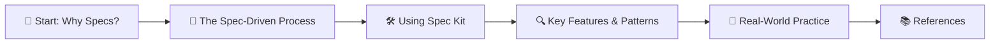
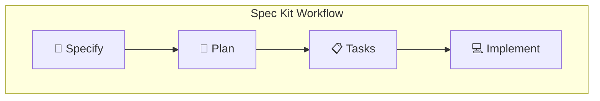
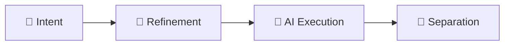

# **Spec Kit: spec-driven development with AI**

## Hook with a Story

You’re staring at a blank editor, ready to build something new. But as soon as you start coding, the requirements shift, docs lag behind, and your AI agent keeps guessing wrong. Sound familiar? Enter Spec Kit—a toolkit that flips the script: specs first, code second, and your AI agent finally gets it right.

## Lay Out the Roadmap

Here’s how we’ll break down spec-driven development with Spec Kit:

## 🌱 Start: Why Specs?

Spec-driven development means you start with a specification—a contract for how your code should behave. This spec becomes the source of truth for your tools and AI agents, reducing guesswork and surprises.

> **Quick Recap:** Specs aren’t just documentation—they’re executable blueprints for your project.

**Your Turn:**  
Think of a recent project. Did you start with a spec, or just start coding?

## 📝 The Spec-Driven Process

Spec Kit organizes your workflow into four phases:
1. **Specify:** Describe what you’re building and why. Focus on user journeys and outcomes.
2. **Plan:** Define your tech stack, architecture, and constraints. The coding agent generates a technical plan.
3. **Tasks:** Break the spec and plan into actionable, testable tasks.
4. **Implement:** The coding agent tackles each task, and you review focused changes.

> **Quick Recap:** Each phase has a checkpoint—don’t move on until you’ve validated the last.

**Your Turn:**  
Write a one-sentence spec for a simple app. What’s the user’s main goal?

## 🛠️ Using Spec Kit

Spec Kit works with coding agents like GitHub Copilot, Claude Code, and Gemini CLI. You steer the agent with commands:
- `specify init <PROJECT_NAME>`: Initialize your project.
- `/specify`: Provide a high-level prompt for the spec.
- `/plan`: Guide the technical plan.
- `/tasks`: Break down the work into tasks.

**Do this!**
1. Install Spec Kit: `uvx --from git+https://github.com/github/spec-kit.git specify init <PROJECT_NAME>`
2. Use `/specify` to describe your project’s intent.
3. Use `/plan` to set technical direction.
4. Use `/tasks` to generate actionable items.

> **Pro Tip:** Focus on the “what” and “why” first—leave the “how” for the plan phase.

**Your Turn:**  
Try initializing a Spec Kit project. What’s the first spec you’d write?

## 🔍 Key Features & Patterns

- **Intent-driven development:** Specs define the “what” before the “how.”
- **Multi-step refinement:** Iterate and refine at each phase.
- **AI-powered execution:** Coding agents generate, test, and validate code from your spec.
- **Separation of concerns:** Stable “what” vs. flexible “how.”

> **Quick Recap:** Spec Kit helps you build, iterate, and modernize—whether greenfield, feature work, or legacy modernization.

**Your Turn:**  
Which phase do you think would help your workflow the most?

## 🚀 Real-World Practice

Spec-driven development shines in:
- **Greenfield projects:** Start with clarity, build what you intend.
- **Feature work:** Add features to complex codebases with confidence.
- **Legacy modernization:** Capture business logic, design fresh architecture, and rebuild with AI.

**Do this!**
1. Pick a small feature in an existing project.
2. Write a spec for it.
3. Use Spec Kit to generate a plan and tasks.
4. Let your coding agent implement and validate.

> **Caveat:** Specs and plans are living artifacts—update them as your project evolves.

**Your Turn:**  
How would you use Spec Kit to modernize a legacy app?

## 📚 References

- [Spec-driven development with AI – GitHub Blog](https://github.blog/ai-and-ml/generative-ai/spec-driven-development-with-ai-get-started-with-a-new-open-source-toolkit/)
- [Spec Kit GitHub Repository](https://github.com/github/spec-kit)
- [Spec Kit Comprehensive Guide](https://github.com/github/spec-kit/blob/main/spec-driven.md)
- [GitHub Copilot](https://github.blog/tag/github-copilot/)
- [5 tips for writing better custom instructions for Copilot](https://github.blog/ai-and-ml/github-copilot/5-tips-for-writing-better-custom-instructions-for-copilot/)
