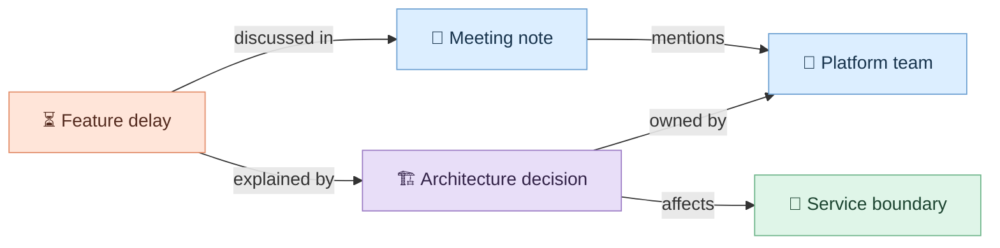
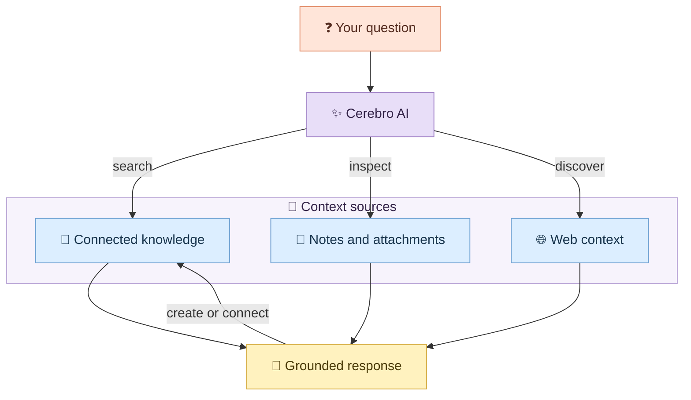
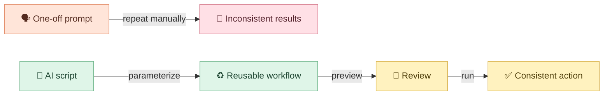
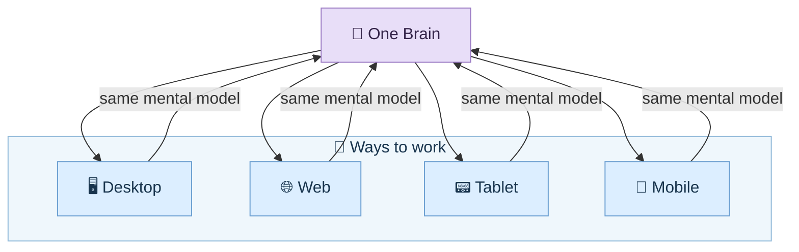
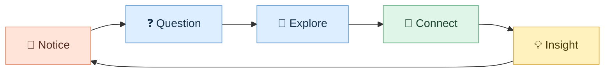
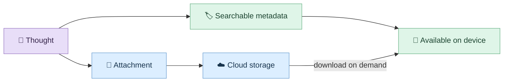
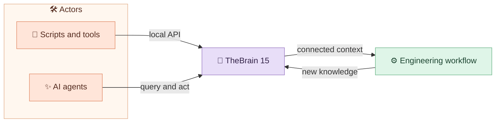
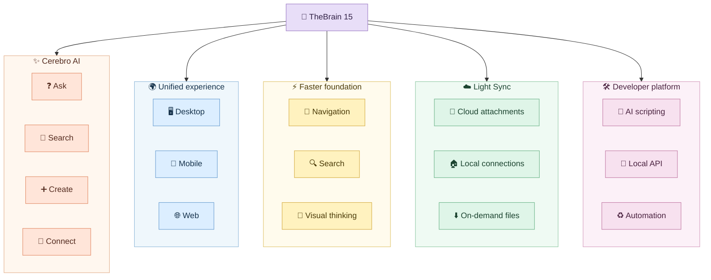

TheBrain is a knowledge-management application that organizes notes, files, people, projects, and ideas as connected *thoughts* rather than isolated documents.

Information rarely arrives in a neat hierarchy. A note becomes a question. The question points to a document. The document belongs to a project, but it also connects to a person, a decision, and an unfinished idea.

Traditional folders ask us to choose one location. Our thinking does not.

TheBrain has always treated knowledge as a network of connected *thoughts*. Version 15 pushes that model further: the network can now be explored conversationally, changed through an AI agent, synchronized more selectively, and accessed through a unified interface across platforms.

> **The big shift:** TheBrain is moving from a visual place where you organize knowledge to an active environment where you can ask, create, connect, and automate.

### In this post

- [Your visual roadmap](#your-visual-roadmap)
- [From filing information to connecting meaning](#1-from-filing-information-to-connecting-meaning)
- [Cerebro AI](#2-cerebro-ai-conversation-becomes-an-action-surface)
- [AI scripting](#3-ai-scripting-reusable-intelligence-instead-of-repeated-prompts)
- [One experience across platforms](#4-one-experience-across-platforms)
- [Performance](#5-faster-thinking-needs-a-faster-interface)
- [Light Sync](#6-light-sync-separate-connection-from-local-storage)
- [Developer angle](#7-the-developer-angle-local-api-and-automation)
- [Learning experiment](#8-a-five-minute-learning-experiment)
- [Who should upgrade?](#who-should-upgrade)

## Your visual roadmap

```mermaid!
flowchart LR
  A[📚 Scattered information] -->|connect| B[🧠 Knowledge network]
  B -->|ask and act| C[✨ Cerebro AI]
  C -->|automate| D[🌱 Living workspace]
  D -->|sync selectively| E[🌍 Knowledge everywhere]

  classDef input fill:#ffe5d9,stroke:#e28c68,color:#542b1f
  classDef knowledge fill:#dceeff,stroke:#6b9fd1,color:#18344d
  classDef action fill:#dff5e8,stroke:#6eb58a,color:#1c4430
  classDef outcome fill:#fff2bf,stroke:#d6ae45,color:#4b3b08
  class A input
  class B knowledge
  class C,D action
  class E outcome
```

Keep this journey in mind as we explore the release:

1. Why connected thinking matters
2. What makes Cerebro agentic
3. How the new platform fits together
4. What performance and Light Sync change
5. Where developers can extend the system
6. How to evaluate the upgrade safely

### Reading the diagrams

The diagrams use a consistent visual language. These are interpretive cues, not claims that knowledge or intelligence literally operates like software.

| Visual cue | Meaning in this model |
|---|---|
| Purple | TheBrain, Cerebro, or the central platform |
| Blue | Knowledge, context, views, or connected information |
| Green | Actions, workflows, local availability, or automation |
| Yellow | Outcomes, review, or insight |
| Cloud icon | Remote storage or web context |

## 1. From filing information to connecting meaning

Imagine three items:

- a meeting note about a delayed feature;
- the architecture decision that caused the delay;
- a person who knows the affected service.

A folder system makes you decide where each item lives. A knowledge graph lets each item participate in several contexts at once.

This is the core mental model behind TheBrain: a thought is useful not only because of what it contains, but because of what it connects.

### Quick recap

**Folders answer:** “Where did I put it?”  
**Connected knowledge answers:** “How does this relate to what I am doing now?”

### Your turn

Choose one active project. Write down five things that influence it: a person, a document, a decision, a risk, and a next action. Now connect them. Which relationship was invisible before?

## 2. Cerebro AI: conversation becomes an action surface

The most important addition in version 15 is **Cerebro**, an AI agent designed to work with your Brain.

It is not presented merely as a chat box beside your notes. According to the official release, Cerebro can search the Brain, create thoughts and notes, summarize attachments, suggest relationships, browse for related information, and maintain searchable conversation history.

That creates a useful distinction:

| Assistant behavior | Agentic behavior |
| --- | --- |
| Explains what you could do | Performs supported actions in the Brain |
| Answers from the current prompt | Searches connected knowledge for context |
| Produces isolated text | Creates or strengthens knowledge structures |
| Ends with an answer | Can continue a workflow |

### A concrete scenario

Suppose your Brain contains research about Rails background jobs, incident notes, and a list of architectural risks. You could ask:

> “Find the incidents related to retries, summarize the recurring causes, and create a thought connecting them to our idempotency guidelines.”

The value is not only the summary. The result can become part of the knowledge network instead of disappearing inside a temporary conversation.

### Pause and predict

Which action carries more risk: summarizing a note, creating a new thought, or reorganizing existing links? Why should an agent treat them differently?

## 3. AI scripting: reusable intelligence instead of repeated prompts

TheBrain 15 also introduces reusable AI instructions with a visual block editor or code-oriented mode. Parameters, conditional logic, built-in variables, and live preview turn a useful prompt into a repeatable operation.

Think of the difference this way:

Possible patterns include:

- summarize the active thought using a fixed structure;
- extract decisions, owners, and deadlines from meeting notes;
- classify a new thought and suggest related links;
- generate a project briefing from selected branches;
- review a knowledge area for missing or weak connections.

> **Design principle:** Automate a stable thinking pattern, not an unclear goal.

## 4. One experience across platforms

Version 15 introduces a redesigned interface intended to provide nearly the same capabilities on desktop, mobile, and web. The goal is cognitive continuity: changing devices should not mean relearning the workspace.

The release also brings Tree View and Card View alongside the visual Plex. This matters because no single representation works for every task:

- **Plex:** explore relationships and nearby context;
- **Tree View:** navigate a familiar hierarchy;
- **Card View:** scan items as visual units;
- **Content view:** focus on reading and writing.

### Quick recap

The knowledge stays the same; the view changes according to the task.

## 5. Faster thinking needs a faster interface

TheBrain describes version 15 as a rebuilt foundation with performance improvements of up to five times in selected areas. The product page emphasizes quicker startup, immediate navigation, smoother visual animations, and lower CPU, memory, and energy use. The practical result will depend on Brain size, device, and workflow.

Why is performance pedagogically important?

Every delay interrupts the loop between curiosity and discovery:

When navigation feels immediate, it is easier to remain inside that loop. Performance is therefore not just a technical metric; it protects attention.

## 6. Light Sync: separate connection from local storage

Large attachments create a familiar conflict: you want them connected and searchable everywhere, but you may not want every byte stored on every device.

Light Sync addresses this by keeping large attachments in the cloud while retaining their place in the Brain. Files can remain indexed and searchable, then download when needed. The user can also control offline availability per attachment.

### Remember it this way

**The relationship is local. The heavy file can be remote.**

### Migration caveat

The official compatibility guidance says version 15 can coexist with version 14, but a Brain opened in version 15 will not automatically reopen in version 14 when Light Sync is enabled. If moving between versions matters to you, review the compatibility notes and backups before changing an important Brain.

> **Migration warning:** Treat enabling Light Sync as a compatibility decision, not only a storage decision. Back up an important Brain and confirm your version-14 rollback plan before opening it in version 15 with Light Sync enabled.

## 7. The developer angle: local API and automation

The local API turns the knowledge environment into a component that scripts and agents can use. The release describes operations for creating and linking thoughts, running commands, and querying Brain data with real-time local results.

That opens a larger architecture:

For software engineers, useful experiments might include:

- linking incident reports to services and owners;
- turning repository documentation into navigable knowledge;
- generating project briefs from connected technical decisions;
- connecting an MCP server or agent workflow to curated Brain content;
- creating local automations that preserve privacy boundaries.

The key architectural question is not “Can it be automated?” but:

> **Which actions should be read-only, reviewable, reversible, or explicitly approved?**

Keep the local API and any connected agent least-privileged. Start with read-only queries, review proposed writes, protect private Brain content and credentials, and make destructive or bulk changes explicitly approved and reversible. The release describes capabilities; the exact permission and authentication model should be verified in the current API documentation before production use.

| Capability | AI scripting | Local API |
|---|---|---|
| Primary user | Knowledge worker | Developer or automation builder |
| Interface | Visual blocks or code-oriented editor | External scripts and tools |
| Scope | Reusable AI instructions | Programmatic access to Brain data |
| Main risk | Inconsistent or unwanted edits | Over-permissioned automation |

## 8. A five-minute learning experiment

Do not begin by importing everything. Start with a small knowledge garden.

1. Create one central thought for an active project.
2. Add five connected thoughts: goal, person, decision, risk, and next action.
3. Attach one relevant document.
4. Ask Cerebro to summarize the structure.
5. Ask it to suggest one missing relationship.
6. Review the suggestion before accepting it.
7. Reopen the same area using Plex, Tree View, and Card View.

### Reflection questions

- Which view helped you understand structure fastest?
- Did the AI reveal a useful connection or merely produce plausible language?
- Which action would you allow to run automatically next time?
- What information should remain local or private?

## What changed, in one visual map

  ## Who should upgrade?

  Version 15 is most compelling if you want Cerebro, a more consistent cross-platform experience, Light Sync, or a foundation for local automation. Those capabilities directly support the connected-workspace model described in this post.

  Evaluate it first on a copy or non-critical Brain if you depend on version-14 compatibility, maintain large legacy Brains, need predictable offline access, or plan to give scripts and agents write access. In those cases, test the migration path, attachment behavior, backups, and approval workflow before changing your primary Brain.

## Final takeaway

TheBrain 15 is compelling not because it adds AI to a knowledge tool, but because it places AI inside a connected model of thought. Cerebro can help explore and shape the network; the new interface makes that network more consistent across devices; performance keeps exploration fluid; and Light Sync separates universal access from universal storage.

The durable skill is still human: deciding which relationships are meaningful.

## References

- [TheBrain 15 official announcement](https://thebrain.com/products/thebrain/thebrain15)
- [TheBrain product overview](https://thebrain.com/products/thebrain)
- [TheBrain 15 download and compatibility information](https://thebrain.com/products/thebrain/thebrain15#download)

