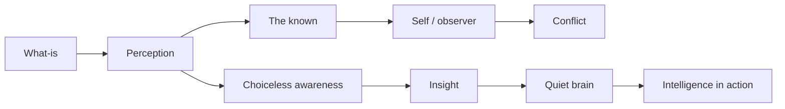
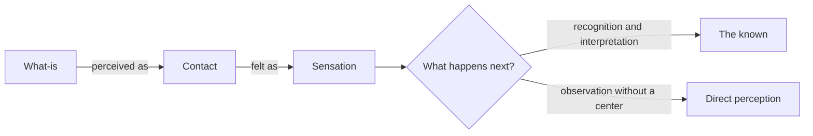
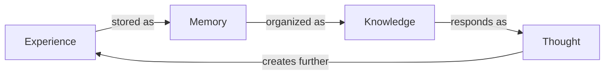
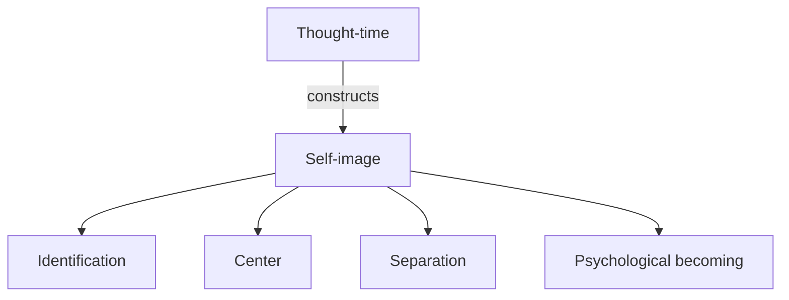
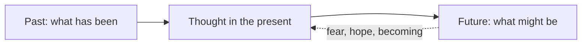
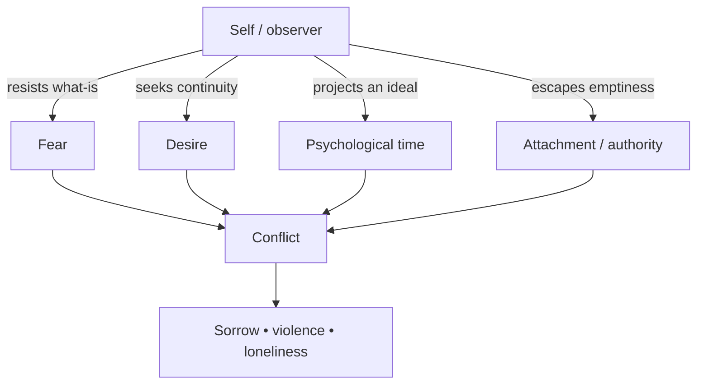
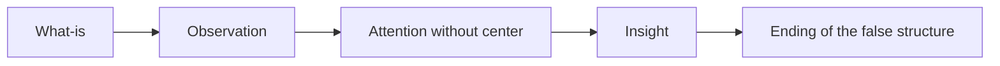
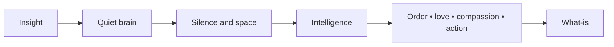

The mind is usually described through isolated words: *thought*, *memory*, *fear*, *desire*, *attention*, and *insight*. But these are not separate pieces sitting side by side. They form relationships, feedback loops, and patterns that reveal how conditioning shapes perception.

This visual map approaches the mind through systems thinking, object-oriented design, and direct observation. One of its principal conceptual references is J. Krishnamurti's exploration of conditioning, thought, the observer, attention, and insight. The architecture metaphor can help us see relationships—but it must remain a metaphor. The description is never the described.

> **Central question:** Can the brain meet *what-is* directly, without translating the present through the accumulated past?

## Explore the architecture maps

The cover introduces the central movement in a simple visual form. The two detailed maps below can be opened when you want to inspect the complete conceptual and Ruby-oriented architectures.

<div style="display:flex;gap:1rem;flex-wrap:wrap;align-items:flex-start;">
  <figure style="flex:1 1 320px;margin:0;">
    <a href="/assets/images/posts/krishnamurti-mind-architecture/mind-architecture-reference.webp">
      
    </a>
    <figcaption style="text-align:center;"><em>Conceptual architecture — click to enlarge</em></figcaption>
  </figure>
  <figure style="flex:1 1 320px;margin:0;">
    <a href="/assets/images/posts/krishnamurti-mind-architecture/ruby-architecture.webp">
      
    </a>
    <figcaption style="text-align:center;"><em>Ruby architecture — click to enlarge</em></figcaption>
  </figure>
</div>

## Your visual roadmap



Keep two movements in view:

1. The known interprets the present and preserves its own continuity.
2. Direct observation reveals that movement without selecting, condemning, or escaping from it.

## 1. Begin with *what-is*

*What-is* is the living fact before an image, label, judgment, ideal, or conclusion is placed over it. It might be a sensation, anger, loneliness, a spoken word, a tree, or the movement of a relationship.

The first contact is simple:



The important distinction is not between having and avoiding thought. Practical thought is necessary for language, engineering, planning, and daily life. The question is whether psychological thought occupies the whole field of perception.

### Pause and notice

Recall a moment of irritation. Before the sentence “I am angry” appeared, what was actually present—physical tension, heat, an image, a remembered insult?

## 2. The brain and the conditioned mind

In the architecture illustration, the **brain** is the physical host. **Conditioning** is represented as an accumulated program formed through culture, experience, tradition, belief, knowledge, and humanity's past.

This does not mean the brain is literally a computer. The analogy highlights repetition: the present is commonly interpreted using patterns stored from previous experience.

| Layer | Function in the visual model | Important distinction |
|---|---|---|
| Brain | Physical organ in which memory and thought operate | The brain is not identical to the totality Krishnamurti calls Mind |
| Conditioning | Accumulated individual and collective patterns | It includes more than conscious personal beliefs |
| Memory | Records experience | Essential practically, distorting when it becomes the psychological observer |
| Knowledge | Organized content of the known | Always limited because experience is limited |
| Thought | Response of memory and knowledge | Useful in its proper field; fragmentary when claiming total perception |

## 3. The recursive movement of the known

Experience, memory, knowledge, and thought reinforce one another:



This loop is not inherently wrong. Without it, there would be no language, technical skill, or recognition. Difficulty begins when the loop becomes the observer of every psychological fact. Then the known does not merely respond to reality—it pretends to be the one who sees reality.

> **Quick recap:** Thought is a response of the past. It can describe a fact, but the description is not the fact.

## 4. How thought constructs the self

The psychological self is not presented here as a permanent inner entity. It is an image assembled through names, experiences, wounds, achievements, attachments, comparisons, and hopes.



The self then appears to stand apart from its own reactions:

- “I must control my fear.”
- “I should overcome my anger.”
- “I will gradually become peaceful.”

But the controller is made from the same memories, images, and thought that created the reaction. This is the significance of Krishnamurti's formulation: **the observer is the observed**.

## 5. Thought-time: past becoming future

Chronological time is necessary. Psychological time is different: it is the projection that inwardly I will become something tomorrow.



Thought carries yesterday into the present and projects a modified version into tomorrow. The result may be fear of repetition, pursuit of pleasure, comparison with an ideal, or the promise of eventual transformation.

## 6. Fear, desire, and conflict are connected

Fear and desire are not isolated modules. They share the movement of thought, sensation, image, and time.

| Movement | Relationship to the self |
|---|---|
| Fear | Resists loss, pain, uncertainty, or the ending of the known |
| Desire | Seeks continuation of sensation, pleasure, identity, or achievement |
| Attachment | Gives the self a sense of permanence and security |
| Becoming | Opposes *what-is* with an image of what should be |
| Conflict | Emerges from division, resistance, contradiction, and opposing desires |



### Remember it visually

Fear looks backward and forward through a clock. Desire stretches a hand toward an image. Conflict is the knot produced when these movements pull in different directions.

## 7. Relationship is the mirror

Conditioning becomes visible in relationship. An image of “me” meets an image of “you”; expectations, memories, wounds, and demands interact. We may believe we are responding to another person while responding primarily to our accumulated image of them.

> Relationship is not merely another component of the architecture. It is where the hidden architecture becomes observable.

### Your turn

During a disagreement, distinguish three things:

1. What was actually said.
2. The memory or interpretation that immediately appeared.
3. The image of yourself that felt threatened.

Do not try to correct the reaction yet. First see its complete movement.

## 8. Choiceless awareness is not another controller

Choiceless awareness is observation without selecting what should remain and what should disappear. It is not indifference, passivity, or concentration on a chosen object.



If the self says, “I will practice awareness to eliminate fear,” the motive belongs to the old loop. Awareness has become a strategy of becoming. The diagram therefore does not model attention as a mode selected by the ego.

## 9. Insight ends; it does not suppress

Insight is direct perception of the whole structure of a fact. It is not intellectual agreement, analysis accumulated over time, or a partial conclusion.

In the visual architecture, insight sends no request to `SelfImprovementService`. It does not refactor the ego into a better ego. Seeing the falseness of a psychological division is itself the ending of that division.

> **Design principle:** Insight does not optimize the conditioned loop. It ends its psychological authority.

The energy previously consumed by resistance and conflict is no longer trapped in that pattern. This is represented as silence and empty psychological space—not blankness, but a brain no longer occupied by incessant self-centered movement.

## 10. Silence, space, intelligence, and action

One conceptual approach informing this model distinguishes the physical brain from the broader meaning of Mind found in Krishnamurti's vocabulary. The infographic therefore places **Mind / the Ground** outside the object hierarchy.

It is not a component possessed by `Brain`, not a superclass from which a person inherits, and not an object created by thought. The architecture can only indicate a possibility: when the brain is quiet, intelligence may act through it.



## 11. The same architecture expressed through Ruby

[Open the complete Ruby architecture infographic](/assets/images/posts/krishnamurti-mind-architecture/ruby-architecture.webp).

Ruby gives us a familiar language for visualizing composition, responsibilities, messages, and emergent behavior. It also lets us expose the limits of the metaphor.

```ruby
module Conditioning
  def inherited_patterns(*patterns)
    patterns.each do |pattern|
      define_method("conditioned_by_#{pattern}?") { true }
    end
  end
end

class ConditionedMind
  extend Conditioning

  inherited_patterns :culture, :tradition, :belief, :human_past

  def initialize(memory: MemoryStore.new)
    @memory = memory
  end

  def interpret(fact)
    knowledge = @memory.recall(fact)
    ThoughtLoop.new(@memory).respond(fact, knowledge)
  end
end
```

Metaprogramming is appropriate here because conditioning often behaves like inherited behavior: patterns operate before we explicitly choose them. Ruby can generate methods dynamically just as culture supplies ready-made responses. But the analogy stops there—human conditioning is not erased by calling `remove_method`.

The direct-perception branch deliberately avoids a long object pipeline:

```ruby
class ChoicelessAwareness
  def self.observe(fact)
    fact # no judge, selector, label, or psychological owner
  end
end

class Insight
  def self.call(what_is)
    ChoicelessAwareness.observe(what_is)
  end
end
```

This code is intentionally paradoxical. Any implementation still belongs to thought and representation. It cannot manufacture attention or instantiate insight. Its purpose is to make one architectural distinction memorable:

```ruby
objects_can_model_the_movement = true
objects_can_contain_the_living_truth = false
```

<details>
<summary><strong>Explore the complete Ruby mapping</strong></summary>

| Krishnamurti concept | Ruby architecture metaphor | Why it helps | Where it breaks |
|---|---|---|---|
| Brain | Aggregate / physical host | Provides an operating boundary | A living brain is not a software container |
| Conditioning | Module with inherited patterns | Shows cross-cutting learned behavior | Conditioning is embodied and collective, not merely code reuse |
| Memory | Repository | Stores traces of experience | Memory actively shapes perception |
| Thought | Recursive interpreter | Shows the known responding to input | Thought is not reducible to a deterministic function |
| Self | Constructed value/image object | Makes its dependence on memory visible | The self feels like the observer, not like a passive DTO |
| Fear and desire | Events derived from self-centered interpretation | Reveals shared upstream causes | Human feeling is not event-bus traffic |
| Relationship | Observability boundary | Exposes hidden state and assumptions | Another human being must never become a test double |
| Insight | Immediate termination of a false loop | Contrasts ending with gradual optimization | Insight cannot be invoked by a method call |
| Mind / Ground | Outside the object model | Prevents conceptual ownership by the brain | Even “outside” is still a spatial metaphor |

</details>

## 12. A five-minute observation experiment

Choose one reaction that appears today—defensiveness, irritation, fear, or the desire to be recognized.

1. Name the external fact with as little interpretation as possible.
2. Notice the bodily sensation.
3. Observe the memory or image that responds.
4. See whether a center appears that says, “This is happening to me.”
5. Notice the projected future or desired outcome.
6. Do not suppress, justify, or replace any part of the movement.
7. Ask whether the observer is different from what it observes.

The goal is not to produce a preferred state. It is to learn through direct observation.

## What the architecture reveals

- The self is not the owner of thought; it is constructed by thought.
- Psychological time connects memory, fear, desire, and becoming.
- Conflict begins with division between the fact and the image of what should be.
- Relationship exposes conditioning in real time.
- Awareness is not another controlling process.
- Insight is an ending, not an incremental improvement.
- Silence is not forced inactivity but space no longer occupied by psychological noise.
- Intelligence acts in direct relationship with life, without a self-centered intermediary.

## Final takeaway

Systems thinking helps us see that fear, desire, memory, time, and the self are not independent objects. They participate in one movement of conditioning. Ruby helps make that movement visible through composition, messages, loops, and generated behavior.

But the deepest point of the architecture is where architecture reaches its limit. A class can represent `Insight`; it cannot produce insight. A diagram can trace the movement of thought; only attention can reveal that movement as it happens.

The map becomes valuable when it sends us back to the territory: relationship, perception, and the living fact of *what-is*.

## Conceptual approach and references

Krishnamurti's teachings are used here as an investigative approach to thought, conditioning, psychological time, the observer, and insight—not as a closed doctrine or as the ownership label for the architecture. Hillary Peter Rodrigues's analysis provides the relational structure that helped translate those concepts into the visual and Ruby-oriented models.

- Hillary Peter Rodrigues, *“Insight” and “The Religious Mind” in the Teachings of Jiddu Krishnamurti*.
- [Krishnamurti Foundation Trust — On Awareness](https://kfoundation.org/urgency-of-change-podcast-episode-73-krishnamurti-on-awareness/)
- [Krishnamurti Foundation Trust — Thought and the Awakening of Intelligence](https://kfoundation.org/krishnamurti-thought-and-the-awakening-of-intelligence-%C2%B7-from-the-awakening-of-intelligence/)
- [Krishnamurti Foundation Trust — Time, Action and Fear](https://kfoundation.org/krishnamurti-in-saanen-1975-talk-4-time-action-and-fear-transcript/)
