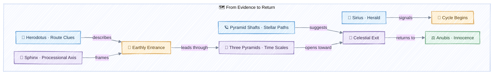
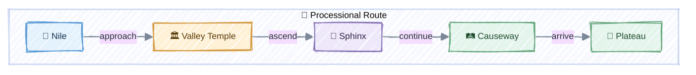

<small><em>Symbolic illustration: the Anubis-headed Sphinx is a contemplative synthesis, not a historical reconstruction.</em></small>

What if the secret of the Sphinx is not a sentence to be decoded, but a path to be followed?

An old desert image gives us the starting point: when a traveler loses all sense of direction, the tracks of a jackal may lead toward water, life, or a known route. Whether or not this was ever a documented Egyptian practice, it is a powerful narrative lens. The jackal does not carry the traveler. It restores orientation.

This visual essay explores a symbolic possibility: **Anubis as the guide, the Sphinx as the threshold, Sirius as the signal, and the three pyramids as an earthly map of three cycles of transformation.** It is an interpretive synthesis—not a claim that Egyptologists have discovered a hidden Tarot system at Giza.

The proposal is deliberately layered: Sirius supplies a visible sign of recurrence; the Sphinx represents discernment at the threshold; the pyramids become a symbolic measure of nested time; and Anubis guides the traveler through transformation. The historical record provides the material clues, while the connections among them belong to a contemplative model.

## How to read this map

The article moves through three different layers. Keeping them separate makes the exploration both imaginative and intellectually honest.

| Layer | What it contains | How it is used here |
|---|---|---|
| Historically attested | Anubis as a jackal-headed funerary deity; the royal Sphinx as a human-headed lion and sacred guardian; Sirius as an important celestial marker | The factual foundation |
| Astronomical interpretation | Correspondences among sacred landscape, stellar cycles, Orion, Sirius, and monumental orientation | A field of inquiry, with debated conclusions |
| Symbolic synthesis | The Anubis-headed Sphinx, three nested scales of time, and the Fool as innocence restored | A modern contemplative model |

> **Reading rule:** The first layer is evidence, the second is interpretation, and the third is symbolic synthesis. The diagrams use these layers to organize an imaginative reading, not to turn analogy into archaeological fact.

## The complete visual map

<small>Interpretive map, not an archaeological reconstruction. Click or tap to open the full-size version.</small>

## 1. The jackal's trace

To be lost is more than not knowing where you are. It is not knowing which sign deserves your trust.

The jackal survives at the edge of settlement and wilderness. Symbolically, its footprints connect the unknown desert to a place where life remains possible. This makes the animal a natural image of orientation: the guide does not eliminate uncertainty; it teaches us how to read it.

That is the first key to this map:

> **A path becomes visible when apparently isolated traces are understood as a sequence.**

## 2. Anubis: the intelligence of the threshold

Ancient Egyptian Anubis was represented as a jackal or canid and was closely connected with burial grounds, embalming, and passage into the next state of existence. The role is not merely about death. It is about **safe transition**—how one state becomes another without meaning being lost.

In this essay, Anubis represents the faculty that can:

- notice the trace;
- distinguish signal from noise;
- accompany a passage;
- connect an ending to a new beginning.

The historical Sphinx, however, is not normally represented with the head of Anubis. The Great Sphinx has a lion's body and a royal human head, commonly associated with Khafre. The **Anubis-headed Sphinx used in our illustration is therefore deliberately symbolic**: it fuses the guide with the guardian of the threshold.

## 3. The Sphinx: entrance, question, and gate

The Sphinx occupies a liminal position. It joins animal power to conscious intelligence, earth to horizon, monument to landscape. Museum interpretations describe Egyptian sphinxes as royal guardians of sacred places and connect the form with the horizon and solar renewal.

Seen through our symbolic lens, the Sphinx is not the final answer. It is the place where the traveler must become capable of asking the right question.

The entrance and the exit are the same threshold encountered by different versions of the traveler.

## 4. Sirius: the visible herald of return

Sirius matters first because it is easy to perceive. It is the brightest star in Earth's night sky and the brightest member of Canis Major. Its heliacal rising—the first dawn appearance after a period hidden in the Sun's glare—was distinct enough to serve as a seasonal signal. In Egypt, Sirius was **Sopdet**, later associated with **Isis**, and its return was linked with the Nile inundation and the opening of the year.

The familiar title **Dog Star** comes from Sirius's position in Canis Major. The more specific expression **“Dog of the Sun”** belongs to older Euphratean, Akkadian, or Assyrian star lore rather than securely attested Egyptian terminology. This distinction strengthens the article: the canine image crosses cultures, while the Egyptian identity remains Sopdet–Isis.

Plutarch preserves another illuminating formulation: Sirius, “the Dog,” acts as a sentinel or scout before the other stars. That image expresses the function required by our map—a conspicuous celestial herald announcing that return has begun.

Historically, Sirius directly marks the **annual** cycle. In this interpretive model, its visibility is then extended analogically across three scales: the return of light each day, the return of the inundation and year, and the return produced by the Great Year of precession. Sirius is therefore not claimed to astronomically initiate all three cycles; it is the **shared symbol by which beginning becomes perceptible**.

## 5. Herodotus and the earthly entrance

In *Histories* 2.124–127, Herodotus describes more than isolated pyramids. He mentions a monumental road or causeway, underground chambers in the hill, water brought from the Nile, a built passage surrounding an island, and the proximity of Khafre's pyramid to the Great Pyramid.

Herodotus does **not** name the Sphinx in these passages. The clue emerges only when his description is placed over the archaeology of the plateau. The Sphinx and Sphinx Temple stand beside Khafre's Valley Temple and causeway—the processional axis climbing from the low, Nile-facing edge toward the pyramid. AERA's architectural research confirms that the south side of the Sphinx quarry forms the north side of Khafre's causeway foundation.

The coherent but cautious inference is therefore:

Herodotus supplies the vocabulary of road, water, chambers, and neighboring pyramids. Archaeology supplies the Sphinx's position within Khafre's processional landscape. Their conjunction suggests an **earthly entrance**, but it is not a sentence written by Herodotus saying that the Sphinx guards all three pyramids.

## 6. The shafts and the celestial exit

The Great Pyramid contains four narrow shafts associated with the King's and Queen's Chambers. Two reach the exterior; the Queen's Chamber shafts terminate behind blocking stones and were explored robotically by the Djedi project. Their construction shows that they were not ordinary windows, and their exact function remains debated.

One religious and archaeoastronomical interpretation treats them as symbolic routes through which the royal spirit could join the celestial order:

| Chamber and direction | Proposed stellar correspondence |
|---|---|
| King's Chamber, south | Orion, associated with Osiris |
| King's Chamber, north | Thuban or the northern “imperishable” stars |
| Queen's Chamber, south | Sirius, associated with Sopdet–Isis |
| Queen's Chamber, north | Northern circumpolar region |

These are proposed alignments, not settled observations. The shafts bend, some were sealed, and scholarly analysis has challenged overly precise star-target claims. Their strongest role in this essay is architectural and symbolic: the internal chamber is connected directionally with the sky. The earthly processional route leads **into** the sacred complex; the shafts can be read as imagined routes **out toward** the imperishable stars.

## 7. As above, so below

Above, the sky offers a recurring drama:

- **Orion**, read in Egyptian religious tradition in relation to **Osiris**;
- **Canis Major**, the constellation that contains **Sirius**;
- **Sirius**, whose heliacal rising became associated with seasonal renewal, the Nile cycle, and the Egyptian New Year.

Below, the sacred landscape offers another arrangement:

- the guardian at the horizon;
- the three pyramidal forms;
- a route through death, transformation, and renewed order.

The phrase “as above, so below” is used here as a principle of correspondence: the sky is not copied mechanically onto the ground; rather, celestial recurrence becomes a language through which earthly life can be organized and understood.

## 8. Three pyramids, three scales of time

The three paths are cycles at progressively larger scales. The divine and pyramidal correspondences below belong to this essay's symbolic cosmology; they are not conventional archaeological identifications.

| Scale | Cycle | Divine correspondence | Celestial marker | Earthly correspondence |
|---|---|---|---|---|
| Human time | Day and night | Horus | The Sun's daily passage | Pyramid of Menkaure |
| Earth time | Seasons and the year | Isis–Sopdet | The return of Sirius, the Nile, and renewal | Pyramid of Khafre |
| Cosmic time | The Great Year | Osiris–Orion | Precession, death, transformation, and rebirth | Great Pyramid of Khufu |

```mermaid!
%%{init: {"theme": "base", "look": "handDrawn", "themeVariables": {"fontFamily": "ui-sans-serif, system-ui, sans-serif", "lineColor": "#7c8798", "primaryTextColor": "#263238", "fontSize": "9px"}, "flowchart": {"nodeSpacing": 4, "rankSpacing": 8, "padding": 0}}}%%
flowchart TB
  subgraph Cycle["♾️ Time Cycles"]
    A["⚖️ Anubis · Start"]

    subgraph Human["☀️ Human"]
      D["🌞 Day · Horus"]
    end

    subgraph Earth["🌊 Earth"]
      Y["🌟 Year · Isis–Sopdet"]
    end

    subgraph Cosmic["🌌 Cosmic"]
      G["🪐 Great Year · Orion"]
    end

    B["🔁 Anubis · Return"]
    F["🃏 0 · The Fool"]
  end

  A -->|begins| D
  D -->|expands to| Y
  Y -->|expands to| G
  G -->|returns through| B
  B -->|restores| F

  classDef guide fill:#fff1d6,stroke:#d39b45,color:#5b3d0b,stroke-width:1px
  classDef human fill:#e3f2fd,stroke:#5b9bd5,color:#16324f,stroke-width:1px
  classDef earth fill:#e4f5ec,stroke:#68a77d,color:#204b2d,stroke-width:1px
  classDef cosmic fill:#eee8fa,stroke:#8b78b8,color:#332348,stroke-width:1px
  classDef return fill:#fbe5e7,stroke:#cf7d86,color:#5b252b,stroke-width:1px
  class A guide
  class D human
  class Y earth
  class G cosmic
  class B,F return
```

Each pyramid therefore marks a different order of recurrence: daily, annual, and cosmic. Together they turn the landscape into a symbolic teaching about nested time.

The three-pyramid assignment is a deliberate interpretive progression, not a historical Egyptian classification. Menkaure, Khafre, and Khufu become visual measures of human, terrestrial, and cosmic time.

## 9. The Great Year: consciousness and civilization

In the introduction to *The Holy Science* (1894), Sri Yukteswar presents a Great Year of 24,000 years: a 12,000-year descending arc followed by a 12,000-year ascending arc. Each half contains four Yugas—Kali (1,200 years), Dwapara (2,400), Treta (3,600), and Satya (4,800)—but in reversed order.

### Illustrated map of the Great Year

<small>Interpretive map, not a chronological equivalence among traditions. Click or tap to open the full-size cross-cultural cycle.</small>

In this model, what contracts and expands is *dharma*, described as the mental or inward capacity to comprehend reality:

| Yuga | Symbolic capacity |
|---|---|
| Kali | One-quarter: dense matter |
| Dwapara | One-half: energy, electricity, and subtle forces |
| Treta | Three-quarters: divine magnetism |
| Satya | Full: Spirit and the unity underlying appearances |

Sri Yukteswar places the darkest turning point around 499 CE and interprets the subsequent centuries as an ascent. His chronology places humanity in ascending Dwapara; the book distinguishes its transition (*sandhi*) from the beginning of Dwapara proper in 1899. Within this worldview, scientific, communicative, and technological development reflects an expanding capacity to perceive subtler forces—but technology alone is not the same as awakened consciousness.

> **Important distinction:** Yukteswar's 24,000-year Great Year is a metaphysical chronology. Modern astronomy describes axial precession as approximately 26,000 years. They are related here as symbols of recurrence, not treated as the same measured cycle.

### Different traditions, one recurring intuition

The Great Year resonates because several traditions imagine history as movement through qualitative ages rather than as a straight line:

- the Indian Yugas describe changing degrees of *dharma* and perception;
- Hesiod's Greek sequence of Gold, Silver, Bronze, Heroic, and Iron describes moral and civilizational decline, with the Heroic Age interrupting a simple metallic descent;
- astrological ages divide the idealized precessional circle into twelve periods of roughly 2,160 years.

These are **resonant traditions, not chronological equivalents**. Their dates and meanings differ; what they share is the intuition that civilizations can lose and recover ranges of understanding.

### Why build for deep time?

This suggests a symbolic explanation for the monument's scale. If civilizations rise and decline, knowledge stored only in fragile media, institutions, or speech can disappear. A massive stone structure can outlive its builders and confront future people with durable clues: orientation, proportion, chambers, alignments, and the relationship between earth and sky.

The Great Pyramid has survived for more than 4,600 years. Its endurance is real, while the further proposition—that it was intentionally designed as a message able to survive cataclysms—is the **legacy hypothesis** of this essay, not an archaeological conclusion.

### Traveler, Fool, or Hero?

The most precise central name is **the Traveler**:

| Figure | Role in the map |
|---|---|
| The Traveler | Humanity as the enduring subject crossing civilizations and ages |
| The Fool—0/XXII | The liminal condition: before the first step and after the last; innocence lost, transformed, and restored |
| The Hero | One possible phase of struggle and integration within the journey, not the universal identity |

Historically, the Fool often stood outside the numbered trump sequence; later decks placed it at 0 and, more rarely, XXII. That ambiguity is exactly what makes the image useful here. The Fool is not confined to one position: **0 before the cycle, XXII after its completion**. The Traveler receives the legacy of a former world, reconnects the signs, and carries understanding into the next.

## 10. Anubis and the return to the Fool

Anubis is both **the beginning and the end of the passage**. In this interpretation, the guide receives the Traveler, conducts the spirit through the three orders of transformation, and returns it to **The Fool—0/XXII**: innocence restored after transformation. Tarot remains a later comparative symbol, not evidence of an ancient Egyptian Tarot doctrine.

## A short practice: follow the trace

Choose one unresolved situation and answer five questions:

1. **The desert:** Where have I lost orientation?
2. **The trace:** What small fact or recurring sign have I ignored?
3. **Anubis:** What would help me cross safely into the next stage?
4. **The Sphinx:** What question must I answer before proceeding?
5. **Sirius:** What event would show me that a new cycle has begun?

The point is not to predict the future. It is to turn fragments into a path.

## The revealed secret

The secret of the Sphinx, in this reading, is not one object hidden inside the monument. It emerges from the coherence of the whole system:

1. **Sirius is perceptible:** the brightest night star becomes the herald of return.
2. **The landscape is directional:** Nile, valley temple, Sphinx, causeway, and plateau create an earthly approach.
3. **Herodotus preserves traces of that world:** road, water, underground chambers, and neighboring pyramids—without explicitly naming the Sphinx.
4. **The Great Pyramid can be read as pointing outward:** its shafts have been interpreted as symbolic paths toward Sirius, Orion, and the northern imperishable stars.
5. **The pyramids measure nested recurrence:** day and night, the annual return, and the Great Year.
6. **Anubis closes the circuit:** the guide presides over entry and exit, returning the transformed spirit to the innocence of the Fool.

The jackal's footprint alone is only a mark in the sand. Orion alone is only a stellar pattern. A pyramid alone is only a monumental form. The Fool alone is only potential. But when these images are connected carefully—without confusing poetry with proof—they create a map of transformation.

The map does not tell us what to believe. It teaches us how to orient ourselves.

Perhaps the sheer scale and extraordinary endurance of this structure find their deepest meaning in such a purpose: to survive the rise and fall of worlds, allowing the Traveler—humanity itself—to rediscover its bearings when the signs have been forgotten. In this reading, the monument becomes more than a construction or tomb. It becomes a vessel of memory, preserving its knowledge as a lasting legacy for the people of a future age.

> **The monument preserves the signs. The Traveler learns to read them again.**

## References and further reading

- [The Metropolitan Museum of Art: Statuette of Anubis](https://www.metmuseum.org/art/collection/search/544075)
- [The Metropolitan Museum of Art: Sphinx of Senwosret III](https://www.metmuseum.org/art/collection/search/544186)
- [The British Museum: The Great Sphinx](https://www.britishmuseum.org/collection/object/Y_EA58)
- [Herodotus, *Histories* 2.124–127, translated by A. D. Godley](https://kosmossociety.org/herodotus-in-egypt/)
- [AERA: Khafre's Monuments as a Unit](https://aeraweb.org/khafres-monuments/)
- [AERA: Who Built the Sphinx?](https://aeraweb.org/projects/who-built-the-sphinx/)
- [University of Leeds: Djedi Robot Archaeological Expedition](https://robotics.leeds.ac.uk/case-studies/djedi-robot-archaeological-expedition/)
- [J. J. Wall: “The Star Alignment Hypothesis for the Great Pyramid Shafts”](https://ui.adsabs.harvard.edu/abs/2007JHA....38..199W/abstract)
- [NASA: Sirius, the Dog Star](https://science.nasa.gov/asset/hubble/the-dog-star-sirius-and-its-tiny-companion/)
- Swami Sri Yukteswar, *The Holy Science* (*A Ciência Sagrada*), Introduction — supplied edition
- [NASA: Precession of Earth's axis over approximately 26,000 years](https://science.nasa.gov/learn/basics-of-space-flight/chapter2-1/)
- [Hesiod, *Works and Days*, lines 109–201: the Ages of Humanity](https://www.theoi.com/Text/HesiodWorksDays.html)
- [Victoria and Albert Museum: A History of Tarot Cards](https://www.vam.ac.uk/articles/tarot-cards)
- [Plutarch, *Isis and Osiris*](https://topostext.org/work/274)
- [Cambridge University Press: *Architecture, Astronomy and Sacred Landscape in Ancient Egypt*](https://www.cambridge.org/core/books/architecture-astronomy-and-sacred-landscape-in-ancient-egypt/part-one/25B7C97DB26561CB2F63D09CDD9294DB)
- [Ancient Egypt Online: Sopdet (Sirius)](https://ancientegyptonline.co.uk/sopdet/)

---

*Written and visually conceived by Roberto Nogueira. The proposed correspondences are an interpretive framework for reflection and visual learning, not a statement of archaeological consensus.*
