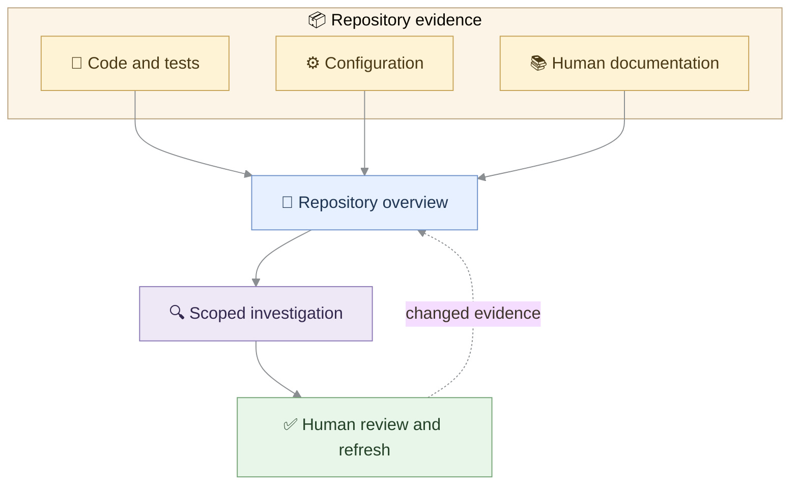
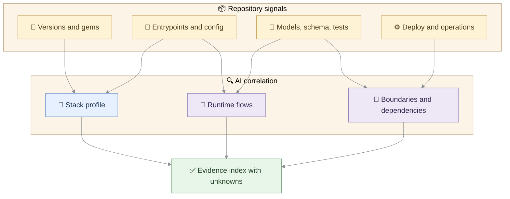
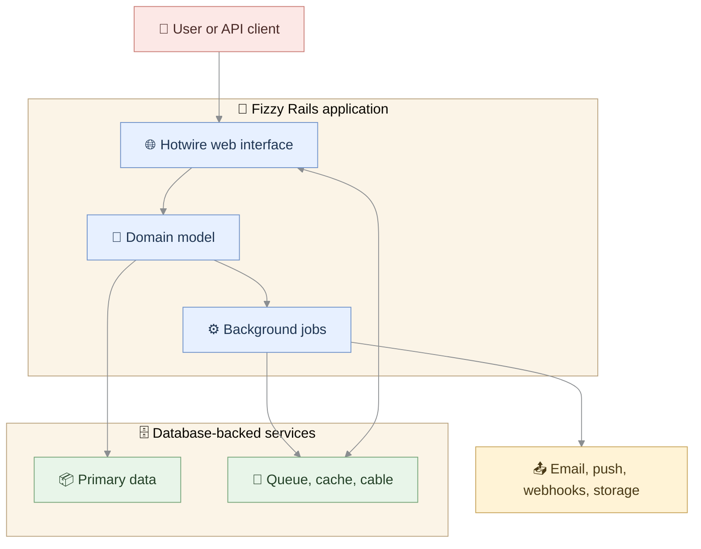
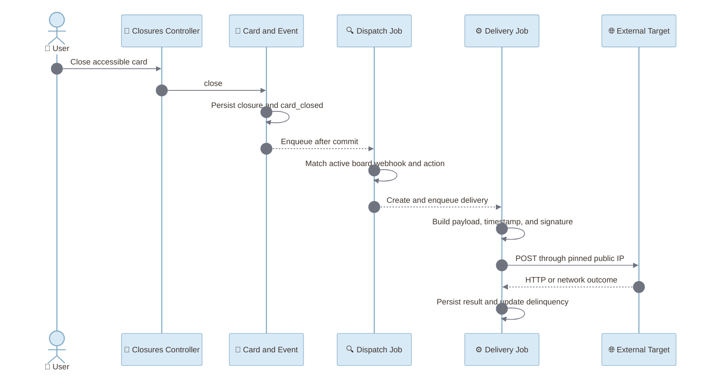
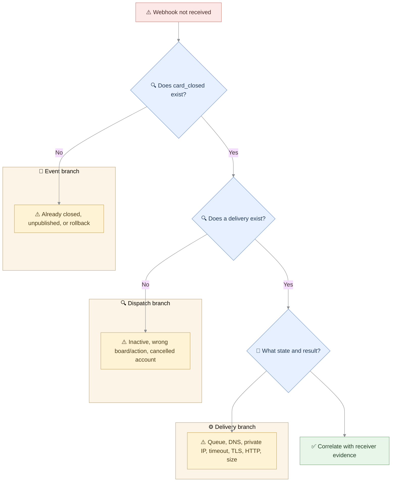
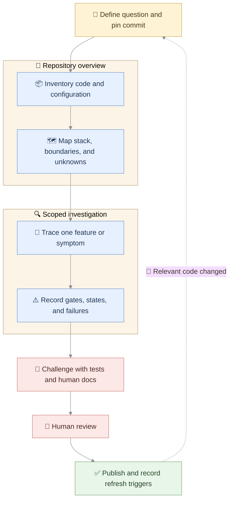

An unfamiliar Rails repository rarely lacks structure. What it lacks is a map connecting conventions, domain behavior, callbacks, jobs, configuration, integrations, and operational failure paths. This guide presents an evidence-based workflow for using AI agents to build that map progressively—from a repository overview to a focused feature or bug investigation—using Basecamp's Fizzy repository as an openly inspectable case study.

## Contents

- [Why Rails Repositories Become Hard to Understand](#why-rails-repositories-become-hard-to-understand)
- [Documentation as a Living Map](#documentation-as-a-living-map)
- [What AI Can Discover from a Rails Repository](#what-ai-can-discover-from-a-rails-repository)
- [The Repository Overview Pass](#the-repository-overview-pass)
- [Building the Architecture and Dependency Map](#building-the-architecture-and-dependency-map)
- [Zooming into a Feature or Business Flow](#zooming-into-a-feature-or-business-flow)
- [Using AI to Investigate a Bug](#using-ai-to-investigate-a-bug)
- [Evidence, Confidence, and Human Review](#evidence-confidence-and-human-review)
- [A Reusable Rails Documentation Workflow](#a-reusable-rails-documentation-workflow)
- [The Documentation Package and Next Steps](#the-documentation-package-and-next-steps)
- [References and Further Exploration](#references-and-further-exploration)

## Why Rails Repositories Become Hard to Understand

Rails makes an application easy to enter locally. Routes point to controllers, controllers coordinate requests, models represent persistent domain state, and conventions remove a great deal of ceremony. That local predictability is one of Rails' greatest strengths. It is not, however, the same as understanding the system.

In a mature repository, one user action may cross a controller, a model concern, a transaction callback, an event record, a background job, an integration adapter, and a second job responsible for delivery. Configuration may switch the database, queue, storage, or product mode. Tests may encode invariants that are never stated beside the implementation. A directory tree can show where files live while hiding why they cooperate.

Fizzy makes this distinction visible. Its repository contains a conventional Rails application, but its behavior is distributed across rich domain models, narrowly named concerns, resource-oriented controllers, database-backed asynchronous services, Hotwire interactions, and conditional self-hosted and SaaS configuration. For example, `Card` composes capabilities for assignment, events, tagging, triage, watching, postponement, broadcasting, and attachments. Reading [`app/models/card.rb`](https://github.com/basecamp/fizzy/blob/9312f6b35f5446a04f7caa2c5850c6921c81ca18/app/models/card.rb) explains the composition, but not every execution path created by those concerns.

This is where AI can help—not by summarizing every file, but by correlating evidence that no single file contains. The useful question is not “What classes exist?” It is “What path does this behavior take, which conditions control it, where does state change, and what evidence supports that conclusion?”

That distinction matters for legacy work. A plausible explanation produced from naming conventions alone can sound authoritative while being wrong about callbacks, queue boundaries, tenancy, feature flags, or failure handling. The first rule of AI-assisted documentation is therefore simple:

> Generate a map of verified relationships, not a story that merely sounds like Rails.

The rest of this workflow applies that rule at two levels: a repository overview for orientation and a scoped investigation for a feature or bug.

## Documentation as a Living Map

A generated megadocument becomes stale almost as soon as it is published. A living map behaves differently. It has layers, declares its scope, links conclusions to evidence, exposes uncertainty, and says how it should be refreshed.

The overview layer answers broad questions: What is the stack? What are the major runtime responsibilities? Which data stores and external systems exist? Where are the likely architectural boundaries? It deliberately avoids pretending to explain every feature.

The scoped layer begins with one bounded question: How is a card closed? Why might a webhook not be delivered? Which code participates in a particular business capability? It follows one path deeply enough to reveal conditions, side effects, tests, and failure branches.



<figure class="post-figure">
  
  <figcaption>Keep the repository landscape visible while narrowing the investigation to one bounded feature or failure path.</figcaption>
</figure>

This layered approach borrows the idea of levels of abstraction from the [C4 model](https://c4model.com/): context, containers, components, and code answer different questions. We do not need to force every Rails diagram into formal C4 notation. We do need to state the level of zoom and avoid mixing a deployment topology, an object relationship, and an execution sequence into one unreadable picture.

Every generated document should carry a small evidence header:

```text
Repository: basecamp/fizzy
Commit: 9312f6b...
Scope: repository overview | webhook delivery
Sources admitted: code, configuration, tests, human docs
Confidence: observed | inferred | unknown
Refresh when: listed evidence paths change
```

This turns documentation into a reviewable engineering artifact. A reader can distinguish a fact observed in code from an architectural inference. A maintainer can challenge an incomplete map without rewriting the entire document. An agent can later refresh the affected scope rather than regenerate everything.

## What AI Can Discover from a Rails Repository

A useful repository scan is concern-driven. Instead of asking an agent to “analyze the project,” give it a matrix of questions and the first evidence to inspect.



For Fizzy, version and dependency evidence begins in [`.ruby-version`](https://github.com/basecamp/fizzy/blob/9312f6b35f5446a04f7caa2c5850c6921c81ca18/.ruby-version), [`Gemfile`](https://github.com/basecamp/fizzy/blob/9312f6b35f5446a04f7caa2c5850c6921c81ca18/Gemfile), and [`Gemfile.lock`](https://github.com/basecamp/fizzy/blob/9312f6b35f5446a04f7caa2c5850c6921c81ca18/Gemfile.lock). Together they establish Ruby 3.4.8 and a Rails dependency resolving to an 8.2 alpha snapshot at the pinned commit. The wording matters: this is an observed repository state, not a claim that all readers should adopt an alpha Rails version.

Entrypoints and runtime choices come from several sources:

- [`config/routes.rb`](https://github.com/basecamp/fizzy/blob/9312f6b35f5446a04f7caa2c5850c6921c81ca18/config/routes.rb) reveals HTTP resources and mounted operational interfaces.
- [`config/environments/production.rb`](https://github.com/basecamp/fizzy/blob/9312f6b35f5446a04f7caa2c5850c6921c81ca18/config/environments/production.rb) selects production cache and job behavior.
- [`config/database.yml`](https://github.com/basecamp/fizzy/blob/9312f6b35f5446a04f7caa2c5850c6921c81ca18/config/database.yml), [`config/queue.yml`](https://github.com/basecamp/fizzy/blob/9312f6b35f5446a04f7caa2c5850c6921c81ca18/config/queue.yml), and [`config/cable.yml`](https://github.com/basecamp/fizzy/blob/9312f6b35f5446a04f7caa2c5850c6921c81ca18/config/cable.yml) expose database-backed persistence, jobs, and real-time communication.
- [`config/importmap.rb`](https://github.com/basecamp/fizzy/blob/9312f6b35f5446a04f7caa2c5850c6921c81ca18/config/importmap.rb) and `app/javascript/` show the Hotwire-oriented browser layer.
- [`Dockerfile`](https://github.com/basecamp/fizzy/blob/9312f6b35f5446a04f7caa2c5850c6921c81ca18/Dockerfile) and [`config/deploy.yml`](https://github.com/basecamp/fizzy/blob/9312f6b35f5446a04f7caa2c5850c6921c81ca18/config/deploy.yml) describe the included container and Kamal topology.

No single source proves the whole runtime. A gem declaration proves availability, not execution. A job class proves an implementation exists, not that it is enqueued. A deployment sample proves a supported topology, not every production topology. The agent should therefore produce claims with evidence and confidence, such as:

| Claim | Label | Reason |
|---|---|---|
| Solid Queue is configured as the production Active Job backend | Observed | Explicit production configuration |
| The application favors rich domain models composed from concerns | Inferred | Repeated structure across sampled domain models |
| Every deployment uses the provided Kamal layout | Unknown | Repository configuration cannot establish all real environments |

This discipline is more useful than a longer stack list. It tells the next investigator where certainty ends.

## The Repository Overview Pass

The first pass should be intentionally blind to explanatory documentation. Admit code, configuration, schema, tests, and deployment files; temporarily exclude the README, `AGENTS.md`, and `docs/`. This is not because human documentation is less valuable. It creates a baseline that can later be compared against maintainer intent.

For Fizzy, the blind pass produced five artifacts:

1. a repository inventory;
2. a stack profile;
3. a system context;
4. an architectural and dependency summary;
5. an unknowns register.



At this level, the diagram intentionally hides individual models and job classes. Its job is orientation. It shows a server-rendered Rails application with Hotwire, a domain-centered model layer, asynchronous processing, database-backed operational services, and external delivery/storage boundaries.

Then the second pass admits human-authored documentation and compares, rather than merges, its findings. In the Fizzy pilot, this comparison confirmed 11 selected claims, refined five, found seven material facts missed by the broad scan, and added eight implementation facts from code that the task-oriented documentation did not explain. No material contradiction was found.

The misses are as valuable as the confirmations. `AGENTS.md` explains invariants such as identity-versus-membership semantics, UUID encoding, and adapter-specific search behavior. Deployment guides add operational knowledge about very large imports. Conversely, code analysis exposes webhook commit boundaries, delivery-selection rules, HMAC signing, public-IP enforcement, timeouts, response limits, and delinquency behavior.

The resulting documentation model has three sources of truth with different strengths:

- code and configuration reveal executable structures and conditions;
- human documentation records intent, invariants, and operational experience;
- AI-generated maps correlate both and make gaps navigable.

An overview is ready for review when it answers the main orientation questions and openly lists what it could not establish. Completeness is not the absence of unknowns; it is the absence of hidden uncertainty.

## Building the Architecture and Dependency Map

A diagram should answer one question that prose answers poorly. “Show the architecture” is too vague. “Which responsibilities connect a web request to domain state, asynchronous work, and external delivery?” is specific enough to diagram and review.

```mermaid!
%%{init: {'theme':'base','flowchart':{'useMaxWidth':true,'htmlLabels':true,'nodeSpacing':42,'rankSpacing':48,'curve':'basis'},'themeVariables':{'background':'#FFF8EF','primaryTextColor':'#3E342C','lineColor':'#8B8E91','fontFamily':'Trebuchet MS, Verdana, sans-serif','fontSize':'17px','clusterBkg':'#FBF4E7','clusterBorder':'#B8A17D'}}}%%
flowchart LR
  classDef edge fill:#FCE8E6,stroke:#C97C75,color:#4A2A27
  classDef web fill:#E7F0FF,stroke:#6E91C9,color:#203653
  classDef domain fill:#EDE7F6,stroke:#8B79B5,color:#33284D
  classDef data fill:#E8F5E9,stroke:#75A478,color:#244228
  classDef integration fill:#FFF3D6,stroke:#C7A45A,color:#4A3A16

  U["👤 Browser or API client"]:::edge

  subgraph R["🌐 Request boundary"]
    direction TB
    RT["🚪 Routes and controllers"]:::web
    UI["⚡ Turbo and Stimulus"]:::web
  end

  subgraph D["🧱 Domain boundary"]
    direction TB
    DM["💎 Models and concerns"]:::domain
    EV["📣 Events and notifications"]:::domain
  end

  subgraph A["⚙️ Async and integrations"]
    direction TB
    JB["🔄 Active Job and Solid Queue"]:::integration
    EX["📤 Mail, push, webhooks, storage"]:::integration
  end

  PS["🗄️ Active Record data"]:::data

  U --> RT
  U --> UI
  RT --> DM
  UI --> RT
  DM --> PS
  DM --> EV
  EV --> JB
  JB --> EX
```



This is a conceptual component map, not a complete call graph. The distinction prevents false precision. Routes and controllers form a request boundary; models and concerns carry much of the domain behavior; events connect committed domain activity to notifications and integrations; Active Job and Solid Queue provide asynchronous execution; external adapters cross the system boundary.

Five rules keep AI-generated diagrams defensible:

1. **Declare the question and scope.** A system context, dependency map, sequence, state model, and hypothesis tree are not interchangeable.
2. **Generate relationships from evidence, not names.** `Webhook::DeliveryJob` sounds relevant; an enqueue site and executed method prove its place in the flow.
3. **Collapse detail deliberately.** The overview may group queue, cache, and cable as database-backed services. A deployment view should separate them.
4. **Mark conceptual edges.** An arrow can mean an observed call, persisted relationship, async handoff, or high-level dependency. The surrounding text must say which.
5. **Challenge the result.** Ask a second pass to find missing branches, callbacks, transactions, tenancy restoration, retries, and configuration switches.

Mermaid is useful here because the source remains reviewable beside the documentation. The Blog Factory renders it with the Jekyll-specific `mermaid!` fence, semantic pastel colors, and meaningful subgraphs. The colors distinguish roles; they must not invent status or criticality. Subgraphs express real boundaries, not decoration.

At the end of the overview pass, the reader should be able to navigate the repository without believing the map is the repository. The next step is to zoom into one concrete path. In Fizzy, that path begins when a card is closed and ends—or fails to end—with an outbound webhook delivery.

## Zooming into a Feature or Business Flow

A repository overview gives us landmarks. It does not explain one behavior end to end. To create scoped documentation, begin with a concrete trigger and a concrete outcome:

> When a published card is closed, how can that domain action become an outbound webhook delivery?

This boundary is narrow enough to investigate and broad enough to demonstrate the real difficulty of legacy comprehension. The path crosses authorization, domain state, a transaction, event tracking, an `after_create_commit` callback, two background jobs, tenant context, selection rules, payload construction, network security, and delivery persistence.

Start at the entry point, not at the class whose name resembles the expected outcome. Fizzy exposes card closure through [`config/routes.rb`](https://github.com/basecamp/fizzy/blob/9312f6b35f5446a04f7caa2c5850c6921c81ca18/config/routes.rb) and `app/controllers/cards/closures_controller.rb`. The controller resolves the card through the current user's accessible-card scope before calling the domain transition. That gives the first investigation rule: document how the object enters scope before tracing what the object does.

The close behavior lives in `app/models/card/closeable.rb`. When the card is eligible, the operation creates the closure and tracks `:closed` inside a transaction. The shared event concern prefixes the action with the record type, producing `card_closed`. Card-specific event behavior adds another condition: the card must be published.

The transaction boundary is essential. `app/models/event.rb` enqueues `Event::WebhookDispatchJob` through `after_create_commit`. The delivery path is therefore not meant to begin merely because code attempted to create an event. It begins after the event transaction commits.



The dispatch job searches for active webhooks belonging to the event's board and subscribed to `card_closed`. Triggering creates a `Webhook::Delivery` unless the account is cancelled. Creating that record enqueues a second job. Both jobs rely on the account-tenancy behavior composed into `ApplicationJob`, so the investigation must include job context rather than assuming request-local state survives asynchronously.

The delivery step is not a simple `POST`. Code in `app/models/webhook/delivery.rb` builds destination-specific payloads, adds an event timestamp, signs the body with HMAC-SHA256, resolves a publicly routable destination, and connects to the resolved IP. That last step helps prevent a hostname from resolving publicly during validation and privately during connection. The request also uses seven-second open and read timeouts and caps the response at 100 KB.

The result becomes part of the domain record. HTTP success, non-2xx responses, DNS errors, blocked private destinations, connection timeouts, TLS failures, unreachable targets, and oversized responses are converted into structured outcomes. Expected transport problems can therefore produce a `completed` delivery with a failure result. An unexpected exception follows a different path and leaves the delivery `errored` after the exception is re-raised.

This feature map is useful because every arrow carries an operational question:

| Boundary | Question to preserve in the documentation |
|---|---|
| Controller to card | Was the card accessible to the current user? |
| Card to event | Was the card eligible and published? |
| Event to dispatch job | Did the transaction commit? |
| Dispatch to webhook | Was the hook active, on the board, and subscribed? |
| Webhook to delivery | Was the account allowed to create a delivery? |
| Delivery job to target | Did validation, DNS, TLS, connection, and HTTP complete? |
| Result to webhook | Did failures contribute to automatic deactivation? |

That table is more reusable than a prose summary. It becomes a checklist for tests, logs, and future refreshes.

## Using AI to Investigate a Bug

Now change the prompt from a feature question to a symptom:

> A card was closed, but the webhook receiver reports nothing. Where could the path have stopped?

This is a hypothetical diagnostic scenario, not a claim that Fizzy contains a webhook bug. The goal is to show how AI can organize hypotheses without promoting any of them to a diagnosis.

The first mistake would be to search only for HTTP errors. “Not received” can mean that no domain event was created, no delivery record was created, a delivery remains pending, a handled transport failure was recorded, or the receiver accepted the request but failed to process it. These are different branches with different evidence.



### Stage 1: establish the domain event

Look for `card_closed` for the expected card and board. If it does not exist, inspect the state before closure, publication status, the transaction outcome, and whether this entry point invokes event tracking. Do not investigate the webhook client yet; the execution path has not reached it.

### Stage 2: establish the delivery record

If the event exists but no delivery does, inspect the webhook's active state, board ownership, exact subscribed action, and account cancellation state. Then verify execution of `Event::WebhookDispatchJob` and whether its serialized arguments could be restored. The absence of a delivery narrows the problem to dispatch or trigger eligibility.

### Stage 3: interpret state and structured result

If a delivery exists, state changes the meaning of the symptom:

| State | Interpretation | Next evidence |
|---|---|---|
| `pending` | The delivery exists but has not visibly started | queue and worker execution |
| `in_progress` | Execution started without a stored terminal result | worker lifecycle and interruption evidence |
| `completed` with 2xx | Fizzy observed HTTP success | receiver logs and payload correlation |
| `completed` with non-2xx/error | A handled outcome explains failure | response code or structured error |
| `errored` | An unexpected exception escaped delivery | exception, job logs, and retry behavior |

This distinction prevents a common diagnostic error: treating `completed` as equivalent to successful. In this implementation, a handled network failure can be complete and unsuccessful.

### Stage 4: inspect prior failure history

`app/models/webhook/delinquency_tracker.rb` counts consecutive failures and remembers the first failure time. A webhook is deactivated when at least ten consecutive failures have accumulated and the first failure is more than one hour old. A later missing delivery may therefore be caused by an earlier sequence of failures. A successful delivery resets the tracked sequence; administrators can reactivate the webhook.

### Stage 5: cross the repository boundary

Only after the internal evidence is established should the investigation rely on receiver logs, proxies, firewalls, or downstream processing. The repository can show what Fizzy intended, attempted, and recorded. It cannot prove what happened inside an external service.

The output of an AI bug investigation should therefore be a hypothesis register:

| Hypothesis | Supporting evidence required | Evidence that weakens it | Status |
|---|---|---|---|
| Event eligibility prevented dispatch | no `card_closed`; card unpublished or unchanged | event record exists | Open |
| Webhook did not match | event exists; no delivery; inactive/board/action mismatch | matching active hook and delivery exist | Open |
| Account cancellation suppressed trigger | event exists; no delivery; cancelled account | active account or delivery exists | Open |
| Transport protection rejected target | delivery contains `private_uri`, DNS, TLS, or timeout error | 2xx result | Open |
| Webhook was auto-deactivated | prior consecutive failures and inactive hook | active hook with no delinquency threshold | Open |
| Receiver failed after accepting request | completed 2xx plus missing downstream effect | no successful HTTP result | Outside repository scope |

The status remains open until evidence closes it. AI accelerates correlation; it does not lower the standard of proof.

## Evidence, Confidence, and Human Review

An AI-generated map becomes trustworthy through traceability and review, not through confident language. Each material claim should carry three coordinates:

1. **scope** — repository overview, feature, bug, component, or deployment;
2. **evidence** — exact paths, tests, configuration, documentation, or runtime records;
3. **epistemic label** — observed, inferred, or unknown.

“Observed” means the admitted evidence directly establishes the claim. “Inferred” means multiple observations support an interpretation, but maintainers may refine it. “Unknown” means the available evidence cannot decide.

<figure class="post-figure">
  
  <figcaption>Evidence illuminates verified paths; inference remains distinguishable, and unknown territory is left visible for human review.</figcaption>
</figure>

For the webhook scope:

| Claim | Label | Confidence | Review note |
|---|---|---:|---|
| Eligible card closure can create `card_closed` | Observed | High | Verify model and concern paths |
| Dispatch is enqueued after commit | Observed | High | Verify `Event` callback |
| Matching uses active state, board, and action | Observed | High | Verify dispatch query and trigger concern |
| Handled network failures become completed failed deliveries | Observed and tested | High | Verify delivery tests and state mutation |
| Consecutive failures can deactivate a webhook | Observed and tested | High | Verify threshold and elapsed-time test |
| One listed branch caused a real production symptom | Unknown | None without runtime evidence | Requires event, delivery, job, and receiver records |

The human review gate should ask more than “Does this sound right?” A reviewer should be able to answer:

- Are the scope and pinned commit explicit?
- Can every material claim be followed to evidence?
- Did the agent inspect callbacks, transactions, jobs, tenancy, and configuration switches?
- Are tests being used to establish expected behavior rather than production occurrence?
- Does each diagram distinguish observed edges from conceptual grouping?
- Are contradictions and missing evidence visible?
- Has any hypothesis silently become a diagnosis?

The Fizzy pilot also shows why human documentation belongs after the blind repository scan. The scan reconstructed the main stack and runtime shape. `AGENTS.md` and deployment guides then added maintainer intent and operational invariants that broad code sampling missed. Code, in turn, exposed webhook security and failure behavior not needed in the public API guide. Review is the act of reconciling these different kinds of truth.

A practical approval record can stay compact:

```text
Scope: webhook delivery after card_closed
Commit: 9312f6b...
Observed claims reviewed: yes
Inferences accepted or revised: yes
Unknowns retained: yes
Runtime diagnosis claimed: no
Reviewer decision: approve | revise
Refresh triggers: webhook, event, job, tenancy, or delivery code changes
```

This turns AI documentation into a maintained engineering asset. It can support onboarding today, a bug investigation tomorrow, and an upgrade later—without pretending that yesterday's generated explanation remains true forever.

## A Reusable Rails Documentation Workflow

The Fizzy investigation can be generalized into a repeatable workflow. The key is to make the agent produce reviewable intermediate artifacts instead of asking for a finished architecture document in one prompt.



### Phase 1: establish the contract

Record the repository, branch, commit, analysis mode, allowed sources, excluded sources, reader outcome, and intended scope. Decide whether the first pass is read-only. For confidential repositories, define which material may leave the environment before an agent reads anything.

A useful opening instruction is:

```text
Analyze this Rails repository in read-only mode at the pinned commit.
Produce evidence-linked documentation, not code changes.
Label findings observed, inferred, or unknown.
Do not claim runtime behavior from file presence alone.
Record every material claim with one or more repository paths.
```

### Phase 2: run the blind overview

Admit code, configuration, schema, tests, containers, CI, and deployment files. Temporarily exclude explanatory documentation. Ask for a repository inventory, stack profile, entry points, data stores, asynchronous systems, integrations, deployment shape, risks, and unknowns.

The output should be small enough to review. Counts describe repository shape; they do not assign equal architectural importance to every file.

### Phase 3: compare with human knowledge

Admit `README`, `AGENTS.md`, development guides, API documentation, runbooks, and architecture decision records. Classify selected claims as confirmed, partial, missed, code-added, or contradicted. This makes human documentation an active challenger rather than background text silently absorbed by the model.

### Phase 4: select and trace one scope

Choose a route, event, job, domain concept, integration, symptom, or bug. Name the trigger and expected outcome. Trace authorization, state transitions, callbacks, transactions, jobs, tenancy, persistence, external calls, tests, and failure behavior. Stop when the investigation crosses a boundary for which no evidence was admitted.

### Phase 5: challenge the map

Give a second agent role—or a second pass—the task of disproving the first explanation:

```text
Find branches, callbacks, configuration switches, transaction boundaries,
job serialization, retries, authorization, tenancy, and tests that could
invalidate or narrow the proposed flow. Preserve unresolved contradictions.
```

The “challenger” need not be a separate model. What matters is a separate objective and an explicit artifact containing gaps and counterevidence.

### Phase 6: review and publish

Review the evidence ledger, diagrams, uncertainty labels, and scope boundary. Record which paths should trigger a refresh. Publish only the approved overview and scope documents; keep raw exploration notes separate from the maintained map.

## The Documentation Package and Next Steps

The final product should not be one AI-generated README. Keep a small index at `docs/ai-map/README.md` and separate stable overview documents from volatile scoped investigations:

```text
docs/ai-map/
  README.md
  stack.md
  architecture.md
  dependencies.md
  integrations.md
  risks-and-unknowns.md
  evidence/
    repository-index.md
  diagrams/
    system-context.md
    component-map.md
  scopes/
    features/
      webhook-delivery/
        overview.md
        sequence.md
        states-and-failures.md
    bugs/
      webhook-not-received/
        hypothesis-tree.md
        evidence-checklist.md
        unresolved-runtime-questions.md
```

Every maintained file should contain:

- repository and pinned commit;
- investigated scope;
- admitted evidence sources;
- observed, inferred, and unknown findings;
- relevant paths and tests;
- owner or reviewer;
- generation and approval dates;
- paths or events that require refresh.

The overview supports onboarding and modernization planning. Feature dossiers help engineers understand business behavior before refactoring. Bug dossiers preserve hypotheses and evidence during incidents. Upgrade work can compare the documented boundaries against framework changes. None of these documents replaces tests, runbooks, API guides, or architecture decisions; the map connects them.

Agent instructions belong near this package, but they serve a different purpose. Documentation records what the team currently understands. Instructions tell future agents how to behave. A concise repository instruction could say:

```text
When updating docs/ai-map, cite repository paths at the analyzed commit.
Separate observed facts, inferences, and unknowns.
Do not turn a bug hypothesis into a diagnosis without runtime evidence.
Refresh only affected scopes and preserve human-approved invariants.
Validate Mermaid diagrams and keep each diagram at one abstraction level.
```

This distinction prevents generated prose from becoming an uncontrolled source of instructions and prevents agent rules from masquerading as architectural truth.

Refresh should also be scoped. A change to `Gemfile.lock` may affect the stack profile. A change to a webhook delivery model should refresh the webhook dossier, not regenerate every document. A route, job, initializer, deployment, or schema change can be mapped to the documents that cite it. Over time, that reverse index becomes the basis for automated staleness checks.

The next practical extension is therefore not more prose. It is a small verification pipeline that checks pinned commits, broken evidence links, changed cited paths, Mermaid syntax, and missing review metadata.

## References and Further Exploration

The method in this post combines Rails-specific evidence, hierarchical architecture views, diagrams as code, repository-level agent guidance, and recent research on LLM-assisted architecture recovery.

### Primary guides and methods

- [Ruby on Rails Guides](https://guides.rubyonrails.org/) — canonical entry point for Rails routing, Active Record, callbacks, jobs, configuration, testing, security, and operations.
- [Active Record Callbacks](https://guides.rubyonrails.org/active_record_callbacks.html) — useful when reconstructing behavior hidden behind lifecycle transitions.
- [Active Job Basics](https://guides.rubyonrails.org/active_job_basics.html) — reference for asynchronous boundaries, enqueueing, execution, and failure behavior.
- [C4 Model](https://c4model.com/) — hierarchical system, container, component, and code views, plus dynamic and deployment diagrams.
- [Mermaid documentation](https://mermaid.js.org/) — text-based diagrams suitable for version control and review.
- [Creating Mermaid diagrams on GitHub](https://docs.github.com/en/get-started/writing-on-github/working-with-advanced-formatting/creating-diagrams) — repository-native Mermaid rendering.
- [Repository custom instructions for GitHub Copilot](https://docs.github.com/en/copilot/customizing-copilot/adding-repository-custom-instructions-for-github-copilot) — persistent project guidance for AI-assisted work.

### Recent research

- [ArchAgent: Scalable Legacy Software Architecture Recovery with LLMs](https://arxiv.org/abs/2601.13007) — agentic, multiview recovery using static analysis, segmentation, and synthesis.
- [CIAO: Code In Architecture Out](https://arxiv.org/abs/2604.08293) — structured generation of system-level architecture documentation from repositories.
- [CodeWiki: Automated Repository-Level Documentation at Scale](https://arxiv.org/abs/2510.24428) — hierarchical decomposition and repository-level textual and visual documentation.

These research papers are recent preprints. They are useful evidence of emerging methods, not settled standards. Their reported limitations—especially high-level context, deployment views, and diagram quality—are reasons to keep evidence links and human approval in the workflow.

### Closing perspective

AI can make a Rails repository legible faster, but speed is not the most important outcome. The real gain is a disciplined way to move between scales: from the system landscape to one component, from one feature to one failure branch, and from a plausible explanation to the evidence that supports or rejects it.

The Fizzy webhook example crosses enough Rails boundaries to show why this matters. A simple symptom led through authorization, domain state, callbacks, transactions, jobs, tenancy, network security, persistence, and operational history. The result was not an omniscient description of the codebase. It was something more useful: a navigable map with visible limits.

The practical outcome is not “the AI understands the repository.” It is a reviewable documentation package containing a stack profile, architecture and dependency maps, one evidence-linked feature flow, one bounded bug investigation, an unknowns register, and refresh triggers. That package gives a new engineer starting points, gives a maintainer claims to challenge, and gives upgrade or refactoring work an explicit map of affected boundaries.

This approach helps when the team treats AI as a correlation engine and documentation assistant—not as an architectural authority. It cannot prove production behavior without runtime evidence, recover unwritten business intent, or decide whether an inference is acceptable. Those limits are why paths, confidence labels, tests, and human approval remain part of every artifact.

Start with one repository, pin one commit, and ask one bounded question. Produce the overview first; then trace a single feature or symptom deeply enough to test whether the map improves onboarding, debugging, or change planning. If another engineer can follow the evidence, find the relevant code faster, and identify what is still unknown, the documentation has done useful work.

That is the standard for documenting a legacy Rails repository with AI: not documentation generated once, but understanding that can be traced, challenged, used, and renewed.
