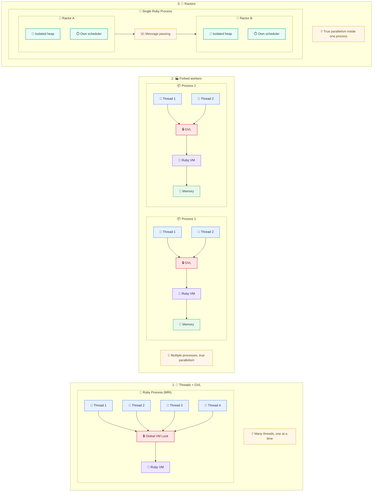
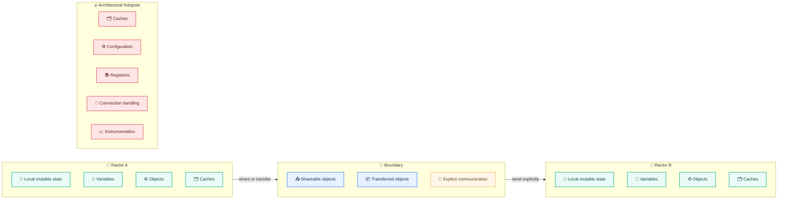
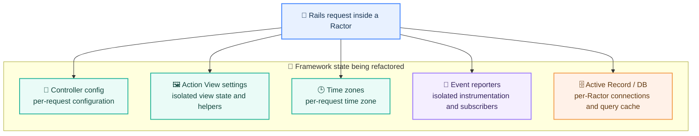
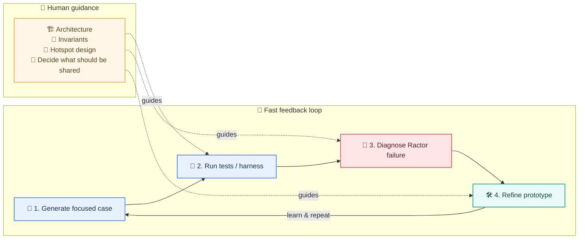

Rails has spent years getting remarkably far with a model built around **threads, the GVL, and multiple worker processes**. It is familiar, dependable, and well understood. But it comes with a trade-off: when we want Ruby code to execute in parallel across CPU cores, we usually obtain that parallelism by running more processes — and each process carries its own copy of the application.

Ractors reopen that design space.

A Ractor — Ruby’s actor-like isolation primitive — can execute Ruby in parallel with other Ractors. The interesting question for Rails is therefore not simply *“Can Rails use Ractors?”* It is:

> **What would Rails architecture look like if parallel Ruby execution no longer required duplicating the entire application process?**

That question is becoming concrete. Shopify’s Ruby and Rails Infrastructure team has been working on Ractor scalability and Rails compatibility; Rails itself has recently merged changes that make framework state shareable or per-Ractor; and Rails World 2026 includes a session on using AI agents to accelerate the path toward Ractor-safety.

This article is a map of that transition: where Rails is today, what Ractors change, what the Writebook experiment actually showed, where the hard engineering work remains, and how to inspect your own application through the lens of Ractor-safety.

## 1. Rails already has concurrency — but not this kind of parallelism

A typical Rails deployment often combines two mechanisms:

- **Threads**, commonly through Puma, allow many requests to be in flight concurrently.
- **Multiple worker processes** allow Ruby execution to happen in parallel across cores.

The distinction matters because CRuby’s Global VM Lock (GVL) means that, inside one Ractor, only one thread executes Ruby code at a time. Threads are still extremely useful — especially when requests spend time waiting on databases, network calls, or other I/O — but CPU-bound Ruby work does not suddenly become multi-core just because several threads exist.

Forked workers solve that. Each process owns its own Ruby VM and its own GVL, so several workers can execute Ruby simultaneously.

The cost is memory.

### Mermaid source: execution models

Rails servers reduce some duplication with copy-on-write: preload the application, fork workers, and let the operating system share unchanged pages. But as workers allocate objects, populate caches, and run garbage collection, their memory diverges.

Ractors offer a different model: **parallel Ruby execution inside a single process**.

That sounds attractive. But it is only possible because Ractors impose a much stronger rule about state.

## 2. The real subject is state ownership

Ractors isolate mutable state. Objects crossing the boundary must either be shareable or transferred according to Ractor rules.

For an ordinary Ruby script, this is already a meaningful constraint. For Rails, it is an architectural challenge because framework and application code have historically made extensive use of configuration objects, registries, caches, class-level state, memoization, connection management, and other structures that assume a shared process-wide world.

### Mermaid source: Ractor isolation boundary

That is why the move toward Ractor-ready Rails is much more interesting than a new concurrency API. It forces us to answer questions that are healthy even before we adopt Ractors:

- Who owns this state?
- Does it need to be mutable?
- Does every request really need to see the same instance?
- Could the value be immutable and shared?
- Should it instead be local to an execution context?
- What happens when a gem quietly assumes process-global state?

Seen this way, **Ractor-safety is architecture made visible**.

## 3. A real Rails experiment: Writebook

The most useful evidence so far is not a synthetic microbenchmark. Shopify’s Rails at Scale team used **Basecamp’s Writebook**, a real Rails application, and served selected endpoints through a Ractor-compatible server.

The experiment deliberately exercised three levels of work: a trivial health endpoint, the application home page with ERB and database queries, and a heavier first-run path involving multiple queries, Markdown rendering, image work, and sanitization.

The results are compelling — with an important caveat.

For memory, the experiment reported that a pool of **8 Ractors used nearly seven times less proportional-set-size memory than 8 forked Puma workers** under the tested setup.

Latency was more nuanced.

The lightweight endpoint was almost unchanged. The home page showed only a small difference. The heavier endpoint suffered more because some operations still had to be dispatched back to the main Ractor through an escape hatch for incompatible native extensions or other non-Ractor-safe behavior.

That is exactly the trade-off we should expect during a transition: Ractors can remove process duplication, but incompatibility can reappear as coordination overhead.

So the conclusion is not “Ractors are seven times better.” It is:

> **The memory opportunity appears real, but the benefit depends on how much of the request path can remain natively Ractor-safe.**

## 4. The triangle: parallelism, memory, isolation

A useful way to reason about Ractors is as a three-way trade-off.

**Parallelism:** CPU-bound Ruby can execute across cores without requiring one Ruby process per unit of parallel work.

**Memory:** a Ractor pool can potentially avoid much of the application duplication inherent in process-based scaling.

**Isolation:** mutable shared state is restricted. That improves architectural boundaries, but it also exposes assumptions that have accumulated throughout Rails, gems, and application code.

The interesting engineering question is therefore workload-specific. A CPU-heavy application with many large worker processes may see a very different value proposition from an application dominated by database latency and inexpensive processes.

Ractors are not a universal replacement for threads or processes. They add another execution model.

## 5. Rails itself is changing

This is not only theoretical framework discussion. Recent Rails work has made several pieces of state compatible with Ractor sharing or per-Ractor storage.

In the September 5, 2026 *This Week in Rails* update, changes included making controller configuration, Action View settings, Active Record commit callbacks, and time-zone configuration shareable across Ractors. Event reporters were changed to use per-Ractor storage on non-main Ractors, and additional Active Record initialization work addressed a deadlock.

### Mermaid source: Rails hotspots for Ractor-safety

The first milestone described by the Rails at Scale team is intentionally modest but important: generate a new Rails application, scaffold a resource, and serve its requests inside a Ractor.

That small scenario touches routing, request/response handling, views, translations, database access, assets, and Active Support. Making that path work creates a foundation; it does not mean that every Rails subsystem is Ractor-ready.

Work still remains across development-mode loading and major components such as Active Job, Active Storage, and Action Cable.

That distinction matters:

**Ractors may be production-viable in modern Ruby, while full Rails Ractor-safety remains an active engineering effort.**

## 6. Why AI fits this problem unusually well

Rails World 2026 includes a Shopify session titled *Ractors, Rails, and Robots: Automating the Path to Ractor-safety*. The premise is interesting because Ractor-safety creates exactly the kind of engineering search space where AI agents can be useful.

A compatibility failure can often be reproduced through a tight harness:

1. generate or isolate a focused Rails scenario;
2. run it inside a Ractor;
3. capture the failure;
4. propose a fix;
5. run the tests again;
6. keep the useful prototype or discard it.

### Mermaid source: AI-assisted Ractor-safety loop

That loop lets an agent explore many mechanical fixes quickly. But the architecture still needs humans.

An agent can discover that a global registry is not shareable. It cannot, by testing alone, decide the best long-term ownership model for that registry. Should it become immutable? Per-Ractor? Lazily reconstructed? Replaced by message passing? Removed altogether?

This is where AI-assisted engineering becomes more interesting than code generation: the agent explores; the engineer defines the invariants.

## 7. Is your Rails application Ractor-ready?

Most applications are not going to migrate tomorrow. That does not make the question useless.

Ractor-readiness is a powerful diagnostic lens because it reveals where the application depends on invisible shared state.

A five-minute inspection can start with seven questions:

1. Where do we keep mutable global or class-level state?
2. Which caches, registries, configuration objects, or memoized values live for the entire process?
3. Which native extensions and critical gems are Ractor-safe?
4. Who owns database connections?
5. Which code assumes there is only one global execution context?
6. Which objects could become immutable and shareable?
7. If we benchmark an alternative model, are we measuring **memory and latency together**?

You do not need to adopt Ractors to benefit from the answers.

In many Rails systems, this exercise will expose exactly the same hotspots that make testing difficult, cause concurrency bugs, complicate reloadability, or make large applications hard to modularize.

## 8. What could change if the model works?

The most exciting possibility is not that Rails suddenly becomes “faster.”

It is that Rails gains another scaling option.

Today, an application may scale a node by combining threads with several worker processes. In a future Ractor-capable configuration, some workloads might instead run a pool of isolated Ractors in one process, achieving real multi-core Ruby execution while reducing duplicated application memory.

That could be especially meaningful for:

- memory-heavy Rails applications;
- CPU-heavy request paths;
- environments where process count is expensive;
- large hosts with many cores;
- applications that already maintain disciplined state boundaries.

But it will not eliminate existing models. Threads remain excellent for concurrency. Processes provide strong isolation and operational familiarity. Background jobs remain appropriate for work that should not execute in the request lifecycle.

The Rails future is more likely to gain an additional tool than to discard the tools we already have.

## Conclusion: from concurrency to ownership

Ractors initially look like a performance feature.

For Rails, they are more profound than that.

They force the framework and application code to state explicitly what has often remained implicit: **who owns mutable state, what is safe to share, and where execution boundaries really exist.**

That is why the current Rails work matters even before most teams run a production Ractor pool. It is pushing Rails toward clearer state boundaries while exploring a route to multi-core Ruby execution with a very different memory profile.

The immediate takeaway is not “rewrite your deployment around Ractors.”

It is simpler:

> **Start seeing your Rails application through the lens of state ownership.**

If the Ractor age arrives for Rails, that mental model will prepare you for it.

And even if your application never uses a Ractor, it is likely to make the architecture easier to understand.

---

## Sources

- Edouard Chin, **“Bringing Rails into the Ractor-age”**, Rails at Scale, August 11, 2026:  
  https://railsatscale.com/2026-08-11-ractors-on-rails/
- Rails World 2026, **“Ractors, Rails, and Robots: Automating the Path to Ractor-safety”**, Andrew Novoselac:  
  https://rubyonrails.org/world/2026/sessions/ractors-rails-robots
- **“Towards Ractor-ready Rails, ordered cache fetches, and more!”**, This Week in Rails, September 5, 2026:  
  https://world.hey.com/this.week.in.rails/towards-ractor-ready-rails-ordered-cache-fetches-and-more-bea9ebcb
- Ruby Ractor documentation:  
  https://docs.ruby-lang.org/en/master/Ractor.html
