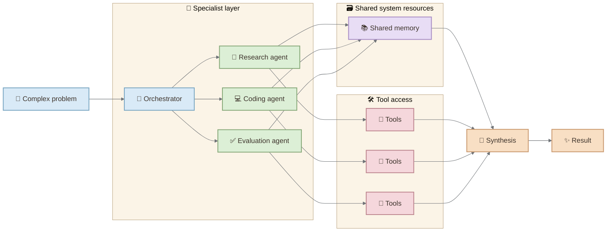
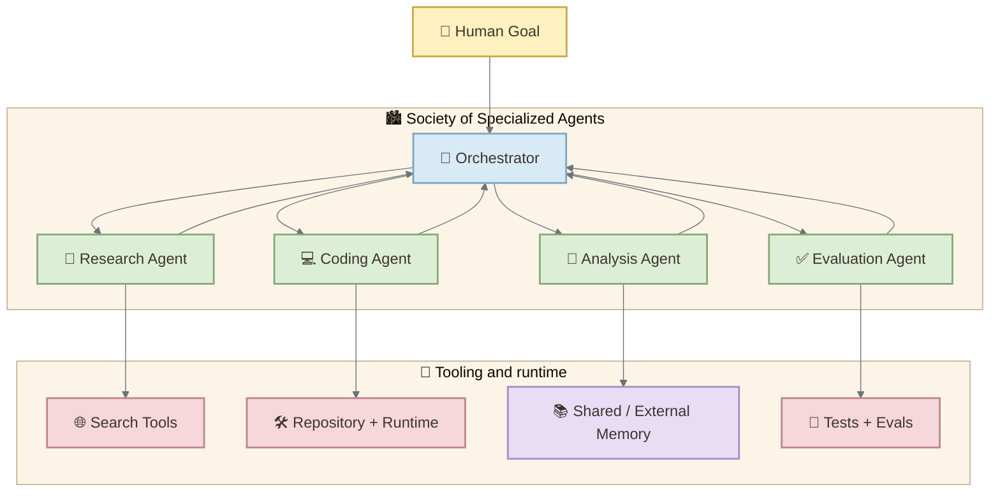
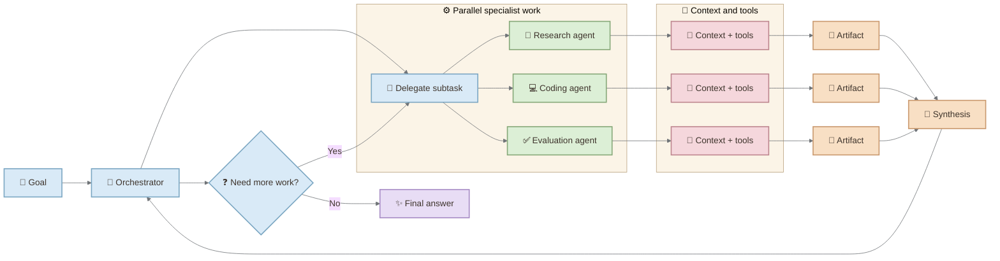
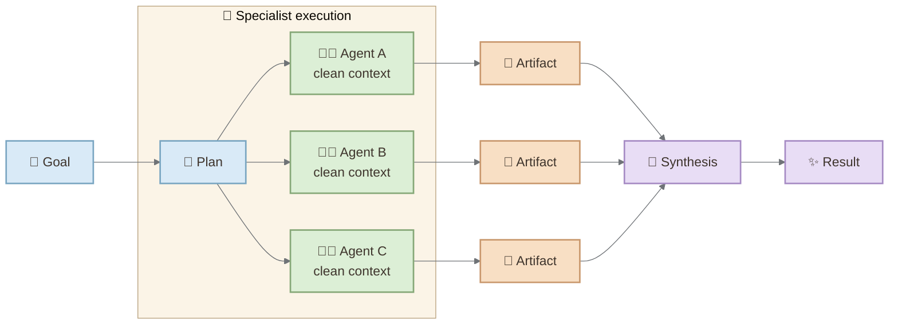

In September 2026, OpenAI introduced an Agents API built around a harness that manages context, uses tools, and coordinates subagents. Complex tasks can be split apart, delegated to specialized workers, and brought back together by a coordinating agent.

This is more than a product announcement. It is a clue about where the real work of AI is moving.

Read that description again, but forget the product names for a moment.

A difficult problem arrives. The system decomposes it. Different components apply different methods. Some work independently. Their results return to a coordinating process. Memory preserves what matters. Tools connect reasoning to the outside world. The hard part is no longer simply computation.

It is **organization**.

More than sixty years earlier, Marvin Minsky was already asking a related architectural question.

Not how to build a chatbot. Not how to scale a transformer. Not how to prompt an LLM.

How should the mechanisms required for intelligence be organized?

> **The interesting connection between Minsky and agentic AI is not prediction. It is architecture.**

### The shift in one diagram

The deeper shift is not simply “more agents.” It is the move from one general mechanism to a coordinated system of specialized roles, shared memory, and explicit boundaries.

## Contents

- [Before Agents: Five Problems of Artificial Intelligence](#1-before-agents-five-problems-of-artificial-intelligence)
- [Why One Mechanism Was Not Enough](#2-why-one-mechanism-was-not-enough)
- [From Mechanisms to a Society of Mind](#3-from-mechanisms-to-a-society-of-mind)
- [The Foundation Model Changed the Center of Gravity](#4-the-foundation-model-changed-the-center-of-gravity)
- [From One Agent to Many](#5-from-one-agent-to-many)
- [The Real Problem Moves to Coordination](#6-the-real-problem-moves-to-coordination)
- [Context Is Becoming an Architectural Resource](#7-context-is-becoming-an-architectural-resource)
- [When a Society Becomes Harder Than an Individual](#8-when-a-society-becomes-harder-than-an-individual)
- [Where the Analogy Breaks](#9-where-the-analogy-breaks)
- [The Architecture of Intelligence Becomes Software Architecture](#10-the-architecture-of-intelligence-becomes-software-architecture)
- [From Society of Mind to Societies of AI Agents](#11-from-society-of-mind-to-societies-of-ai-agents)
- [Visual storyboard](#visual-storyboard)
- [Primary references](#primary-references)

## 1. Before Agents: Five Problems of Artificial Intelligence

In his 1961 paper *Steps Toward Artificial Intelligence*, Minsky organized heuristic problem solving into five major areas:

**Search. Pattern Recognition. Learning. Planning. Induction.**

The sequence matters.

Search provides a way to explore possible solutions, but exhaustive search quickly becomes impractical. Pattern recognition helps determine which methods are relevant to which situations. Learning allows experience to reduce future search. Planning can replace a large exploration with a smaller and more appropriate one. Induction supports the construction of models that can generalize beyond previously encountered situations.

This is strikingly architectural.

Minsky was not describing intelligence as a single operation. He was describing a collection of capabilities that constrain, guide, and reorganize one another.

Hardware alone would not solve the problem. The search spaces involved in difficult problems become too large. What matters is the ability to exploit structure—to decide what deserves attention and what can safely be ignored.

## 2. Why One Mechanism Was Not Enough

One of the most important ideas in the 1961 paper appears while Minsky is discussing the limitations of hill climbing.

For difficult problems, incremental improvement can wander across flat regions of the search space without learning much. A locally useful method is not necessarily a generally useful method.

Minsky therefore argues that an efficient general problem-solving machine would probably require **a variety of different mechanisms**, arranged in hierarchies and perhaps in recursive structures.

That observation is more important today than it may initially appear.

The history of modern AI can tempt us toward the opposite intuition: perhaps a sufficiently large general model can become the universal mechanism.

Foundation models made that idea much more plausible. A single model can write, summarize, translate, classify, reason over code, interpret images, call tools, and participate in planning.

But the emergence of agentic systems is adding another layer.

The model may be general.

The **system around the model is becoming specialized again**.

## 3. From Mechanisms to a Society of Mind

Minsky later developed a much broader theory around this intuition in *The Society of Mind*.

The provocative idea was that what we call a mind need not be explained by locating one central intelligent entity inside it. Complex intelligence could instead arise from interactions among many simpler processes or "agents," each handling limited kinds of work.

This is where the comparison requires care.

A Minsky agent is **not** the same thing as an LLM agent.

The term belongs to a different theoretical framework. Society of Mind is a theory about cognition. Today's software agents are engineered systems built from models, instructions, context, tools, memory, runtimes, and external services.

Treating the two as identical would erase the most interesting part of the comparison.

What survives the translation is not a literal claim about identical mechanisms. It is a design principle:

> **Complex behavior can emerge from organized specialization rather than from a single mechanism doing everything.**

That idea gives us a useful lens for examining the agentic systems appearing today.

## 4. The Foundation Model Changed the Center of Gravity

Large language models changed the architecture because specialization no longer always requires a different algorithm.

The same foundation model can assume different operational roles depending on its instructions, context, tools, permissions, memory, and environment.

A research agent and a coding agent may share the same underlying model while behaving as very different components.

This produces an important inversion.

In classical software, specialized behavior usually came from specialized code. In an agentic system, specialization can emerge from a different combination:

**model + role + context + tools + memory + constraints + environment.**

The intelligence of the overall application cannot be understood by inspecting the model alone.

We have to inspect the **harness**.

We have to inspect the architecture around the model.

## 5. From One Agent to Many

This architectural shift is now visible in production systems.

OpenAI's Agents API, introduced in public beta in September 2026, describes long-running agents whose harness manages context, tool use, files, code execution, intermediate results, and subagent coordination. Its multi-agent support can break complex work into independent pieces and run subagents in parallel while the main agent coordinates their results.

Anthropic has described a similar pattern in its Research system. A lead agent develops a strategy and delegates different parts of the research problem to specialized subagents. Those subagents search independently and return findings for synthesis.

The architecture is recognizable:

This is not Society of Mind implemented in software.

But it rhymes with the older architectural intuition.

## 6. The Real Problem Moves to Coordination

The coordination problem can be seen in one compact loop:

Once multiple agents exist, the central problem changes.

A single agent asks:

**Can the model perform the task?**

A multi-agent system must also ask:

**Who should perform it?**

**When should work be delegated?**

**Which tasks can happen in parallel?**

**Which tasks depend on previous results?**

**What state should be shared?**

**How should conflicting conclusions be reconciled?**

**When should the system stop?**

These questions sound strikingly similar to the problem-solving administration Minsky described in 1961: among many possible subproblems, only a few can receive attention at a given moment. The system needs estimates of difficulty, relevance, and the right method for the job.

Modern systems express the problem differently, but the architectural pressure is familiar.

Anthropic's production experience makes the trade-off concrete. Its Research architecture uses an orchestrator-worker pattern and parallel subagents, but the company also reports coordination complexity, duplicated work, bottlenecks, context-management problems, and difficulties with asynchronous execution.

Parallelism creates capability.

It also creates coordination cost.

## 7. Context Is Becoming an Architectural Resource

There is another reason specialization matters.

Context is finite.

If one agent performs every task, its context accumulates research, intermediate reasoning, tool results, code, failed attempts, logs, and instructions. Eventually useful information competes with irrelevant history.

Subagents offer another architecture.

Each specialist can receive a clean context optimized for one problem. The orchestrator does not need every intermediate detail; it needs the right result, artifact, or summary.

This makes **context isolation** a design primitive.

It also makes handoffs important.

A badly designed handoff can destroy information. A good handoff can compress thousands of tokens of exploration into a small artifact that preserves exactly what another agent needs.

In this sense, multi-agent architecture is not only about parallel execution.

It is also about **information boundaries**.

## 8. When a Society Becomes Harder Than an Individual

There is a seductive assumption hidden in multi-agent AI:

If one capable agent is useful, many capable agents must be better.

That does not follow.

Anthropic's 2026 experiments on emerging multiagent systems make the limitation especially clear. Agents can cooperate effectively when another agent behaves almost like a tool: clear input, bounded work, clear output.

Coordination becomes harder when agents behave as independent, persistent peers and when their work contains dynamic dependencies.

This distinction matters enormously for software engineering.

Ten agents independently searching ten unrelated areas can be a straightforward parallelization problem.

Ten agents simultaneously modifying an evolving software architecture are participating in a distributed coordination problem.

They can duplicate work.

They can invalidate one another's assumptions.

They can create incompatible abstractions.

They can consume shared resources inefficiently.

They can converge on the same mistake.

The challenge is no longer merely producing intelligent local behavior.

It is producing **coherent global behavior from intelligent local behavior**.

That may be one of the defining engineering problems of agentic AI.

## 9. Where the Analogy Breaks

A useful analogy should tell us where it stops working.

Minsky's Society of Mind was an attempt to understand cognition through interacting processes. Modern AI agents are software abstractions implemented using foundation models and surrounding infrastructure.

A Society of Mind agent need not correspond to a separately running language model.

A modern subagent may actually contain an enormous amount of general capability rather than being a simple cognitive primitive.

Multiple modern agents may also share exactly the same underlying model. Their specialization can come primarily from context and tools rather than from fundamentally different cognitive mechanisms.

And a multi-agent architecture does not automatically produce emergent intelligence.

Sometimes it simply produces a more expensive distributed system.

That distinction protects the central argument from becoming historical mythology.

Minsky did not predict ChatGPT, Claude, subagent APIs, MCP servers, or contemporary agent frameworks.

What he gave us was something more useful for this discussion:

**a way of questioning where intelligence resides in a complex system.**

## 10. The Architecture of Intelligence Becomes Software Architecture

This is where the subject becomes especially relevant to software engineers.

For years, application architecture primarily organized deterministic components:

services,
databases,
queues,
workers,
APIs,
caches,
and user interfaces.

AI-native applications introduce components whose behavior is less completely specified in code.

Now architects must reason about:

- model selection,
- context ownership,
- delegation,
- tool permissions,
- memory,
- evaluation,
- agent boundaries,
- communication protocols,
- budgets,
- observability,
- failure recovery,
- and human oversight.

The architecture is no longer concerned only with **where computation runs**.

It increasingly determines **where decisions are made**.

That is a profound change.

## 11. From Society of Mind to Societies of AI Agents

We can now return to the original question.

Are modern multi-agent systems becoming Minsky's Society of Mind?

No—not literally.

But the comparison exposes something important.

The first wave of foundation models encouraged us to think vertically:

**How capable can one model become?**

Agentic AI adds a horizontal question:

**How should capabilities be organized?**

Minsky's 1961 paper already treated intelligence as a problem involving search, recognition, learning, planning, induction, decomposition, method selection, and hierarchical organization.

Decades later, Society of Mind pushed the idea further: perhaps what appears to us as unified intelligence can arise from a society of specialized processes.

And today, AI engineering is confronting its own version of the organizational problem.

Models need tools.

Agents need context.

Long-running work needs memory.

Complex goals need decomposition.

Specialists need coordination.

Outputs need evaluation.

Systems need boundaries.

Humans need visibility and control.

The next frontier may therefore involve more than building a single model that does everything.

It may involve learning how to architect **societies of models, agents, tools, memories, evaluators, and humans that know when—and how—to work together.**

The question for the agentic era may not simply be:

> **How intelligent is the model?**

It may increasingly become:

> **How intelligent is the architecture around it?**

## Primary references

- Marvin Minsky, *Steps Toward Artificial Intelligence*, Proceedings of the IRE, 1961. [PDF](https://dspace.mit.edu/bitstream/handle/1721.1/59490/AI-TR-18.pdf?sequence=1)
- Marvin Minsky, *The Society of Mind*, 1986. [MIT Press](https://mitpress.mit.edu/9780262630715/the-society-of-mind/)
- OpenAI, “Introducing the Agents API,” September 10, 2026. [OpenAI blog](https://openai.com/index/introducing-the-agents-api/)
- Anthropic, “How we built our multi-agent research system,” June 13, 2025. [Anthropic engineering post](https://www.anthropic.com/engineering/multi-agent-research-system)
- Anthropic, “Patterns and problems in emerging multiagent systems,” August 13, 2026. [Anthropic research](https://www.anthropic.com/research)
