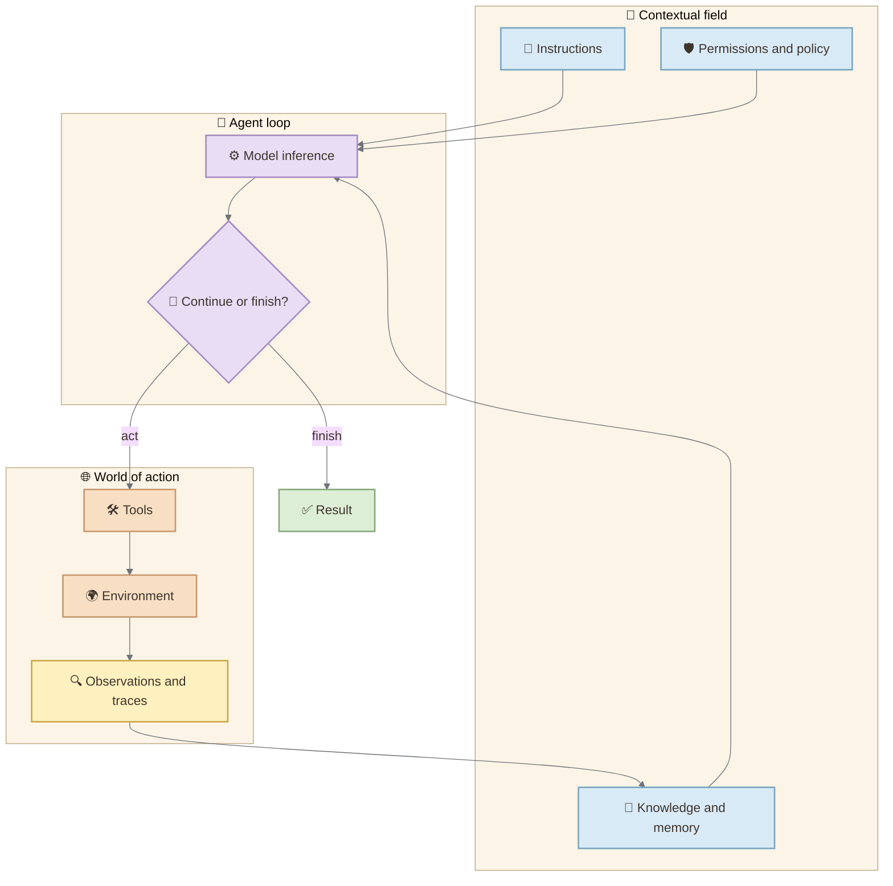
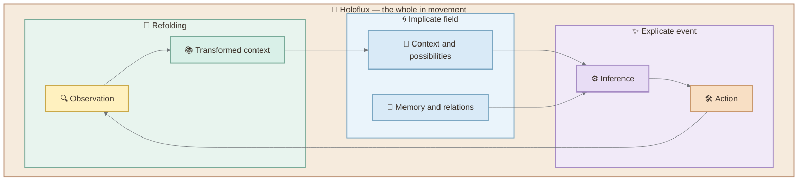

> “HoloFlux — Is Intelligence, and its language — is Silence.”  
> — [HoloFlux](https://holoflux.wordpress.com/)

> What if AI intelligence resides not in the model, but in the movement of the whole system? A Bohm-inspired look at agents, harnesses, and holoflux.

This older motto provides the interpretive thread for the journey ahead. It is not presented as a formal scientific definition from Bohm. Instead, it points toward the central inquiry: if the whole is fundamentally movement, might intelligence be recognized less as something a component possesses and more as the quality of a movement that perceives, acts, learns, and renews itself without losing relationship with the whole?

When an AI agent completes a complex task, where did the intelligence reside?

The tempting answer is: **inside the model**. The model interpreted the request, selected tools, wrote code, revised its work, and produced the result. The surrounding software can look like plumbing around the real intelligence.

But replace the tools with ambiguous ones. Remove the repository map. Hide the test results. Corrupt the memory. Change the permissions. Prevent the system from observing what its actions did. The same model now behaves like a different agent.

This suggests a more useful answer: an agent's observable intelligence does not belong to the model alone. It appears through the movement that continually relates model, instructions, context, tools, memory, environment, evaluation, and human participation.

David Bohm's *Wholeness and the Implicate Order* offers a powerful lens for examining this shift. Its decisive concept is not only wholeness, but **wholeness in flowing movement**: the holomovement, or holoflux. The connection developed here is an **architectural analogy**, not a claim that agent systems implement quantum physics or that Bohm anticipated large language models. Its value is more disciplined: Bohm helps us notice when an abstraction has been mistaken for an independently existing whole, and when intelligence is better understood as a living movement of relations than as a property stored inside one fragment.

## Contents

- [The Fragment We Mistake for the Whole](#the-fragment-we-mistake-for-the-whole)
- [Bohm's Challenge to Fragmentation](#bohms-challenge-to-fragmentation)
- [The Harness as an Operational Whole](#the-harness-as-an-operational-whole)
- [Enfolding and Unfolding in the Agent Loop](#enfolding-and-unfolding-in-the-agent-loop)
- [Where the Analogy Must Stop](#where-the-analogy-must-stop)
- [Designing Agents Without Fragmentation](#designing-agents-without-fragmentation)
- [References](#references)

## The Fragment We Mistake for the Whole

The model is the most visible component of an agent system. It produces language, selects actions, and appears to reason. Model names also dominate product descriptions and benchmarks. Visibility makes it easy to commit a conceptual error: identifying the component that speaks with the whole system that acts.

[OpenAI's description of the Codex agent loop](https://openai.com/index/unrolling-the-codex-agent-loop/) draws a clearer boundary. The harness prepares the model's input, performs requested tool calls, adds observations to the evolving context, and repeats the cycle until the model returns a final response. The model proposes; the surrounding system makes proposal, execution, observation, and continuation possible.

Anthropic makes the distinction explicit in its discussion of [agent evaluations](https://www.anthropic.com/engineering/demystifying-evals-for-ai-agents): an agent harness processes inputs, orchestrates tool calls, and returns results. Evaluating an agent therefore means evaluating the model and harness together.

Before continuing, make a prediction. If two systems use the same model but expose different tools, memories, permissions, and feedback, should we regard them as the same agent?

Operationally, no. Model identity is only one constraint within a larger organization.

<figure>
  
  <figcaption>Fragmentation isolates functions; holomovement reveals them as temporary forms within one transforming flow.</figcaption>
</figure>

## Bohm's Challenge to Fragmentation

In [*Wholeness and the Implicate Order*](https://www.routledge.com/Wholeness-and-the-Implicate-Order/Bohm/p/book/9780415289795), Bohm challenges the habit of treating reality as a collection of independently existing parts. Fragmentation is not merely division. Divisions can be useful. A map needs boundaries, and software needs modules. The problem begins when a useful distinction is treated as the fundamental nature of what it describes.

Bohm's alternative begins with **undivided wholeness**. What appears as a stable thing can instead be understood as a relatively persistent pattern within a deeper movement. His term **holomovement**, also rendered as **holoflux**, names the unbroken totality in flowing movement. The whole is not a static container assembled from finished pieces; it is the generative movement within which distinguishable forms arise, persist for a time, and fold back into new relations.

The **implicate order** names what is enfolded: relationships and possibilities that are not all displayed as separate objects. The **explicate order** names what becomes unfolded into relatively distinct and observable form. Neither should be imagined as a hidden storage layer feeding a visible user interface. They are ways of describing how apparent forms arise from, and remain related within, a more encompassing process.

This distinction matters for the word **intelligence**. Bohm's holomovement should not simply be renamed "intelligence" as though the terms were technical synonyms. Yet his wider critique allows a stronger interpretation: intelligence is disclosed when perception and action are not trapped inside a fragment, but remain responsive to the movement of the whole. Applied to AI architecture, the claim becomes: **agent intelligence is not a substance inside the model; it is a capacity expressed by the organized movement of the whole system.**

This vocabulary changes the question we ask about agents. Instead of asking only, "Which component contains the intelligence?" we can ask:

> What movement of the whole allows intelligent behavior to unfold here?

That question does not make AI Bohmian physics. It simply resists premature fragmentation.

## The Harness as an Operational Whole

A contemporary agent is better understood as an **operational whole**: a set of coupled capabilities whose behavior depends on their relations.

The model supplies learned capabilities for interpreting and generating representations. The context supplies the locally available world. Tools define possible interventions. The environment gives actions consequences. Memory and artifacts carry selected state across turns or sessions. Guardrails and permissions constrain what may occur. Evaluations determine what the organization counts as success. Human beings initiate, supervise, redirect, and accept responsibility for the process.

None of these components is sufficient in isolation. More importantly, their meaning changes through their relationships. A shell tool without permission to execute is not the same tool operationally. A test suite that the agent cannot run is not feedback. A document that exists but cannot be retrieved is not context. A trace that nobody can inspect is not yet observability.

This is why current engineering practice increasingly focuses on harness design rather than prompting alone. [OpenAI's account of harness engineering](https://openai.com/index/harness-engineering/) emphasizes making repositories, interfaces, logs, metrics, and review feedback legible to agents. [Anthropic's context-engineering guidance](https://www.anthropic.com/engineering/effective-context-engineering-for-ai-agents) similarly treats context as an evolving and finite resource composed of instructions, tools, external data, and interaction history.

The architecture can be summarized as three coupled layers:

The diagram still separates components because engineering requires distinctions. The important move is to treat those distinctions as functional views within one recurrent process, not as proof that one box independently owns the behavior.

## Enfolding and Unfolding in the Agent Loop

The agent loop offers the strongest point of contact with Bohm's process-oriented language. The earlier version of this argument could still leave the impression that the harness is a large container surrounding smaller parts. Holomovement corrects that picture: **the whole is the movement itself**.

At the beginning of a turn, many possible actions are **enfolded** within the system's current condition: model capabilities, instructions, retrieved knowledge, tool definitions, state, permissions, and the user's goal. These possibilities do not yet exist as one committed action.

Inference selects and expresses a next move. A tool call, code edit, search, or final answer becomes **explicate**: a concrete event in the environment. The environment then answers back. A command succeeds or fails. A file changes. A test produces evidence. A user approves or rejects an operation.

That observation is not merely appended to a log. It is folded into the next effective context. The next inference therefore arises from a transformed whole. The loop is not simple repetition; each cycle changes the conditions from which the next action emerges.

In this analogy, the **holoflux of the agent system** is the continuous transformation across these moments. Context is not intelligence by itself. Inference is not intelligence by itself. Action and observation are not intelligence by themselves. What we recognize as intelligent agency appears in their coherent circulation, correction, and renewal.

<figure>
  
  <figcaption>The agent is not carried by the flow as a separate object; it appears as a temporary pattern of the whole in movement.</figcaption>
</figure>

This interpretation also explains why context management is architectural rather than clerical. Every observation competes for limited attention. Too little retained state destroys continuity; too much uncurated state introduces noise and confusion. Compaction, retrieval, structured artifacts, and session handoffs are ways of shaping what remains causally available to the next turn.

For long-running work, the whole can even persist while an individual model session ends. Anthropic's work on [long-running harness design](https://www.anthropic.com/engineering/harness-design-long-running-apps) uses structured artifacts and fresh contexts to transfer state between agents or sessions. Identity, in this operational sense, belongs less to one uninterrupted stream of tokens than to the organized continuity of goals, artifacts, constraints, and evaluation.

## Where the Analogy Must Stop

An analogy becomes useful when it clarifies structure and dangerous when it erases differences.

First, Bohm's implicate order is part of a philosophical and physical account of reality. An agent's context window, memory store, or latent representation is an engineered mechanism. Calling context "implicate" does not make it ontologically equivalent to Bohm's proposal.

Second, an agent loop is explicitly implemented in software. Its repetition does not demonstrate the holomovement, quantum nonlocality, or any other physical theory.

Third, system-level organization does not by itself establish consciousness. The claim here concerns observable capability and architecture, not subjective experience.

Finally, wholeness is not an excuse for vagueness. Engineers still need component boundaries, contracts, isolation, permissions, and tests. Bohm's critique does not forbid analysis. It warns us not to forget that analysis creates abstractions from a process whose behavior depends on relations.

The responsible formulation is therefore precise rather than reductive:

> Bohm's holomovement helps us see why a model-centric description of AI agency is incomplete. Agent engineering supplies the technical mechanisms; Bohm supplies a language for understanding intelligence as an expression of the whole in movement.

## Designing Agents Without Fragmentation

Once intelligence is treated as an expression of the operational whole in movement, several engineering consequences follow.

### Evaluate the model and harness together

A model benchmark cannot predict the behavior of every system built around that model. Agent evaluations should include tool use, environment state, permissions, termination behavior, recovery, traces, and actual outcomes. The transcript matters, but the changed world matters more.

### Design context as a living boundary

Context is not a warehouse filled until the window is full. It is a curated boundary around what may influence the next inference. Good context engineering selects the minimal sufficient instructions, evidence, tools, and history while preserving critical state outside the immediate window.

### Make consequences observable

Agents improve when they can inspect the effects of their actions. Tests, screenshots, logs, metrics, traces, and structured error messages turn the environment into feedback. An action without legible consequence breaks the loop.

### Treat tools as epistemic interfaces

A tool does more than perform an operation. Its name, schema, output, errors, and permissions shape what the model can know and do. Ambiguous tools create ambiguous agency.

### Preserve continuity through artifacts

Plans, task lists, decision logs, source maps, and progress files allow the larger process to survive context resets and handoffs. The continuing unit of work is the organized project state, not necessarily one persistent conversational subject.

### Keep humans inside the architecture

Human approval is not an external interruption to an otherwise complete agent. Goals, acceptable risk, authority, interpretation, and responsibility are part of the system's operational conditions. Removing the human from the diagram can be another form of fragmentation.

Return now to the opening question: **Where does the intelligence reside?**

Not in one box. Not equally everywhere. And not in a mysterious substance flowing between components. It appears in the organized holoflux through which capabilities, context, tools, environment, evaluation, and human purpose constrain and transform one another.

The model matters enormously. But the agent is not the model, and the model is not the whole.

The practical transfer question is simple: when your next agent fails, will you ask only how to improve the prompt or model—or will you inspect the whole that made that behavior possible?

## References

- Bohm, David. [*Wholeness and the Implicate Order*](https://www.routledge.com/Wholeness-and-the-Implicate-Order/Bohm/p/book/9780415289795). Routledge, 1980.
- OpenAI. ["Unrolling the Codex agent loop."](https://openai.com/index/unrolling-the-codex-agent-loop/) January 23, 2026.
- OpenAI. ["Harness engineering: leveraging Codex in an agent-first world."](https://openai.com/index/harness-engineering/) February 11, 2026.
- Anthropic. ["Effective context engineering for AI agents."](https://www.anthropic.com/engineering/effective-context-engineering-for-ai-agents) September 29, 2025.
- Anthropic. ["Harness design for long-running application development."](https://www.anthropic.com/engineering/harness-design-long-running-apps) March 24, 2026.
- Anthropic. ["Demystifying evals for AI agents."](https://www.anthropic.com/engineering/demystifying-evals-for-ai-agents) January 9, 2026.
- HoloFlux. ["HoloFlux — Is Intelligence, and its language — is Silence."](https://holoflux.wordpress.com/) Visual and interpretive inspiration; not treated as a scientific source on Bohm.

*Sources and time-sensitive technical claims checked on September 21, 2026.*

