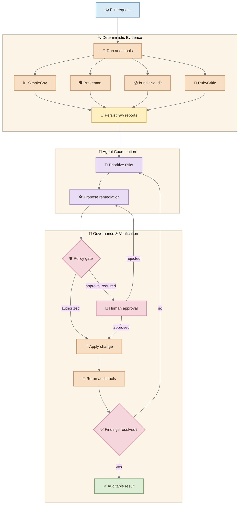
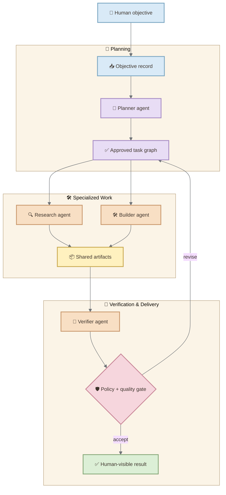
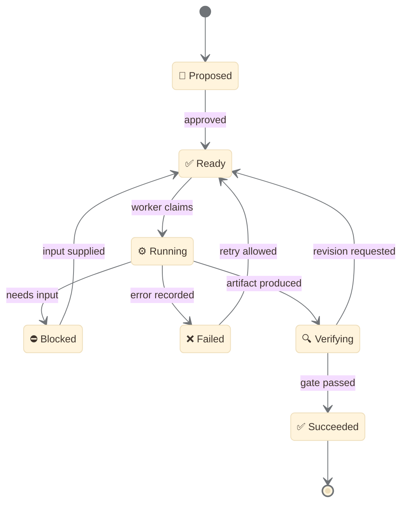

> What if the most important operating system for an AI-agent society is not a new agent framework, but the application architecture we already know how to operate?

The current wave of agentic AI often begins with a seductive move: create another agent. One agent plans, another researches, another writes, another reviews, and a supervisor decides what happens next. The cast grows quickly. The architecture often does not.

This creates a paradox. We add agents to distribute intelligence, yet every new agent introduces another boundary across which intent, context, authority, state, failure, and evidence must travel. The system acquires more cognitive capacity while becoming harder to coordinate.

The next scaling problem may therefore be less about model intelligence and more about **organized action**.

This essay develops a concrete hypothesis: a **modular Rails monolith** can act as the operating system for a society of AI agents. Not because Rails makes models smarter, and not because every agent should execute inside one Ruby process. Rails is interesting because it already provides many institutional capabilities an agent society lacks: durable records, transactions, jobs, authorization, interfaces, instrumentation, tests, deployment conventions, and visible human accountability.

The proposal is narrower than “Rails is the best agent framework.” It is an architectural experiment: when several agents collaborate on consequential work, can Rails provide a coherent operational whole without forcing premature distribution?

## Contents

- [The Lonely Generalist](#the-lonely-generalist)
- [Why More Agents Can Produce Less Intelligence](#why-more-agents-can-produce-less-intelligence)
- [The Coordination Scaling Law](#the-coordination-scaling-law)
- [Rails as an Agent Operating System](#rails-as-an-agent-operating-system)
- [Anatomy of the Agentic Monolith](#anatomy-of-the-agentic-monolith)
- [A Concrete Example: An Auditable Rails Maintenance Run](#a-concrete-example-an-auditable-rails-maintenance-run)
- [One Workflow, Many Specialized Agents](#one-workflow-many-specialized-agents)
- [Concurrency Without Architectural Fragmentation](#concurrency-without-architectural-fragmentation)
- [How the System Learns](#how-the-system-learns)
- [The Experiment That Could Falsify the Idea](#the-experiment-that-could-falsify-the-idea)
- [Where the Monolith Must End](#where-the-monolith-must-end)
- [A Practical Starting Point](#a-practical-starting-point)
- [Conclusion](#conclusion)
- [References](#references)

## The Lonely Generalist

The simplest agent architecture is also the most attractive: one model receives the objective, sees a set of tools, accumulates context, and keeps acting until it reaches a result.

For bounded work, that is often enough. Anthropic's [guide to building effective agents](https://www.anthropic.com/engineering/building-effective-agents) recommends starting with the simplest design that works and distinguishes deterministic workflows from agents that dynamically direct their own tool use. Complexity needs evidence.

But a general-purpose agent eventually becomes a *lonely generalist*. It must simultaneously interpret the goal, retrieve knowledge, plan, choose tools, respect permissions, remember progress, recover from failures, judge quality, and decide when to stop. These concerns compete for the same context window and decision loop.

The failure is not necessarily a lack of intelligence. It is an excess of institutional responsibility concentrated in one probabilistic actor.

<figure>
  
  <figcaption>A single agent can perform many roles, but each additional responsibility increases context pressure and makes failures harder to isolate.</figcaption>
</figure>

Specialization appears to solve the problem. Give research to a researcher, implementation to a builder, verification to a reviewer, and orchestration to a supervisor. Yet specialization transfers complexity rather than eliminating it:

- Which agent owns the current state?
- Which observations are authoritative?
- Can two agents modify the same artifact?
- What happens after a partial failure?
- Which agent may call a destructive tool?
- How is duplicate work prevented?
- Who decides that the objective is complete?

A collection of prompts does not answer these questions. An architecture must.

## Why More Agents Can Produce Less Intelligence

Research increasingly treats communication and coordination as first-class design problems. [*Beyond Self-Talk*](https://arxiv.org/abs/2502.14321) organizes LLM-based multi-agent systems around architectures, goals, protocols, strategies, and message content. A survey of [multi-agent collaboration mechanisms](https://arxiv.org/abs/2501.06322) likewise distinguishes actors, collaboration types, structures, strategies, and coordination protocols.

The implication is easy to miss: **adding agents creates a system problem, not merely a prompting problem**.

Empirical work gives reason for caution. [*Why Do Multi-Agent LLM Systems Fail?*](https://arxiv.org/abs/2503.13657) studies failure modes and challenges the assumption that more agents automatically produce meaningful gains. A 2026 analysis of [architectural scalability](https://arxiv.org/abs/2607.27942) reports that performance can peak at intermediate complexity and then degrade, with consistency remaining a central challenge.

This does not make multi-agent systems a dead end. It means collective intelligence has a coordination cost.

If every one of n agents can communicate directly with every other agent, the number of possible pairwise relationships is:

$$
E = \frac{n(n-1)}{2}
$$

Five agents create ten possible relationships. Ten create forty-five. Twenty create 190. Real systems do not exercise every relationship equally, but the formula exposes the pressure: unbounded peer-to-peer collaboration grows faster than the agent count.

The design goal is not maximum connectivity. It is **useful constraint**.

## The Coordination Scaling Law

A productive agent society needs a shared grammar for action. Tasks need identities. State transitions must be explicit. Tools need contracts. Results must be recorded. Conflicts need resolution rules. Failures must become observable events instead of disappearing into conversational history.

<figure>
  
  <figcaption>Coordination improves when unconstrained conversation becomes governed movement through explicit shared state.</figcaption>
</figure>

This leads to a practical scaling law:

> The useful capacity of an agent society grows only when coordination quality grows at least as fast as interaction complexity.

That is an architectural hypothesis, not a universal mathematical law. Its purpose is to redirect attention. When a multi-agent system disappoints, a stronger supervisor prompt may be less effective than better state ownership, task boundaries, idempotency, observability, and evaluation.

The most important component may not be another agent. It may be the institution that makes agents legible to one another.

## Rails as an Agent Operating System

An operating system does not perform every application task. It provides durable abstractions through which many tasks coexist: processes, memory, permissions, scheduling, I/O, isolation, and observation.

A Rails application can play an analogous role:

| Agent-society need | Rails capability |
| --- | --- |
| Durable shared memory | Active Record models and relational constraints |
| Units of work | Active Job and database-backed queues |
| Atomic state changes | Transactions and locking |
| Tool contracts | Service objects, commands, APIs, and schemas |
| Identity and authority | Authentication, authorization, and policies |
| Human intervention | Controllers, forms, dashboards, and approvals |
| Evidence | Logs, events, traces, artifacts, and audit records |
| Verification | Unit, integration, job, and system tests |
| Boundaries | Engines, namespaces, packages, and modular-monolith conventions |

Rails 8 made this proposition more interesting by adopting database-backed components as defaults. The official [Rails 8.0 release notes](https://guides.rubyonrails.org/8_0_release_notes.html) describe Solid Queue as the default Active Job backend. The [Active Job guide](https://guides.rubyonrails.org/active_job_basics.html) documents queues, priorities, retries, recurring work, concurrency controls, and transactional integrity.

This does not make a database queue sufficient for every AI workload. It means a Rails application can persist domain state and coordinate durable background work without beginning with a distributed platform.

The central move is to stop storing the society only in prompts.

```ruby
class AgentTask < ApplicationRecord
  enum :status, {
    proposed: "proposed",
    ready: "ready",
    running: "running",
    blocked: "blocked",
    succeeded: "succeeded",
    failed: "failed"
  }

  belongs_to :objective
  belongs_to :assigned_agent, optional: true
  has_many :observations
  has_many :tool_invocations
end
```

The model may propose the next action, but the application owns the transition. The database can enforce uniqueness. A job can retry. A policy can reject the tool call. A human can inspect the evidence. Another agent can resume from explicit state rather than reconstructing the past from prose.

That is what makes Rails an operating-system candidate: not intelligence, but **operational coherence**.

## Anatomy of the Agentic Monolith

The agentic monolith is modular, not amorphous. Its internal boundaries correspond to responsibilities that must remain independently understandable.

<figure>
  
  <figcaption>The monolith centralizes operational truth while preserving explicit internal boundaries.</figcaption>
</figure>

### Memory

Memory is not a transcript dump. Separate working context for one model call, resumable task state, durable domain memory, and artifacts such as patches, reports, images, and evaluations. Active Record lets memory participate in invariants: a decision can point to evidence, an observation can be immutable, and an artifact can carry a checksum.

### Jobs

Agent work is naturally asynchronous. Model calls may time out, providers may rate-limit, tools may be slow, and humans may take hours to approve a step. Jobs turn those pauses into durable workflow boundaries. Each job should be small enough to retry safely and explicit about idempotency.

### Tools

A tool should be a narrow capability with a schema, permission policy, timeout, observable result, and explicit failure model. “Shell access” is not one tool; it is an unbounded capability surface. Tool results should enter the system as observations, with raw evidence retained for audit and a bounded representation returned to the model.

### Policy

Agent autonomy is scoped authority. Policies decide which agent can perform which action against which resource under which conditions. A model may explain why an action seems appropriate, but it should not be the only mechanism deciding whether production data can be deleted, money can move, or code can deploy.

### Observability

Traditional monitoring asks whether the service is healthy. Agent observability must also ask whether the work is coherent. Useful events include task creation, context assembly, model response, tool authorization, artifact production, evaluation, human intervention, and stop conditions.

Rails exposes a rich instrumentation model through [Active Support Instrumentation](https://guides.rubyonrails.org/active_support_instrumentation.html). Agent-specific events can extend it while traces connect one objective across model, job, tool, and human boundaries.

<style>
.mermaid-diagram img,
.mermaid-diagram svg {
  display: block;
  width: 100%;
  max-width: 600px;
  height: auto;
  margin: 1.5rem auto;
}
</style>

## A Concrete Example: An Auditable Rails Maintenance Run

Consider a pull request that changes authentication code and several dependencies. A maintenance run can combine deterministic tools with agent coordination.

<div class="mermaid-diagram" markdown="1">



</div>

*Deterministic tools produce evidence; agents interpret it; Rails preserves state, governs changes, and closes the verification loop.*

The tools remain the source of evidence. SimpleCov measures coverage, Brakeman checks Rails security risks, bundler-audit checks vulnerable dependencies, and RubyCritic identifies complexity and maintainability problems. The agents interpret and coordinate those results; Rails persists the run, schedules jobs, records artifacts, and governs transitions.

This distinction matters because a skill and an application solve different problems:

| Need | Skill | Agentic monolith |
| --- | --- | --- |
| One-off audit | Excellent | Excessive |
| Tool execution | Excellent | Excellent |
| History across runs | Limited | Natural |
| Multiple projects | Manual coordination | Natural |
| Retries and durable jobs | Limited | Strong |
| Dashboards and reports | Basic | Natural |
| Permissions and approvals | Limited | Strong |
| CI/CD integration | Possible | Strong |

A skill is the right starting point for a one-off audit. A Rails application becomes justified when audits are recurring, shared across projects, persisted over time, integrated with CI, and subject to approval policies.

The recent [FastRuby technical debt audit workflow](https://www.fastruby.io/blog/tech-debt-audit-with-claude-code.html) is a useful implementation of that first stage. Its reusable Claude Code skill runs a broader set of Rails analysis tools and produces a consolidated HTML report. The architectural next step explored here is to make that workflow durable, observable, and governed by the application.

**The skill executes and interprets a bounded audit. Rails remembers across runs, schedules durable work, governs changes, and verifies outcomes.**

## One Workflow, Many Specialized Agents

The monolith does not require agents to become synchronous Ruby objects inside one request. It gives them a common institutional surface.

<div class="mermaid-diagram" markdown="1">



</div>

Agents communicate primarily by changing governed state and producing artifacts. Natural-language messages still matter, but they are no longer the only source of truth.

This also makes agents replaceable. A research task can be executed by a different model, a deterministic crawler, or a human without changing the rest of the workflow. The role remains stable when the performer changes.

The boundary is simple:

- **agents decide within bounded roles**;
- **the application decides what counts as a valid transition**.

That protects the system from turning every business invariant into a prompt.

## Concurrency Without Architectural Fragmentation

The word *monolith* is sometimes mistaken for “one process doing one thing at a time.” That is not the proposal.

Rails web processes, job workers, provider requests, sandboxes, browsers, and external tools can run concurrently. The monolith is the coherent application and data model coordinating them, not a prohibition against parallel execution.

- Network-bound model and tool calls belong in jobs or async I/O.
- Independent tasks can run in parallel workers.
- CPU-bound local computation may use separate processes or, where appropriate, Ruby Ractors.
- Unsafe or resource-intensive tools should run in isolated environments.
- Specialized services should be extracted when measurement reveals a real scaling or isolation boundary.

Ractors are not the default answer for model calls. Most model interaction is I/O-bound, and surrounding libraries may not be Ractor-safe. The more important concurrency primitive is durable work with explicit ownership.

The Rails guide on [multiple databases](https://guides.rubyonrails.org/active_record_multiple_databases.html) also shows that a coherent application need not be limited to one physical database. A modular monolith can evolve through replicas, sharding, separate queue storage, and specialized infrastructure without first dissolving its domain model into services.

## How the System Learns

An agentic system should improve, but “the system learns” must not become a mystical claim that production software retrains itself after every interaction.

The safer loop is governed:

1. **Observe** executions, outputs, failures, latency, cost, and human corrections.
2. **Evaluate** results against tests, rubrics, and domain outcomes.
3. **Adapt** prompts, tools, policies, models, routing, or context assembly through reviewed changes.
4. **Release** the tested configuration with versioning and rollback.

<figure>
  
  <figcaption>The system learns operationally when evidence becomes an evaluated, human-governed, testable change.</figcaption>
</figure>

The application should record which prompt, model, tool version, policy version, and context recipe produced each result. Without that lineage, improvement becomes anecdotal.

Evaluation belongs inside the architecture rather than at the end of a demo. Anthropic's [work on agent evaluations](https://www.anthropic.com/engineering/demystifying-evals-for-ai-agents) emphasizes that the evaluated object is the agent system—including its harness—not only the model. Rails tests, jobs, audit records, feature flags, and deployment history can connect evaluation to the same system that performs the work.

## The Experiment That Could Falsify the Idea

A revolutionary claim is useful only if it can fail.

Build the same bounded software-maintenance task in three configurations:

1. **Lonely generalist** — one agent receives all tools and owns the task.
2. **Conversational swarm** — specialized agents exchange messages with minimal shared structure.
3. **Agentic monolith** — specialized agents use durable tasks, shared artifacts, policy gates, idempotent jobs, and explicit evaluation.

Use identical model access and a controlled task set:

| Dimension | Example measure |
| --- | --- |
| Correctness | Tests passed and requirements satisfied |
| Reliability | Successful completion across repeated runs |
| Recovery | Completion after injected timeout or tool failure |
| Consistency | Contradictions and stale-state decisions |
| Efficiency | Tokens, model calls, wall time, and cost |
| Auditability | Decisions traceable to state and evidence |
| Human load | Interventions and review time |

The expected result is not that the monolith always wins. For small tasks, the generalist should be cheaper. For exploratory work, a flexible swarm may discover better paths.

The hypothesis is more precise:

> As tasks become longer, stateful, failure-prone, and consequential, the agentic monolith should improve reliability, recovery, and auditability enough to justify its coordination overhead.

If it does not, the architecture is ceremony. If a simpler workflow matches it, choose the simpler workflow. No benchmark results are claimed here; the experiment is the next step.

## Where the Monolith Must End

Central coordination can become central congestion. Split the architecture when evidence shows a boundary deserving independent operation:

- workloads with different scaling characteristics;
- strong security or data-isolation requirements;
- failure domains that must not share deployment risk;
- teams requiring independent release cadence;
- specialized runtimes that cannot be operated responsibly inside the main application;
- throughput limits demonstrated by measurement.

“Agents are distributed by nature” is not enough. Start with boundaries in code and data ownership. Extract services when the operational boundary is real.

## A Practical Starting Point

The first version does not need an elaborate autonomous society:

1. Define one objective with a measurable completion condition.
2. Persist objectives, tasks, observations, tool calls, artifacts, and evaluations.
3. Implement two roles: a worker and a verifier.
4. Expose three narrow tools with schemas and timeouts.
5. Execute tasks through idempotent background jobs.
6. Require a deterministic policy gate for consequential actions.
7. Trace the run and show it in a human-readable interface.
8. Inject one failure and prove the workflow can resume.
9. Compare it with a single-agent baseline.

The most important artifact is not the agent roster. It is the state machine:

<div class="mermaid-diagram" markdown="1">



</div>

Once transitions are explicit, agents can be creative inside a structure that remains testable.

## Conclusion

The future of agentic software may not belong to the system with the largest number of agents. It may belong to the system that gives specialized intelligence a reliable way to become collective action.

Rails already knows how to coordinate actors that do not share a request, a clock, or a perfect view of the world. It persists state, schedules work, protects invariants, exposes interfaces, records events, supports human decisions, and evolves toward greater distribution when reality demands it.

That makes the modular monolith newly relevant. What looked like a conservative application architecture may become a powerful institutional substrate for AI.

The model can reason. The agent can act. But the society needs memory, law, work, evidence, and a shared world.

Rails may already be carrying the blueprint.

## References

- Anthropic. [Building Effective Agents](https://www.anthropic.com/engineering/building-effective-agents).
- Anthropic. [Demystifying Evals for AI Agents](https://www.anthropic.com/engineering/demystifying-evals-for-ai-agents).
- Ruby on Rails Guides. [Active Job Basics](https://guides.rubyonrails.org/active_job_basics.html).
- Ruby on Rails Guides. [Ruby on Rails 8.0 Release Notes](https://guides.rubyonrails.org/8_0_release_notes.html).
- Ruby on Rails Guides. [Active Support Instrumentation](https://guides.rubyonrails.org/active_support_instrumentation.html).
- Ruby on Rails Guides. [Multiple Databases with Active Record](https://guides.rubyonrails.org/active_record_multiple_databases.html).
- Yan et al. [Beyond Self-Talk](https://arxiv.org/abs/2502.14321).
- Tran et al. [Multi-Agent Collaboration Mechanisms](https://arxiv.org/abs/2501.06322).
- Cemri et al. [Why Do Multi-Agent LLM Systems Fail?](https://arxiv.org/abs/2503.13657).
- Sander et al. [Scaling LLM-Driven Multi-Agent Systems](https://arxiv.org/abs/2607.27942).
- FastRuby.io. [Automate Tech Debt Audits with Claude Code](https://www.fastruby.io/blog/tech-debt-audit-with-claude-code.html).
