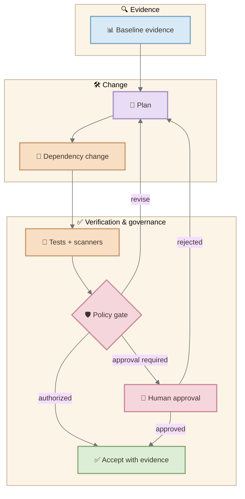

> The most consequential change in AI-assisted development may not be that machines write more code. It may be that developers increasingly design, supervise, and verify the systems that write it.

GitHub Copilot began in the public imagination as autocomplete: a probabilistic collaborator waiting at the cursor, predicting the next useful fragment. That mental model is now incomplete.

Copilot can operate from a terminal, maintain a multi-turn session, plan work, invoke tools, edit files, delegate to specialized agents, load reusable skills, connect to external systems through the Model Context Protocol, and expose its runtime through an SDK. In research preview, Project HydraFusion goes one level deeper: it can select not only a model, but a multi-model execution pattern for the task.

This is a shift from **code generation** to **work orchestration**.

At the first GitHub Copilot Day, GitHub COO Kyle Daigle framed the transition as a move away from manually producing every line and toward agentic orchestration. The claim is larger than a product announcement. It suggests a change in the unit of software engineering: from the line, function, or prompt to the governed workflow.

But orchestration is not automatically engineering. An agent can act without producing trustworthy work. A runtime can coordinate tools without preserving evidence. A router can reduce cost while making decisions harder to explain. The architectural question is therefore not whether Copilot can perform more actions. It is whether those actions can become **observable, bounded, reproducible, and independently verified**.

## Contents

- [The End of Copilot as Autocomplete](#the-end-of-copilot-as-autocomplete)
- [The Developer Becomes the Orchestrator](#the-developer-becomes-the-orchestrator)
- [One Runtime, Many Surfaces](#one-runtime-many-surfaces)
- [The New Copilot Stack](#the-new-copilot-stack)
- [Prompts, Instructions, Agents, Skills, and MCP](#prompts-instructions-agents-skills-and-mcp)
- [From Model Selection to Workflow Selection](#from-model-selection-to-workflow-selection)
- [What HydraFusion Changes](#what-hydrafusion-changes)
- [A Concrete Rails Experiment](#a-concrete-rails-experiment)
- [Who Governs the Agents?](#who-governs-the-agents)
- [The Risk of Invisible Orchestration](#the-risk-of-invisible-orchestration)
- [What Agentic Engineering Actually Changes](#what-agentic-engineering-actually-changes)
- [Conclusion](#conclusion)
- [References](#references)

## The End of Copilot as Autocomplete

Autocomplete is local. It reacts to the text around the cursor, proposes a continuation, and leaves the developer in direct control of the edit. Agentic work is different. It begins with an objective and may cross files, tools, processes, repositories, services, and time.

The progression is not simply “more powerful completion.” Each stage introduces a new architectural responsibility.

| Stage | Unit of interaction | New responsibility |
| --- | --- | --- |
| Completion | Next tokens | Accept or reject a suggestion |
| Chat | Conversation | Supply useful context |
| Edit or agent mode | Multi-file change | Review a proposed implementation |
| CLI | Repository workflow | Control tools, permissions, and sessions |
| Custom agents and skills | Reusable specialization | Define roles and procedures |
| MCP | External systems | Bound authority across integrations |
| SDK | Embedded agent runtime | Own lifecycle, policy, and product behavior |
| HydraFusion | Multi-model workflow | Evaluate routing, cost, and quality |

The visible interface may still be a prompt. Behind it, however, the system increasingly resembles a runtime.

<figure>
  
  <figcaption>Copilot's surface evolves from local suggestions toward reusable, embeddable, multi-model workflows.</figcaption>
</figure>

<style>
.mermaid-diagram img,
.mermaid-diagram svg {
  display: block;
  width: 100%;
  max-width: 520px;
  height: auto;
  margin: 1.1rem auto;
}
</style>

The transition matters because the cost of a bad suggestion is small; the cost of a badly governed action may not be. Once an assistant can run commands, edit multiple files, call APIs, or open a pull request, quality depends on more than model intelligence. It depends on the harness around the model.

## The Developer Becomes the Orchestrator

“The developer becomes the orchestrator” can sound like the developer is leaving implementation behind. That would be a mistake. Orchestration is not passive delegation. It is the design of a system in which probabilistic actors can do useful work without becoming the sole authority on whether that work is correct.

The developer's attention moves upward:

- from syntax to intent;
- from isolated edits to task decomposition;
- from choosing every action to defining allowed actions;
- from inspecting only the patch to inspecting evidence and lineage;
- from manually performing every check to designing checks that cannot be skipped;
- from selecting one model to evaluating the workflow that selects models.

This resembles the historical movement from machine code to higher-level languages, and from manually managed servers to declarative infrastructure. Abstraction removes some direct labor, but it creates a new obligation: understanding what the abstraction does when reality diverges from the happy path.

Agentic engineering is therefore not “prompting with more confidence.” It is building a control system around uncertain execution.

## One Runtime, Many Surfaces

Copilot now appears across the editor, GitHub, the terminal, cloud agents, a desktop application, and embedded applications. The surfaces differ, but GitHub describes the Copilot SDK as programmatic access to the same production-tested agent runtime that powers Copilot CLI and cloud agents.

That runtime can plan, invoke tools, edit files, stream responses, and maintain multi-turn sessions. The SDK makes those capabilities available to applications instead of requiring every team to assemble an orchestration layer from scratch.

<figure>
  
  <figcaption>The Copilot stack separates surfaces from the shared runtime, external capabilities, and independent verification.</figcaption>
</figure>

This unification is powerful, but it changes the platform boundary. When applications embed the runtime, they inherit questions that were previously hidden inside an editor feature: session ownership, tool permissions, memory, failure recovery, spend limits, observability, and user consent.

## The New Copilot Stack

The emerging stack is easier to understand if each layer answers a different question.

| Layer | Question |
| --- | --- |
| Objective | What outcome does the developer want? |
| Instructions | What rules should consistently shape behavior? |
| Plan | What sequence of work is proposed? |
| Agent | Which specialized role should reason about the task? |
| Skill | Which reusable procedure and resources apply? |
| Tool | What bounded capability may be invoked? |
| MCP server | Which external system supplies context or actions? |
| Hook | What deterministic behavior runs at lifecycle boundaries? |
| Model workflow | Which model or combination of models performs the reasoning? |
| Verification | What independent evidence determines acceptance? |

Confusing these layers produces brittle systems. A long prompt becomes a substitute for policy. A custom agent accumulates every procedure. An MCP server is treated as trusted simply because it is connected. A model's self-review is mistaken for independent verification.

The stack becomes reliable only when its boundaries remain explicit.

## Prompts, Instructions, Agents, Skills, and MCP

Copilot's customization mechanisms overlap, but they are not interchangeable.

| Mechanism | Best use | Avoid using it as |
| --- | --- | --- |
| Prompt | One immediate objective | Permanent project policy |
| Custom instructions | Stable repository conventions | A long executable workflow |
| Custom agent | A bounded specialist with its own role and tools | A universal supervisor |
| Agent skill | A reusable task procedure with instructions, scripts, and resources | An identity or permission system |
| MCP server | Structured access to external context and actions | An automatically trusted data source |
| Hook | Deterministic behavior at lifecycle events | Open-ended reasoning |
| CI workflow | Independent, repeatable validation | A model-generated confidence statement |

GitHub documents custom agents in Copilot CLI as subagents with their own context windows. This matters: specialization can prevent the main agent's context from accumulating every domain detail. Skills solve a different problem. They package instructions, scripts, and resources that Copilot can load when relevant. MCP servers extend the system outward by providing tools and context from other systems. Hooks insert deterministic commands at defined moments in execution.

The architectural principle is simple:

> Put stable rules in instructions, specialized judgment in agents, reusable procedures in skills, external capabilities behind MCP, deterministic lifecycle behavior in hooks, and acceptance criteria in independent verification.

## From Model Selection to Workflow Selection

The first generation of multi-model products asked: **Which model should answer this prompt?**

Auto model selection improves that decision by considering task complexity, system health, availability, quality, latency, and cost. But it still tends to frame execution as a single-model choice.

HydraFusion introduces a more consequential question:

> Which reasoning workflow should execute this task?

A simple request may use one efficient model. A harder request may begin with an inexpensive draft and escalate when a quality signal is weak. Another may use one model to draft, another to critique, and a final pass to revise. The unit of optimization becomes the workflow rather than the individual response.

<figure>
  
  <figcaption>HydraFusion changes the optimization target from choosing one model to choosing an execution workflow.</figcaption>
</figure>

The final verification gate is intentionally outside the model workflow. A critique can improve a draft, but agreement among models is not proof that the code compiles, the tests pass, the vulnerability is closed, or the requirement is satisfied.

## What HydraFusion Changes

HydraFusion is currently a research preview, so it should be treated as an experiment rather than a stable architectural guarantee. Even so, it reveals where coding assistants are heading.

First, **model identity becomes less visible**. The developer may select a fused capability while the runtime chooses the participating models and execution pattern.

Second, **cost becomes a runtime property**. Spend is influenced by routing, critique passes, escalation, retries, caching, and context—not only by the advertised price of one model.

Third, **quality claims move to the harness**. If the system says a cheaper workflow matches a frontier baseline, the interesting artifact is no longer a single response. It is the evaluation design: benchmarks, routing criteria, failure distribution, latency, and cost accounting.

Fourth, **observability becomes essential**. Teams need to know which workflow ran, what evidence triggered escalation, how many model calls occurred, which tools changed state, and what verification accepted the result.

HydraFusion therefore strengthens the thesis of agentic engineering while also exposing its central risk: sophisticated orchestration can become invisible precisely when it becomes most consequential.

## A Concrete Rails Experiment

Claims about agentic engineering should survive contact with a controlled task. Consider a Rails application with an outdated authentication dependency and a pull request that changes session handling.

Run the same maintenance objective in three configurations:

1. **Single Copilot session** — one agent, one selected model, repository tools.
2. **Specialized workflow** — planner, Rails maintainer, security reviewer, reusable upgrade skill, documentation through MCP, and deterministic gates.
3. **HydraFusion workflow** — the same tools and gates, but with runtime multi-model orchestration enabled.

The task is not “make the code better.” It is bounded:

```text
upgrade the authentication dependency
preserve existing login and logout behavior
remove known advisories
avoid reducing test coverage
produce an auditable before-and-after report
```

<div class="mermaid-diagram" markdown="1">



</div>

The workflow should collect evidence before any edit:

- current dependency versions;
- relevant security advisories;
- passing and failing tests;
- SimpleCov coverage;
- Brakeman findings;
- bundler-audit results;
- files and configuration affected by authentication.

After the proposed change, the same checks run again. The model may explain the result, but the tools remain the source of evidence.

| Dimension | Measure |
| --- | --- |
| Correctness | Authentication tests and acceptance criteria |
| Security | Brakeman and bundler-audit deltas |
| Regression risk | Full test suite and changed behavior |
| Coverage | SimpleCov before and after |
| Human effort | Interventions and review time |
| Recovery | Completion after an injected tool failure |
| Cost | Session credits or model usage |
| Traceability | Reconstructable plan, actions, evidence, and approvals |

The experiment is falsifiable. The specialized or fused workflow should not be declared better because it appears more sophisticated. It must improve measurable outcomes enough to justify added complexity, cost, and opacity.

## Who Governs the Agents?

Copilot CLI can ask for permission before potentially destructive tools run. SDK applications can add lifecycle hooks, scoped tools, custom agents, and spending limits. These are necessary controls, but they do not replace application-level governance.

Useful governance boundaries include:

- **least authority** — an agent receives only the tools required for its role;
- **explicit mutation** — reading, proposing, modifying, and publishing are distinct capabilities;
- **human checkpoints** — sensitive changes require approval at the moment authority expands;
- **durable evidence** — raw reports and tool outputs are retained, not only summarized;
- **independent verification** — tests and scanners run outside the model's confidence loop;
- **bounded spend** — sessions have explicit cost limits and stop conditions;
- **recovery semantics** — retries are idempotent and partial changes are visible;
- **lineage** — the system records instructions, agent, skill, tools, models, and configuration used.

The core distinction is the same one that separates autonomy from sovereignty:

> Agents may decide how to pursue an authorized objective. They should not unilaterally decide what authority they possess or what evidence counts as success.

## The Risk of Invisible Orchestration

Agentic systems compress visible work. A developer may see one request and one final patch even though the runtime planned multiple steps, invoked tools, delegated to agents, routed across models, retried failures, and rewrote its answer after critique.

Compression is convenient, but it can conceal the causal chain.

| Invisible decision | Engineering question |
| --- | --- |
| Context selection | Which files or instructions were omitted? |
| Agent delegation | Why was this specialist chosen? |
| Tool permission | What authority was granted, and for how long? |
| Model routing | Which quality, cost, or availability signal drove the choice? |
| Critique | Was the reviewer independent or sharing the same failure mode? |
| Retry | Did the second attempt change the plan or merely repeat it? |
| Acceptance | Which external evidence closed the task? |

The goal is not to expose every token. Raw model reasoning is neither necessary nor sufficient for accountability. What matters is operational lineage: inputs, plans, tool calls, mutations, artifacts, evaluations, approvals, cost, and outcome.

Without that lineage, orchestration becomes theater. The system may look autonomous while leaving humans unable to explain why a change happened.

## What Agentic Engineering Actually Changes

Agentic engineering changes the shape of leverage, not the need for engineering judgment.

Developers can spend less time on mechanical navigation and more time defining outcomes. Specialized agents can keep domain procedures out of one overloaded context. Skills can make good practices reusable. MCP can connect the workflow to authoritative systems. Hooks can enforce deterministic behavior. Multi-model orchestration can allocate intelligence more efficiently.

But the durable artifacts of software engineering remain familiar:

- explicit requirements;
- constrained authority;
- versioned code and configuration;
- executable tests;
- observable behavior;
- reviewable changes;
- rollback paths;
- accountable human decisions.

The revolutionary part is not that these disciplines disappear. It is that they move from surrounding human execution to surrounding mixed human-agent execution.

## Conclusion

GitHub Copilot is no longer well described as an AI pair programmer living beside the cursor. The CLI turns it into a repository-level operator. Custom agents and skills make specialization reusable. MCP extends its reach. Hooks introduce deterministic lifecycle behavior. The SDK makes the runtime embeddable. HydraFusion experiments with selecting entire multi-model workflows.

Together, these capabilities point toward a new layer in the software stack: the **agent runtime**.

The developer's job does not become merely “tell the agents what to do.” It becomes more architectural: define objectives, shape context, allocate authority, encode procedures, design verification, observe execution, and decide what evidence is sufficient.

The line of code is no longer the only unit of work. The workflow is becoming programmable.

And once the workflow becomes programmable, it must be engineered.

## References

- GitHub. [Welcome to GitHub Copilot Day: The Future of Agentic Engineering](https://www.youtube.com/watch?v=wtMaYmkhANQ).
- GitHub. [Project HydraFusion: Frontier Quality via Multi-Model Orchestration](https://github.blog/ai-and-ml/github-copilot/project-hydrafusion-frontier-quality-via-multi-model-orchestration/).
- GitHub. [Copilot SDK Is Now Generally Available](https://github.blog/changelog/2026-06-02-copilot-sdk-is-now-generally-available/).
- GitHub. [Build an Agent into Any App with the GitHub Copilot SDK](https://github.blog/news-insights/company-news/build-an-agent-into-any-app-with-the-github-copilot-sdk/).
- GitHub Docs. [Using GitHub Copilot CLI](https://docs.github.com/en/copilot/how-tos/copilot-cli/use-copilot-cli/overview).
- GitHub Docs. [Overview of Customizing GitHub Copilot CLI](https://docs.github.com/en/copilot/how-tos/copilot-cli/customize-copilot/overview).
- GitHub Docs. [Adding Agent Skills for GitHub Copilot CLI](https://docs.github.com/en/copilot/how-tos/copilot-cli/customize-copilot/add-skills).
- GitHub Docs. [Adding MCP Servers for GitHub Copilot CLI](https://docs.github.com/en/copilot/how-tos/copilot-cli/customize-copilot/add-mcp-servers).
- GitHub Docs. [Allowing and Denying Tool Use](https://docs.github.com/en/copilot/how-tos/copilot-cli/use-copilot-cli/allowing-tools).
- GitHub Docs. [About Copilot Auto Model Selection](https://docs.github.com/en/copilot/concepts/models/auto-model-selection).
- Microsoft for Developers. [Get Started with GitHub Copilot CLI: A Free, Hands-on Course](https://developer.microsoft.com/blog/get-started-with-github-copilot-cli-a-free-hands-on-course/).
- James Montemagno. [First Steps with GitHub Copilot](https://jamesmontemagno.github.io/first-steps-with-github-copilot/).
