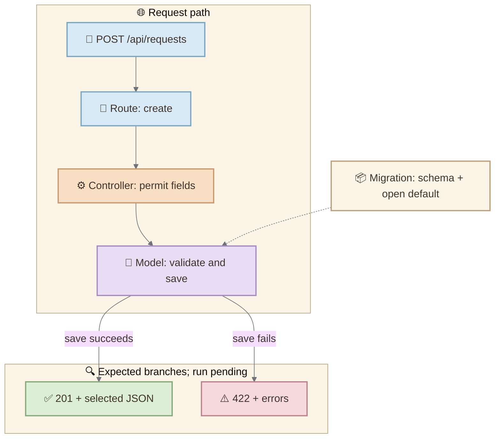

*Cover illustration: the CaseFlow browser is a conceptual application view. The companion lab supplies an integrated Rails API source app, not a working web interface.*

*GitHub Copilot for Rails Engineers · Part 01*

*The first half-hour in a new repository should produce a defensible map, a list of unknowns, and one useful next action.*

A client asks: “Can we add status transitions to this Rails API this week?” You have never seen the codebase. GitHub Copilot can help you explore it, but an answer that *sounds* like Rails is not evidence that this particular application behaves that way. Our goal is a small, falsifiable map of the current request path before proposing a change.

We will use **CaseFlow**, a synthetic integrated Rails API source app. It is deliberately small enough to inspect and incomplete enough to expose an important habit: distinguish what source says, what a test asserts, and what a running system actually did. The [companion materials](/assets/downloads/first-30-minutes-rails-repository-support.zip) contain the integrated app, an artifact-producing prompt, an evidence map, Mermaid source and the study workbook with answers.

## Contents

- [0–5 minutes: predict before you inspect](#predict)
- [5–15 minutes: follow the request through source](#trace)
- [15–20 minutes: ask Copilot for a bounded map](#ask)
- [20–27 minutes: turn assertions into observations](#observe)
- [27–30 minutes: give the client one bounded answer](#client)
- [Your 20–30 minute lab](#lab)
- [References and supporting materials](#references)

## 0–5 minutes: predict before you inspect {:#predict}

Write down your current hypothesis for `POST /api/requests`: what input is accepted, what gets saved and what comes back. Label every sentence **prediction**. This prevents your first impression or an AI suggestion from quietly turning into a fact.

The exercise is about one endpoint. Do not ask Copilot to explain the entire application yet. GitHub's [codebase exploration guide](https://docs.github.com/en/copilot/tutorials/explore-a-codebase) shows how repository and file context can narrow a question. Its [review guidance](https://docs.github.com/en/copilot/tutorials/review-ai-generated-code) is equally relevant: inspect the answer against actual files. Here, the hypothesis is an investigation aid, not a delivery promise.

## 5–15 minutes: follow the request through source {:#trace}

Start with `caseflow/config/routes.rb`:

```ruby
namespace :api do
  resources :requests, only: %i[index show create]
end
```

This declares a create route under `/api`. Rails routes dispatch incoming HTTP methods and paths to controller actions, as described in the [Rails routing guide](https://guides.rubyonrails.org/routing.html). The `only:` list matters: it does **not** declare an update route. Then inspect `app/controllers/api/requests_controller.rb`:

```ruby
def create
  request = ServiceRequest.new(request_params)
  if request.save
    render json: serialize(request), status: :created
  else
    render json: { errors: request.errors.full_messages }, status: :unprocessable_entity
  end
end

def request_params
  params.require(:request).permit(:title, :description)
end
```

The controller allows `title` and `description` from the request payload; `status` is not permitted there. Its private `serialize` method selects `id`, `title`, `description`, `status`, `created_at` and `updated_at`. There is no separate serializer file in this CaseFlow app. A reader who guesses “the serializer” from habit would be looking in the wrong place.

Next, the model constrains title presence, title length and status membership:

```ruby
STATUSES = %w[open in_progress resolved].freeze

validates :title, presence: true, length: { maximum: 160 }
validates :status, inclusion: { in: STATUSES }
```

The migration declares a `service_requests` table with `status` defaulting to `open`. A migration describes a schema change applied during setup; it is **not** another method called for each POST. In a correctly migrated database, the default is a reasonable expectation for a new record created without an explicit status, but we still have to run the application before claiming to have observed it. See the [Rails migration guide](https://guides.rubyonrails.org/active_record_migrations.html) for the schema role of migrations.



*The dotted link marks schema context, not an extra runtime step. The status labels describe the supplied controller branches; they are not a report of executed responses.*

## 15–20 minutes: ask Copilot for a bounded map {:#ask}

Open `caseflow/` as the VS Code workspace and use Copilot Chat with workspace search available. A workspace search or index can help locate relevant code; it does not verify behavior. Ask for three reviewable artifacts, rather than a prose-only summary:

```text
Investigate POST /api/requests in the CaseFlow workspace; do not edit files.
Search the actual route, controller, model, migration and request specs.
Return: (1) a table of claim | exact file/symbol | source, assertion,
observation or unknown; (2) a Mermaid flowchart TD of route →
parameters → validation/save → expected 201 or 422, with the migration
as a dotted schema dependency; (3) three unknowns and how to test each.
Label unrun branches as expected, cite paths, and do not invent results.
```

Compare the generated diagram and evidence table with the reviewed `parts/01-first-30-minutes/request-map.md` and `docs/diagrams/request-path.mmd` in the companion package. Check each path yourself. A citation is useful only if it points to a file that exists and supports that exact claim. Record a missing citation or a mistaken inference; correcting Copilot's map is part of the exercise. In a client repository, keep sensitive data out of the prompt and follow the organization's approved tooling rules.

## 20–27 minutes: turn assertions into observations {:#observe}

The included request spec has two cases: a valid title expecting a `201` response, an `open` status and one stored record; and a missing title expecting `422` with no record. Those are **assertions in source**, not reported pass results. The companion includes an integrated Rails API source app, but has no resolved lockfile or installed dependencies here; we have not executed its specs in the authoring environment.

<figure>
  
  <figcaption>Source and a test assertion can suggest behavior. Only an actual run can supply observation; CaseFlow has not crossed that boundary yet.</figcaption>
</figure>

On a Mac with compatible Ruby and Bundler installed, follow `caseflow/README.md` in the [companion materials](/assets/downloads/first-30-minutes-rails-repository-support.zip). Use the integrated `caseflow/` app, install dependencies, and record the actual output of:

```bash
bundle install
bin/rails db:prepare
bundle exec rspec spec/requests/api/requests_spec.rb
```

If setup fails, keep the first useful error. A blocker is evidence. Do not replace it with a hypothetical green test run. If it succeeds, send a synthetic HTTP request and capture the actual response before promoting the expected behavior to observed behavior.

| Statement | Evidence now | Classification |
|---|---|---|
| Route includes `create` but no `update` | `config/routes.rb` | Source fact |
| Controller permits `title`, `description` | `RequestsController#request_params` | Source fact |
| Migration declares default `open` | Migration source | Schema fact; runtime effect pending |
| Valid request returns `201` in this environment | Spec assertion only | Unverified until execution |
| Client can transition to `resolved` | No route/action or test supplied | Unsupported |

## 27–30 minutes: give the client one bounded answer {:#client}

The useful answer is not “Copilot says the endpoint works.” It is: “The source defines creation with title and description, title and status validations, and a schema default of `open`. The supplied specs cover valid creation and missing title, but I have not run them in this environment. I do not see an update route. The next safe step is to boot the integrated app, record the focused spec result, then scope a status-transition contract and tests.”

That answer supports a short engagement: a visible finding, a named uncertainty and a testable next issue. It also gives a stakeholder a clear boundary between discovery and implementation.

### Your 20–30 minute lab {:#lab}

1. Make three predictions in a local `ENVIRONMENT.md` using the template (`caseflow/ENVIRONMENT.template.md`).
2. Trace the five files in the lab checklist (`docs/labs/01-codebase-diagnosis.md`), then compare Copilot's cited map against source.
3. Attempt the focused spec; record the versions, command, actual outcome or first blocker.
4. Explain why a model that lists `resolved` does **not** prove a client can perform a status transition. Draft one bounded issue for that transition.

**Retrieval question:** What evidence would let you change “the source suggests `201`” to “I observed `201`,” and why does a passing spec not prove the entire API is production ready?

**Next in the series:** we will refine the context we give Copilot—repository guidance, instructions and tool boundaries—while keeping the same evidence discipline. [Part 01’s reviewed request map](/assets/downloads/first-30-minutes-rails-repository-support.zip) and Mermaid source are in the companion package.

## References and supporting materials {:#references}

- [Download the CaseFlow companion package](/assets/downloads/first-30-minutes-rails-repository-support.zip): the complete post in Markdown, integrated Rails API app, study workbook with exercises and answers, field lab, bounded prompt, Mermaid source and validation status. The integrated app still requires installing dependencies and its request specs remain unexecuted in this authoring environment.
- [VS Code Docs: How Copilot understands your workspace](https://code.visualstudio.com/docs/agents/reference/workspace-context).
- [GitHub Docs: Using GitHub Copilot to explore a codebase](https://docs.github.com/en/copilot/tutorials/explore-a-codebase).
- [GitHub Docs: Review AI-generated code](https://docs.github.com/en/copilot/tutorials/review-ai-generated-code).
- [Rails Guides: Routing from the Outside In](https://guides.rubyonrails.org/routing.html).
- [Rails Guides: Active Record Migrations](https://guides.rubyonrails.org/active_record_migrations.html).
