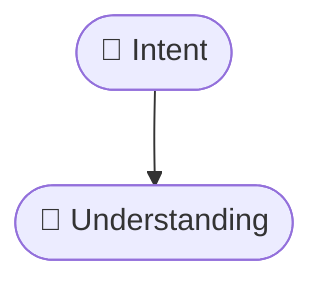

# jekyll-mermaid-publishing

Jekyll publishing adapter for Mermaid diagrams.

This skill has a deliberately narrow responsibility:

Local authoring / VS Code preview (`mermaid`) → Jekyll publication (`mermaid!`).

It **does not redesign Mermaid diagrams**.

If the diagram itself needs semantic or visual improvement, use
`mermaid-visual-standard` first.

---

## Purpose

During local authoring, keep normal Mermaid fences:

Use a `mermaid` code fence around a complete diagram such as `flowchart TD` with an edge `A --> B`.

For Jekyll publication, convert only the opening fence:

Use a `mermaid!` code fence around the exact same diagram body.

The Mermaid body must remain unchanged.

---

## Recommended skill folder

```text
jekyll-mermaid-publishing/
├── SKILL.md
└── README.md
```

---

## Basic usage

Invoke:

```text
$jekyll-mermaid-publishing
```

Example:

```text
Apply $jekyll-mermaid-publishing to this Jekyll post.

Ensure `mermaid: true` is present when Mermaid blocks exist.
Convert plain `mermaid` opening fences to `mermaid!`.
Preserve Mermaid bodies, wrappers, colors, emoji, topology,
labels, classes, shapes, direction, and edge semantics exactly.
```

---

## Responsibility boundary

This skill may:

- detect Mermaid blocks;
- ensure Jekyll Mermaid front matter is enabled;
- convert publication fences;
- preserve wrappers;
- preserve references;
- validate publication output.

This skill must **not**:

- redesign diagrams;
- normalize Mermaid visuals;
- add or remove colors;
- add or remove emoji;
- change direction;
- change node shapes;
- change graph topology;
- change edge semantics;
- normalize diagram height;
- rewrite node labels.

When visual normalization is requested, apply:

```text
$mermaid-visual-standard
```

first.

Then apply:

```text
$jekyll-mermaid-publishing
```

---

## Front matter

If Mermaid blocks exist, require:

```yaml
mermaid: true
```

Example:

```yaml
---
layout: post
title: "Intent-Oriented Programming"
mermaid: true
---
```

Do not change unrelated front matter unless required by the publication task.

---

## Conversion contract

At publication time:

1. find plain `mermaid` opening fences;
2. convert them to `mermaid!`;
3. preserve Mermaid body exactly;
4. preserve the closing fence;
5. preserve wrappers;
6. preserve colors;
7. preserve emoji;
8. preserve graph topology;
9. preserve natural height;
10. preserve node labels and classes.

Canonical transformation:

Change the opening fence language from `mermaid` to `mermaid!`; leave the diagram body and closing fence unchanged.

Only the opening fence changes.

---

# Examples of use

## Example 1 — Publish one Jekyll post

```text
Apply $jekyll-mermaid-publishing to this post.

Requirements:
- add or verify `mermaid: true`;
- convert all plain Mermaid opening fences to `mermaid!`;
- preserve every Mermaid body exactly;
- preserve wrappers;
- keep reference URLs clickable.
```

---

## Example 2 — Use after visual normalization

```text
First apply $mermaid-visual-standard to all Mermaid diagrams.

After visual and semantic normalization is complete,
apply $jekyll-mermaid-publishing to prepare the article for Jekyll.

The publishing step must not redesign the diagrams.
```

Recommended pipeline:

```text
Mermaid source
→ mermaid-visual-standard
→ approved Mermaid source
→ jekyll-mermaid-publishing
→ Jekyll-ready post
```

---

## Example 3 — Local source vs publication source

Local authoring:

````markdown
## Runtime


````

Publication version:

````markdown
## Runtime


````

The diagram body remains identical.

---

## Example 4 — Multiple Mermaid diagrams

```text
Apply $jekyll-mermaid-publishing to this article containing multiple Mermaid blocks.

Convert every plain Mermaid opening fence to `mermaid!`.

Do not:
- reorder diagrams;
- modify labels;
- modify classes;
- modify colors;
- modify emoji;
- modify edge styles;
- modify direction;
- normalize dimensions.
```

---

## Example 5 — Audit only

```text
Audit this Jekyll article with $jekyll-mermaid-publishing.

Do not modify the file.

Report:
- missing `mermaid: true`;
- plain `mermaid` fences remaining in publication output;
- malformed publication fences;
- Mermaid bodies changed unexpectedly;
- broken wrappers;
- non-clickable URLs in References.

Do not evaluate or redesign diagram visuals.
```

---

## Example 6 — References section

Use explicit Markdown links:

```markdown
## References

- David Bohm, *Wholeness and the Implicate Order*.
- Mermaid documentation:
  [Mermaid](https://mermaid.js.org/)
```

Keep:

- source title readable;
- author readable where available;
- URLs clickable.

---

## Example 7 — Full post workflow

Use the skills in this order:

```text
1. $mermaid-visual-standard
   → diagram semantics and visual normalization

2. $text-visual-standard
   → callouts and semantic text visuals

3. $jekyll-mermaid-publishing
   → Jekyll-specific Mermaid packaging
```

Prompt:

```text
Prepare this post for publication.

Apply:
- $mermaid-visual-standard to Mermaid diagrams;
- $text-visual-standard to textual visual components;
- $jekyll-mermaid-publishing last.

The publishing adapter must preserve the finalized Mermaid source.
```

---

## Example 8 — Blog-wide publication preparation

```text
Apply $jekyll-mermaid-publishing to the selected Jekyll posts.

For each post:
- verify Mermaid front matter;
- convert publication fences;
- preserve all Mermaid source;
- preserve wrappers;
- verify References links.

Do not perform visual normalization.
```

---

## Validation checklist

Before publication:

```text
[ ] `mermaid: true` exists when Mermaid blocks exist
[ ] no plain `mermaid` opening fence remains in publication output
[ ] every intended diagram uses `mermaid!`
[ ] Mermaid bodies are unchanged
[ ] closing fences are unchanged
[ ] wrappers are preserved
[ ] colors are preserved
[ ] emoji are preserved
[ ] topology is preserved
[ ] natural height is preserved
[ ] labels and classes are preserved
[ ] URLs in References are clickable
```

---

## Relationship to mermaid-visual-standard

The separation is intentional:

```text
mermaid-visual-standard
→ owns semantic and visual design

jekyll-mermaid-publishing
→ owns publication adaptation
```

Do not mix these responsibilities.

A publishing adapter should not silently alter meaning.

---

## Relationship to text-visual-standard

For a complete article:

```text
Mermaid relationships
→ mermaid-visual-standard

Text callouts / semantic prose
→ text-visual-standard

Jekyll Mermaid fence conversion
→ jekyll-mermaid-publishing
```

This keeps:

- semantic design;
- textual visual language;
- publication mechanics

as separate concerns.

---

## Core rule

```text
authoring format
→ may change

publication fence
→ may change

Mermaid meaning
→ must not change

Mermaid body
→ must not change
```

The purpose of this skill is packaging, not redesign.
