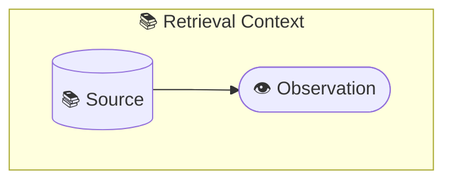
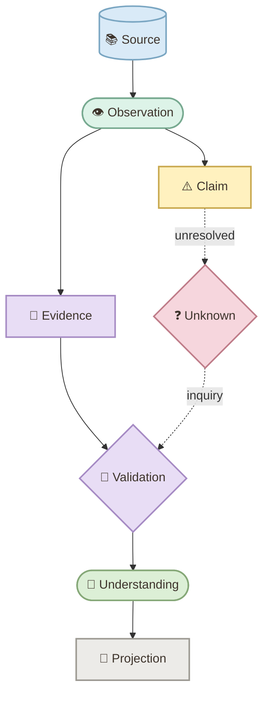
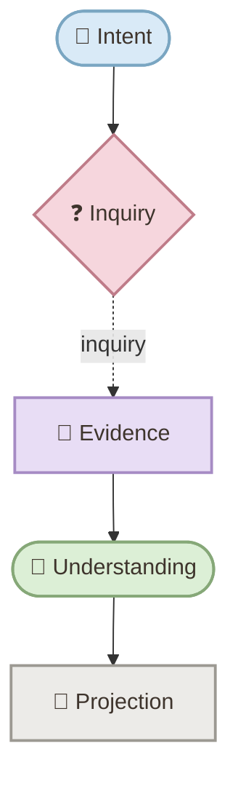
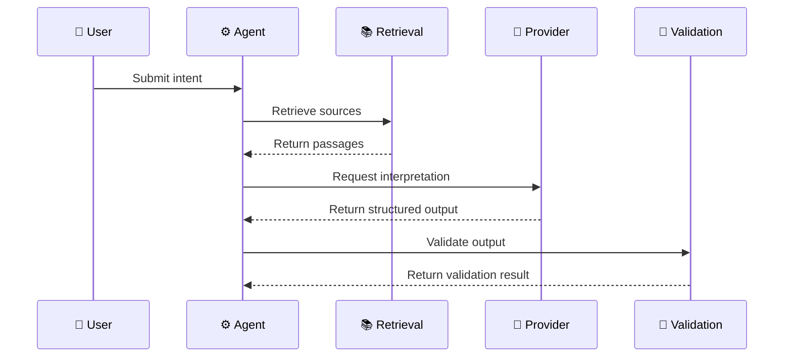
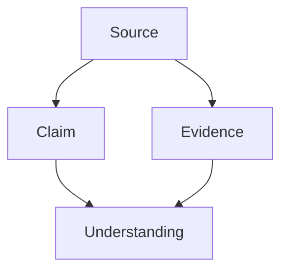
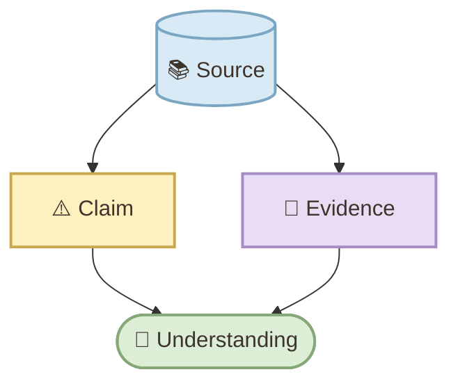

# mermaid-visual-standard

Canonical Mermaid visual standard for:

- HOLOFLUX
- IOP
- COSMOS
- FACTORIES
- blogs
- ebooks
- READMEs
- architecture documentation
- epistemic runtimes
- technical documentation

It complements `text-visual-standard`.

Use:

```text
mermaid-visual-standard
→ relationships, flows, architecture, sequence, topology, state, structure

text-visual-standard
→ callouts, shoutouts, evidence, insights, warnings, definitions,
  questions, examples, references, takeaways, and other text visuals
```

---

## 1. What this skill does

This skill standardizes the semantic visual language used in Mermaid diagrams.

Its canonical model is:

```text
SHAPE
→ structural entity type

COLOR
→ semantic / epistemic status

EMOJI
→ concept identity

EDGE
→ relation type / epistemic force

SUBGRAPH
→ context / perspective / boundary
```

The diagram must remain understandable even when color or emoji is ignored.

---

## 2. Core principle

> Mermaid is a semantic visual language, not a box-sizing system.

The goal is to make meaning visible while preserving Mermaid's natural geometry.

Use semantics first.

Do not redesign diagrams merely to force identical sizes.

---

## 3. When to use it

Use `mermaid-visual-standard` when the content depends primarily on relationships.

Typical use cases:

- process flow;
- architecture;
- component relationships;
- sequence of interactions;
- state transitions;
- data relationships;
- requirements traceability;
- repository history;
- timeline;
- journey;
- knowledge flow;
- epistemic runtime;
- inquiry flow;
- provenance;
- source → evidence → claim → understanding;
- orchestration;
- semantic boundaries.

---

## 4. When not to use it

Do not use Mermaid merely to make text look visual.

Prefer `text-visual-standard` for:

- Insight;
- Warning;
- Evidence callout;
- Definition;
- Open Question;
- Example;
- Context block;
- Takeaway;
- Reference;
- Try This;
- editorial emphasis.

If ordinary prose is clearer, keep prose.

---

## 5. Installation

Recommended local structure:

```text
skills/
└── mermaid-visual-standard/
    ├── SKILL.md
    └── README.md
```

Place the canonical skill content in:

```text
SKILL.md
```

---

## 6. Basic usage

Invoke or reference:

```text
$mermaid-visual-standard
```

Example:

```text
Apply $mermaid-visual-standard to all Mermaid diagrams in this post.

Preserve the meaning of each diagram.
Use semantic shapes, pastel semantic colors, functional emoji,
truthful relation styles, and real subgraph boundaries.

Do not normalize diagram sizes.
```

---

## 7. Canonical visual grammar

### Shape = structural type

Use a small stable shape vocabulary.

| Structural role | Preferred Mermaid form | Typical concepts |
|---|---|---|
| orientation / state / synthesis / result | `([text])` | Intent, Observation, Understanding, Result |
| process / assertion / transformation | `[text]` | Action, Claim, Evidence, Projection |
| unresolved branch / gate / tension | `{text}` | Unknown, Decision, Contradiction, Validation Gate |
| source / store / corpus | `[(text)]` | Source, Reference, Dataset, Knowledge Store |
| context / layer / perspective / actor boundary | `subgraph` | Context, Perspective, Runtime Layer |

Rule:

```text
same structural meaning
→ same shape

different structural meaning
→ shape may differ
```

Do not vary shapes for decoration.

---

## 8. Semantic colors

Canonical palette:

```text
classDef context fill:#D9EAF7,stroke:#7AA6C2,color:#3E342C,stroke-width:2px;
classDef observation fill:#DDF3E8,stroke:#78AA91,color:#3E342C,stroke-width:2px;
classDef claim fill:#FFF1BF,stroke:#C8A84E,color:#3E342C,stroke-width:2px;
classDef evidence fill:#E8DDF5,stroke:#A68BC4,color:#3E342C,stroke-width:2px;
classDef hypothesis fill:#F8DFC4,stroke:#C9986D,color:#3E342C,stroke-width:2px;
classDef uncertainty fill:#F6D6DD,stroke:#BF7C89,color:#3E342C,stroke-width:2px;
classDef contradiction fill:#F4CFC8,stroke:#B96B5D,color:#3E342C,stroke-width:2px;
classDef understanding fill:#DCEFD6,stroke:#86A878,color:#3E342C,stroke-width:2px;
classDef projection fill:#ECEBE8,stroke:#9C9992,color:#3E342C,stroke-width:2px;
classDef orchestration fill:#DDE3F4,stroke:#8998C8,color:#3E342C,stroke-width:2px;
```

Use color to communicate role.

Do not color every node merely for visual variety.

---

## 9. Functional emoji vocabulary

Recommended vocabulary:

| Concept | Emoji |
|---|---|
| Source / Reference / Context | 📚 |
| Observation | 👁 |
| Intent / Orientation | 🧭 |
| Inquiry / Evidence | 🔎 |
| Validation / Experiment / Replication | 🧪 |
| Relation | 🔗 |
| Hypothesis / Mechanism / Structure | 🧩 |
| Claim / Contradiction / Warning | ⚠️ |
| Unknown / unresolved question | ❓ |
| Understanding | 🧠 |
| HOLOFLUX | 🌀 |
| COSMOS / orchestration | ⚙️ |
| Projection / Artifact | 📄 |
| Action | ▶️ |
| Accepted Result / Checkpoint | ✅ |

Rules:

```text
same concept
→ same emoji

emoji
→ functional identity

emoji
≠ decoration
```

Use at most one functional emoji per visible concept label unless a strong semantic reason requires otherwise.

Do not alter exact:

- identifiers;
- commands;
- values;
- IDs;
- requirement IDs;
- method names;
- class names;
- exact source labels.

Use a display alias where Mermaid supports it.

---

## 10. Edge semantics

Primary accepted relationship:

```text
-->
```

Hypothesis, uncertainty, weak association, unresolved relationship, or relation under inquiry:

```text
-. label .->
```

Useful edge labels:

```text
supports
derived from
observes
qualifies
unresolved
inquiry
projects
revises
```

Do not use dotted arrows simply for visual variation.

Do not reinterpret sequence ordering, dependency, chronology, or cardinality as epistemic strength.

---

## 11. Subgraphs

Use `subgraph` only for a real:

- context;
- perspective;
- runtime layer;
- environment;
- responsibility;
- actor boundary;
- phase.

Example:



Do not use subgraphs as decorative boxes.

---

## 12. Layout defaults

For conceptual and epistemic flowcharts, prefer:

```text
flowchart TD
```

Typical defaults:

```text
nodeSpacing: 36
rankSpacing: 44
curve: basis
fontSize: 13px
```

These are defaults, not immutable laws.

Use `LR` only when:

- the domain is genuinely horizontal; or
- it materially improves readability.

---

## 13. Natural geometry

Let Mermaid determine:

- node width;
- node height;
- shape geometry;
- label width;
- edge routing;
- branch spacing;
- graph bounds.

Avoid:

- forced equal sizes;
- invisible padding;
- fake spaces;
- `<br/>` only to equalize boxes;
- per-diagram fixed widths;
- adding nodes just to fill space;
- removing nodes merely to reduce footprint.

Different shapes are expected to have different dimensions.

That difference is semantic.

---

## 14. Epistemic integrity

When a diagram models knowledge, preserve:

```text
Citation ≠ Source
Source ≠ Evidence
Evidence ≠ Claim
Claim ≠ Understanding
Operational success ≠ Epistemic acceptance
Retrieval ≠ Semantic extraction
Generated citation span ≠ Source passage
```

Also:

```text
Unknown ≠ Error
Contradiction ≠ Falsification automatically
Tool success ≠ Epistemic validation
Retrieval success ≠ Semantic correctness
```

---

## 15. Canonical example



This is a semantic reference.

It is not a required topology, size, or node count.

---

# Examples of use

## 16. Example: apply to one existing diagram

Prompt:

```text
Apply $mermaid-visual-standard to this Mermaid diagram.

Preserve the existing domain meaning.

Review:
- node structural roles
- semantic colors
- functional emoji
- relation semantics
- subgraphs
- reading direction
- epistemic distinctions

Do not change the diagram merely to match a preferred footprint.
```

---

## 17. Example: refactor all diagrams in a post

Prompt:

```text
Apply $mermaid-visual-standard to every Mermaid diagram in this post.

For each diagram:
1. read the surrounding content;
2. identify what the diagram is meant to communicate;
3. preserve the native diagram type when appropriate;
4. apply semantic shapes, colors, emoji, relation styles, and grouping;
5. preserve exact IDs, code, values, dates, cardinality, and ordering;
6. keep the geometry natural;
7. render and inspect the result if a Mermaid renderer is available.
```

---

## 18. Example: create a new conceptual diagram

Prompt:

```text
Create a Mermaid diagram using $mermaid-visual-standard.

Topic:
Intent → Inquiry → Evidence → Understanding → Projection

Requirements:
- use flowchart TD;
- semantic pastel colors;
- functional emoji;
- concise labels;
- use a diamond only for a genuine unresolved gate;
- use dotted relations only for uncertainty or inquiry;
- preserve natural Mermaid geometry.
```

Example output:



---

## 19. Example: sequence diagram

Prompt:

```text
Create a Mermaid sequence diagram using $mermaid-visual-standard.

Model:
User → Agent → Retrieval → Provider → Validation

Preserve interaction order.
Do not use arrow style as epistemic strength unless the message itself represents
an epistemic relation.
Use functional emoji in participant display labels where supported.
```

Example:



The dashed return arrows here represent response direction, not uncertainty.

---

## 20. Example: class diagram

Prompt:

```text
Apply $mermaid-visual-standard to this class diagram.

Preserve:
- class names;
- method names;
- signatures;
- multiplicities;
- associations.

Use semantic color only where status is meaningful.
Do not insert emoji into identifiers; use visible display labels or stereotypes only
where supported.
```

---

## 21. Example: state diagram

Prompt:

```text
Create a Mermaid state diagram using $mermaid-visual-standard.

States:
Observed
Under Inquiry
Validated
Accepted
Rejected

Use choice or validation nodes only where control flow genuinely branches.
Do not treat every transition as evidence.
```

---

## 22. Example: architecture diagram

Prompt:

```text
Apply $mermaid-visual-standard to this architecture diagram.

Requirements:
- preserve actual components and boundaries;
- group only real runtime or responsibility boundaries;
- keep interfaces and dependencies truthful;
- use semantic color only where it adds a separate meaningful status dimension;
- avoid decorative subgraphs.
```

---

## 23. Example: epistemic runtime

Prompt:

```text
Create a Mermaid diagram using $mermaid-visual-standard for an epistemic runtime.

Keep these distinct:
- Source
- Observation
- Claim
- Evidence
- Unknown
- Contradiction
- Validation
- Understanding
- Projection

Use:
- Source as cylinder;
- Unknown / validation gates as diamonds where branching is real;
- accepted relations as solid arrows;
- inquiry / unresolved relations as dotted arrows;
- the canonical semantic palette;
- functional emoji.
```

---

## 24. Example: diagram for HOLOFLUX

Prompt:

```text
Create a HOLOFLUX conceptual diagram using $mermaid-visual-standard.

Model:
Meaning
→ Inquiry
→ Understanding
→ Explication
→ Revision

Use 🌀 only where HOLOFLUX itself is explicitly represented.
Do not use the HOLOFLUX emoji as generic decoration.
```

---

## 25. Example: diagram for COSMOS

Prompt:

```text
Create a COSMOS orchestration diagram using $mermaid-visual-standard.

Represent:
Intent
Capabilities
Knowledge
Agents
Artifacts
Revision

Use ⚙️ for COSMOS / orchestration where explicitly relevant.
Use subgraphs only for real runtime layers or responsibility boundaries.
```

---

## 26. Example: before and after

### Before



### After



The improvement comes from semantic encoding, not decoration.

---

## 27. Example: choose Mermaid or text visual

Use this rule:

```text
Does meaning depend on relationships?
→ Mermaid

Does meaning depend on textual emphasis?
→ text visual

Does ordinary prose already work?
→ prose
```

Examples:

```text
Source → Evidence → Claim
→ Mermaid

"Do not confuse Source with Evidence."
→ Warning / Key Idea

Definition of Evidence
→ Definition block

Five-step architecture interaction
→ Mermaid sequence diagram
```

---

## 28. Example: use both skills in one post

Prompt:

```text
Apply the canonical visual standards to this post.

Use:
- $mermaid-visual-standard for Mermaid diagrams
- $text-visual-standard for textual visual components

Share one Semantic + Epistemic Visual Vocabulary across both.

Examples:
- 🔎 Evidence means Evidence in both text blocks and Mermaid nodes.
- 🧠 Understanding keeps the same semantic meaning across both.
- 📚 Source / Context remains distinct from Evidence.
- ❓ Unknown remains unresolved rather than being rendered as an error.

Do not force prose into Mermaid.
Do not replace useful diagrams with callouts.
```

---

## 29. Example: Jekyll post workflow

Prompt:

```text
Review this Jekyll post.

For Mermaid:
apply $mermaid-visual-standard.

For textual callouts:
apply $text-visual-standard.

Preserve the existing Jekyll fence convention.
Do not change diagram semantics while converting fences.
Keep publication-specific rendering separate from semantic source.
```

---

## 30. Example: README workflow

Prompt:

```text
Review this README using $mermaid-visual-standard.

Improve Mermaid diagrams only where semantic clarity benefits.

Keep diagrams compatible with GitHub rendering.
Do not add presentation hacks.
Preserve natural geometry.
Use functional emoji in eligible visible labels.
```

---

## 31. Example: blog-wide normalization

Prompt:

```text
Audit all Mermaid diagrams in this blog using $mermaid-visual-standard.

Identify:
- inconsistent semantic colors;
- inconsistent emoji;
- incorrect node shapes;
- decorative diamonds;
- decorative subgraphs;
- misleading dotted arrows;
- sizing hacks;
- Source / Evidence / Claim / Understanding conflation.

Normalize semantics without forcing identical diagram dimensions.
```

---

## 32. Static rendering

When static rendering is available, prefer:

```text
@mermaid-js/mermaid-cli@12.0.0
```

Canonical pipeline:

```text
Mermaid source
→ mmdc 12.0.0
→ static SVG
→ preserve viewBox and internal geometry
→ optional single global display scale
→ responsive presentation
```

Publishing CSS may use:

```css
max-width: 100%;
height: auto;
```

Do not resize individual nodes after rendering.

---

## 33. GitHub / VS Code

For environments that render Mermaid directly:

Use `mermaid` fences with complete, valid diagram bodies; e.g. `flowchart TD` followed by `A --> B`.

Allow the host renderer to present natural geometry.

Do not add source-level presentation hacks.

---

## 34. Jekyll

If a repository explicitly requires:

```text
mermaid!
```

use:

Use the `mermaid!` fence for Jekyll publication, containing a complete, valid diagram body; never publish `...` as Mermaid syntax.

Fence conversion is a publishing concern.

Do not alter semantic meaning during fence conversion.

---

## 35. Quality checklist

Before publishing:

```text
[ ] Is the diagram type appropriate?
[ ] Is the semantic purpose clear?
[ ] Are native diagram semantics preserved?
[ ] Are structural roles encoded truthfully?
[ ] Are shapes meaningful rather than decorative?
[ ] Are colors semantic?
[ ] Are emojis functional and consistent?
[ ] Are exact identifiers preserved?
[ ] Do edge styles reflect actual relation semantics?
[ ] Are chronology, dependency, cardinality, and order preserved?
[ ] Are Source, Evidence, Claim, Unknown, Contradiction, and Understanding distinct?
[ ] Are subgraphs real boundaries?
[ ] Are labels concise?
[ ] Is the reading direction clear?
[ ] Has natural geometry been preserved?
[ ] Were sizing hacks avoided?
[ ] Does the diagram remain understandable without color?
[ ] If rendered statically, was the SVG viewBox preserved?
```

---

## 36. Core rules

```text
shape
→ structural type

color
→ semantic / epistemic status

emoji
→ concept identity

edge
→ relation semantics

subgraph
→ context / boundary

geometry
→ renderer responsibility
```

And:

```text
semantic consistency
≠ identical visual footprint
```

The objective is not to make every diagram look the same.

The objective is to make the same meanings look semantically consistent.
