# Layered Design for Ruby on Rails Applications: Master the Extended Rails Way

*Based on Vladimir Dementyev's comprehensive guide to building maintainable Rails applications*

---

## 🚀 The Journey from Simple to Sophisticated

Picture this: You've just launched your Rails MVP. The code is clean, the features work, and your users are happy. Fast forward six months—your codebase has grown, your team has expanded, and suddenly that elegant Rails app feels more like a house of cards. Sound familiar?

Welcome to the world of **Rails at Scale**, where the conventions that once made you productive now threaten to overwhelm your application's maintainability. But here's the good news: there's a path forward that doesn't require abandoning The Rails Way.

## 🗺️ Your Roadmap to Layered Excellence

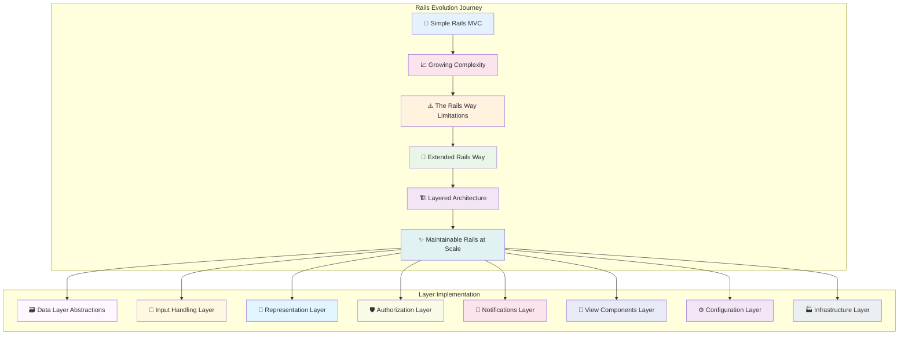

## 📚 What You'll Master

In this comprehensive guide, we'll explore Vladimir Dementyev's **Extended Rails Way**—a philosophy that embraces Rails conventions while introducing strategic abstraction layers that grow with your application.

## 🧱 The Complete Rails Layer Architecture

Let's start with the big picture. Here's how a well-layered Rails application looks when all pieces come together:

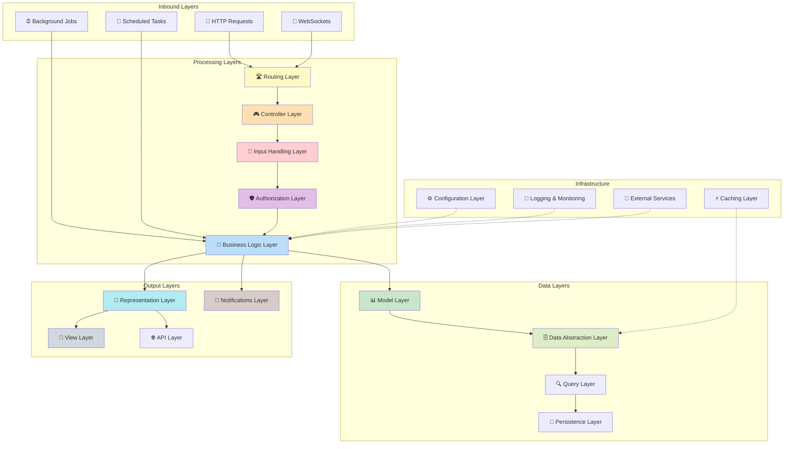

---

## 🎯 Layer 1: The Foundation - Understanding Rails Web Architecture

<details>
<summary><strong>🔍 Click to explore the Web Request Journey</strong></summary>

<p>The journey of a simple click through a Rails application is more complex than you might think. Let's trace this path:</p>

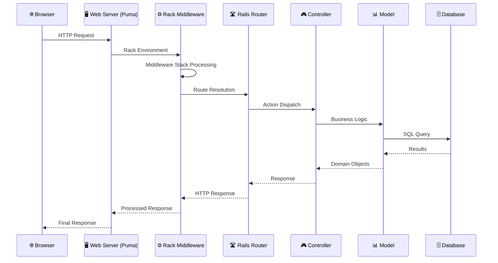

<h3>Key Insights:</h3>
<ul>
<li><strong>Thousands of method calls</strong> happen in a single request</li>
<li><strong>3,000+ object allocations</strong> for even simple actions</li>
<li><strong>Middleware stack</strong> provides cross-cutting concerns</li>
<li><strong>Controller</strong> translates web requests to business actions</li>
</ul>

</details>

---

## 🎯 Layer 2: Data Layer Abstractions

<details>
<summary><strong>🔍 Click to explore Data Layer Patterns</strong></summary>

Active Record is powerful, but it can become a God object. Here's how to tame it:

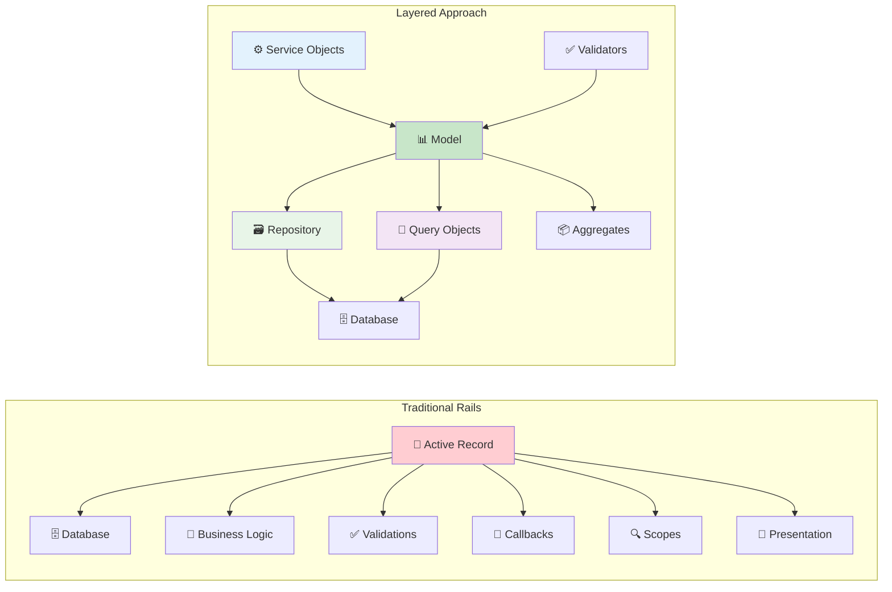

</details>

### Data Layer Components:

#### 📂 Repository Pattern Implementation

**📋 [View Complete Repository Pattern Examples →](https://github.com/PacktPublishing/Layered-Design-for-Ruby-on-Rails-Applications/tree/main/02-repository)**

- 🔍 **[PostRepository](https://github.com/PacktPublishing/Layered-Design-for-Ruby-on-Rails-Applications/blob/main/02-repository/app/repositories/post_repository.rb)** - Basic repository with query chaining
- 📈 **[AdvancedRepository](https://github.com/PacktPublishing/Layered-Design-for-Ruby-on-Rails-Applications/blob/main/02-repository/app/repositories/advanced_repository.rb)** - Complex queries with joins and aggregations
- 🧪 **[Repository Specs](https://github.com/PacktPublishing/Layered-Design-for-Ruby-on-Rails-Applications/tree/main/02-repository/spec/repositories)** - Testing strategies for repositories

```ruby
# Key Repository Pattern Features:
# ✅ Query encapsulation and reuse
# ✅ Chainable interface design
# ✅ Clean separation from Active Record
# ✅ Testable query logic
```

#### 🔍 Query Objects Implementation

**📋 [View Complete Query Objects Examples →](https://github.com/PacktPublishing/Layered-Design-for-Ruby-on-Rails-Applications/tree/main/03-query-objects)**

- 📊 **[PopularPostsQuery](https://github.com/PacktPublishing/Layered-Design-for-Ruby-on-Rails-Applications/blob/main/03-query-objects/app/queries/popular_posts_query.rb)** - Complex aggregation queries
- 🔎 **[SearchQuery](https://github.com/PacktPublishing/Layered-Design-for-Ruby-on-Rails-Applications/blob/main/03-query-objects/app/queries/search_query.rb)** - Full-text search implementation
- 📅 **[TimeRangeQuery](https://github.com/PacktPublishing/Layered-Design-for-Ruby-on-Rails-Applications/blob/main/03-query-objects/app/queries/time_range_query.rb)** - Date/time filtering patterns

```ruby
# Query Objects Benefits:
# ✅ Complex SQL logic encapsulation
# ✅ Reusable across controllers/services
# ✅ Easy to test in isolation
# ✅ Performance optimization opportunities
```

---

## 🎯 Layer 3: Input Handling Layer

<details>
<summary><strong>🔍 Click to explore Form Objects and Input Processing</strong></summary>

Move user input handling out of your models and controllers:

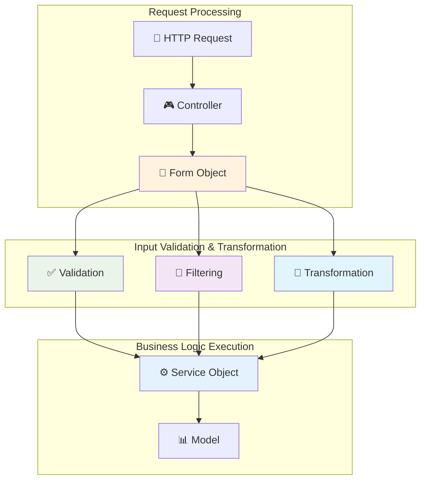

</details>

### Input Handling Components:

#### 📝 Form Objects Implementation

**📋 [View Complete Form Objects Examples →](https://github.com/PacktPublishing/Layered-Design-for-Ruby-on-Rails-Applications/tree/main/04-form-objects)**

- 📋 **[PostForm](https://github.com/PacktPublishing/Layered-Design-for-Ruby-on-Rails-Applications/blob/main/04-form-objects/app/forms/post_form.rb)** - Complex multi-model form handling
- 👤 **[UserRegistrationForm](https://github.com/PacktPublishing/Layered-Design-for-Ruby-on-Rails-Applications/blob/main/04-form-objects/app/forms/user_registration_form.rb)** - Multi-step form with validation
- 🏪 **[CheckoutForm](https://github.com/PacktPublishing/Layered-Design-for-Ruby-on-Rails-Applications/blob/main/04-form-objects/app/forms/checkout_form.rb)** - Transaction handling with rollbacks

```ruby
# Form Objects Benefits:
# ✅ Context-specific validation rules
# ✅ Complex business logic coordination
# ✅ Clean controller interfaces
# ✅ Easy to test and maintain
```

#### 🔽 Filter Objects Implementation

**📋 [View Complete Filter Objects Examples →](https://github.com/PacktPublishing/Layered-Design-for-Ruby-on-Rails-Applications/tree/main/05-filters)**

- 🔍 **[PostFilters](https://github.com/PacktPublishing/Layered-Design-for-Ruby-on-Rails-Applications/blob/main/05-filters/app/filters/post_filters.rb)** - Advanced search and filtering
- 📊 **[AdminFilters](https://github.com/PacktPublishing/Layered-Design-for-Ruby-on-Rails-Applications/blob/main/05-filters/app/filters/admin_filters.rb)** - Administrative dashboard filtering
- 🏷️ **[TagFilters](https://github.com/PacktPublishing/Layered-Design-for-Ruby-on-Rails-Applications/blob/main/05-filters/app/filters/tag_filters.rb)** - Multi-dimensional filtering

```ruby
# Filter Objects Features:
# ✅ Chainable filter conditions
# ✅ Clean parameter handling
# ✅ URL-friendly filter states
# ✅ Performance-optimized queries
```

---

## 🎯 Layer 4: Representation Layer

<details>
<summary><strong>🔍 Click to explore Presenters and Serializers</strong></summary>

Keep your models focused on business logic by extracting presentation concerns:

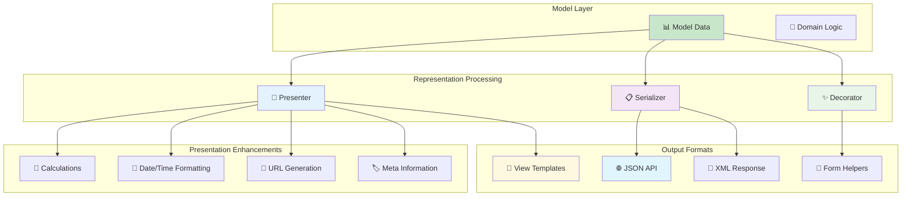

</details>

### Representation Layer Components:

#### 🎨 Presenter Pattern Implementation

**📋 [View Complete Presenter Examples →](https://github.com/PacktPublishing/Layered-Design-for-Ruby-on-Rails-Applications/tree/main/06-presenters)**

- 📄 **[PostPresenter](https://github.com/PacktPublishing/Layered-Design-for-Ruby-on-Rails-Applications/blob/main/06-presenters/app/presenters/post_presenter.rb)** - Rich presentation logic with view context
- 👤 **[UserPresenter](https://github.com/PacktPublishing/Layered-Design-for-Ruby-on-Rails-Applications/blob/main/06-presenters/app/presenters/user_presenter.rb)** - Avatar handling and social links
- 📊 **[DashboardPresenter](https://github.com/PacktPublishing/Layered-Design-for-Ruby-on-Rails-Applications/blob/main/06-presenters/app/presenters/dashboard_presenter.rb)** - Complex data aggregation for views

```ruby
# Presenter Pattern Benefits:
# ✅ Clean separation of presentation logic
# ✅ View context integration
# ✅ Reusable formatting methods
# ✅ Enhanced testability
```

#### 📋 Serializer Pattern Implementation

**📋 [View Complete Serializer Examples →](https://github.com/PacktPublishing/Layered-Design-for-Ruby-on-Rails-Applications/tree/main/07-serializers)**

- 🌐 **[PostSerializer](https://github.com/PacktPublishing/Layered-Design-for-Ruby-on-Rails-Applications/blob/main/07-serializers/app/serializers/post_serializer.rb)** - Multi-variant API responses
- 📱 **[MobileSerializer](https://github.com/PacktPublishing/Layered-Design-for-Ruby-on-Rails-Applications/blob/main/07-serializers/app/serializers/mobile_serializer.rb)** - Mobile-optimized data structures
- 🔗 **[ExternalApiSerializer](https://github.com/PacktPublishing/Layered-Design-for-Ruby-on-Rails-Applications/blob/main/07-serializers/app/serializers/external_api_serializer.rb)** - Third-party integration formats

```ruby
# Serializer Pattern Features:
# ✅ Multiple output format support
# ✅ Version control for APIs
# ✅ Performance-optimized queries
# ✅ Consistent data structures
```

---

## 🎯 Layer 5: Authorization Layer

<details>
<summary><strong>🛡️ Click to explore Authorization Patterns</strong></summary>

Implement authorization as a first-class concern with dedicated abstractions:

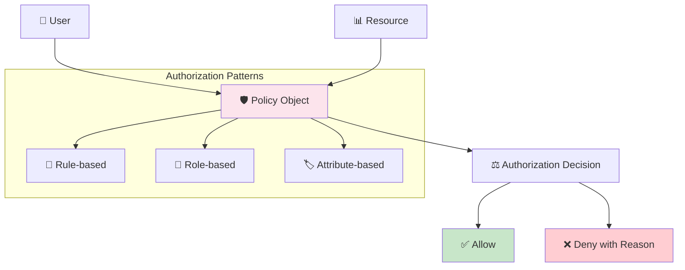

</details>

### Authorization Layer Components:

#### 🛡️ Policy Objects Implementation

**📋 [View Complete Authorization Examples →](https://github.com/PacktPublishing/Layered-Design-for-Ruby-on-Rails-Applications/tree/main/08-authorization)**

- 🛡️ **[PostPolicy](https://github.com/PacktPublishing/Layered-Design-for-Ruby-on-Rails-Applications/blob/main/08-authorization/app/policies/post_policy.rb)** - Resource-based authorization with scopes
- 👥 **[AdminPolicy](https://github.com/PacktPublishing/Layered-Design-for-Ruby-on-Rails-Applications/blob/main/08-authorization/app/policies/admin_policy.rb)** - Role-based access control
- 🏢 **[OrganizationPolicy](https://github.com/PacktPublishing/Layered-Design-for-Ruby-on-Rails-Applications/blob/main/08-authorization/app/policies/organization_policy.rb)** - Multi-tenant authorization

```ruby
# Authorization Benefits:
# ✅ Centralized permission logic
# ✅ Easy to test and audit
# ✅ Consistent security across app
# ✅ Fine-grained access control
```

#### ⚙️ Authorization Service Implementation

**📋 [View Authorization Service Examples →](https://github.com/PacktPublishing/Layered-Design-for-Ruby-on-Rails-Applications/blob/main/08-authorization/app/services/authorization_service.rb)**

- 🔐 **[AuthorizationService](https://github.com/PacktPublishing/Layered-Design-for-Ruby-on-Rails-Applications/blob/main/08-authorization/app/services/authorization_service.rb)** - Centralized authorization coordination
- 🔍 **[PolicyFinder](https://github.com/PacktPublishing/Layered-Design-for-Ruby-on-Rails-Applications/blob/main/08-authorization/app/services/policy_finder.rb)** - Dynamic policy resolution
- 📊 **[PermissionAuditor](https://github.com/PacktPublishing/Layered-Design-for-Ruby-on-Rails-Applications/blob/main/08-authorization/app/services/permission_auditor.rb)** - Security audit trails

---

## 🎯 Layer 6: Notifications Layer

<details>
<summary><strong>🔍 Click to explore Multi-channel Notification Systems</strong></summary>

Build a flexible notification system that supports multiple channels:

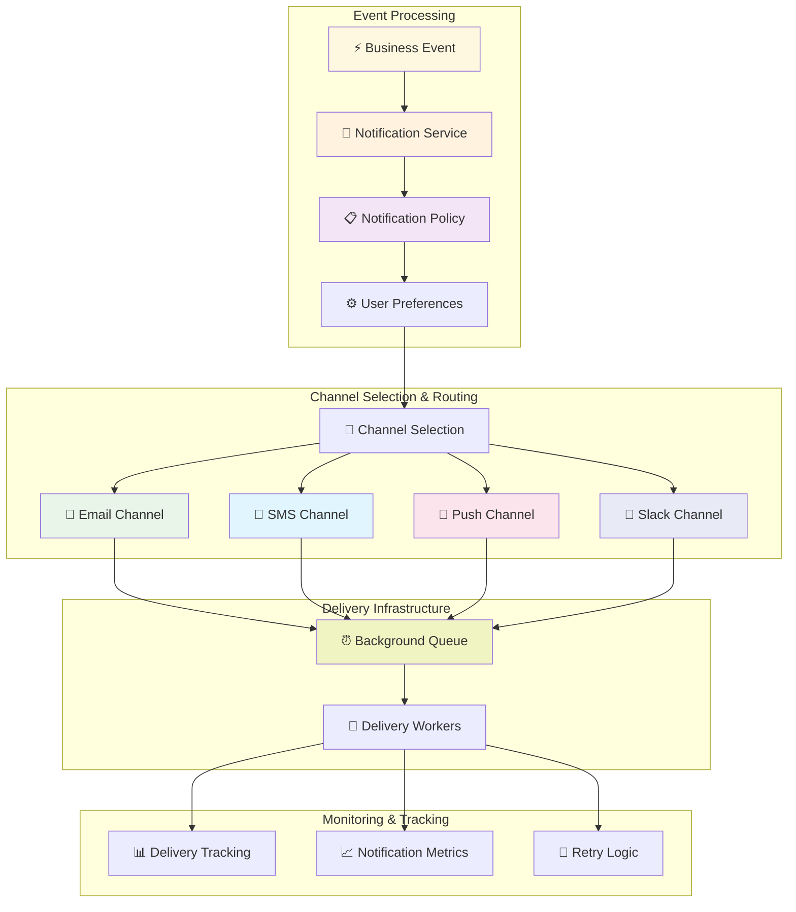

</details>

### Notification Layer Components:

#### 🔔 Notification System Implementation

**📋 [View Complete Notification Examples →](https://github.com/PacktPublishing/Layered-Design-for-Ruby-on-Rails-Applications/tree/main/09-notifications)**

- 🔔 **[NotificationService](https://github.com/PacktPublishing/Layered-Design-for-Ruby-on-Rails-Applications/blob/main/09-notifications/app/services/notification_service.rb)** - Multi-channel notification coordination
- 📧 **[EmailChannel](https://github.com/PacktPublishing/Layered-Design-for-Ruby-on-Rails-Applications/blob/main/09-notifications/app/channels/email_channel.rb)** - Email delivery with templates
- 📱 **[SmsChannel](https://github.com/PacktPublishing/Layered-Design-for-Ruby-on-Rails-Applications/blob/main/09-notifications/app/channels/sms_channel.rb)** - SMS delivery with rate limiting
- 💬 **[SlackChannel](https://github.com/PacktPublishing/Layered-Design-for-Ruby-on-Rails-Applications/blob/main/09-notifications/app/channels/slack_channel.rb)** - Slack integration with rich formatting

```ruby
# Notification System Features:
# ✅ Multi-channel delivery support
# ✅ User preference management
# ✅ Async delivery with queues
# ✅ Delivery tracking and metrics
```

#### ⚙️ Notification Preferences Implementation

**📋 [View Notification Preferences →](https://github.com/PacktPublishing/Layered-Design-for-Ruby-on-Rails-Applications/blob/main/09-notifications/app/models/notification_preferences.rb)**

- 🎛️ **[NotificationPreferences](https://github.com/PacktPublishing/Layered-Design-for-Ruby-on-Rails-Applications/blob/main/09-notifications/app/models/notification_preferences.rb)** - User preference management
- 🔄 **[PreferencesSync](https://github.com/PacktPublishing/Layered-Design-for-Ruby-on-Rails-Applications/blob/main/09-notifications/app/services/preferences_sync.rb)** - Preference synchronization across channels
- 📊 **[NotificationAnalytics](https://github.com/PacktPublishing/Layered-Design-for-Ruby-on-Rails-Applications/blob/main/09-notifications/app/services/notification_analytics.rb)** - Delivery metrics and insights

---

## 🎯 Layer 7: View Components Layer

<details>
<summary><strong>🔍 Click to explore Component-based UI Architecture</strong></summary>

Build maintainable UIs with reusable components:

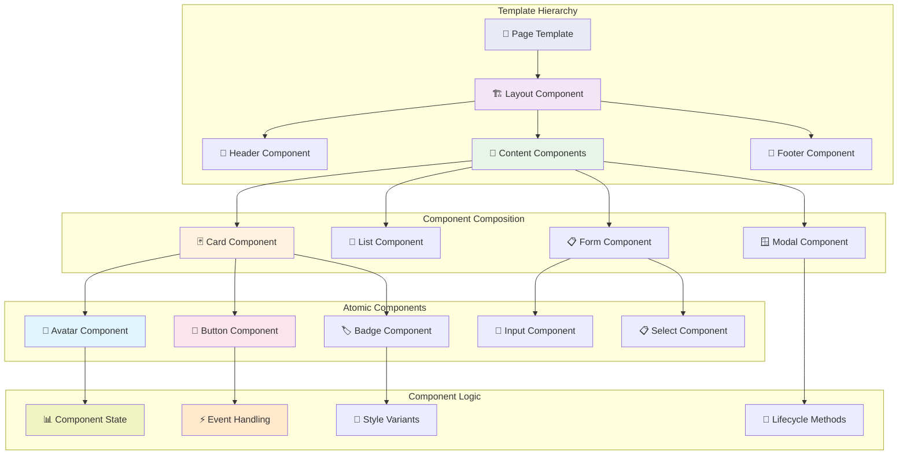

</details>

### View Components Implementation:

#### 🧩 Component Architecture

**📋 [View Complete View Components Examples →](https://github.com/PacktPublishing/Layered-Design-for-Ruby-on-Rails-Applications/tree/main/10-view-components)**

- 🃏 **[PostCardComponent](https://github.com/PacktPublishing/Layered-Design-for-Ruby-on-Rails-Applications/blob/main/10-view-components/app/components/post_card_component.rb)** - Reusable post display with variants
- 👤 **[AvatarComponent](https://github.com/PacktPublishing/Layered-Design-for-Ruby-on-Rails-Applications/blob/main/10-view-components/app/components/avatar_component.rb)** - User avatar with fallbacks and sizing
- 🔘 **[ButtonComponent](https://github.com/PacktPublishing/Layered-Design-for-Ruby-on-Rails-Applications/blob/main/10-view-components/app/components/button_component.rb)** - Consistent button styling and behavior
- 📋 **[FormComponent](https://github.com/PacktPublishing/Layered-Design-for-Ruby-on-Rails-Applications/blob/main/10-view-components/app/components/form_component.rb)** - Form builder with validation display

```ruby
# View Components Benefits:
# ✅ Reusable UI building blocks
# ✅ Encapsulated component logic
# ✅ Consistent styling and behavior
# ✅ Easy to test and maintain
```

#### 🎨 Component Templates & Styling

**📋 [View Component Templates →](https://github.com/PacktPublishing/Layered-Design-for-Ruby-on-Rails-Applications/tree/main/10-view-components/app/components)**

- 📄 **[Component Templates](https://github.com/PacktPublishing/Layered-Design-for-Ruby-on-Rails-Applications/tree/main/10-view-components/app/components)** - ERB templates with component logic
- 🎨 **[Component Styles](https://github.com/PacktPublishing/Layered-Design-for-Ruby-on-Rails-Applications/tree/main/10-view-components/app/assets/stylesheets/components)** - CSS modules for component styling
- 🧪 **[Component Tests](https://github.com/PacktPublishing/Layered-Design-for-Ruby-on-Rails-Applications/tree/main/10-view-components/spec/components)** - Testing strategies for UI components

---

## 🎯 Layer 8: Configuration Layer

<details>
<summary><strong>🔍 Click to explore Application Configuration Management</strong></summary>

Treat configuration as a first-class citizen in your application:

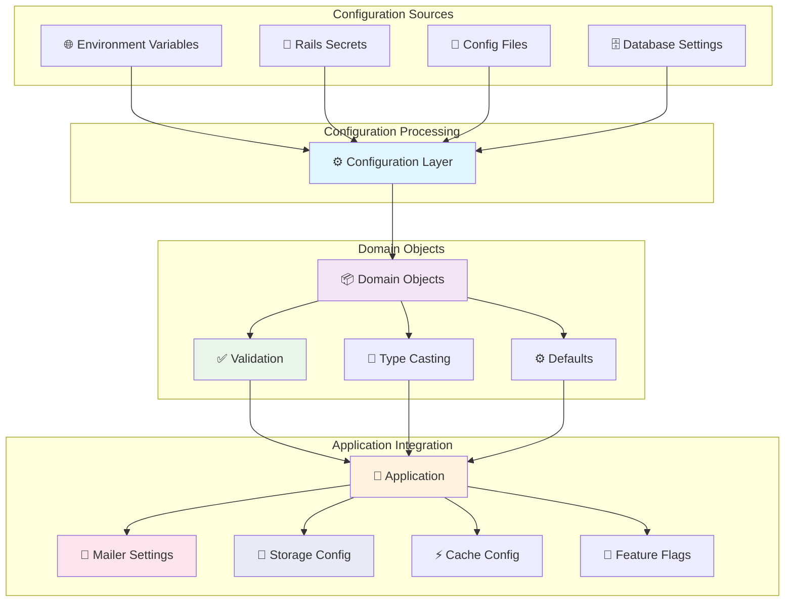

</details>

### Configuration Layer Implementation:

#### ⚙️ Configuration Objects

**📋 [View Complete Configuration Examples →](https://github.com/PacktPublishing/Layered-Design-for-Ruby-on-Rails-Applications/tree/main/11-configuration)**

- ⚙️ **[ApplicationConfig](https://github.com/PacktPublishing/Layered-Design-for-Ruby-on-Rails-Applications/blob/main/11-configuration/app/config/application_config.rb)** - Type-safe configuration with validation
- 📧 **[MailerConfig](https://github.com/PacktPublishing/Layered-Design-for-Ruby-on-Rails-Applications/blob/main/11-configuration/app/config/mailer_config.rb)** - Email service configuration
- ☁️ **[StorageConfig](https://github.com/PacktPublishing/Layered-Design-for-Ruby-on-Rails-Applications/blob/main/11-configuration/app/config/storage_config.rb)** - File storage service configuration
- 🚩 **[FeatureFlags](https://github.com/PacktPublishing/Layered-Design-for-Ruby-on-Rails-Applications/blob/main/11-configuration/app/config/feature_flags.rb)** - Dynamic feature toggling

```ruby
# Configuration Benefits:
# ✅ Type safety with validation
# ✅ Environment-specific settings
# ✅ Centralized configuration logic
# ✅ Easy testing and debugging
```

#### 📊 Configuration Management

**📋 [View Configuration Management →](https://github.com/PacktPublishing/Layered-Design-for-Ruby-on-Rails-Applications/tree/main/11-configuration/lib/configuration)**

- 🔧 **[ConfigLoader](https://github.com/PacktPublishing/Layered-Design-for-Ruby-on-Rails-Applications/blob/main/11-configuration/lib/configuration/config_loader.rb)** - Dynamic configuration loading
- ✅ **[ConfigValidator](https://github.com/PacktPublishing/Layered-Design-for-Ruby-on-Rails-Applications/blob/main/11-configuration/lib/configuration/config_validator.rb)** - Configuration validation utilities
- 🔄 **[ConfigRefresh](https://github.com/PacktPublishing/Layered-Design-for-Ruby-on-Rails-Applications/blob/main/11-configuration/lib/configuration/config_refresh.rb)** - Hot configuration reloading

---

## 🎯 Layer 9: Infrastructure Layer

<details>
<summary><strong>🔍 Click to explore Cross-cutting Concerns</strong></summary>

Handle logging, monitoring, and external services with dedicated abstractions:

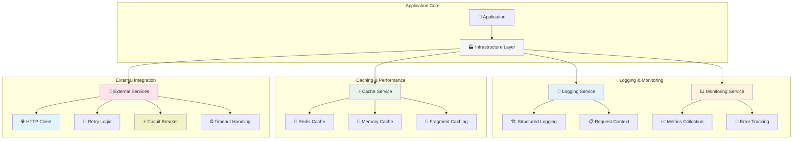

</details>

### Infrastructure Layer Implementation:

#### 📝 Logging & Monitoring

**📋 [View Complete Infrastructure Examples →](https://github.com/PacktPublishing/Layered-Design-for-Ruby-on-Rails-Applications/tree/main/12-infrastructure)**

- 📝 **[ApplicationLogger](https://github.com/PacktPublishing/Layered-Design-for-Ruby-on-Rails-Applications/blob/main/12-infrastructure/app/services/application_logger.rb)** - Structured logging with context
- 📊 **[MetricsCollector](https://github.com/PacktPublishing/Layered-Design-for-Ruby-on-Rails-Applications/blob/main/12-infrastructure/app/services/metrics_collector.rb)** - Application metrics and monitoring
- 🚨 **[ErrorTracker](https://github.com/PacktPublishing/Layered-Design-for-Ruby-on-Rails-Applications/blob/main/12-infrastructure/app/services/error_tracker.rb)** - Error handling and reporting
- 🔍 **[PerformanceMonitor](https://github.com/PacktPublishing/Layered-Design-for-Ruby-on-Rails-Applications/blob/main/12-infrastructure/app/services/performance_monitor.rb)** - Performance tracking and analysis

```ruby
# Infrastructure Benefits:
# ✅ Centralized logging and monitoring
# ✅ Performance optimization insights
# ✅ Error tracking and debugging
# ✅ Operational visibility
```

#### 🔌 External Service Abstractions

**📋 [View External Service Examples →](https://github.com/PacktPublishing/Layered-Design-for-Ruby-on-Rails-Applications/tree/main/12-infrastructure/app/clients)**

- 🌐 **[ExternalServiceClient](https://github.com/PacktPublishing/Layered-Design-for-Ruby-on-Rails-Applications/blob/main/12-infrastructure/app/clients/external_service_client.rb)** - HTTP client with resilience patterns
- 🔄 **[RetryService](https://github.com/PacktPublishing/Layered-Design-for-Ruby-on-Rails-Applications/blob/main/12-infrastructure/app/services/retry_service.rb)** - Intelligent retry logic with backoff
- ⚡ **[CircuitBreaker](https://github.com/PacktPublishing/Layered-Design-for-Ruby-on-Rails-Applications/blob/main/12-infrastructure/app/services/circuit_breaker.rb)** - Service resilience patterns
- ⏰ **[TimeoutHandler](https://github.com/PacktPublishing/Layered-Design-for-Ruby-on-Rails-Applications/blob/main/12-infrastructure/app/services/timeout_handler.rb)** - Request timeout management

---

## 🏆 The Ebook That Started It All

This comprehensive guide is inspired by **Vladimir Dementyev's** groundbreaking book:

### 📖 "Layered Design for Ruby on Rails Applications"

<div style="text-align: center; margin: 2rem 0;">
  
</div>

Vladimir Dementyev, a core contributor to Ruby on Rails and the creator of AnyCable, brings years of experience building and maintaining large-scale Rails applications. This book is the definitive guide to evolving beyond the basic MVC structure while staying true to Rails principles.

**📚 Complete Learning Resources:**
- 📖 **[Get the Book](https://www.packtpub.com/product/layered-design-for-ruby-on-rails-applications/9781801813785)** - Complete guide with theory and practice
- 💻 **[GitHub Repository](https://github.com/PacktPublishing/Layered-Design-for-Ruby-on-Rails-Applications)** - All code examples and implementations
- 🎓 **[Author's Blog](https://evilmartians.com/blog)** - Advanced Rails architecture articles
- 🐦 **[Follow Vladimir](https://twitter.com/palkan_tula)** - Latest updates and insights

**What makes this book special:**
- ✅ **Real-world patterns** tested in production applications
- ✅ **Gradual approach** - no big rewrites required
- ✅ **Performance considerations** for each abstraction layer
- ✅ **Practical examples** with complete code samples
- ✅ **Testing strategies** for layered architectures

## 🎯 Master These Pattern Recognition Skills

<details>
<summary><strong>🧠 Test Your Understanding: Layered Architecture Quiz</strong></summary>

<p><strong>Question 1:</strong> You have a Rails model with 500+ lines containing validations, callbacks, scopes, business logic, and presentation methods. What's the first refactoring you should consider?</p>

<details>
<summary><strong>💡 Click for Answer</strong></summary>

<p><strong>Answer:</strong> Start by extracting presentation logic into <strong>Presenter objects</strong> and validation logic into <strong>Form objects</strong>. These are the safest first steps that provide immediate benefits without changing core business logic.</p>

<p><strong>Why this approach:</strong></p>
<ul>
<li>Presentation logic is usually the easiest to extract</li>
<li>Form objects can handle context-specific validations</li>
<li>Both patterns have minimal impact on existing code</li>
<li>You'll see immediate improvements in model readability</li>
</ul>

<p><strong>🔗 See the implementation:</strong></p>
<ul>
<li><a href="https://github.com/PacktPublishing/Layered-Design-for-Ruby-on-Rails-Applications/blob/main/06-presenters/app/presenters/post_presenter.rb">PostPresenter Example</a></li>
<li><a href="https://github.com/PacktPublishing/Layered-Design-for-Ruby-on-Rails-Applications/blob/main/04-form-objects/app/forms/post_form.rb">PostForm Example</a></li>
</ul>

</details>

<p><strong>Question 2:</strong> Your application needs to send notifications via email, SMS, and Slack. Currently, this logic is scattered across different controllers and background jobs. Which pattern should you implement?</p>

<details>
<summary><strong>💡 Click for Answer</strong></summary>

<p><strong>Answer:</strong> Implement a <strong>Notifications Layer</strong> with:</p>
<ul>
<li>A central NotificationService to coordinate delivery</li>
<li>Channel-specific adapters (EmailChannel, SmsChannel, SlackChannel)</li>
<li>User preference management for channel selection</li>
<li>Background job integration for async delivery</li>
</ul>

<p><strong>Benefits:</strong></p>
<ul>
<li>Single point of control for all notifications</li>
<li>Easy to add new channels</li>
<li>User preferences handled centrally</li>
<li>Consistent delivery tracking and error handling</li>
</ul>

<p><strong>🔗 See the implementation:</strong></p>
<ul>
<li><a href="https://github.com/PacktPublishing/Layered-Design-for-Ruby-on-Rails-Applications/tree/main/09-notifications">Complete Notification System</a></li>
<li><a href="https://github.com/PacktPublishing/Layered-Design-for-Ruby-on-Rails-Applications/blob/main/09-notifications/app/services/notification_service.rb">NotificationService</a></li>
</ul>

</details>

<p><strong>Question 3:</strong> You're building an API that needs different data representations for different client types (mobile app, web app, external partners). What abstraction should you use?</p>

<details>
<summary><strong>💡 Click for Answer</strong></summary>

<p><strong>Answer:</strong> Implement <strong>Serializer objects</strong> with variant support:</p>

<p><strong>🔗 See the full implementation:</strong> <a href="https://github.com/PacktPublishing/Layered-Design-for-Ruby-on-Rails-Applications/blob/main/07-serializers/app/serializers/post_serializer.rb">PostSerializer with Variants</a></p>

<p><strong>Why Serializers:</strong></p>
<ul>
<li>Keep presentation logic out of models</li>
<li>Support multiple output formats</li>
<li>Easy to test and maintain</li>
<li>Version control for API changes</li>
</ul>

<p><strong>🔗 More serializer examples:</strong></p>
<ul>
<li><a href="https://github.com/PacktPublishing/Layered-Design-for-Ruby-on-Rails-Applications/blob/main/07-serializers/app/serializers/mobile_serializer.rb">Mobile-optimized Serializer</a></li>
<li><a href="https://github.com/PacktPublishing/Layered-Design-for-Ruby-on-Rails-Applications/blob/main/07-serializers/app/serializers/external_api_serializer.rb">External API Serializer</a></li>
</ul>

</details>

</details>

## 🚀 Your Next Steps

Ready to transform your Rails application? Here's your action plan with repository examples:

### Phase 1: Foundation (Weeks 1-2)
1. **Audit your models** - Identify God objects and responsibility overlaps
   - 📋 **[Use the Model Audit Checklist](https://github.com/PacktPublishing/Layered-Design-for-Ruby-on-Rails-Applications/blob/main/docs/model-audit-checklist.md)**
2. **Extract presenters** - Move display logic out of models
   - 🎨 **[Start with PostPresenter](https://github.com/PacktPublishing/Layered-Design-for-Ruby-on-Rails-Applications/blob/main/06-presenters/app/presenters/post_presenter.rb)**
3. **Implement basic authorization** - Add policy objects for your core entities
   - 🛡️ **[Implement PostPolicy](https://github.com/PacktPublishing/Layered-Design-for-Ruby-on-Rails-Applications/blob/main/08-authorization/app/policies/post_policy.rb)**

### Phase 2: Input & Data (Weeks 3-4)
4. **Create form objects** - Handle complex user input scenarios
   - 📝 **[Use PostForm Template](https://github.com/PacktPublishing/Layered-Design-for-Ruby-on-Rails-Applications/blob/main/04-form-objects/app/forms/post_form.rb)**
5. **Add query objects** - Extract complex Active Record queries
   - 🔍 **[Follow PopularPostsQuery](https://github.com/PacktPublishing/Layered-Design-for-Ruby-on-Rails-Applications/blob/main/03-query-objects/app/queries/popular_posts_query.rb)**
6. **Implement repository pattern** - For your most complex data access
   - 🗃️ **[Start with PostRepository](https://github.com/PacktPublishing/Layered-Design-for-Ruby-on-Rails-Applications/blob/main/02-repository/app/repositories/post_repository.rb)**

### Phase 3: Architecture (Weeks 5-6)
7. **Build notification layer** - Centralize all user communications
   - 🔔 **[Use NotificationService](https://github.com/PacktPublishing/Layered-Design-for-Ruby-on-Rails-Applications/tree/main/09-notifications)**
8. **Add view components** - Create reusable UI components
   - 🧩 **[Start with PostCardComponent](https://github.com/PacktPublishing/Layered-Design-for-Ruby-on-Rails-Applications/blob/main/10-view-components/app/components/post_card_component.rb)**
9. **Extract service objects** - Encapsulate complex business operations
   - ⚙️ **[Follow Service Object Patterns](https://github.com/PacktPublishing/Layered-Design-for-Ruby-on-Rails-Applications/tree/main/05-service-objects)**

### Phase 4: Infrastructure (Weeks 7-8)
10. **Implement configuration layer** - Manage app settings properly
    - ⚙️ **[Use ApplicationConfig](https://github.com/PacktPublishing/Layered-Design-for-Ruby-on-Rails-Applications/blob/main/11-configuration/app/config/application_config.rb)**
11. **Add monitoring abstractions** - Structured logging and metrics
    - 📝 **[Implement ApplicationLogger](https://github.com/PacktPublishing/Layered-Design-for-Ruby-on-Rails-Applications/blob/main/12-infrastructure/app/services/application_logger.rb)**
12. **Extract external service clients** - Handle third-party integrations
    - 🔌 **[Use ExternalServiceClient](https://github.com/PacktPublishing/Layered-Design-for-Ruby-on-Rails-Applications/blob/main/12-infrastructure/app/clients/external_service_client.rb)**

## 📚 Essential Resources

### Books & Guides
- 📖 **[Layered Design for Ruby on Rails Applications](https://www.packtpub.com/product/layered-design-for-ruby-on-rails-applications/9781801813785)** - The definitive guide
- 🏗️ **[Clean Architecture](https://www.amazon.com/Clean-Architecture-Craftsmans-Software-Structure/dp/0134494164)** - Uncle Bob's architectural principles
- 🏛️ **[Patterns of Enterprise Application Architecture](https://martinfowler.com/books/eaa.html)** - Martin Fowler's classic

### Code Examples & Implementation
- 💻 **[Complete GitHub Repository](https://github.com/PacktPublishing/Layered-Design-for-Ruby-on-Rails-Applications)** - All patterns implemented
- 🧪 **[Testing Examples](https://github.com/PacktPublishing/Layered-Design-for-Ruby-on-Rails-Applications/tree/main/spec)** - Comprehensive test suites
- 📋 **[Migration Guides](https://github.com/PacktPublishing/Layered-Design-for-Ruby-on-Rails-Applications/tree/main/docs)** - Step-by-step refactoring guides

### Gems & Tools
- 🧩 **[ViewComponent](https://viewcomponent.org/)** - Component-based UI architecture
- 🛡️ **[Pundit](https://github.com/varvet/pundit)** - Authorization via policy objects
- 🏗️ **[Dry-rb](https://dry-rb.org/)** - Toolkit for building better Ruby applications
- 🗄️ **[ROM-rb](https://rom-rb.org/)** - Data mapper implementation for Ruby

### Community & Learning
- 👨‍💻 **[Vladimir Dementyev's Blog](https://evilmartians.com/blog)** - Advanced Rails architecture patterns
- 📖 **[Ruby on Rails Guides](https://guides.rubyonrails.org/)** - Official Rails documentation
- 🎥 **[GoRails](https://gorails.com/)** - Advanced Rails screencasts
- 🐦 **[Follow @palkan_tula](https://twitter.com/palkan_tula)** - Latest architectural insights

---

## 🎯 The Extended Rails Way: Your Path to Mastery

The beauty of the Extended Rails Way lies in its pragmatic approach. You don't need to rebuild your entire application overnight. Instead, you can gradually introduce these patterns as your application grows and evolves.

**🔗 Ready to start?** Clone the [complete repository](https://github.com/PacktPublishing/Layered-Design-for-Ruby-on-Rails-Applications) and begin with the examples that match your current challenges.

Remember: **The goal isn't to add complexity—it's to manage complexity through strategic abstraction.**

Start small, measure the impact, and build confidence in these patterns. Your future self (and your team) will thank you for creating a maintainable, scalable Rails application that grows gracefully with your business needs.

Happy coding! 🚀

---

*Want to dive deeper into advanced Rails architecture patterns? Check out our other posts on [Ruby and AI](/ruby/ai/), [Rails Development](/ruby/rails/), and [Modern Web Development](/projects/).*
